# SATRAK
### Satellite Tracking and Regulatory Assessment Kit
### AI-Powered Urban Compliance Intelligence Platform

---

## Product Requirements Document — Master Volume

**Classification:** Government Restricted / Procurement-Grade Draft
**Document Owner:** SATRAK Program Office
**Prepared For:** National / State Urban Development Authorities, Municipal Corporations, Smart City Missions

---

# VOLUME 1 — PRODUCT REQUIREMENTS DOCUMENT

# CHAPTER 1: PROGRAM FOUNDATION

---

## 1.0 Cover Page

| Field | Value |
|---|---|
| Program Name | SATRAK — Satellite Tracking and Regulatory Assessment Kit |
| Document Type | Product Requirements Document (PRD), Volume 1 of N |
| Document Status | Draft v0.1 — Chapter 1 of ~30 |
| Classification | Government Restricted |
| Intended Audience | Engineering leadership, GovTech procurement boards, Smart City Mission directors, municipal commissioners, systems integrators, AI/ML and GIS engineering teams |
| Target Team Size | 100+ engineers across 12+ disciplines |
| Estimated Program Investment | $35M–$60M (5-year build + 3-year operate, indicative — see Chapter 27, Implementation Roadmap, for phased costing) |
| Document Owner | SATRAK Program Office |
| Review Cycle | Quarterly, or upon major scope change |

---

## 1.1 Document Control

| Attribute | Detail |
|---|---|
| Document ID | SATRAK-PRD-VOL1-CH1 |
| Repository Location | `/program-docs/prd/volume-1/chapter-1-foundation.md` |
| Owning Team | Product Management Office (PMO) |
| Approval Authority | Program Steering Committee (Government Sponsor + Prime Contractor CTO + Chief Architect) |
| Distribution | Internal engineering, government sponsor, empanelled systems integrator, security auditor (redacted copy) |
| Confidentiality | Not for public distribution. Contains architecture and security-relevant detail. |
| Change Control | All edits after v1.0 baseline require a Change Request (CR) logged in the program's ALM tool and approved by the Chief Architect and Product Owner jointly. |

### 1.1.1 Related Documents (to be produced in subsequent chapters)

| Ref | Document | Status |
|---|---|---|
| VOL1-CH2 | Stakeholders, Personas & Market Analysis | Pending |
| VOL2 | System Architecture & Infrastructure | Pending |
| VOL3 | Module Specifications (30 modules) | Pending |
| VOL4 | AI/ML System Design | Pending |
| VOL5 | Satellite & Drone Intelligence Platforms | Pending |
| VOL6 | GIS & Geospatial Architecture | Pending |
| VOL7 | Data Model & Database Design | Pending |
| VOL8 | API Specification | Pending |
| VOL9 | Security, Privacy & Compliance | Pending |
| VOL10 | UI/UX Design System & Screens | Pending |
| VOL11 | Reporting & Legal Evidence Specification | Pending |
| VOL12 | Implementation Roadmap & Phasing | Pending |

---

## 1.2 Version History

| Version | Date | Author | Summary of Changes |
|---|---|---|---|
| 0.1 | Draft (this issue) | SATRAK Program Office | Initial baseline: Chapter 1 — vision, mission, problem statement, background, industry analysis, current workflows, challenges, market opportunity, product overview |
| — | — | — | Subsequent chapters will append here as they are issued |

**Note on approach:** A document of this scope is normally produced by a PMO over several months with input from GIS architects, legal advisors, and government domain experts. This PRD is being generated **chapter by chapter** so each section receives full treatment rather than compressed summary. This document (`SATRAK_PRD.md`) is the single growing master file — each new chapter will be appended to it in place, so you always have one authoritative, continuously-updated artifact rather than fragments.

---

## 1.3 Executive Summary

Unauthorized construction, encroachment on public land, and non-compliance with sanctioned building plans are among the most persistent and financially significant governance failures in rapidly urbanizing economies. Municipal bodies today rely on manual field inspections, citizen complaints, and outdated satellite snapshots reviewed by hand — a model that scales linearly with headcount in a problem that grows geometrically with urban density.

**SATRAK** proposes a fundamentally different model: a continuously-running, AI-native **Urban Compliance Operating System** that fuses satellite imagery, drone intelligence, GIS records, and government property/permit databases into a single automated detection, verification, and enforcement pipeline. Rather than a point solution ("find illegal buildings"), SATRAK is designed as **infrastructure** — a platform other government systems, dashboards, and citizen services are built on top of, in the same way a payments platform underlies a country's financial applications.

This document set specifies SATRAK across 30 product modules spanning Earth observation, drone command and control, computer vision, GIS, legal evidence generation, and citizen-facing services, architected from the outset for nationwide scale: **1,000+ cities, tens of millions of building footprints, petabyte-scale imagery archives, and government-grade security and auditability.**

This chapter establishes the vision, the problem being solved, the current-state government workflow it replaces, and the market context. Subsequent chapters specify every module, every AI model, every database table, every API, and every screen in implementation-ready detail.

---

## 1.4 Vision

> **To make every square meter of urban land in a nation continuously observable, verifiable, and accountable — so that unauthorized construction and encroachment are detected in weeks, not years, and enforcement is backed by evidence that stands up in court.**

SATRAK envisions a future where:

- No unauthorized structure remains undetected for more than one satellite revisit cycle (target: 5–16 days depending on sensor tasking).
- Every enforcement action is backed by a defensible, timestamped, geolocated chain of evidence — satellite, drone, and document — admissible in judicial and quasi-judicial proceedings.
- Urban planners have a live "Digital Twin" of city-wide compliance, not a static GIS layer updated once a year.
- Citizens can verify the sanctioned status of any property before purchase, and report suspected violations with an auditable trail.
- Government bodies shift from **reactive, complaint-driven enforcement** to **proactive, continuous, risk-prioritized enforcement.**

---

## 1.5 Mission

SATRAK's mission is to **build and operate a national-scale AI compliance platform** that:

1. Ingests satellite, drone, and government data at continuous cadence.
2. Detects deviations from sanctioned plans, land-use rules, and environmental boundaries using computer vision and geospatial analytics.
3. Converts detections into **inspection-ready, legally defensible cases**, not raw alerts.
4. Integrates into existing government workflows (permits, courts, revenue departments) rather than replacing them wholesale.
5. Is operated with the security, availability, and auditability standards expected of critical government infrastructure.
6. Remains extensible — a foundation smart cities can build additional modules on (traffic, disaster response, environmental monitoring) beyond compliance alone.

---

## 1.6 Problem Statement

Urban local bodies (ULBs), development authorities, and state town-planning departments face a structural enforcement gap:

| Problem | Consequence |
|---|---|
| Manual, field-inspector-driven detection of violations | Coverage is limited to a small fraction of a city per year; inspectors physically cannot cover megacities with millions of parcels |
| Detection depends on citizen complaints or political pressure | Systemic under-reporting; enforcement is inconsistent and open to allegations of bias or corruption |
| Satellite/aerial imagery, where used, is reviewed manually by GIS staff | Slow (weeks per ward), not repeatable, not standardized, doesn't scale with revisit frequency |
| No unified property-permit-parcel data model | A "violation" cannot be automatically defined because sanctioned plan data, ownership data, and parcel boundaries live in disconnected legacy systems (or paper) |
| Evidence collected manually is often challenged in court | Weak chain-of-custody, no timestamped geolocation proof, inconsistent documentation formats |
| No continuous monitoring of construction progress | Illegal construction is often complete (and politically harder to demolish) before it is even flagged |
| Encroachment on natural resources (lakebeds, forests, rivers) is monitored by different departments with no shared platform | Cross-jurisdictional encroachments (e.g., a private structure spanning both revenue land and a lakebed) fall through institutional gaps |
| No predictive capability | Departments cannot forecast where new violations are likely to emerge as cities grow, so resources aren't allocated proactively |

**The core problem SATRAK solves:** *Government has the legal authority to detect and act on urban violations, but lacks the observational, computational, and evidentiary infrastructure to do so at the scale and speed modern cities require.*

---

## 1.7 Background

Urbanization in emerging economies is occurring faster than municipal enforcement capacity can grow. Several structural factors compound the problem:

- **Data fragmentation:** Building permits sit in one department's legacy system, land records in another (often at the state revenue department), and municipal tax records in a third. A single building's "true compliance status" requires manually reconciling all three — something that is rarely done except when a dispute already exists.
- **Legacy GIS adoption:** Many ULBs have adopted GIS for base mapping (parcel boundaries, ward maps) but have not connected GIS to a live detection or workflow layer — GIS remains a cartography tool, not an operations tool.
- **Earth observation has matured faster than government adoption:** Sub-meter commercial satellite imagery (Maxar, Airbus, Planet) and open moderate-resolution constellations (Sentinel-2, Landsat, India's Cartosat/Resourcesat series) now provide the raw observational capability needed for automated change detection — but very few government bodies have the AI/ML and data engineering capacity in-house to operationalize this.
- **Drone regulation has matured:** With frameworks such as India's Digital Sky / UAS Traffic Management (UTM) rules and equivalent regulatory sandboxes elsewhere, government-operated drone fleets for surveying and enforcement are now a legally supported operating model, not just a pilot concept.
- **Precedent programs exist but are narrow:** Several municipal bodies have run pilot projects using drone surveys or satellite change-detection for one-time property tax base expansion ("GIS-based property tax surveys"). These have proven the underlying data (a drone/satellite survey materially increases the discovered tax base) but have stopped at a one-time survey rather than a continuously operating compliance system.

SATRAK is designed to be the generalization and productionization of these narrow, proven pilots into permanent, national-scale infrastructure.

---

## 1.8 Industry Analysis

### 1.8.1 Adjacent Markets and Reference Players

| Category | Representative Players | Relevance to SATRAK |
|---|---|---|
| Geospatial intelligence for government | Palantir (Foundry, Gotham), ESRI (ArcGIS Enterprise) | Data fusion and case-management patterns; SATRAK differs by being purpose-built for urban compliance rather than general-purpose |
| Earth observation providers | Maxar, Planet Labs, Airbus Defence & Space, ISRO/NRSC | Imagery supply chain SATRAK must integrate with, not compete against |
| Drone survey & GIS-based property tax | Genesys International, various state-level "drone property survey" programs | Proven the ROI case for aerial-based property discovery; SATRAK generalizes this into continuous monitoring |
| Smart city platforms | Municipal Command & Control Centers (India's Smart Cities Mission ICCCs), Sidewalk Labs (discontinued), various national digital-twin initiatives | Integration surface — SATRAK should plug into existing ICCC dashboards, not fragment them |
| Legal/evidence tech | eDiscovery and forensic chain-of-custody platforms (general enterprise, not urban-specific) | Pattern to borrow for the Digital Evidence Repository and Court Evidence Generator modules (Ch. 27–28) |
| AI-for-EO research | Google Earth Engine, Microsoft Planetary Computer, various academic building-footprint datasets (Open Buildings, Microsoft Building Footprints) | Pretraining data and platform patterns for the AI Detection Engine (Volume 4) |

### 1.8.2 Why No Complete Solution Exists Today

No vendor currently offers an end-to-end, government-deployable platform that spans satellite ingestion → AI detection → GIS reconciliation → workflow → legal evidence → citizen portal as a single accountable system. The market is fragmented into:

- Pure imagery providers (sell pixels, not compliance answers)
- Pure GIS platforms (visualize, don't detect or adjudicate)
- Pure AI/CV vendors (research-grade models, no government workflow integration)
- Pure case-management/workflow vendors (no geospatial or AI-native detection)

This fragmentation is precisely the gap SATRAK is scoped to close, and is the primary justification for building a unified platform rather than procuring point solutions.

### 1.8.3 Regulatory and Institutional Considerations

- Any deployment must map to the **legal definition of a violation** in each jurisdiction's building bylaws, master plan, and municipal act — this is not a purely technical problem and requires a **Compliance Rule Engine** (Module 6) that is configurable per state/city rather than hardcoded.
- Drone operations must comply with national UAS regulations (e.g., Digital Sky, no-fly zones, altitude ceilings) — addressed in the Drone Intelligence Platform (Module 2).
- Evidence used for enforcement or prosecution must meet each jurisdiction's evidentiary standards (e.g., IT Act Section 65B certification in India for electronic evidence) — addressed in the Digital Evidence Repository and Court Evidence Generator (Modules 27–28).
- Data privacy: property and ownership data is often personally identifiable; the platform must comply with applicable data protection law (e.g., India's DPDP Act) — addressed in Volume 9 (Security, Privacy & Compliance).

---

## 1.9 Current Government Workflow (As-Is)

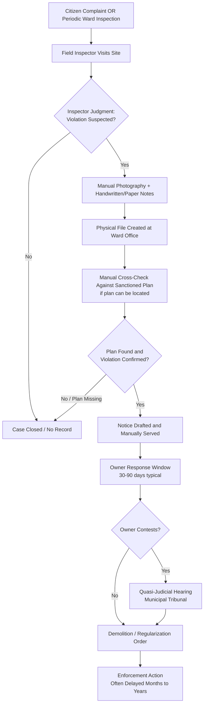

### 1.9.1 Time and Coverage Reality

| Stage | Typical Duration (Observed Across ULBs) | Bottleneck |
|---|---|---|
| Detection (complaint-to-inspection) | Weeks to never | Complaint-dependent; systemic under-coverage |
| Plan verification | Days to weeks | Sanctioned plans often on paper or in disconnected legacy systems |
| Notice and response window | 30–90 days | Statutory, largely fixed |
| Hearing/tribunal (if contested) | Months | Court/tribunal backlog |
| Final enforcement | Months to years, if ever | Political sensitivity, resource constraints, appeals |
| **Total addressable coverage per year** | **A small single-digit percentage of a large city's built footprint**, in practice | No systematic, city-wide detection mechanism exists |

### 1.9.2 Key Structural Weaknesses in the As-Is Model

1. **No systematic detection layer** — the workflow only starts if a human happens to notice or complain.
2. **No persistent visual record** — a structure photographed once is not compared against its future state.
3. **No cross-department data fusion** — permit, revenue, and municipal systems are not queried together automatically.
4. **Evidence quality is inconsistent** — hand-held photographs without geotagging or timestamp certification are weak in court.
5. **No prioritization** — inspectors cannot be directed to the highest-risk areas because there is no risk score.

---

## 1.10 Current Challenges (Consolidated)

| Challenge Category | Specific Challenges |
|---|---|
| **Coverage & Scale** | Cannot manually inspect millions of parcels; large cities add thousands of new/modified structures monthly |
| **Data** | Fragmented permit/parcel/ownership data; sanctioned plans in non-digital or non-standardized formats; no unified building ID across systems |
| **Technology** | No production AI detection; legacy GIS used for visualization only; no drone command infrastructure; no satellite tasking/ingestion pipeline |
| **Process** | Complaint-driven rather than proactive; no SLA-backed workflow; paper-based notice-and-hearing process |
| **Evidence & Legal** | Weak chain of custody; inconsistent report formats; evidence often successfully challenged in court on procedural, not factual, grounds |
| **Human Resources** | Chronic inspector understaffing relative to jurisdiction size; skill gap in GIS/remote sensing among existing staff |
| **Institutional/Political** | Enforcement can be selectively applied; no audit trail creates accountability gaps; cross-department turf issues (revenue vs. municipal vs. forest/lake authorities) |
| **Citizen Trust** | No way for citizens to verify a property's sanctioned status before purchase; no transparent complaint tracking |

---

## 1.11 Market Opportunity

### 1.11.1 Sizing Logic (Illustrative Framework — to be refined with government-supplied data in Volume 2)

| Driver | Illustrative Basis |
|---|---|
| Number of statutory towns/cities in scope (India-scale example) | 4,000+ Urban Local Bodies nationally; SATRAK architecture targets 1,000+ as an initial addressable rollout across large/medium ULBs |
| Estimated built structures in scope cities | Tens of millions of individual building footprints |
| Property tax revenue leakage attributable to unassessed/unauthorized construction | Independently documented in multiple municipal GIS-property-survey pilots as a material % increase in assessed tax base — to be cited with jurisdiction-specific studies in Volume 2 |
| Avoided cost of reactive litigation/demolition | Early detection during construction avoids costlier, more contested post-completion demolition |
| Smart Cities Mission and urban-tech budget lines | Existing government digital infrastructure budgets (ICCCs, GIS cells, e-Governance missions) represent adjacent, already-funded procurement channels SATRAK can be positioned against |

### 1.11.2 Value Pools Created

1. **Direct revenue recovery** — expanded and accurate property tax base from previously undetected/misclassified construction.
2. **Avoided cost** — earlier detection reduces cost and political cost of enforcement (a foundation is cheaper to flag than a finished 8-floor building).
3. **Risk reduction** — early detection of structurally dangerous or unauthorized-in-hazard-zone construction (flood plains, unstable slopes) reduces disaster liability.
4. **Institutional trust** — transparent, evidence-backed enforcement reduces corruption exposure and improves citizen trust scores.
5. **Reusable infrastructure** — the same satellite/drone/GIS backbone can be extended to disaster management, environmental monitoring, and infrastructure planning (Module 29, Module 30), amortizing the platform investment across multiple government mandates.

### 1.11.3 Competitive Positioning

SATRAK is positioned not as a single-purpose "illegal construction detector" app, but as **shared urban intelligence infrastructure** — analogous to how a national payments platform underlies many downstream financial products. This positioning matters commercially and technically: it justifies the scale of investment being requested, and it dictates architectural principles (Module 26, Integration Hub; Module 30, Future Smart City Integration) that must be designed in from day one rather than retrofitted later.

---

## 1.12 Product Overview

### 1.12.1 What SATRAK Is

SATRAK is a cloud-native, AI-driven platform comprising **30 integrated modules** (enumerated in full in Volume 3) organized into six functional layers:

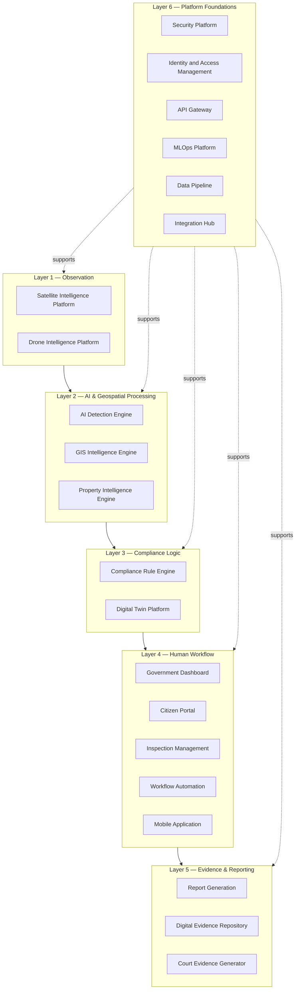

### 1.12.2 What SATRAK Is Not

To keep scope disciplined, this PRD explicitly states what SATRAK does **not** attempt to be:

- **Not a replacement for judicial/tribunal authority** — SATRAK produces evidence and case files; humans and courts adjudicate.
- **Not a general-purpose GIS product** — SATRAK uses GIS as infrastructure but is not competing as a base-mapping product for unrelated use cases.
- **Not a consumer real-estate app** — the Citizen Portal (Module 9) provides verification and complaint functions, not property listings or valuations.
- **Not a fully autonomous enforcement system** — every detection is reviewed by a human inspector/officer before any enforcement action; the AI Detection Engine (Module 3) is decision-support, not decision-making, for anything with legal consequence.

### 1.12.3 Core Product Pillars

| Pillar | Description |
|---|---|
| **Continuous Observation** | Every parcel in scope is re-observed on a defined cadence (satellite: days; drone: on-demand/scheduled for high-risk zones), not once-and-done. |
| **Automated, Explainable Detection** | AI flags candidate violations with confidence scores and visual evidence, not black-box alerts. |
| **Rule-Configurable Compliance** | Violation definitions are data-driven per jurisdiction (setback rules, FAR/FSI limits vary by city/zone), not hardcoded logic. |
| **Evidence-Grade Chain of Custody** | Every detection carries cryptographic timestamping and geolocation sufficient for legal admissibility. |
| **Human-in-the-Loop Workflow** | Officers review, verify, and act; the platform manages workflow state, SLAs, and audit trail. |
| **Citizen Transparency** | Property compliance status and complaint tracking are visible to citizens, improving trust and enabling crowdsourced signal. |
| **National Scalability** | Multi-tenant architecture supports independent city/state deployments on shared infrastructure without data leakage across jurisdictions. |

### 1.12.4 High-Level Success Definition

SATRAK's success, at a program level, will ultimately be measured against (fully specified with targets in Chapter 2, Success Metrics):

- Reduction in time-to-detection for new unauthorized construction.
- Increase in the percentage of a city's built footprint under active monitoring.
- Increase in enforcement actions that survive legal challenge.
- Increase in property tax base attributable to previously undetected construction.
- Citizen satisfaction/trust scores for the compliance process.

---

## 1.13 Chapter 1 Closing Note

This chapter establishes the *why* of SATRAK. Chapter 2 (next) will establish the *who* — full stakeholder analysis, personas (government officer, urban planner, citizen, systems integrator, auditor), pain points per persona, business and government goals, quantified success metrics, and the release roadmap. From Chapter 2 onward, the document builds systematically toward Volume 3's module-by-module specifications, where every one of the 30 modules receives the full treatment specified in your brief (purpose, user stories, functional/non-functional requirements, architecture, database schema, APIs, security, KPIs, and risks).

**Next chapter:** Chapter 2 — Stakeholders, Personas, Business & Government Goals, Success Metrics, Roadmap.

---

---

# CHAPTER 2: STAKEHOLDERS, PERSONAS, GOALS & ROADMAP

---

## 2.1 Stakeholder Map

SATRAK sits at the intersection of government administration, judiciary-adjacent process, engineering delivery, and citizen services. Getting the stakeholder map right early matters because it directly shapes access control design (Volume 9) and workflow states (Module 11).

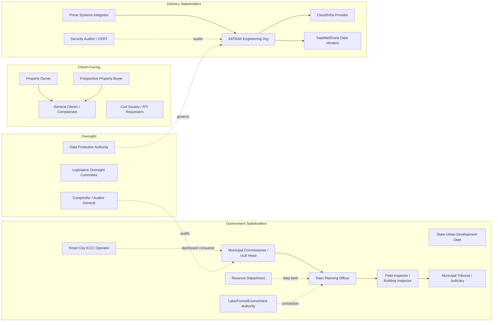

### 2.1.1 Stakeholder Register

| # | Stakeholder | Category | Primary Interest | Influence | Engagement Approach |
|---|---|---|---|---|---|
| 1 | Municipal Commissioner / ULB Head | Government — Executive | Political accountability, visible results, budget defense | High | Executive dashboard (Module 8), monthly steering reviews |
| 2 | Town Planning Officer | Government — Domain Authority | Correct application of zoning/FAR/setback rules | High | Compliance Rule Engine configuration authority (Module 6) |
| 3 | Field Inspector / Building Inspector | Government — Operational | Usable mobile tools, reduced paperwork, safety | Medium (but critical adoption risk) | Mobile Application (Module 15), Inspection Management (Module 10) co-design |
| 4 | Revenue Department | Government — Adjacent | Property tax base accuracy | Medium | Integration Hub (Module 26) data-sharing agreement |
| 5 | Lake/Forest/Environment Authority | Government — Adjacent Jurisdiction | Encroachment on protected land | Medium | Shared detection feed, jurisdiction-aware Compliance Rule Engine |
| 6 | State Urban Development Department | Government — Funding/Policy | Program funding, policy alignment, multi-city rollout | Very High | Program Steering Committee membership |
| 7 | Municipal Tribunal / Judiciary | Quasi-judicial | Evidentiary quality, procedural fairness | High (blocking, if evidence fails) | Court Evidence Generator (Module 28) design review |
| 8 | Smart City ICCC Operator | Government — Operational Integration | Dashboard/data feed integration, no fragmentation | Medium | Integration Hub, shared API Gateway |
| 9 | Prime Systems Integrator | Delivery | Contract delivery, SLA compliance | High | Joint architecture governance |
| 10 | SATRAK Engineering Org | Delivery | Buildable, maintainable, well-specified requirements | High | This PRD is the primary artifact |
| 11 | Cloud/Infra Provider | Delivery | Consumption, SLAs, data residency compliance | Medium | Volume 2, Cloud Architecture |
| 12 | Satellite/Drone Data Vendors | Delivery | Licensing terms, tasking volume | Medium | Satellite/Drone module vendor integration specs |
| 13 | Security Auditor / CERT | Oversight | Vulnerability posture, incident response readiness | High (gating for go-live) | Volume 9, independent audit cycle |
| 14 | Property Owner | Citizen | Fair, transparent process; avoid wrongful flagging | Medium (individually), High (collectively) | Citizen Portal, appeal workflow |
| 15 | Prospective Property Buyer | Citizen | Verify sanctioned status before purchase | Low (individually) | Citizen Portal — Property Verification |
| 16 | General Citizen / Complainant | Citizen | Report violations, track resolution | Low (individually) | Citizen Portal — Complaint Filing |
| 17 | Civil Society / RTI Requesters | Citizen / Oversight | Transparency, data on enforcement patterns | Medium (reputational) | Aggregated public analytics (ward-level, anonymized) |
| 18 | Comptroller / Auditor General | Oversight | Fund utilization, program effectiveness | High (periodic) | Audit & Compliance System (Module 20) exports |
| 19 | Legislative Oversight Committee | Oversight | Policy outcomes, citizen grievance patterns | Medium | Periodic reporting, not live access |
| 20 | Data Protection Authority | Oversight | Compliance with data protection law | High (gating) | Privacy-by-design review, Volume 9 |

---

## 2.2 Personas

Five personas are carried through the rest of this PRD as the primary lens for requirements. Each module chapter in Volume 3 will reference these personas explicitly in its User Stories section.

### 2.2.1 Persona: "Officer Priya" — Field Building Inspector

| Attribute | Detail |
|---|---|
| Role | Assistant Engineer / Building Inspector, Ward-level |
| Age / Experience | 28–45, 3–15 years in municipal service |
| Technical fluency | Moderate — comfortable with smartphones, not with GIS software |
| Daily reality | Covers 2–3 wards, ~15–25 site visits/week, competing with unrelated administrative duties |
| Primary device | Android smartphone, sometimes shared/low-spec |
| Goals | Close cases quickly and defensibly; avoid personal liability for missed violations; avoid confrontation risk during site visits |
| Pain points | Paper forms; no offline mode in existing tools; unclear which structures are "already flagged" vs. new; fear of being blamed if a violation is later found that they "should have caught" |
| What SATRAK must give her | A prioritized task list (not "go inspect the whole ward"), one-tap photo/GPS capture that auto-attaches to a case, offline-first mobile app, and a clear defensible paper trail that protects her professionally |

### 2.2.2 Persona: "Planner Arjun" — Town Planning Officer

| Attribute | Detail |
|---|---|
| Role | Town Planning Officer / Deputy Director, Planning |
| Technical fluency | High on planning rules and master plans; moderate on software beyond desktop GIS |
| Goals | Ensure zone-specific rules (FAR, setback, land-use) are correctly and consistently applied city-wide; defend decisions if challenged |
| Pain points | Rules differ by zone/ward and change over time (amendments); no single source of truth for "what rule applied on what date" for a given parcel; manual FAR/FSI calculation is error-prone |
| What SATRAK must give him | A configurable, versioned Compliance Rule Engine (Module 6) where rule changes are timestamped and applied only prospectively (or per policy), and a way to simulate rule changes before publishing them |

### 2.2.3 Persona: "Commissioner Fatima" — Municipal Commissioner / ULB Head

| Attribute | Detail |
|---|---|
| Role | IAS/equivalent civil service officer heading the ULB |
| Technical fluency | Low-to-moderate; needs summarized, decision-ready views, not raw data |
| Goals | Demonstrable results for political/administrative reporting; defensible use of public funds; avoid controversy from wrongful enforcement |
| Pain points | No city-wide visibility into compliance status; relies on ad hoc reports before audits or legislative questions; cannot easily show "progress" |
| What SATRAK must give her | An Executive Dashboard (Module 8) with ward-level heatmaps, trend lines, and one-click exportable reports for legislative/audit questions |

### 2.2.4 Persona: "Citizen Rahul" — Property Owner / Prospective Buyer

| Attribute | Detail |
|---|---|
| Role | Private citizen, property owner or buyer |
| Technical fluency | Moderate — comfortable with consumer apps |
| Goals | Verify a property's sanctioned status before purchase; understand and contest any violation notice fairly; avoid harassment |
| Pain points | No way today to check compliance status without visiting the municipal office in person; opaque notice/appeal process |
| What SATRAK must give him | Citizen Portal (Module 9) property lookup, transparent complaint/appeal tracking with status timestamps, and clear notice-and-response timelines |

### 2.2.5 Persona: "Architect Meera" — Chief System Architect (Delivery Side)

| Attribute | Detail |
|---|---|
| Role | Chief Architect, SATRAK engineering program |
| Technical fluency | Very high |
| Goals | Deliver a system that scales to 1,000+ cities without re-architecture; keep security/compliance auditable; keep AI models measurably accurate and monitored in production |
| Pain points | Requirements arriving without NFRs; unclear multi-tenancy boundaries; AI models that work in a demo but drift in production without monitoring |
| What SATRAK must give her | Every module chapter (Volume 3 onward) specified with explicit NFRs, a shared multi-tenant architecture pattern (Volume 2), and an MLOps platform (Module 23) with drift monitoring and retraining pipelines built in from day one, not bolted on |

---

## 2.3 Pain Points Summary (Cross-Persona)

| Pain Point | Affected Personas | Addressed By (Module) |
|---|---|---|
| No prioritized, manageable workload | Officer Priya | Inspection Management (10), Predictive AI (14) |
| No offline-capable field tool | Officer Priya | Mobile Application (15) |
| Inconsistent rule application across zones/time | Planner Arjun | Compliance Rule Engine (6) |
| No city-wide visibility for leadership | Commissioner Fatima | Government Dashboard (8), Analytics Platform (13) |
| No pre-purchase compliance verification for citizens | Citizen Rahul | Citizen Portal (9) |
| Opaque appeal/notice process | Citizen Rahul | Workflow Automation (11), Citizen Portal (9) |
| Evidence challenged in court on procedural grounds | Commissioner Fatima, Tribunal | Digital Evidence Repository (27), Court Evidence Generator (28) |
| Architecture risk at national scale | Architect Meera | Volume 2 (Cloud Architecture), all modules' NFR sections |
| AI models untrusted/unmonitored in production | Architect Meera, Planning | MLOps Platform (23), AI Model Management (22) |

---

## 2.4 Business Goals

| # | Goal | Rationale |
|---|---|---|
| B1 | Increase the percentage of a city's built footprint under active, continuous monitoring from near-zero to a defined target within 24 months of go-live per city | Direct measure of coverage — the core structural failure of the as-is model |
| B2 | Increase municipal property tax base attributable to previously undetected/misclassified construction | Directly funds program ROI; precedented in GIS-property-survey pilots |
| B3 | Reduce average time-to-detection of new unauthorized construction from "often never" to weeks | Enables intervention before structures are complete, reducing enforcement cost and political friction |
| B4 | Increase the proportion of enforcement actions that survive legal/tribunal challenge | Evidence quality directly determines enforcement effectiveness |
| B5 | Reduce field inspector time spent on documentation and manual cross-referencing | Frees capacity for higher-value site verification work |
| B6 | Establish a reusable geospatial-AI platform that other government mandates (disaster management, environment, infrastructure planning) can build on | Amortizes investment, strengthens the business case beyond compliance alone |

## 2.5 Government (Policy) Goals

| # | Goal |
|---|---|
| GG1 | Uniform, rule-based enforcement that reduces perception and reality of selective/discretionary enforcement |
| GG2 | Cross-department data fusion (revenue, planning, environment) without requiring departments to give up system ownership |
| GG3 | A defensible, auditable trail for every enforcement decision, protecting both citizens and officers |
| GG4 | Compliance with data protection and electronic evidence law from initial design, not retrofitted |
| GG5 | A platform architecture that a state or national government can roll out to additional cities without re-procurement of core technology |

## 2.6 Citizen Goals

| # | Goal |
|---|---|
| CG1 | Ability to verify any property's sanctioned/compliance status before financial commitment (purchase, loan) |
| CG2 | Transparent, trackable complaint and appeal process with defined timelines |
| CG3 | Confidence that enforcement is applied consistently, not selectively |
| CG4 | Protection of personal data collected through the platform |

---

## 2.7 Success Metrics

Metrics are grouped by horizon. Baselines are jurisdiction-specific and will be established during Phase 1 discovery (see Volume 12, Implementation Roadmap) — the values below define **what** is measured, not yet the numeric target, which must be co-defined with each deploying government body.

| Metric | Definition | Primary Owner |
|---|---|---|
| Monitoring Coverage % | Share of built footprint (by area or structure count) under active satellite/drone monitoring | Program Office |
| Median Time-to-Detection | Days between a structure's unauthorized change occurring and its first AI-flagged detection | AI/Product |
| Detection Precision / Recall | Confusion-matrix metrics for the AI Detection Engine against inspector-verified ground truth | AI/ML Team |
| Case Closure Time | Median days from detection to case resolution (regularized, demolished, or dismissed) | Workflow/Operations |
| Legal Survival Rate | % of enforcement actions upheld when challenged in tribunal/court | Legal/Compliance |
| Tax Base Uplift | Incremental assessed property tax value attributable to platform-driven discovery | Revenue Department (partner metric) |
| Inspector Adoption Rate | % of assigned inspectors actively using the mobile app weekly | Product/Change Management |
| Citizen Portal NPS / Trust Score | Citizen satisfaction survey score for the compliance process | Citizen Services |
| System Availability | Platform uptime against defined SLA (target defined in Volume 2 NFRs) | Engineering/SRE |
| Model Drift Incidents | Number of AI model performance degradations caught by MLOps monitoring before impacting case quality | MLOps Team |

---

## 2.8 Roadmap (Program-Level View)

Full phased implementation detail (team ramp, budget, city-by-city rollout sequencing) is specified in Volume 12. This section gives the program-level shape only.

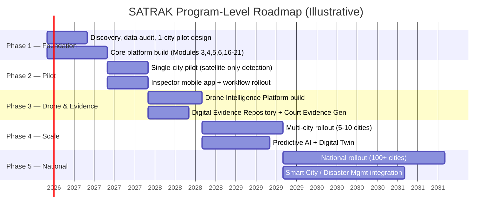

### 2.8.1 Release Planning Principle

Each phase must ship a **complete, usable vertical slice** — not partial layers across all modules simultaneously. Phase 2, for example, deliberately limits detection to satellite-only (no drone) so that the workflow, evidence, and citizen-facing layers are proven end-to-end on a narrower observational input before drone complexity is added in Phase 3. This sequencing decision is revisited in full in Volume 12.

---

## 2.9 Chapter 2 Closing Note

This chapter has established the full stakeholder landscape, five carrier personas used throughout the remaining volumes, consolidated pain points, and the goal/metric/roadmap framework the rest of the program will be measured against. Chapter 3 (next) begins **Volume 2 — System Architecture**, starting with the overall cloud architecture, multi-tenancy model, and the microservices topology that every subsequent module will plug into.

**Next chapter:** Chapter 3 — Cloud Architecture, Multi-Tenancy Model & Microservices Topology.

---

---

# VOLUME 2 — SYSTEM ARCHITECTURE

# CHAPTER 3: CLOUD ARCHITECTURE, MULTI-TENANCY MODEL & MICROSERVICES TOPOLOGY

---

## 3.1 Architectural Principles

Before any diagram or technology choice, the following principles are binding across every module in this program. Every subsequent chapter's architecture section must be traceable back to these.

| # | Principle | Implication |
|---|---|---|
| AP1 | **Jurisdiction isolation by default** | Every city/state deployment's data is logically (and where required by policy, physically) isolated. No cross-tenant query path may exist without an explicit, audited, cross-jurisdiction data-sharing agreement (e.g., a lake authority spanning two municipal boundaries). |
| AP2 | **Stateless services, stateful stores** | All application services are horizontally scalable and hold no session state; state lives in databases, object storage, and caches designed for that purpose. |
| AP3 | **Event-driven over point-to-point** | Modules communicate primarily via an event backbone (Kafka) rather than direct synchronous calls, so new modules (e.g., future Disaster Management) can subscribe to existing event streams without modifying producers. |
| AP4 | **API-first** | Every capability is exposed via a versioned API before any UI consumes it — the Government Dashboard, Mobile App, and Citizen Portal are all "just clients" of the same API Gateway. |
| AP5 | **AI as a governed service, not embedded logic** | All model inference happens through the AI Model Management/MLOps layer (Module 22–23), never hardcoded into business services, so models can be versioned, monitored, and rolled back independently of application releases. |
| AP6 | **Evidence immutability** | Once an image, detection, or document is registered as evidence, it is written to WORM (write-once-read-many) storage with a cryptographic hash chain; no service may mutate it in place. |
| AP7 | **Security is a platform layer, not a per-module feature** | AuthN/AuthZ, encryption, and audit logging are provided centrally (Modules 17–20) and consumed by all modules identically. |
| AP8 | **Design for 1,000 cities from city #1** | Multi-tenancy, partitioning, and naming conventions are established at the pilot stage even though the pilot covers one city, to avoid a re-architecture at national scale. |
| AP9 | **Graceful degradation over hard failure** | Loss of one observation source (e.g., cloud cover blocking satellite imagery) must degrade detection confidence, not halt the pipeline. |
| AP10 | **Everything auditable, nothing silently automated with legal effect** | No AI output triggers a legal/administrative consequence without a logged human decision point. |

---

## 3.2 Cloud Architecture Overview

### 3.2.1 Deployment Model

SATRAK is specified as **cloud-agnostic at the design layer**, deployable on any major hyperscaler or an empanelled government/national cloud (e.g., MeghRaj in the Indian context), because government procurement frequently mandates data residency within national borders and, in some cases, specific empanelled cloud providers.

| Layer | Technology Class | Notes |
|---|---|---|
| Compute | Kubernetes (managed: EKS/AKS/GKE, or self-managed on empanelled government cloud) | All application and AI inference workloads run as containers |
| Object Storage | S3-compatible (imagery, evidence, documents) | Must support Object Lock / WORM mode for evidence immutability (AP6) |
| Relational Database | PostgreSQL + PostGIS | Primary system-of-record for structured + spatial data |
| Time-Series / Analytics | ClickHouse or TimescaleDB | Detection history, sensor telemetry, analytics rollups |
| Cache | Redis | Session cache, hot-path spatial query cache, rate-limiting counters |
| Message/Event Backbone | Apache Kafka | Cross-module event streaming (AP3) |
| Task Queue | RabbitMQ (or Kafka consumer groups where ordering isn't critical) | Async job orchestration (report generation, batch inference) |
| Search | OpenSearch/Elasticsearch | Full-text search across cases, documents, audit logs |
| Container Orchestration | Kubernetes with Istio (service mesh) | mTLS between services, traffic policy, canary releases |
| CI/CD | GitLab CI / ArgoCD (GitOps) | Every environment (dev/staging/prod, per-tenant where isolated) deployed via pipeline, no manual changes |
| Observability | Prometheus + Grafana + OpenTelemetry + Loki | Metrics, tracing, and logs unified |
| IaC | Terraform + Helm | All infrastructure defined as code, peer-reviewed like application code |

### 3.2.2 High-Level Cloud Topology

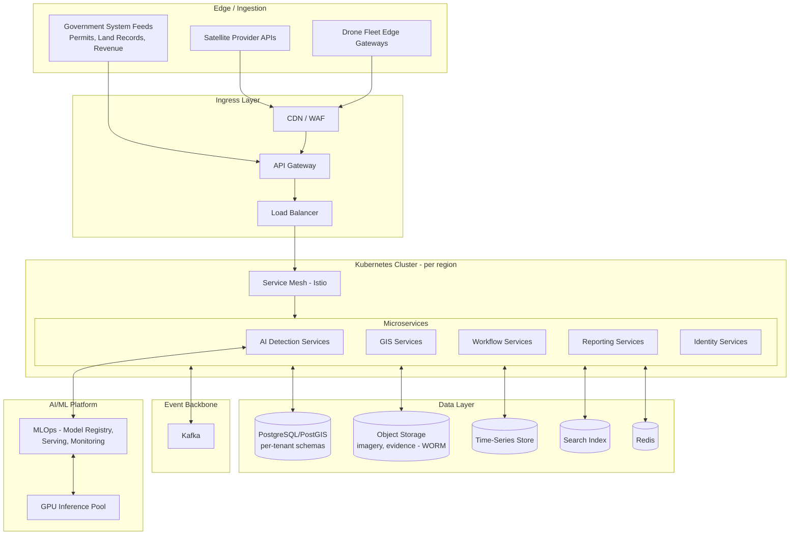

### 3.2.3 Multi-Region / Disaster Recovery Posture

| Aspect | Design Decision | Rationale |
|---|---|---|
| Primary/DR region pairing | Active-passive across two geographically separated government-approved data center regions | Government data residency and DR mandates typically require in-country, geographically separated pairs |
| RPO (Recovery Point Objective) | ≤ 15 minutes for transactional data; ≤ 24 hours for bulk imagery archives | Transactional data (cases, notices) is legally consequential; raw imagery is re-fetchable from source in worse case |
| RTO (Recovery Time Objective) | ≤ 4 hours for core workflow services; ≤ 24 hours for full analytics/AI stack | Field/citizen-facing services prioritized over analytics in a disaster scenario |
| Backup strategy | Continuous WAL streaming (PostgreSQL) to DR region; object storage cross-region replication; Kafka topic mirroring (MirrorMaker 2) | Standard, provider-agnostic approach avoiding hyperscaler lock-in |
| Data residency | All personally identifiable and property data remains within national borders per applicable law | Non-negotiable for government deployment (see Volume 9) |

---

## 3.3 Multi-Tenancy Model

Multi-tenancy is the single most consequential architecture decision in this platform, because a "tenant" here is not a paying customer in the SaaS sense — it is a **sovereign government jurisdiction** with its own legal authority, data ownership, and often its own data-residency sub-requirements (a state government may mandate its data never leaves state-designated infrastructure even within the same country).

### 3.3.1 Tenancy Levels

| Level | Definition | Isolation Approach |
|---|---|---|
| **National Platform** | Shared code, shared platform services (AuthN, API Gateway, MLOps model registry) | Single deployment of platform-level services, versioned centrally |
| **State/Region Tenant** | A state or union territory, may host its own dedicated Kubernetes cluster and database cluster if mandated by residency policy | Cluster-level isolation |
| **City/ULB Tenant** | An individual municipal corporation or development authority | Schema-level isolation within a shared state-level database cluster (default), OR dedicated schema/cluster for very large megacities |
| **Ward/Zone** | Sub-division within a city, not a tenancy boundary | Row-level partitioning only, not isolation |

### 3.3.2 Isolation Pattern (Default)

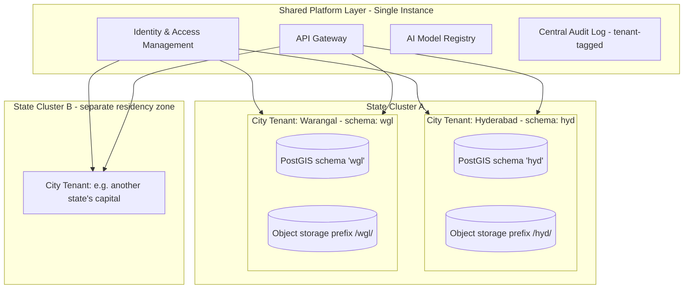

**Default pattern: schema-per-tenant within a shared PostgreSQL cluster**, with object storage using tenant-prefixed buckets/paths and per-tenant encryption keys (envelope encryption, Volume 9). This balances operational simplicity (one cluster to patch/monitor per state) against isolation strength (no tenant can query across schemas without an explicit, logged cross-tenant service call).

**Escalation path for megacities:** Cities exceeding a defined data-volume/QPS threshold (to be set during Phase 1 discovery, Volume 12) are promoted to a **dedicated database cluster**, still within the same logical architecture, to avoid noisy-neighbor risk.

### 3.3.3 Cross-Jurisdiction Data Sharing (e.g., Lakebed Encroachment Spanning Two ULBs)

A structure encroaching on a lake governed by a state environment authority but physically sitting across two municipal boundaries requires a **cross-tenant case**. This is handled explicitly, not implicitly:

1. The Compliance Rule Engine (Module 6) tags the detection with multiple jurisdiction IDs.
2. A cross-jurisdiction case object is created with read access granted to each relevant tenant's officers, logged as an explicit data-sharing event in the Audit & Compliance System (Module 20).
3. No tenant gains standing access to another tenant's unrelated data — only to the specific shared case.

---

## 3.4 Microservices Topology

### 3.4.1 Domain-Driven Service Boundaries

Services are bounded by business capability (domain-driven design), aligned to the 30 modules, not by technical layer. This keeps each module chapter in Volume 3 mappable to a concrete, independently deployable set of services.

| Domain | Representative Services | Data Owned |
|---|---|---|
| Observation | `satellite-ingestion-svc`, `satellite-tasking-svc`, `drone-mission-svc`, `drone-telemetry-svc` | Imagery metadata, tasking orders, flight logs |
| AI/Detection | `detection-orchestrator-svc`, `model-inference-svc` (per model family), `change-detection-svc` | Detection results, confidence scores, model run metadata |
| GIS | `parcel-svc`, `spatial-query-svc`, `geofence-svc`, `tile-server-svc` | Parcel geometry, zoning layers, tile cache |
| Property | `property-registry-svc`, `ownership-svc`, `permit-svc` | Property master data, ownership history, permit records |
| Compliance | `rule-engine-svc`, `violation-classifier-svc` | Versioned rule sets, violation determinations |
| Digital Twin | `twin-state-svc`, `twin-render-svc` | 3D/temporal city state snapshots |
| Workflow | `case-management-svc`, `notice-svc`, `hearing-svc`, `sla-tracker-svc` | Case state machine, notices, SLA timers |
| Reporting/Evidence | `report-generator-svc`, `evidence-vault-svc`, `court-package-svc` | Generated reports, evidence hash chain |
| Citizen | `citizen-portal-svc`, `complaint-svc`, `property-lookup-svc` | Complaints, public-facing lookups |
| Platform | `iam-svc`, `notification-svc`, `audit-svc`, `admin-svc`, `integration-hub-svc` | Users/roles, notifications, audit trail, tenant config |
| MLOps | `model-registry-svc`, `training-orchestrator-svc`, `drift-monitor-svc` | Model artifacts, training runs, monitoring metrics |

### 3.4.2 Service Communication Pattern

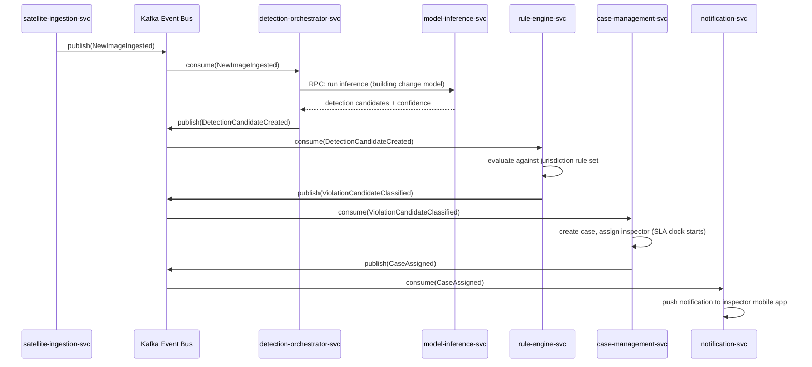

This pattern — ingestion publishes an event, downstream services react independently — is why AP3 (event-driven over point-to-point) matters: `rule-engine-svc` never needs to know that `case-management-svc` exists, and a future `disaster-risk-svc` (Module 29) can subscribe to `DetectionCandidateCreated` without any change to the services above it.

### 3.4.3 Synchronous vs. Asynchronous Boundaries

| Interaction Type | Pattern | Example |
|---|---|---|
| User-facing request/response (dashboard load, mobile app query) | Synchronous REST/GraphQL via API Gateway | Officer loads case detail screen |
| Cross-module business events with downstream consequences | Asynchronous, Kafka event | Detection → violation classification → case creation |
| Long-running compute | Async job + polling/webhook | Satellite image batch inference, PDF report generation, 3D reconstruction |
| Real-time telemetry | Streaming (Kafka or WebRTC for video) | Drone live video, drone telemetry |

---

## 3.5 Non-Functional Requirements (Platform-Wide)

These apply to every module unless a module chapter explicitly overrides them with a stricter requirement.

| Category | Requirement |
|---|---|
| **Availability** | 99.9% for citizen/officer-facing services; 99.5% for analytics/batch AI services |
| **Scalability** | Horizontal auto-scaling to 1,000+ tenant schemas and 10M+ concurrent-tracked parcels without architecture change |
| **Latency** | P95 < 500ms for synchronous API calls under normal load; spatial queries on indexed layers < 300ms P95 |
| **Data Durability** | 99.999999999% (11 nines) for object storage (imagery, evidence) via cross-region replication |
| **Security** | Zero Trust network model; mTLS between all services; encryption at rest (AES-256) and in transit (TLS 1.3) |
| **Auditability** | Every state-changing action logged immutably with actor, timestamp, and before/after state |
| **Compliance** | Data residency per applicable national/state law; electronic evidence handling per applicable evidence law |
| **Observability** | 100% of services instrumented with distributed tracing; alerting on SLO breach within 5 minutes |
| **Deployability** | Zero-downtime deployments via blue/green or canary; rollback within 10 minutes of a failed release |

---

## 3.6 Risks and Limitations of This Architecture

| Risk | Mitigation |
|---|---|
| Schema-per-tenant at national scale (1,000+ schemas) may hit PostgreSQL connection/catalog limits | Connection pooling (PgBouncer), tenant sharding across multiple clusters by state, promotion path to dedicated clusters for large tenants (3.3.3) |
| Kafka as a single event backbone becomes a critical-path dependency | Multi-broker clustering, MirrorMaker cross-region replication, and documented degraded-mode behavior (AP9) for each consumer service |
| Cross-jurisdiction case sharing (3.3.4) is procedurally, not just technically, complex | Requires a legal data-sharing MoU template co-developed with legal advisors (see Volume 9) before first cross-jurisdiction case type is enabled |
| Government-empanelled cloud may lag behind hyperscaler managed-service feature parity (e.g., managed Kafka) | Architecture assumes self-managed fallback (Kubernetes-hosted Kafka, PostgreSQL) is always viable, not just managed-service dependent |

---

## 3.7 Chapter 3 Closing Note

This chapter establishes the architectural spine every module in Volume 3 will be built against: cloud topology, the tenancy model that keeps 1,000+ sovereign jurisdictions safely isolated, the event-driven microservices pattern, and the platform-wide NFRs. Chapter 4 (next) will detail the **Data Pipeline architecture** — how satellite, drone, and government-system data actually flows from external source to queryable, AI-ready state — since every module from here depends on that pipeline existing.

**Next chapter:** Chapter 4 — Data Pipeline Architecture (Ingestion, ETL, Data Lake/Lakehouse Design, STAC Catalog).

---

---

# CHAPTER 4: DATA PIPELINE ARCHITECTURE

---

## 4.1 Purpose and Scope

Every AI detection, every GIS overlay, and every officer's case view depends on data having moved reliably from an external source (a satellite provider, a drone's onboard storage, a legacy government permit system) into a normalized, queryable, AI-ready state. This chapter specifies that pipeline as its own architectural layer — Module 24, Data Pipeline — because it is a shared dependency of nearly every other module and deserves independent design rather than being implicit inside each module chapter.

---

## 4.2 Data Sources Inventory

| Source Category | Examples | Ingestion Cadence | Format |
|---|---|---|---|
| Optical Satellite | Sentinel-2, Landsat-8/9, Cartosat-3, Planet SkySat/Dove, Maxar WorldView, Airbus Pléiades | Per revisit (5–16 days) or tasked on-demand | GeoTIFF, JPEG2000, COG |
| SAR Satellite | Sentinel-1, RISAT, ICEYE, Capella | Per revisit or tasked | SAFE format, GeoTIFF |
| Hyperspectral | EnMAP, PRISMA (future-proofing, Module 30 relevance) | On-demand | GeoTIFF (multi-band) |
| Drone Imagery | RGB, thermal, LiDAR from fleet missions | Per mission (scheduled/on-demand) | JPEG/RAW, LAS/LAZ (LiDAR), MP4 (video) |
| Government Property/Permit Systems | Legacy ULB permit databases, state land records (e.g., Bhu-Naksha style cadastral systems), revenue department tax rolls | Batch (daily/weekly) or real-time API where available | CSV, XML, proprietary DB exports, REST/SOAP APIs |
| Citizen-Submitted Data | Complaint photos, location pins | Real-time (event-driven) | JPEG/PNG, GPS coordinates |
| IoT (Future) | Structural sensors, environmental sensors | Streaming | MQTT/JSON |
| Reference/Basemap Data | OpenStreetMap, national basemap services, administrative boundary layers | Periodic refresh | Vector tiles, Shapefile/GeoJSON |

---

## 4.3 Pipeline Architecture — Ingestion to AI-Ready

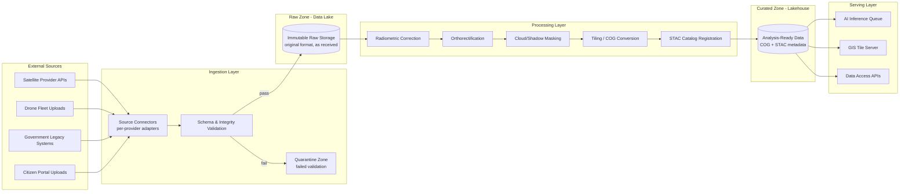

### 4.3.1 Zone Definitions (Lakehouse Pattern)

| Zone | Purpose | Mutability | Retention |
|---|---|---|---|
| **Raw Zone** | Exact copy of data as received from source, untouched | Immutable (WORM where evidentiary) | Indefinite for evidentiary imagery; policy-defined for reference data |
| **Processed/Curated Zone** | Radiometrically corrected, orthorectified, cloud-masked, tiled (COG), STAC-cataloged | Append-only (new processing versions create new curated artifacts, don't overwrite) | Indefinite (this is what AI models and GIS actually consume) |
| **Analytics Zone** | Aggregated/derived tables for dashboards and reporting (e.g., ward-level monthly violation counts) | Recomputable, not authoritative | Rolling window + periodic snapshots |

**Design decision:** processing never overwrites raw data, and re-processing (e.g., after improving an orthorectification algorithm) creates a **new versioned curated artifact** rather than mutating the old one — this preserves the ability to explain, months later, exactly what data an AI detection or legal case was based on (traceability requirement, tied to AP6 and AP10 in Chapter 3).

---

## 4.4 STAC Catalog Design

SpatioTemporal Asset Catalog (STAC) is the metadata backbone that lets every downstream service — AI inference, GIS tile server, analytics — discover and query imagery by location, time, sensor, and processing level without bespoke per-source logic.

### 4.4.1 STAC Hierarchy for SATRAK

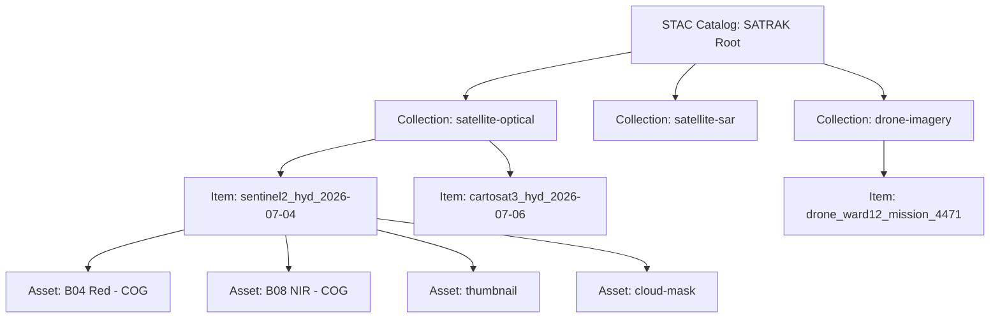

### 4.4.2 Core STAC Item Metadata Fields (SATRAK Extensions)

| Field | Standard/Custom | Purpose |
|---|---|---|
| `datetime` | STAC core | Acquisition timestamp |
| `geometry` / `bbox` | STAC core | Spatial footprint |
| `eo:cloud_cover` | STAC `eo` extension | Filtering usable imagery |
| `sat:orbit_state` | STAC `sat` extension | SAR/optical geometry context |
| `satrak:tenant_ids` | Custom | Which city/state tenant(s) this asset is relevant to |
| `satrak:processing_level` | Custom | raw / radiometric-corrected / orthorectified / analysis-ready |
| `satrak:evidentiary` | Custom (boolean) | Whether this asset is registered in the Digital Evidence Repository (Module 27) with hash-chain protection |
| `satrak:source_license` | Custom | Licensing terms from imagery vendor, for compliance/audit |

Using STAC (an open, widely adopted specification) rather than a bespoke metadata schema means SATRAK can directly consume public STAC-compliant catalogs (Microsoft Planetary Computer, Element84 Earth Search) for reference/training data, and any future imagery vendor integration only requires a connector, not a metadata redesign.

---

## 4.5 Government Legacy System Integration Pattern

Legacy permit/land-record systems are the hardest integration surface because they vary enormously by state/ULB, are often not API-accessible, and contain the ground truth (sanctioned plans, ownership) that the entire Compliance Rule Engine depends on.

### 4.5.1 Integration Tiers

| Tier | Scenario | Approach |
|---|---|---|
| Tier 1 — API Available | ULB has a modern permit system with REST/SOAP API | Direct connector via Integration Hub (Module 26) |
| Tier 2 — Database Accessible, No API | Legacy system with direct DB access permitted | Scheduled batch extract via read-replica or approved ETL job, never direct production DB writes |
| Tier 3 — File Export Only | System only supports manual CSV/Excel export | Scheduled SFTP drop-and-ingest pattern with strict schema validation and a human data-steward sign-off step |
| Tier 4 — Paper Records | No digital system exists | Out of automated pipeline scope — addressed via Document AI/OCR digitization workstream (Module 3, Document AI) as a one-time or ongoing digitization project, not a live pipeline |

### 4.5.2 Data Quality Gate

All Tier 2–4 sources pass through a **Data Quality Gate** before entering the Curated Zone:

1. Schema conformance check (required fields present, types valid)
2. Referential integrity check (parcel ID exists in GIS parcel layer; owner ID resolvable)
3. Duplicate/conflict detection (same parcel, conflicting sanctioned plan records from two source systems)
4. Human steward review queue for anything failing steps 1–3 — **never silently dropped, never silently auto-resolved** when the conflict involves legal ownership or sanctioned-plan data

---

## 4.6 Data Pipeline Non-Functional Requirements

| Requirement | Target |
|---|---|
| Satellite imagery ingestion latency (provider delivery → Raw Zone) | < 2 hours |
| Processing latency (Raw → Curated, per scene) | < 6 hours for standard optical; < 12 hours for SAR (heavier processing) |
| Drone imagery ingestion latency (mission end → Curated) | < 1 hour (prioritized for near-real-time enforcement use cases) |
| Legacy government batch ingestion | Nightly, with configurable per-source schedule |
| Pipeline failure alerting | < 5 minutes to on-call data engineering |
| End-to-end data lineage traceability | 100% — every curated asset traceable to its raw source and every processing step applied |

---

## 4.7 Risks and Limitations

| Risk | Mitigation |
|---|---|
| Legacy government data is frequently incomplete, inconsistent, or simply wrong (e.g., outdated ownership records) | Data Quality Gate (4.5.2) surfaces rather than hides conflicts; Compliance Rule Engine (Module 6) must be designed to express confidence/uncertainty, not assume ground truth is perfect |
| Satellite tasking costs scale with revisit frequency and resolution | Tiered tasking strategy (Module 1) — continuous moderate-resolution monitoring city-wide, high-resolution tasking only for AI-flagged candidate areas |
| STAC catalog growth at national scale (petabytes, millions of items) | Catalog itself must be backed by a scalable metadata store (PostgreSQL/PostGIS with pgSTAC), not flat files, from day one |
| Cloud cover in monsoon-affected regions creates optical data gaps | SAR (cloud-penetrating) fusion built in from the start (Module 1, SAR Fusion) rather than treated as an edge case |

---

## 4.8 Chapter 4 Closing Note

With the data pipeline specified, every module in Volume 3 can now be described in terms of what it consumes from the Curated Zone and what events it reacts to on the Kafka backbone (Chapter 3). Chapter 5 begins **Volume 3 — Module Specifications**, starting with **Module 1: Satellite Intelligence Platform**, given the full treatment specified in the program brief: purpose, users, user stories, functional and non-functional requirements, UI components, workflows, architecture, microservices, database tables, APIs, permissions, security, data flow, external integrations, KPIs, future improvements, risks, and limitations.

**Next chapter:** Chapter 5 — Module 1: Satellite Intelligence Platform (full specification).

---

---

# VOLUME 3 — MODULE SPECIFICATIONS

# CHAPTER 5: MODULE 1 — SATELLITE INTELLIGENCE PLATFORM

---

## 5.1 Module Template (Applies to All 30 Modules)

Every module in Volume 3 is specified against this fixed template, so engineering teams can navigate any module chapter identically:

`Purpose → Vision → Business Value → Users → User Stories → Use Cases → Functional Requirements → Non-Functional Requirements → UI Components → Workflows → Architecture → Microservices → Database Tables → APIs → Permissions → Security → Data Flow → External Integrations → KPIs → Future Improvements → Risks → Limitations → Technology Choices`

---

## 5.2 Purpose

The Satellite Intelligence Platform is SATRAK's primary continuous-observation layer. It is responsible for **acquiring, tasking, and preparing satellite imagery** — optical, SAR, hyperspectral — across every jurisdiction in scope, and exposing it in analysis-ready form to the AI Detection Engine (Module 3) and GIS Intelligence Engine (Module 4). It does not itself decide what is a violation; it makes the earth observable.

## 5.3 Vision

Every parcel of urban land under SATRAK's jurisdiction has a continuously updating satellite observation record, at the highest resolution/cadence justified by risk, without manual GIS staff involvement in the acquisition process.

## 5.4 Business Value

| Value Driver | Explanation |
|---|---|
| Coverage at near-zero marginal cost | Once tasking pipelines exist, monitoring an additional city adds imagery licensing cost, not proportional headcount |
| Objective, repeatable baseline | Removes reliance on ad hoc, one-off satellite purchases reviewed manually |
| Foundation for change detection | Nothing in the AI Detection Engine (Module 3) works without a reliable, versioned imagery time series |
| Cost-tiered acquisition | Moderate-resolution constellations provide cheap city-wide baseline monitoring; expensive high-resolution tasking is reserved for AI-flagged candidate areas only (see 5.9) |

## 5.5 Users

| User | Interaction |
|---|---|
| Data Engineering / Platform Ops | Configures tasking schedules, provider connectors, monitors ingestion pipeline health |
| AI/ML Team | Consumes curated imagery for model training and inference |
| GIS Architects | Consumes tiled imagery for basemap and overlay rendering |
| Town Planning Officer (Persona: Arjun) | Indirectly — views resulting imagery/detections in the Government Dashboard, not this module's own UI |
| Procurement/Program Office | Reviews imagery licensing cost/usage reports |

*(Note: this module is primarily backend/platform infrastructure; its direct human-facing UI is an internal Ops console, not a citizen- or officer-facing product surface.)*

## 5.6 User Stories

| ID | As a... | I want to... | So that... |
|---|---|---|---|
| US-1.1 | Data Engineer | configure a recurring tasking schedule per tenant/zone | imagery is acquired automatically without manual re-ordering |
| US-1.2 | Data Engineer | be alerted when a scheduled acquisition fails or is delayed by cloud cover | I can trigger a fallback (SAR, or re-task) before a monitoring gap becomes significant |
| US-1.3 | AI/ML Engineer | query all analysis-ready imagery for a given parcel over the last N months | I can build change-detection training pairs |
| US-1.4 | Town Planning Officer | (indirectly) see when the "last observed" date for their ward is stale | they know if there is a monitoring gap requiring drone follow-up |
| US-1.5 | Program Office | see monthly imagery licensing spend by provider and by tenant | cost is attributable and budgetable per city |

## 5.7 Use Cases

### UC-1.1: Scheduled City-Wide Baseline Monitoring
Trigger: recurring schedule (e.g., every Sentinel-2 revisit). System checks new scene availability, ingests if cloud cover below threshold, else waits for next revisit or flags a gap.

### UC-1.2: On-Demand High-Resolution Tasking (AI-Triggered)
Trigger: AI Detection Engine flags a candidate change area at moderate-resolution confidence below actioning threshold. System automatically submits a tasking order to a high-resolution provider (Maxar/Airbus/Planet SkySat) for that specific bounding box, prioritized over routine tasking.

### UC-1.3: Manual Tasking Request
Trigger: Officer or planner requests imagery for a specific area outside the automated schedule (e.g., in response to a citizen complaint). Routed through approval if it exceeds a cost threshold.

### UC-1.4: SAR Fallback During Persistent Cloud Cover
Trigger: Optical acquisition fails N consecutive cycles due to cloud cover (monsoon season). System automatically substitutes SAR acquisition to maintain change-detection continuity, flagging reduced confidence to downstream consumers.

## 5.8 Functional Requirements

| ID | Requirement |
|---|---|
| FR-1.1 | System shall support scheduled and on-demand tasking across at least Sentinel-2, Landsat-8/9, Cartosat-3, Planet, Maxar, and Airbus provider APIs via a common adapter interface |
| FR-1.2 | System shall automatically reject/flag scenes exceeding a configurable cloud-cover threshold, per tenant/zone |
| FR-1.3 | System shall perform radiometric correction, orthorectification, and cloud/shadow masking on all ingested optical imagery before marking it analysis-ready |
| FR-1.4 | System shall register every ingested and processed asset in the STAC catalog (Chapter 4) with full lineage metadata |
| FR-1.5 | System shall support automatic SAR substitution when optical acquisition fails for a configurable number of consecutive cycles |
| FR-1.6 | System shall expose a tasking API allowing the AI Detection Engine to programmatically request high-resolution acquisition for a specific bounding box |
| FR-1.7 | System shall track and report per-tenant, per-provider imagery licensing cost and usage |
| FR-1.8 | System shall support time-series query (all available imagery for a parcel/area across a date range, filterable by sensor type and cloud cover) |
| FR-1.9 | System shall generate and store cloud-optimized GeoTIFFs (COG) as the standard analysis-ready format |
| FR-1.10 | System shall apply image super-resolution enhancement (see Module 3, AI Section) as an optional processing step for candidate violation areas requiring finer detail than native resolution provides |

## 5.9 Non-Functional Requirements

| ID | Requirement |
|---|---|
| NFR-1.1 | Ingestion latency (provider delivery → Raw Zone): < 2 hours (per Chapter 4) |
| NFR-1.2 | Processing latency (Raw → analysis-ready): < 6 hours optical, < 12 hours SAR |
| NFR-1.3 | System shall support at least 10,000 concurrent tile-server read requests at P95 < 300ms |
| NFR-1.4 | Provider adapter interface shall support adding a new imagery provider without core pipeline code changes (plugin architecture) |
| NFR-1.5 | 100% of ingested imagery shall have complete, queryable STAC metadata within 1 hour of processing completion |
| NFR-1.6 | Tasking cost-control: on-demand high-resolution tasking above a configurable per-order cost threshold requires human approval (tied to FR-1.6/UC-1.2) |

## 5.10 UI Components

This module's direct UI is an internal **Satellite Ops Console** (not citizen/officer-facing):

| Component | Description |
|---|---|
| Tasking Calendar | Visual schedule of upcoming/completed acquisitions per tenant/zone |
| Provider Health Panel | Live status of each provider API connector (uptime, error rate, quota remaining) |
| Coverage Heatmap | Map view showing "last observed" recency per parcel/ward, color-coded by staleness |
| Cost Dashboard | Licensing spend by provider/tenant/month, budget burn-down |
| Manual Tasking Request Form | For UC-1.3, with cost estimate and approval routing |

## 5.11 Workflows

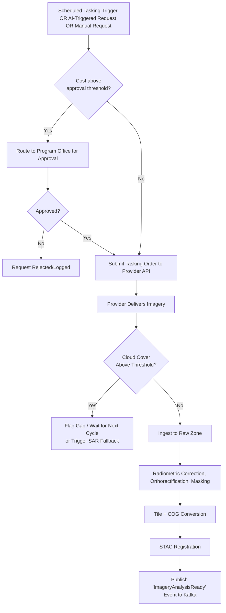

## 5.12 Architecture

The Satellite Intelligence Platform is the primary producer into the Data Pipeline described in Chapter 4. It owns the ingestion connectors and processing jobs up through STAC registration; it does not own the Curated Zone storage itself (a shared platform resource) but is the primary writer to it for satellite-sourced data.

## 5.13 Microservices

| Service | Responsibility |
|---|---|
| `satellite-tasking-svc` | Manages tasking schedules, submits orders to provider APIs, handles approval routing |
| `satellite-ingestion-svc` | Receives/pulls delivered imagery, performs initial validation, writes to Raw Zone |
| `satellite-processing-svc` | Radiometric correction, orthorectification, cloud masking (may be a set of worker jobs, not a single service) |
| `satellite-catalog-svc` | STAC registration and catalog query API |
| `satellite-cost-svc` | Tracks licensing usage/cost per provider/tenant |

## 5.14 Database Tables (Core Entities)

| Table | Key Fields |
|---|---|
| `tasking_order` | id, tenant_id, provider, bbox_geom, requested_at, requested_by, status, cost_estimate, approved_by |
| `imagery_asset` | id, stac_item_id, tenant_ids[], provider, sensor_type, acquisition_datetime, cloud_cover_pct, processing_level, storage_uri, evidentiary_flag |
| `provider_connector_config` | id, provider_name, api_endpoint, credentials_ref (vault reference, not plaintext), rate_limit_config |
| `coverage_status` | tenant_id, zone_id, last_observed_datetime, sensor_type, staleness_days (materialized/derived) |
| `licensing_usage` | id, tenant_id, provider, period, cost, scene_count |

*(Full DDL, indexes, and PostGIS geometry column specifications are provided in Volume 7 — Data Model & Database Design, which consolidates all 30 modules' schemas with cross-referential integrity rules.)*

## 5.15 APIs (Representative)

| Method | Endpoint | Purpose |
|---|---|---|
| `POST` | `/v1/tasking-orders` | Submit a tasking request (manual or AI-triggered) |
| `GET` | `/v1/tasking-orders/{id}` | Check tasking order status |
| `GET` | `/v1/imagery?bbox=&datetime=&sensor=&cloud_cover_lt=` | Query analysis-ready imagery matching spatial/temporal/quality filters |
| `GET` | `/v1/coverage/{tenant_id}` | Get coverage/staleness heatmap data for a tenant |
| `GET` | `/v1/licensing-usage/{tenant_id}` | Get cost/usage report |

Full request/response schemas, pagination, and error contracts are specified in Volume 8 — API Specification.

## 5.16 Permissions

| Role | Permissions |
|---|---|
| Data Engineer / Platform Ops | Full read/write on tasking, provider config |
| AI/ML Engineer | Read-only on imagery query APIs |
| Program Office | Read on cost/usage; approve authority on high-cost tasking orders |
| Town Planning Officer | No direct access to this module (consumes via Dashboard/GIS layer only) |

## 5.17 Security

- Provider API credentials stored in a secrets manager (e.g., HashiCorp Vault), never in application config or source control.
- All tasking requests logged with actor identity (ties to Audit & Compliance System, Module 20).
- Imagery marked `evidentiary_flag = true` (i.e., already referenced by an active case) becomes immutable per AP6 (Chapter 3) and cannot be deleted or reprocessed in place.

## 5.18 Data Flow

Satellite Provider API → Ingestion connector → Raw Zone (immutable) → Processing (radiometric/ortho/cloud-mask) → Curated Zone (COG) → STAC Catalog → Kafka event (`ImageryAnalysisReady`) → consumed by AI Detection Engine (Module 3) and GIS Intelligence Engine (Module 4).

## 5.19 External Integrations

| Integration | Type |
|---|---|
| Sentinel Hub / Copernicus Data Space | Free/open Sentinel-1/2 access |
| USGS EarthExplorer | Landsat access |
| ISRO Bhuvan / NRSC Data Center | Cartosat and other Indian EO assets, where applicable |
| Planet Labs API | Commercial high-frequency optical |
| Maxar / Airbus tasking APIs | Commercial high-resolution tasking |

## 5.20 KPIs

| KPI | Target (indicative, refined per Volume 12) |
|---|---|
| % of jurisdiction area with imagery < 30 days old | > 95% outside persistent-cloud-cover season |
| Tasking-to-delivery time (on-demand high-res) | < 72 hours |
| Pipeline ingestion success rate | > 99% |
| Cost per km² monitored per year | Tracked and reported; used for provider negotiation leverage |

## 5.21 Future Improvements

- Hyperspectral integration for material/vegetation-health-based inference (relevant to Module 30, Future Smart City Integration).
- Tighter tasking-cost optimization using predictive AI (Module 14) to pre-task high-resolution imagery for areas predicted likely to develop violations, before AI detection even flags them.

## 5.22 Risks

| Risk | Mitigation |
|---|---|
| Commercial tasking costs exceed budget at scale | Tiered acquisition strategy (moderate-res baseline, high-res only on AI trigger) — see NFR-1.6 |
| Provider API changes/deprecation | Plugin adapter architecture (NFR-1.4) isolates core pipeline from provider-specific changes |
| Persistent monsoon cloud cover in some regions | SAR fallback (FR-1.5) |

## 5.23 Limitations

- Satellite resolution, even high-resolution commercial imagery (~30cm), cannot reliably detect all violation types (e.g., interior floor additions without exterior footprint change) — this is why the Drone Intelligence Platform (Module 2) exists as a complementary, higher-resolution, on-demand layer, not a redundant one.
- Revisit frequency is provider- and orbit-dependent; near-real-time monitoring is not achievable from satellite alone for any single location.

## 5.24 Technology Choices

| Component | Choice | Rationale |
|---|---|---|
| Image format | Cloud-Optimized GeoTIFF (COG) | Enables partial/range-request reads without full download, standard in modern EO pipelines |
| Catalog | STAC + pgSTAC (PostgreSQL-backed) | Open standard, scalable metadata store, avoids flat-file catalog bottlenecks at national scale |
| Processing | Python (rasterio, GDAL, sentinelhub-py) in containerized batch jobs | Mature, widely supported geospatial processing ecosystem |
| Orchestration | Argo Workflows or Airflow on Kubernetes | DAG-based processing pipeline orchestration with retry/backoff built in |

---

## 5.25 Chapter 5 Closing Note

Module 1 establishes the template every subsequent module chapter will follow. Chapter 6 continues Volume 3 with **Module 2: Drone Intelligence Platform** — the enterprise Drone Command Center covering live video, mission planning, autonomous/manual missions, drone docks, and Digital Sky regulatory integration.

**Next chapter:** Chapter 6 — Module 2: Drone Intelligence Platform (full specification).

---

---

# CHAPTER 6: MODULE 2 — DRONE INTELLIGENCE PLATFORM

---

## 6.1 Purpose

The Drone Intelligence Platform is SATRAK's enterprise Drone Command Center — an on-demand, high-resolution observation layer that closes the gaps satellite imagery structurally cannot (Chapter 5, §5.23): fine-grained floor/height detail, interior-facing extensions, thermal/structural anomalies, and rapid response to a specific flagged parcel. It manages the full lifecycle of drone missions: planning, autonomous or manual flight, live video, data capture (RGB/thermal/LiDAR), fleet/dock management, and regulatory compliance.

## 6.2 Vision

Any flagged parcel, anywhere in a jurisdiction's coverage area, can have a high-resolution drone survey initiated and completed within hours — not scheduled around inspector availability — with full regulatory compliance and safety built into the mission-planning step itself, not bolted on afterward.

## 6.3 Business Value

| Value Driver | Explanation |
|---|---|
| Ground-truth verification | Converts a satellite-flagged "candidate" into a court-defensible, high-resolution confirmed observation |
| Rapid response | Drone missions can be flown same-day, versus weeks for manual inspector scheduling |
| 3D/structural detail | LiDAR and photogrammetry provide floor-count, height, and volumetric measurements satellite imagery cannot |
| Officer safety | Reduces need for physical site entry in contested/hazardous locations before legal backing is confirmed |

## 6.4 Users

| User | Interaction |
|---|---|
| Drone Pilot / Remote Pilot in Command (RPIC) | Plans and executes/monitors missions |
| Field Inspector (Persona: Priya) | Requests a drone survey for a case; reviews resulting imagery/measurements |
| Drone Fleet Operations Manager | Manages fleet health, dock scheduling, maintenance |
| AI/ML Team | Consumes drone imagery for high-resolution model training/inference |
| Digital Sky Compliance Officer | Ensures every mission is registered/compliant with national UAS regulation |

## 6.5 User Stories

| ID | As a... | I want to... | So that... |
|---|---|---|---|
| US-2.1 | Field Inspector | request a drone survey directly from an open case | I get high-resolution confirmation without waiting for a separate manual visit |
| US-2.2 | Drone Pilot | plan an autonomous mission with pre-defined waypoints over a flagged parcel | the flight is repeatable, safe, and doesn't require manual piloting for routine surveys |
| US-2.3 | Fleet Ops Manager | see real-time battery, maintenance, and dock status for every drone | I can schedule missions without last-minute equipment failures |
| US-2.4 | Digital Sky Compliance Officer | verify every planned mission against no-fly zones and altitude ceilings before launch | the platform never operates outside legal airspace authorization |
| US-2.5 | AI/ML Engineer | pull LiDAR point clouds and RGB imagery for a specific mission | I can train/run floor-count and height-estimation models |

## 6.6 Use Cases

### UC-2.1: Case-Triggered On-Demand Survey
Trigger: Inspector or AI Detection Engine flags a parcel needing higher-resolution confirmation. System checks nearest available drone/dock, verifies airspace clearance, and either auto-schedules (autonomous, pre-approved zone) or queues for pilot approval (manual/contested zone).

### UC-2.2: Scheduled Ward Sweep
Trigger: Periodic schedule for wards without recent high-resolution coverage. Autonomous multi-waypoint mission covering a defined ward boundary.

### UC-2.3: Live-Monitored Manual Mission (Contested/Complex Site)
Trigger: Site requires human judgment during flight (e.g., obstacles, crowd presence, legal sensitivity). Pilot flies manually with live video (WebRTC/RTSP) streamed to a supervising officer.

### UC-2.4: Post-Mission 3D Reconstruction
Trigger: Mission with photogrammetry/LiDAR capture completes. System automatically triggers 3D reconstruction pipeline (Module 3, AI Section) to produce a textured mesh and height/floor measurements for the Digital Twin Platform (Module 7).

## 6.7 Functional Requirements

| ID | Requirement |
|---|---|
| FR-2.1 | System shall support autonomous waypoint-based mission planning with configurable altitude, overlap %, and sensor payload selection |
| FR-2.2 | System shall verify every planned mission against a no-fly-zone/altitude-ceiling layer sourced from Digital Sky (or equivalent national UAS authority) before allowing launch |
| FR-2.3 | System shall support live video streaming (RTSP/WebRTC) from drone to a supervising officer's console during manual missions |
| FR-2.4 | System shall support RGB, thermal, and LiDAR payload capture, tagged per mission |
| FR-2.5 | System shall track battery, maintenance schedule, and dock/charging status for every fleet asset in real time |
| FR-2.6 | System shall support obstacle avoidance during autonomous flight (leveraging onboard drone hardware capability, integrated via telemetry feed) |
| FR-2.7 | System shall trigger automated 3D reconstruction (photogrammetry) for missions flagged for structural/height measurement |
| FR-2.8 | System shall allow a field inspector to request a mission directly from an open case record (tight integration with Module 10, Inspection Management) |
| FR-2.9 | System shall support edge AI inference on-drone (e.g., preliminary object detection) to prioritize which captured frames are transmitted at full resolution when bandwidth is constrained |
| FR-2.10 | System shall log every mission's flight path, timestamps, and pilot/operator identity as part of the evidentiary chain (Module 27) |

## 6.8 Non-Functional Requirements

| ID | Requirement |
|---|---|
| NFR-2.1 | Mission scheduling-to-launch latency (pre-approved zones): < 4 hours |
| NFR-2.2 | Live video latency: < 500ms end-to-end for supervising officer console |
| NFR-2.3 | Fleet telemetry update frequency: ≥ 1Hz |
| NFR-2.4 | Airspace clearance check: 100% of missions verified before launch; zero tolerance for bypass |
| NFR-2.5 | Post-mission data upload/availability in Curated Zone: < 1 hour after landing |
| NFR-2.6 | System shall support fleet scale of hundreds of drones across a state without redesign (multi-tenant fleet management) |

## 6.9 UI Components

| Component | Description |
|---|---|
| Mission Planner (map-based) | Draw/select area, set waypoints, altitude, sensor payload, review airspace clearance overlay |
| Live Mission Console | Real-time video feed, telemetry (battery, altitude, speed, GPS), manual override controls |
| Fleet Status Board | Grid/map view of all drones — status, battery, location, next scheduled mission |
| Dock Management Panel | Charging schedule, maintenance logs, dock capacity |
| Mission History / Playback | Review completed missions, flight path replay, captured imagery gallery |

## 6.10 Workflows

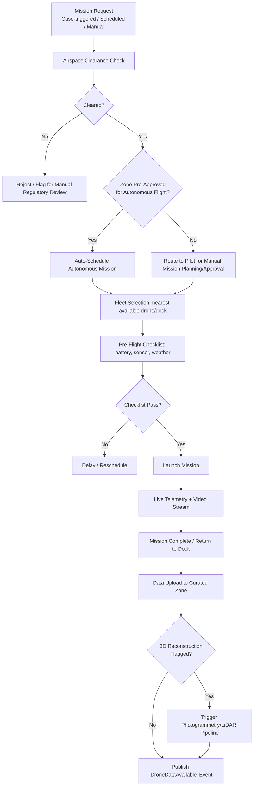

## 6.11 Architecture

The Drone Intelligence Platform integrates with the Data Pipeline (Chapter 4) as a second major producer alongside the Satellite Intelligence Platform, and additionally owns real-time streaming infrastructure (WebRTC media servers) that the satellite side does not require. It publishes `DroneDataAvailable` events consumed by the AI Detection Engine and Digital Twin Platform.

## 6.12 Microservices

| Service | Responsibility |
|---|---|
| `drone-mission-svc` | Mission planning, scheduling, airspace clearance checks |
| `drone-telemetry-svc` | Real-time telemetry ingestion (position, battery, sensor status) |
| `drone-streaming-svc` | Live video relay (WebRTC/RTSP media server) |
| `drone-fleet-svc` | Fleet inventory, dock/charging, maintenance scheduling |
| `drone-data-ingestion-svc` | Post-mission data upload and handoff to Data Pipeline |
| `reconstruction-orchestrator-svc` | Triggers and tracks 3D reconstruction jobs |

## 6.13 Database Tables (Core Entities)

| Table | Key Fields |
|---|---|
| `drone_asset` | id, tenant_id, serial_number, model, sensor_payloads[], status, current_dock_id |
| `drone_mission` | id, tenant_id, case_id (nullable, FK to Module 10), planned_path_geom, altitude, sensor_config, status, pilot_id, airspace_clearance_id |
| `airspace_clearance` | id, mission_id, checked_at, result, no_fly_zone_refs[] |
| `mission_telemetry` | mission_id, timestamp, lat, lon, altitude, battery_pct, speed |
| `dock_station` | id, tenant_id, location_geom, capacity, current_occupancy |
| `mission_asset_output` | id, mission_id, asset_type (rgb/thermal/lidar/video), storage_uri, stac_item_id |

## 6.14 APIs (Representative)

| Method | Endpoint | Purpose |
|---|---|---|
| `POST` | `/v1/missions` | Create a mission (case-triggered, scheduled, or manual) |
| `GET` | `/v1/missions/{id}/telemetry` | Stream/poll live telemetry |
| `POST` | `/v1/missions/{id}/airspace-check` | Run/re-run airspace clearance |
| `GET` | `/v1/fleet` | Fleet status query |
| `GET` | `/v1/missions/{id}/assets` | Retrieve captured data assets for a completed mission |

## 6.15 Permissions

| Role | Permissions |
|---|---|
| Drone Pilot / RPIC | Full mission planning/execution within assigned tenant |
| Fleet Ops Manager | Full fleet/dock management; read on missions |
| Field Inspector | Request mission from a case; read-only on resulting data |
| Digital Sky Compliance Officer | Read/override on airspace clearance decisions |

## 6.16 Security

- Live video streams encrypted end-to-end (DTLS-SRTP for WebRTC).
- Mission flight logs are part of the evidentiary chain (Module 27) and immutable once a mission completes.
- Drone-to-ground-station communication authenticated via mutual certificate-based authentication, not shared credentials.

## 6.17 Data Flow

Drone onboard capture → post-mission upload → `drone-data-ingestion-svc` → Data Pipeline Raw Zone → processing (photogrammetry/LiDAR registration where applicable) → Curated Zone → Kafka event (`DroneDataAvailable`) → consumed by AI Detection Engine (Module 3) and Digital Twin Platform (Module 7).

## 6.18 External Integrations

| Integration | Type |
|---|---|
| Digital Sky / national UAS traffic management platform | Airspace clearance, mission registration (regulatory) |
| Drone manufacturer SDKs (DJI, or government-approved domestic manufacturers) | Telemetry, mission upload, fleet control |
| Weather API | Pre-flight weather-suitability check |

## 6.19 KPIs

| KPI | Target (indicative) |
|---|---|
| Mission request-to-launch time (pre-approved zones) | < 4 hours |
| Airspace clearance check success rate before any launch | 100% |
| Fleet utilization rate | Tracked; optimized via scheduling, not a hard target |
| 3D reconstruction turnaround | < 24 hours post-mission |

## 6.20 Future Improvements

- Swarm intelligence for multi-drone coordinated ward sweeps (reduces total sweep time).
- Automated dock-to-dock relay missions for large-area coverage beyond single-battery range.
- Edge AI model updates pushed over-the-air to onboard compute for improved in-flight prioritization (FR-2.9).

## 6.21 Risks

| Risk | Mitigation |
|---|---|
| Regulatory/airspace changes (no-fly zone updates) | Airspace layer refreshed on a defined schedule and validated against authoritative source before every mission (FR-2.2, NFR-2.4) |
| Physical safety (crowds, obstacles, weather) | Pre-flight checklist gate (6.10), manual override always available to pilot |
| Fleet hardware failure/downtime | Predictive maintenance scheduling using battery-cycle and flight-hour telemetry (tie-in with Module 14, Predictive AI) |

## 6.22 Limitations

- Drone missions are on-demand/scheduled, not continuous — they complement satellite's continuous cadence rather than replace it (Chapter 5, §5.23 cross-reference).
- Weather and regulatory constraints (night flight restrictions, wind limits) create real operational ceilings on responsiveness that no software layer can eliminate.

## 6.23 Technology Choices

| Component | Choice | Rationale |
|---|---|---|
| Live video | WebRTC (primary), RTSP (legacy/interop) | WebRTC gives low-latency browser-native streaming without plugins |
| Photogrammetry | Open Drone Map (ODM) pipeline or commercial SDK (e.g., Pix4D engine, licensed) | Mature, widely validated for drone-to-3D-mesh workflows |
| LiDAR processing | PDAL (Point Data Abstraction Library) | Standard open-source LiDAR/point-cloud processing toolkit |
| Telemetry protocol | MAVLink (where drone hardware supports it) | Industry-standard, well-documented UAV telemetry protocol |

---

## 6.24 Chapter 6 Closing Note

With Modules 1 and 2 specified, SATRAK's two observation sources — continuous satellite and on-demand drone — are fully defined, along with how they converge into the shared Data Pipeline (Chapter 4). Chapter 7 continues Volume 3 with **Module 3: AI Detection Engine**, the layer that actually turns this imagery into violation candidates — covering building detection, segmentation, change detection, and the full AI Section models specified in the program brief.

**Next chapter:** Chapter 7 — Module 3: AI Detection Engine (full specification, including per-model detail for every AI system listed in the brief's AI Section).

---

---

# CHAPTER 7: MODULE 3 — AI DETECTION ENGINE (PART 1 OF 2)

---

## 7.1 Purpose

The AI Detection Engine is SATRAK's computer-vision and machine-learning core — the layer that converts raw satellite and drone imagery into **candidate violations with confidence scores and visual evidence**, for human review. This chapter (Part 1) covers the module-level specification plus the first group of AI systems (detection, segmentation, change, and measurement models). Chapter 8 (Part 2) covers foundation models, predictive/anomaly systems, and image-enhancement models, plus the module's database/API/security/KPI sections.

**Critical framing (repeated deliberately, per AP10 in Chapter 3):** every model in this module is **decision-support**, not decision-making. No model output triggers legal consequence without a human review step in Module 10 (Inspection Management) and Module 11 (Workflow Automation).

## 7.2 Vision

Every piece of imagery entering the Curated Zone is automatically screened by the appropriate model pipeline within hours of availability, with results explainable enough that a non-technical officer can understand *why* a candidate was flagged, and with model performance continuously monitored so degradation is caught before it silently erodes case quality.

## 7.3 Business Value

| Value Driver | Explanation |
|---|---|
| Coverage multiplier | One trained model screens an entire city's imagery in hours; manual review of the same area would take inspector-months |
| Consistency | Removes inter-inspector variability in what counts as "suspicious" — same rule/model applied uniformly |
| Prioritization | Confidence scores let limited inspector capacity be directed at highest-likelihood violations first (feeds Module 10) |
| Evidentiary strength | Model outputs are logged with versioned model IDs and inputs, supporting the "how was this detected" question in court (Module 28) |

## 7.4 Users

| User | Interaction |
|---|---|
| AI/ML Research Engineers | Build, train, evaluate models |
| MLOps Engineers | Deploy, monitor, retrain models in production (tight coupling with Module 22–23) |
| Field Inspector (Priya) | Receives prioritized, model-flagged case candidates, not raw model output |
| Town Planning Officer (Arjun) | Reviews model-flagged FAR/setback violations against rule engine output |
| Data Protection/Audit | Reviews model explainability documentation for compliance |

## 7.5 User Stories

| ID | As a... | I want to... | So that... |
|---|---|---|---|
| US-3.1 | AI/ML Engineer | register a new/updated model version with a defined evaluation benchmark | I can promote it to production only if it beats the current model on held-out data |
| US-3.2 | Field Inspector | see a visual overlay (e.g., "extra floor detected here, 87% confidence") rather than raw pixel output | I can quickly understand and verify the flagged issue on-site |
| US-3.3 | MLOps Engineer | be alerted when a model's live prediction distribution drifts from its training distribution | I can trigger retraining before case quality silently degrades |
| US-3.4 | Data Protection Officer | review which models process personally identifiable data (e.g., OCR on ownership documents) | I can ensure appropriate data-handling controls are applied per model |

## 7.6 Use Cases

### UC-3.1: Automated Screening on New Imagery
Trigger: `ImageryAnalysisReady` or `DroneDataAvailable` Kafka event (Chapters 5–6). Orchestrator dispatches the relevant model pipeline (building change detection at minimum; others per configuration) and publishes results as `DetectionCandidateCreated` events (Chapter 3, §3.4.2).

### UC-3.2: Targeted Re-Inference on Officer Request
Trigger: Officer requests re-analysis of a specific parcel with the latest model version or additional sensor data (e.g., after a new drone survey).

### UC-3.3: Model Promotion Pipeline
Trigger: A newly trained model version completes evaluation. If it exceeds the current production model on the fixed benchmark (precision/recall on held-out ground truth), it is promoted via canary rollout (see Module 23, MLOps Platform) to a small traffic percentage before full promotion.

## 7.7 Functional Requirements

| ID | Requirement |
|---|---|
| FR-3.1 | System shall run building footprint detection and segmentation on all newly ingested analysis-ready imagery |
| FR-3.2 | System shall run change detection comparing each new scene against the most recent prior scene of the same location |
| FR-3.3 | System shall attach a confidence score and bounding-box/segmentation-mask visual evidence to every detection candidate |
| FR-3.4 | System shall tag every detection with the exact model ID and version used, for evidentiary traceability |
| FR-3.5 | System shall support human feedback capture (confirmed / false positive / uncertain) on every detection, feeding back into retraining datasets |
| FR-3.6 | System shall support configurable model pipelines per jurisdiction (not every city needs every model active, e.g., lakebed-encroachment models only relevant near water bodies) |

## 7.8 Non-Functional Requirements

| ID | Requirement |
|---|---|
| NFR-3.1 | Inference latency for standard change-detection pipeline: < 30 minutes per city-wide scene batch |
| NFR-3.2 | Model precision on held-out validation set: minimum acceptance threshold defined per model type before production promotion (see individual model specs below) |
| NFR-3.3 | All inference logged with input reference, model version, output, and confidence — 100% traceability |
| NFR-3.4 | GPU inference pool shall autoscale based on queue depth, avoiding both idle GPU cost and pipeline backlog |

## 7.9 UI Components

The AI Detection Engine's primary UI surface is embedded within the Government Dashboard (Module 8) and Mobile Application (Module 15) as **detection overlays**, not a standalone UI. Internal-only components:

| Component | Description |
|---|---|
| Model Registry Console | List of registered models, versions, evaluation metrics, promotion status |
| Detection Review Queue (internal QA) | Sample-based human QA review of raw model outputs before they reach officer-facing queues |
| Drift Monitoring Dashboard | Live view of prediction distribution drift per model (feeds Module 23) |

## 7.10 Workflows

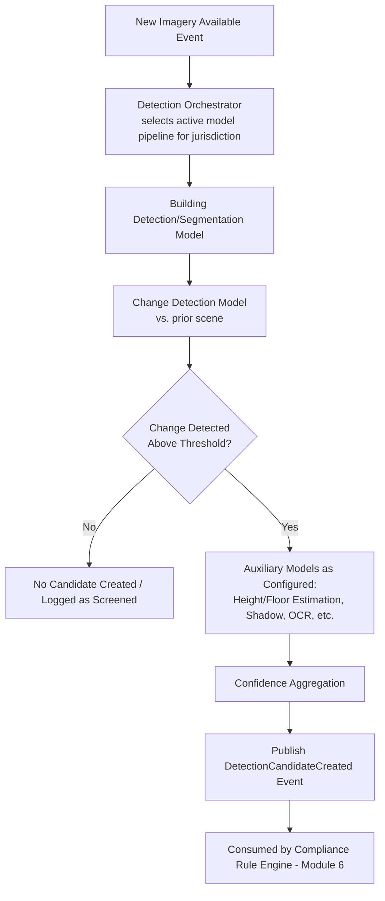

## 7.11 Architecture

The AI Detection Engine is architected as an **orchestrator + model-family services** pattern: `detection-orchestrator-svc` (Chapter 3, §3.4.1) decides which models to run per jurisdiction/imagery type, and each model family runs as an independently deployable, independently versioned inference service under `model-inference-svc`, registered in the Model Registry (Module 22). This means a new model type (e.g., a future flood-risk model for Module 29) can be added without modifying the orchestrator's core logic — only its configuration.

## 7.12 Microservices

| Service | Responsibility |
|---|---|
| `detection-orchestrator-svc` | Determines which model pipeline runs on which imagery, aggregates multi-model output |
| `model-inference-svc` (per model family, e.g., `building-detection`, `change-detection`) | Runs a specific model's inference, versioned independently |
| `feedback-capture-svc` | Captures human confirm/reject feedback on detections for retraining datasets |
| `evaluation-svc` | Runs benchmark evaluation for candidate model versions before promotion |

---

## 7.13 AI Model Specifications — Group A: Detection, Segmentation & Measurement Models

Each model below is specified per the program brief's required fields: Purpose, Input, Output, Training, Datasets, Evaluation, Inference, Deployment, Monitoring, Retraining.

### 7.13.1 Building Detection

| Field | Detail |
|---|---|
| Purpose | Identify the presence and location of building structures within imagery |
| Input | Analysis-ready optical imagery tile (satellite or drone), RGB or RGB+NIR |
| Output | Bounding boxes or point locations of detected buildings with confidence scores |
| Training | Supervised object detection (e.g., transformer-based detector) fine-tuned from a pretrained backbone |
| Datasets | Open building-footprint datasets (Google Open Buildings, Microsoft Building Footprints) for pretraining; jurisdiction-specific labeled imagery for fine-tuning, produced via the Human Feedback loop (7.5, US-3.2) |
| Evaluation | Precision/recall against held-out labeled tiles; mean Average Precision (mAP) at defined IoU thresholds |
| Inference | Batch, GPU-accelerated, tiled processing for large scenes |
| Deployment | Containerized service registered in Model Registry (Module 22), versioned |
| Monitoring | Prediction confidence distribution tracked per deployment; alert on drift (Module 23) |
| Retraining | Triggered on a schedule or when drift/feedback volume crosses a threshold |

### 7.13.2 Building Segmentation

| Field | Detail |
|---|---|
| Purpose | Produce pixel-accurate building footprint polygons (not just bounding boxes), required for accurate area/FAR calculation |
| Input | Same as Building Detection |
| Output | Polygon masks per building, with area computed in the imagery's ground-sample-distance-corrected units |
| Training | Semantic/instance segmentation architecture (e.g., U-Net or transformer-based segmentation model) |
| Datasets | Same base datasets as Building Detection, with pixel-level mask annotations |
| Evaluation | Intersection-over-Union (IoU) against ground-truth polygons; boundary F-score for edge accuracy |
| Inference | Batch, GPU-accelerated |
| Deployment | Independently versioned service; often run immediately after Building Detection in the same pipeline stage |
| Monitoring | Polygon area distribution drift; systematic over/under-segmentation patterns flagged in QA sampling |
| Retraining | Prioritizes feedback from officer-confirmed area discrepancies (a common real-world error source) |

### 7.13.3 Change Detection

| Field | Detail |
|---|---|
| Purpose | Identify meaningful structural change between two time-separated observations of the same location |
| Input | Pair (or time series) of co-registered analysis-ready images of the same area |
| Output | Change mask/heatmap with a change-type classification (new construction, extension, demolition, no change) and confidence |
| Training | Siamese-network or transformer-based change-detection architecture trained on paired before/after imagery |
| Datasets | Public change-detection benchmarks (e.g., LEVIR-CD style building-change datasets) for pretraining; jurisdiction time-series imagery with officer-confirmed change labels for fine-tuning |
| Evaluation | Precision/recall on change vs. no-change classification; F1 on change-type sub-classification |
| Inference | Triggered automatically whenever a new scene is ingested for a previously-observed location (core of FR-3.2) |
| Deployment | Primary/default pipeline stage — this is the single most heavily used model in the platform |
| Monitoring | False-positive rate from officer feedback tracked as the primary production health signal (false positives directly cost inspector time) |
| Retraining | Continuous incremental retraining incorporating confirmed/rejected feedback; scheduled full retrain quarterly |

### 7.13.4 Road Detection

| Field | Detail |
|---|---|
| Purpose | Identify road network geometry, used to compute setback distances and detect road encroachment |
| Input | Analysis-ready optical imagery |
| Output | Road centerline/polygon vector layer |
| Training | Semantic segmentation model fine-tuned on road-specific datasets |
| Datasets | Public road-extraction benchmarks (e.g., DeepGlobe Road Extraction), fused with official road-network GIS layers where available as weak supervision |
| Evaluation | IoU against ground-truth road masks; topology correctness (connectivity) metrics |
| Inference | Run less frequently than change detection — road networks change slowly; re-run on a periodic schedule or when GIS reference layer updates |
| Deployment | Standard containerized inference service |
| Monitoring | Compared periodically against official road GIS layer updates for consistency |
| Retraining | Low frequency (annual or on significant road-network change) |

### 7.13.5 Tree Detection

| Field | Detail |
|---|---|
| Purpose | Identify tree/vegetation cover, used both for environmental/forest-encroachment detection and to correct building-detection models for occlusion |
| Input | Optical imagery, ideally with NIR band (vegetation indices like NDVI improve accuracy) |
| Output | Tree/vegetation mask, canopy density estimate |
| Training | Segmentation model incorporating spectral index features (NDVI) alongside RGB |
| Datasets | Public forest-cover datasets (e.g., Global Forest Watch derived layers) for pretraining; local fine-tuning for jurisdiction-specific vegetation types |
| Evaluation | IoU against ground-truth vegetation masks |
| Inference | Batch, run alongside building detection to help de-occlude building footprint estimates |
| Deployment | Standard service |
| Monitoring | Seasonal accuracy drift (deciduous vegetation changes appearance across seasons) explicitly tracked |
| Retraining | Seasonal recalibration where deciduous vegetation is significant |

### 7.13.6 Shadow Detection

| Field | Detail |
|---|---|
| Purpose | Identify and mask shadow regions, both to avoid shadow being misclassified as a structure/change, and to assist height estimation (shadow length correlates with structure height at known sun angle) |
| Input | Optical imagery with known acquisition datetime/sun angle (available from STAC metadata, Chapter 4) |
| Output | Shadow mask; estimated structure height where shadow geometry is usable |
| Training | Segmentation model, often rule-assisted (physics-based shadow modeling using sun-angle metadata combined with learned segmentation) |
| Datasets | Synthetic shadow datasets generated from known building heights + sun angle, supplemented with manually labeled real imagery |
| Evaluation | IoU on shadow mask; height-estimate error (meters) against ground-truth surveyed heights |
| Inference | Run as an auxiliary model feeding Height Estimation (7.13.7) |
| Deployment | Standard service |
| Monitoring | Height-estimate error tracked against drone-LiDAR ground truth where available (cross-validation) |
| Retraining | As needed based on error tracking |

### 7.13.7 Height Estimation

| Field | Detail |
|---|---|
| Purpose | Estimate structure height, a key input to floor-count estimation and building-code compliance checks |
| Input | Shadow-derived estimate (satellite case), or direct LiDAR/photogrammetry measurement (drone case) |
| Output | Height in meters, with confidence/uncertainty band |
| Training | For satellite-shadow method: regression model calibrated against known-height ground truth. For drone-LiDAR: direct geometric computation, not a learned model |
| Datasets | Ground-truth height surveys (subset of inspected buildings with confirmed floor counts/heights) |
| Evaluation | Mean absolute error (meters) against ground truth |
| Inference | Satellite path: per flagged candidate. Drone path: automatic on every LiDAR-equipped mission |
| Deployment | Two parallel paths (satellite-estimation service, drone-geometric service) feeding a unified height field in the detection record |
| Monitoring | Error tracked separately per path; satellite-based estimates always flagged as lower-confidence than drone-LiDAR-derived ones |
| Retraining | Satellite regression model recalibrated as more ground-truth height data accumulates from drone-confirmed cases |

### 7.13.8 Floor Estimation

| Field | Detail |
|---|---|
| Purpose | Estimate number of floors, the single most commonly violated parameter (unauthorized additional floors) |
| Input | Height estimate (7.13.7) plus jurisdiction-typical floor-height assumption, OR direct visual floor-line counting from high-resolution drone facade imagery |
| Output | Estimated floor count with confidence |
| Training | Regression/classification model combining height input with visual facade cues (window-row counting) where facade imagery is available |
| Datasets | Ground-truth floor counts from confirmed inspection cases |
| Evaluation | Exact-match accuracy and ±1-floor accuracy against ground truth |
| Inference | Per flagged candidate, using best available input (drone facade imagery preferred over satellite-height-only estimate) |
| Deployment | Standard service, tightly coupled to Height Estimation output |
| Monitoring | Accuracy tracked per input-source type (drone-facade vs. satellite-height-only) separately, since confidence differs materially |
| Retraining | Incremental, prioritizing officer-confirmed corrections |

### 7.13.9 OCR (Optical Character Recognition)

| Field | Detail |
|---|---|
| Purpose | Extract text from scanned permit documents, sanctioned plans, ownership records, and site signage (e.g., builder nameplates) for digitization and cross-referencing |
| Input | Scanned document images or photographs containing text |
| Output | Extracted text with bounding-box location and confidence, structured where possible (e.g., permit number, date, owner name fields) |
| Training | Fine-tuned OCR model (e.g., transformer-based OCR) on jurisdiction-specific document formats and regional language scripts |
| Datasets | Sample sets of actual permit/plan documents (redacted for training where they contain PII, per Volume 9 privacy requirements), public multi-lingual OCR benchmarks for base pretraining |
| Evaluation | Character Error Rate (CER) and Word Error Rate (WER) against manually transcribed ground truth |
| Inference | Triggered on document upload (permit digitization workstream, Tier 4 legacy sources per Chapter 4, §4.5.1) |
| Deployment | Standard service, often combined with Document AI (7.13.10) for structured field extraction |
| Monitoring | Error rate tracked per document type/language/script |
| Retraining | As new document formats/languages are onboarded per jurisdiction |

### 7.13.10 Document AI

| Field | Detail |
|---|---|
| Purpose | Go beyond raw OCR text to extract **structured fields** from permits, sanctioned plans, and legal notices (permit number, sanctioned floor count, setback specifications, owner name, issue date) |
| Input | OCR output (7.13.9) plus document layout image |
| Output | Structured key-value record matching the Property/Permit database schema (Module 5) |
| Training | Layout-aware document understanding model (combining OCR text, position, and visual layout features) fine-tuned per document template family (each ULB/state often has distinct permit formats) |
| Datasets | Labeled examples of each document template family with ground-truth field extraction |
| Evaluation | Field-level extraction accuracy (precision/recall per field type) |
| Inference | Per uploaded/digitized document |
| Deployment | Standard service; new document template families require a targeted fine-tuning cycle before reliable extraction (flagged in Future Improvements) |
| Monitoring | Extraction accuracy tracked per template family; low-confidence extractions routed to human data-entry review, never silently accepted for legally significant fields (owner name, sanctioned floor count) |
| Retraining | On onboarding of each new document template family |

---

## 7.14 Chapter 7 Closing Note

Part 1 has specified the AI Detection Engine's module-level requirements and the first ten AI models — the detection, segmentation, and measurement backbone of the entire platform. Chapter 8 (Part 2) continues with foundation models, vision-language and large language models, graph neural networks, predictive/anomaly systems, and image-enhancement models (super-resolution, cloud removal, 3D reconstruction, drone object detection, thermal detection, SAR fusion), followed by this module's database schema, APIs, security, KPIs, risks, and limitations.

**Next chapter:** Chapter 8 — Module 3: AI Detection Engine (Part 2 of 2).

---

---

# CHAPTER 8: MODULE 3 — AI DETECTION ENGINE (PART 2 OF 2)

---

## 8.1 AI Model Specifications — Group B: Foundation Models, Language & Graph Models

### 8.1.1 Foundation Models (Earth Observation)

| Field | Detail |
|---|---|
| Purpose | Provide a general-purpose, pretrained visual representation of satellite/aerial imagery that downstream task-specific models (detection, segmentation, change detection) fine-tune from, reducing labeled-data requirements per task |
| Input | Large unlabeled/weakly-labeled satellite and aerial imagery corpora |
| Output | A pretrained encoder (embedding model) reusable across all Group A models |
| Training | Self-supervised pretraining (e.g., masked autoencoding or contrastive learning) on large-scale EO imagery |
| Datasets | Public EO foundation-model corpora (e.g., SSL4EO, SatlasPretrain-style datasets) combined with SATRAK's own accumulating multi-year imagery archive |
| Evaluation | Downstream task performance uplift when fine-tuning from this encoder vs. from a generic ImageNet-pretrained backbone |
| Inference | Not directly served to end users — consumed internally as a shared backbone by task-specific models |
| Deployment | Versioned centrally in Model Registry (Module 22); task-specific models declare which foundation-model version they were fine-tuned from |
| Monitoring | Tracked indirectly via downstream task model performance |
| Retraining | Periodic (e.g., annual) full re-pretraining as the imagery archive grows, since more data materially improves foundation-model quality |

### 8.1.2 Vision-Language Models (VLMs)

| Field | Detail |
|---|---|
| Purpose | Allow natural-language querying of imagery ("show me all parcels with a rooftop structure added in the last 3 months near [ward]") and generate natural-language descriptions of detected changes for officer-facing reports |
| Input | Imagery plus natural-language prompt/query |
| Output | Natural-language description, or a ranked set of matching imagery/locations |
| Training | Fine-tuned from an open multimodal foundation model on EO-specific image-text pairs (captions describing detected changes, generated initially from structured detection output, refined by human review) |
| Datasets | Synthetically generated image-caption pairs from Group A model outputs, human-reviewed for quality; general open VLM pretraining data for base capability |
| Evaluation | Human evaluation of description accuracy/usefulness; retrieval accuracy for natural-language search use cases |
| Inference | On-demand (dashboard search feature); not part of the automatic screening pipeline |
| Deployment | Standard inference service, likely GPU-heavier than Group A models given model size |
| Monitoring | Human feedback on description quality/usefulness sampled regularly |
| Retraining | As captioning quality feedback accumulates |

### 8.1.3 Large Language Models (LLMs)

| Field | Detail |
|---|---|
| Purpose | Support the Report Generation module (Module 12) by drafting inspection reports, notices, and case summaries from structured case data; support the Citizen Portal chatbot for complaint filing guidance |
| Input | Structured case data (detection results, rule-engine output, officer notes) |
| Output | Draft natural-language report/notice text, always presented as a **draft requiring officer review and sign-off**, never auto-sent |
| Training | Fine-tuned/prompted foundation LLM (open-weight or licensed, deployed within the government's data-residency boundary — no case data sent to external third-party LLM APIs, per Volume 9 data residency requirements) |
| Datasets | Historical (anonymized/approved) inspection reports and notices for style/format fine-tuning |
| Evaluation | Human review acceptance rate (% of drafts accepted with minor vs. major edits) |
| Inference | On-demand, triggered from Module 12/Module 10 workflows |
| Deployment | Self-hosted within government-approved infrastructure boundary; strict prohibition on sending property/citizen data to external hosted LLM APIs |
| Monitoring | Draft-acceptance rate; flagged for review if hallucinated/incorrect factual claims are detected in officer edits |
| Retraining | Periodic fine-tuning refresh incorporating accepted-draft patterns |

### 8.1.4 Graph Neural Networks (GNNs)

| Field | Detail |
|---|---|
| Purpose | Model relationships between parcels, ownership entities, and permit records to detect patterns invisible to per-parcel analysis — e.g., a single owner/developer entity with a repeated pattern of violations across multiple non-adjacent parcels |
| Input | Property/ownership/permit graph (nodes: parcels, owners, permits; edges: ownership, permit-issuance, adjacency) |
| Output | Risk score per owner/entity node; flagged sub-graphs of related suspicious activity |
| Training | Graph neural network (e.g., GraphSAGE or GAT architecture) trained on the property graph with historical violation labels |
| Datasets | Property Intelligence Engine (Module 5) graph data, historical violation/case outcomes |
| Evaluation | Precision/recall on predicting which owner-entities have undisclosed related violations, against held-out historical data |
| Inference | Batch, run periodically (not per-image, since this operates on the relationship graph, not imagery) |
| Deployment | Standard service, output feeds Predictive AI (Module 14) and Analytics Platform (Module 13) |
| Monitoring | Precision/recall tracked against subsequently confirmed cases |
| Retraining | Periodic (e.g., monthly) as the property/case graph grows |

---

## 8.2 AI Model Specifications — Group C: Predictive & Anomaly Systems

### 8.2.1 Anomaly Detection

| Field | Detail |
|---|---|
| Purpose | Flag imagery or sensor patterns that don't fit expected norms but don't match a specific known violation type — a catch-all for novel or unusual patterns |
| Input | Imagery embeddings (from Foundation Model, 8.1.1) or structured feature vectors per parcel |
| Output | Anomaly score; flagged for human review as "unclassified anomaly" rather than a specific violation type |
| Training | Unsupervised/semi-supervised (e.g., autoencoder reconstruction error, or isolation forest on structured features) |
| Datasets | Full imagery/feature archive (unsupervised, doesn't require labels) |
| Evaluation | Reviewed via human QA sampling rate of flagged anomalies (what % turn out to be meaningful vs. noise) |
| Inference | Run alongside standard change detection as a secondary, lower-priority signal |
| Deployment | Standard service; explicitly tuned toward higher recall/lower precision than violation-specific models, since its role is catching what specific models miss |
| Monitoring | Human-review-confirmed-useful rate tracked to keep anomaly volume manageable for QA staff |
| Retraining | Periodic, as normal-pattern baseline shifts with city growth |

### 8.2.2 Time-Series Forecasting

| Field | Detail |
|---|---|
| Purpose | Forecast ward/zone-level construction activity trends to inform resource planning (where will new violations likely emerge) |
| Input | Historical time series of detection counts, permit issuance rates, and construction-activity indicators per ward |
| Output | Forecasted activity/violation-likelihood trend per ward, with confidence interval |
| Training | Standard time-series forecasting model (e.g., gradient-boosted trees on engineered features, or a temporal transformer for larger datasets) |
| Datasets | Historical case/detection/permit time series per jurisdiction |
| Evaluation | Forecast accuracy (MAPE or similar) against actual subsequent-period outcomes |
| Inference | Periodic batch (e.g., monthly refresh) |
| Deployment | Standard service, output feeds Analytics Platform (Module 13) and Predictive AI (Module 14) |
| Monitoring | Forecast error tracked over time |
| Retraining | Monthly/quarterly refresh |

### 8.2.3 Risk Prediction

| Field | Detail |
|---|---|
| Purpose | Produce a per-parcel or per-ward risk score for undetected violations, to prioritize proactive drone surveys and inspector allocation |
| Input | Combination of GNN owner-risk score (8.1.4), time-series forecast (8.2.2), historical violation density, and parcel attributes (age, permit history, proximity to protected land) |
| Output | Composite risk score, explainable via feature contribution breakdown (not a black-box number) |
| Training | Ensemble model (e.g., gradient-boosted trees) combining upstream model outputs as features, trained against historical confirmed-violation outcomes |
| Datasets | Historical case outcomes across all contributing signal sources |
| Evaluation | Precision/recall of high-risk-flagged parcels against subsequently confirmed violations; calibration check (is a "70% risk" parcel actually violating ~70% of the time) |
| Inference | Batch, periodic refresh feeding the prioritized inspection queue (Module 10) |
| Deployment | Standard service; feature-contribution explanation surfaced to officers, not just the score, per AP10 (explainability requirement) |
| Monitoring | Calibration drift tracked explicitly, not just raw accuracy |
| Retraining | Quarterly, or on significant upstream model changes |

---

## 8.3 AI Model Specifications — Group D: Image Enhancement & Specialized Sensing

### 8.3.1 Image Super-Resolution

| Field | Detail |
|---|---|
| Purpose | Enhance effective resolution of satellite imagery for candidate violation areas where native resolution is insufficient for confident classification |
| Input | Native-resolution satellite image tile |
| Output | Super-resolved image tile (with an explicit, logged disclaimer that this is a model-enhanced, not a physically-captured, image — critical for evidentiary integrity, see 8.3.1 note below) |
| Training | Super-resolution GAN or diffusion-based model trained on paired high/low-resolution imagery |
| Datasets | Paired imagery at multiple native resolutions from the same/similar sensors |
| Evaluation | Perceptual quality metrics (SSIM/LPIPS) against true high-resolution reference where available |
| Inference | On-demand, applied only to already-flagged candidate areas, never as a blanket pre-processing step |
| Deployment | Standard service |
| Monitoring | Tracked for over-hallucination risk — QA must verify super-resolved output isn't inventing detail not present in source data |
| Retraining | As needed |

**Evidentiary note:** Super-resolved imagery is **never** submitted as court evidence in place of native imagery — it is explicitly labeled as an AI-enhanced visualization aid for officer triage only. The Court Evidence Generator (Module 28) always sources from native, unenhanced imagery for legal submission. This distinction is treated as a hard rule, not a configuration option.

### 8.3.2 Cloud Removal

| Field | Detail |
|---|---|
| Purpose | Reconstruct cloud-obscured regions of optical imagery using temporal or SAR-fused data, to maintain change-detection continuity during persistent cloud cover |
| Input | Cloud-masked optical image plus a nearby-in-time cloud-free reference (optical or SAR) |
| Output | Cloud-gap-filled composite image, explicitly flagged as reconstructed (not raw capture) in metadata |
| Training | Generative model (e.g., GAN-based) trained on paired cloudy/clear imagery of the same location |
| Datasets | Time-series imagery pairs with and without cloud cover for the same location |
| Evaluation | Reconstruction accuracy against genuinely clear imagery of the same scene (held-out validation) |
| Inference | Triggered automatically when cloud cover exceeds threshold and a fallback is needed for continuity (ties to Module 1, FR-1.5) |
| Deployment | Standard service |
| Monitoring | Reconstruction confidence explicitly downgrades downstream change-detection confidence — never presented as equivalent to genuine clear imagery |
| Retraining | As needed |

### 8.3.3 3D Reconstruction

| Field | Detail |
|---|---|
| Purpose | Build a textured 3D mesh from drone photogrammetry/LiDAR captures, feeding the Digital Twin Platform (Module 7) and providing volumetric/height measurements |
| Input | Overlapping drone RGB imagery and/or LiDAR point cloud from a mission |
| Output | Textured 3D mesh, point cloud, and derived measurements (height, footprint, volume) |
| Training | Not a learned model in the traditional sense for the geometric reconstruction (uses structure-from-motion/photogrammetry algorithms); learned components may enhance mesh cleanup/hole-filling |
| Datasets | N/A for core photogrammetry; mesh-cleanup learned components trained on general 3D mesh datasets |
| Evaluation | Geometric accuracy (measured dimensions vs. ground-truth survey measurements) |
| Inference | Per mission flagged for reconstruction (Module 2, UC-2.4) |
| Deployment | Batch processing pipeline (compute-intensive, not real-time) |
| Monitoring | Reconstruction success rate (missions that produce usable output) and measurement accuracy |
| Retraining | N/A for core algorithm; periodic upgrade of underlying photogrammetry/mesh-cleanup libraries |

### 8.3.4 Drone Object Detection

| Field | Detail |
|---|---|
| Purpose | Real-time object/structure detection running on-drone or on ground-station edge compute during live missions, prioritizing which frames merit full-resolution transmission/storage |
| Input | Live drone video/image stream |
| Output | Real-time bounding boxes on structures/objects of interest |
| Training | Lightweight, edge-optimized object detection model (e.g., a distilled/quantized detector) |
| Datasets | Drone-captured imagery labeled for structures/objects of interest |
| Evaluation | Precision/recall plus inference latency (must run in real-time on edge hardware) |
| Inference | Real-time, on-edge (drone or ground station) |
| Deployment | Model exported to an edge-optimized runtime (e.g., ONNX/TensorRT) for on-device inference |
| Monitoring | Latency and accuracy tracked separately; edge deployment drift monitored via periodic comparison against full-size cloud model on sampled frames |
| Retraining | Periodic, with edge re-export/quantization validation after each retrain |

### 8.3.5 Thermal Detection

| Field | Detail |
|---|---|
| Purpose | Identify structural anomalies (heat leakage suggesting unauthorized interior modifications), active construction (heat signatures from equipment/material curing), or environmental violations (illegal burning) using drone thermal camera payloads |
| Input | Thermal imagery (drone payload) |
| Output | Thermal anomaly regions with classification (construction activity / structural anomaly / burning) |
| Training | Segmentation/classification model trained on labeled thermal imagery |
| Datasets | Drone thermal captures with officer-confirmed ground-truth labels |
| Evaluation | Classification accuracy against confirmed ground truth |
| Inference | Per thermal-equipped mission |
| Deployment | Standard service |
| Monitoring | Accuracy tracked per anomaly class |
| Retraining | As labeled data accumulates |

### 8.3.6 SAR Fusion

| Field | Detail |
|---|---|
| Purpose | Combine SAR (cloud-penetrating, all-weather) and optical imagery for continuous change detection during cloud-cover periods, and to detect changes optical alone might miss (e.g., subsurface/structural changes SAR backscatter is sensitive to) |
| Input | Co-registered SAR and optical imagery pair (or SAR alone during persistent cloud cover) |
| Output | Fused change-detection output with per-source confidence contribution |
| Training | Multi-modal fusion architecture trained on paired SAR/optical time series with change labels |
| Datasets | Sentinel-1 (SAR) and Sentinel-2 (optical) co-registered time series with change labels; jurisdiction fine-tuning data |
| Evaluation | Change-detection accuracy in cloud-cover conditions specifically, compared against optical-only baseline (demonstrating fusion's uplift) |
| Inference | Automatic fallback/supplement per Module 1, FR-1.5 |
| Deployment | Standard service |
| Monitoring | Tracked separately for SAR-alone vs. fused-mode accuracy |
| Retraining | As needed, particularly if SAR sensor characteristics change (new satellite generation) |

---

## 8.4 Database Tables (Core Entities, Module 3)

| Table | Key Fields |
|---|---|
| `model_registry_entry` | id, model_family, version, training_run_id, evaluation_metrics (JSON), promotion_status, promoted_at |
| `detection_result` | id, tenant_id, imagery_asset_id (FK Module 1), model_registry_entry_id, parcel_id (FK Module 5), detection_type, confidence, geometry (mask/bbox), created_at |
| `detection_feedback` | id, detection_result_id, officer_id, feedback_type (confirmed/false_positive/uncertain), notes, submitted_at |
| `model_drift_metric` | id, model_registry_entry_id, metric_name, value, measured_at |
| `training_run` | id, model_family, dataset_version, hyperparameters (JSON), started_at, completed_at, resulting_metrics |

*(Full schema, indexes, and cross-module foreign keys consolidated in Volume 7.)*

## 8.5 APIs (Representative)

| Method | Endpoint | Purpose |
|---|---|---|
| `POST` | `/v1/detections/query` | Query detections by parcel, date range, model type, confidence threshold |
| `POST` | `/v1/detections/{id}/feedback` | Submit officer confirm/reject feedback |
| `GET` | `/v1/models` | List registered models and their promotion status |
| `POST` | `/v1/models/{id}/evaluate` | Trigger evaluation run for a candidate model version |
| `GET` | `/v1/models/{id}/drift` | Get drift monitoring data for a deployed model |

## 8.6 Permissions

| Role | Permissions |
|---|---|
| AI/ML Research Engineer | Full access to model registry, training pipelines |
| MLOps Engineer | Deploy/rollback models; view all monitoring data |
| Field Inspector | Read detections relevant to assigned cases; submit feedback |
| Data Protection Officer | Read-only audit access to models processing PII (OCR/Document AI) |

## 8.7 Security

- All model inference logged with input reference and output for full traceability (NFR-3.3).
- LLM deployment strictly self-hosted within government data-residency boundary (8.1.3) — no case/property/citizen data transmitted to external third-party model APIs under any configuration.
- Model artifacts stored with integrity hashes; a deployed model's hash is verified against the Model Registry record at load time to prevent tampering.

## 8.8 Data Flow

Imagery/sensor data (Modules 1–2) → Detection Orchestrator → relevant model pipeline(s) (Groups A–D) → detection results with confidence and evidence → Compliance Rule Engine (Module 6) for violation classification → officer feedback loop back into retraining datasets.

## 8.9 External Integrations

| Integration | Purpose |
|---|---|
| Open EO foundation-model checkpoints (where licensing permits) | Pretraining acceleration |
| GPU cloud provider / on-premise GPU cluster | Training and inference compute |
| Government-approved self-hosted LLM infrastructure | Report drafting, chatbot (data-residency compliant) |

## 8.10 KPIs

| KPI | Target (indicative) |
|---|---|
| Change-detection precision (officer-confirmed) | > 80% at production confidence threshold |
| Change-detection recall (against subsequent drone-confirmed ground truth sampling) | > 90% |
| Floor-estimation accuracy (±1 floor) | > 85% for drone-facade-derived estimates |
| Model promotion cycle time | < 2 weeks from training completion to production canary |
| Officer feedback submission rate | > 70% of reviewed detections receive feedback (data flywheel health metric) |

## 8.11 Future Improvements

- Active learning loop prioritizing which unlabeled imagery is routed to human review, to maximize labeling efficiency.
- Federated/cross-jurisdiction model improvement without cross-jurisdiction raw data sharing (privacy-preserving learning), relevant as more states onboard.
- On-device (edge) deployment of a broader model set beyond current real-time drone detection.

## 8.12 Risks

| Risk | Mitigation |
|---|---|
| Model bias toward better-represented jurisdictions' imagery/building styles | Explicit per-jurisdiction evaluation benchmarks (NFR-3.2), not a single national aggregate metric |
| Over-reliance on AI confidence scores by time-pressured officers ("automation bias") | UI design (Module 8/15) mandates visual evidence display alongside score, and workflow (Module 11) requires an explicit officer confirmation action, not a passive approval |
| Super-resolution/cloud-removal outputs mistaken for genuine imagery | Hard evidentiary rule (8.3.1) — never submitted as legal evidence in place of native imagery |
| LLM-drafted content containing factual errors | Always presented as an editable draft requiring human sign-off (8.1.3), never auto-sent |

## 8.13 Limitations

- No model in this module makes a final legal/administrative determination — this is a deliberate design limitation (AP10), not a gap to be closed later.
- Model accuracy is fundamentally bounded by ground-truth data quality and volume, which itself is bounded by inspector feedback throughput — early deployment phases will have materially lower accuracy than mature ones, and rollout planning (Volume 12) must account for this ramp.

## 8.14 Technology Choices

| Component | Choice | Rationale |
|---|---|---|
| Model training framework | PyTorch | Dominant ecosystem for both CV and NLP/multimodal research, broad pretrained-model availability |
| Model serving | Triton Inference Server or TorchServe, containerized on Kubernetes | Standardized, autoscaling-compatible serving layer across heterogeneous model types |
| Experiment tracking | MLflow | Open-source, integrates with the Model Registry pattern (Module 22) |
| Edge deployment runtime | ONNX Runtime / TensorRT | Required for real-time on-drone inference (8.3.4) |
| Self-hosted LLM serving | vLLM or equivalent, on government-approved infrastructure | Data-residency compliant, avoids external API dependency for sensitive content generation |

---

## 8.15 Chapter 8 Closing Note

Module 3 — the AI Detection Engine — is now fully specified across both chapters: twenty individual AI systems plus the orchestration layer, database schema, APIs, and governance controls that keep every model a decision-support tool rather than an autonomous decision-maker. Chapter 9 continues Volume 3 with **Module 4: GIS Intelligence Engine** — the spatial backbone (PostGIS, tiling, zoning layers, parcel management) that the Compliance Rule Engine and every officer-facing map view depend on.

**Next chapter:** Chapter 9 — Module 4: GIS Intelligence Engine (full specification).

---

---

# CHAPTER 9: MODULE 4 — GIS INTELLIGENCE ENGINE

---

## 9.1 Purpose

The GIS Intelligence Engine is SATRAK's spatial backbone — it owns parcel geometry, zoning layers, administrative boundaries, and all spatial query/indexing capability. Every other module that needs to answer "what is at this location," "what parcel does this detection belong to," or "what zoning rule applies here" depends on this module rather than implementing its own spatial logic.

## 9.2 Vision

A single, authoritative, continuously maintained spatial fabric — every parcel boundary, zoning layer, and administrative unit in a jurisdiction is queryable with sub-second response time, and every other module treats this as ground truth rather than maintaining its own copy.

## 9.3 Business Value

| Value Driver | Explanation |
|---|---|
| Single source of spatial truth | Prevents the fragmentation problem described in Chapter 1 (§1.10) — the reason SATRAK exists in the first place is that parcel/zoning data is currently scattered; this module is where that ends internally |
| Enables automated rule application | The Compliance Rule Engine (Module 6) cannot compute FAR/setback violations without authoritative parcel geometry and zone classification |
| Reusable across future mandates | The same spatial fabric supports future Disaster Management (Module 29) and Smart City integration (Module 30) without rebuilding GIS infrastructure |

## 9.4 Users

| User | Interaction |
|---|---|
| GIS Architects/Analysts | Maintain parcel/zoning/administrative layers, resolve topology errors |
| Town Planning Officer (Arjun) | Queries zoning classification and applicable rules for a parcel |
| AI Detection Engine (Module 3) | Resolves which parcel a detection geometry falls within |
| Compliance Rule Engine (Module 6) | Queries zone classification, setback lines, protected-land boundaries |
| Citizen (Rahul) | Indirectly, via Citizen Portal property lookup |

## 9.5 User Stories

| ID | As a... | I want to... | So that... |
|---|---|---|---|
| US-4.1 | GIS Analyst | import/update parcel boundary data from a state land-records source | the spatial fabric stays current without manual redrawing |
| US-4.2 | Town Planning Officer | query which zoning classification and rule set applies to a given parcel as of a specific date | I can correctly evaluate compliance even for older cases under prior rules |
| US-4.3 | AI Detection Engine (system) | resolve a detection's pixel-space geometry to a parcel ID | the detection can be attached to the correct property/case record |
| US-4.4 | Compliance Rule Engine (system) | query the nearest protected-land boundary (lake/forest) distance for a parcel | it can evaluate encroachment-proximity rules |

## 9.6 Use Cases

### UC-4.1: Parcel Layer Ingestion/Update
Trigger: New or updated cadastral data received from state land-records system (Chapter 4, Tier 1–3 integration). System validates topology, resolves conflicts with existing parcel boundaries, versions the update.

### UC-4.2: Point-in-Polygon Resolution
Trigger: Any module (most commonly AI Detection Engine) needs to resolve a geographic point/geometry to its containing parcel, ward, and zone. Real-time spatial query against indexed layers.

### UC-4.3: Zoning Rule Lookup with Temporal Versioning
Trigger: Officer or Compliance Rule Engine needs "what rule applied to this parcel on this date" (relevant for cases involving construction that occurred before a zoning amendment).

## 9.7 Functional Requirements

| ID | Requirement |
|---|---|
| FR-4.1 | System shall maintain versioned parcel boundary geometry with full change history |
| FR-4.2 | System shall maintain zoning classification layers with effective-date versioning (temporal validity) |
| FR-4.3 | System shall support point-in-polygon, nearest-feature, and buffer/proximity spatial queries |
| FR-4.4 | System shall detect and flag topology errors (overlapping parcels, gaps, self-intersecting polygons) on ingestion |
| FR-4.5 | System shall serve vector and raster tiles for map rendering across all client applications (Dashboard, Mobile, Citizen Portal) |
| FR-4.6 | System shall maintain protected-land boundary layers (lakes, forests, government land) as a distinct, authoritative layer set |
| FR-4.7 | System shall support administrative boundary hierarchy (state → ULB → ward → zone) as a queryable structure |

## 9.8 Non-Functional Requirements

| ID | Requirement |
|---|---|
| NFR-4.1 | Point-in-polygon query latency: P95 < 300ms (per Chapter 3, §3.5 platform-wide spatial query target) |
| NFR-4.2 | Vector tile serving: support 10,000+ concurrent read requests |
| NFR-4.3 | Topology validation: 100% of ingested parcel updates validated before promotion to serving layer |
| NFR-4.4 | Spatial index (e.g., GiST in PostGIS) maintained on all frequently queried geometry columns |

## 9.9 UI Components

| Component | Description |
|---|---|
| GIS Admin Console | Layer management, topology error review/resolution, version history browser |
| Map Viewer (embedded across Dashboard/Mobile/Citizen Portal) | Base map with parcel, zoning, and detection overlay toggles |
| Zoning Rule Lookup Panel | Query interface for "what rule applies here, as of when" |

## 9.10 Workflows

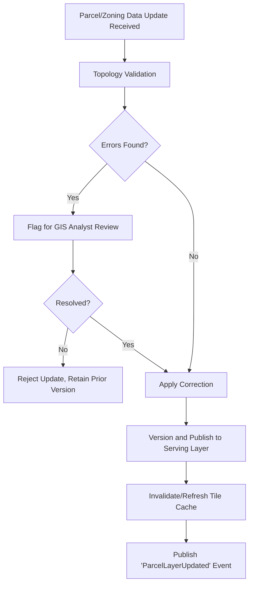

## 9.11 Architecture

The GIS Intelligence Engine is built on PostGIS as the authoritative spatial store, with GeoServer (or an equivalent OGC-compliant tile server) serving vector/raster tiles to clients, and a dedicated spatial-query API layer in front to keep client applications from needing direct database access. This module is a heavy read-path service — the architecture prioritizes read scalability (tile caching, read replicas) since spatial layers change relatively infrequently compared to query volume.

## 9.12 Microservices

| Service | Responsibility |
|---|---|
| `parcel-svc` | Parcel CRUD, versioning, topology validation |
| `zoning-svc` | Zoning classification layers with temporal versioning |
| `spatial-query-svc` | Point-in-polygon, nearest-feature, proximity queries — the primary consumed API |
| `tile-server-svc` | Vector/raster tile serving (GeoServer-backed) |
| `admin-boundary-svc` | State/ULB/ward/zone hierarchy management |

## 9.13 Database Tables (Core Entities)

| Table | Key Fields |
|---|---|
| `parcel` | id, tenant_id, geometry (PostGIS), parcel_number, version, valid_from, valid_to, source |
| `zoning_layer` | id, tenant_id, geometry, zone_type, far_limit, setback_rules (JSON), effective_from, effective_to |
| `protected_land` | id, tenant_id, geometry, protection_type (lake/forest/govt_land), authority |
| `administrative_boundary` | id, tenant_id, geometry, level (state/ulb/ward/zone), parent_id, name |
| `topology_error_log` | id, tenant_id, source_update_id, error_type, geometry, status, resolved_by |

## 9.14 APIs (Representative)

| Method | Endpoint | Purpose |
|---|---|---|
| `GET` | `/v1/parcels/resolve?lat=&lon=` | Point-in-polygon parcel resolution |
| `GET` | `/v1/parcels/{id}/zoning?as_of=` | Temporal zoning rule lookup for a parcel |
| `GET` | `/v1/parcels/{id}/nearest-protected-land` | Proximity query for encroachment evaluation |
| `GET` | `/tiles/{layer}/{z}/{x}/{y}` | Vector/raster tile serving |

## 9.15 Permissions

| Role | Permissions |
|---|---|
| GIS Analyst | Full read/write on layers, topology error resolution |
| Town Planning Officer | Read on zoning/parcel layers; propose zoning amendments (routed to GIS Analyst for publication) |
| All authenticated modules (system-to-system) | Read via `spatial-query-svc` API |
| Citizen (via Citizen Portal) | Read-only, rate-limited, on public-safe layers only (no raw parcel-owner PII exposed) |

## 9.16 Security

- Parcel ownership PII is not stored in this module — this module owns geometry/zoning only; ownership lives in the Property Intelligence Engine (Module 5) and is joined at query time under access control, keeping the spatial layer itself shareable more broadly (e.g., with the Citizen Portal) without PII exposure risk.
- All layer updates logged with source and approving GIS Analyst identity (Module 20 audit trail).

## 9.17 Data Flow

State/ULB cadastral source (Chapter 4 integration tiers) → `parcel-svc` ingestion → topology validation → versioned publish → tile cache refresh → consumed by AI Detection Engine (parcel resolution), Compliance Rule Engine (zoning/proximity queries), and all map-based UI clients.

## 9.18 External Integrations

| Integration | Purpose |
|---|---|
| State land-records / cadastral systems | Authoritative parcel boundary source |
| OpenStreetMap | Supplementary basemap data (roads, landmarks) where official data is incomplete |
| National administrative boundary datasets | Ward/zone/ULB boundary reference |

## 9.19 KPIs

| KPI | Target (indicative) |
|---|---|
| Parcel layer freshness (time since last authoritative sync) | < 30 days |
| Topology error rate on ingestion | Tracked; trending toward zero as source data quality improves |
| Spatial query P95 latency | < 300ms |
| Tile cache hit rate | > 95% |

## 9.20 Future Improvements

- 3D parcel/zoning visualization integrated with the Digital Twin Platform (Module 7).
- Automated topology-error auto-correction for common, low-risk error patterns (e.g., minor gap closure), with human review remaining mandatory for anything affecting parcel boundary disputes.

## 9.21 Risks

| Risk | Mitigation |
|---|---|
| Authoritative source data (state cadastral records) is itself often outdated or disputed | GIS layer versioning preserves history so disputes can reference "what the record showed at time X"; this module does not claim to resolve legal ownership disputes, only to represent the source record accurately (see Limitations) |
| Topology errors silently corrupting downstream spatial queries | Mandatory validation gate (FR-4.4, NFR-4.3) before any update reaches the serving layer |

## 9.22 Limitations

- This module represents the **spatial record as sourced**, not a legally authoritative survey — where source cadastral data is itself wrong or contested, SATRAK surfaces the discrepancy (via the Data Quality Gate, Chapter 4 §4.5.2) rather than silently resolving it.
- High-frequency real-time updates (e.g., live construction progress) are not this module's responsibility — that is the AI Detection Engine's domain; this module's layers update on a data-source-driven cadence (days to months), not continuously.

## 9.23 Technology Choices

| Component | Choice | Rationale |
|---|---|---|
| Spatial database | PostgreSQL + PostGIS | Industry-standard, mature spatial indexing (GiST), strong topology/validation tooling |
| Tile server | GeoServer | OGC-compliant, widely adopted in government GIS deployments, supports both vector and raster tiles |
| Client-side map rendering | MapLibre GL JS (web), with Cesium reserved for 3D/Digital Twin views (Module 7) | MapLibre is open-source (no vendor lock-in, important for government procurement), performant vector tile rendering |
| Topology validation | PostGIS topology extension + custom validation rules | Built into the existing spatial database, avoids a separate topology engine dependency |

---

## 9.24 Chapter 9 Closing Note

The GIS Intelligence Engine gives every other module — most immediately the Property Intelligence Engine and Compliance Rule Engine — a shared, authoritative spatial fabric to query against. Chapter 10 continues Volume 3 with **Module 5: Property Intelligence Engine**, which owns ownership records, permit history, and the property master data that turns a bare parcel geometry into a legally meaningful record.

**Next chapter:** Chapter 10 — Module 5: Property Intelligence Engine (full specification).

---

---

# CHAPTER 10: MODULE 5 — PROPERTY INTELLIGENCE ENGINE

---

## 10.1 Purpose

The Property Intelligence Engine owns the property master record — ownership, permit history, sanctioned plan data, and the ownership/entity graph consumed by the AI Detection Engine's GNN model (Chapter 8, §8.1.4). Where the GIS Intelligence Engine (Module 4) answers "what geometry exists here," this module answers "who owns it, what was it permitted to be, and what is its history."

## 10.2 Vision

A single property record per parcel that reconciles ownership, permit, and tax data from previously fragmented source systems (Chapter 1, §1.10), versioned over time, so that "is this structure compliant with what was actually sanctioned" is a direct query rather than a multi-department manual investigation.

## 10.3 Business Value

| Value Driver | Explanation |
|---|---|
| Eliminates cross-department reconciliation | Directly addresses the core as-is workflow bottleneck (Chapter 1, §1.9.1: "plan verification, days to weeks") |
| Enables automated FAR/FSI/setback checking | The Compliance Rule Engine cannot compute a violation without knowing the sanctioned plan parameters this module stores |
| Powers the citizen property-verification use case | Citizen Portal's pre-purchase verification (Module 9, CG1 from Chapter 2) is a direct read against this module |
| Feeds the GNN owner-risk model | Ownership-entity graph structure (Chapter 8, §8.1.4) is sourced from this module |

## 10.4 Users

| User | Interaction |
|---|---|
| Town Planning Officer (Arjun) | Reviews sanctioned plan data during compliance evaluation |
| Revenue Department | Cross-references property record for tax assessment |
| Field Inspector (Priya) | Views property/permit history during a case investigation |
| Citizen (Rahul) | Queries property compliance status via Citizen Portal |
| Compliance Rule Engine (Module 6, system) | Queries sanctioned plan parameters for rule evaluation |

## 10.5 User Stories

| ID | As a... | I want to... | So that... |
|---|---|---|---|
| US-5.1 | Town Planning Officer | see the full sanctioned plan history for a property, including amendments | I can determine which version applied when construction occurred |
| US-5.2 | Field Inspector | look up ownership and permit status for a property from the field | I can verify claims made by the property owner during a site visit |
| US-5.3 | Citizen | check whether a property I'm considering purchasing has any open violations or unsanctioned deviations | I can make an informed purchase decision |
| US-5.4 | Revenue Department (via Integration Hub) | receive updated property records reflecting AI-discovered undeclared construction | the tax assessment base can be corrected |

## 10.6 Use Cases

### UC-5.1: Property Record Reconciliation
Trigger: Data from permit system, revenue records, and land records for the same parcel arrive with conflicting details (e.g., different floor counts recorded in two systems). System surfaces the conflict via the Data Quality Gate (Chapter 4, §4.5.2) for human steward resolution rather than silently picking one source.

### UC-5.2: Sanctioned Plan Digitization
Trigger: A paper sanctioned plan is scanned and processed via OCR/Document AI (Chapter 7, §7.13.9–7.13.10) to extract structured plan parameters (sanctioned floor count, FAR, setback specifications).

### UC-5.3: Citizen Property Verification Lookup
Trigger: Citizen searches a property via the Citizen Portal. System returns sanctioned status, any open cases (redacted of sensitive investigation detail), and last-verified date — never raw internal case notes.

## 10.7 Functional Requirements

| ID | Requirement |
|---|---|
| FR-5.1 | System shall maintain a versioned property master record per parcel, including ownership history, permit history, and sanctioned plan parameters |
| FR-5.2 | System shall link property records to parcel geometry (Module 4) via a stable parcel ID |
| FR-5.3 | System shall surface (not silently resolve) conflicting data from multiple source systems for the same property |
| FR-5.4 | System shall maintain an ownership-entity graph (owner → properties, including cross-references for entities under multiple registered names where legally identifiable) for GNN input |
| FR-5.5 | System shall expose a citizen-safe, redacted view of property compliance status excluding internal investigation detail |
| FR-5.6 | System shall support structured extraction of sanctioned plan parameters (floor count, FAR, setbacks) from digitized documents via Module 3's Document AI |

## 10.8 Non-Functional Requirements

| ID | Requirement |
|---|---|
| NFR-5.1 | Property record query latency: P95 < 300ms |
| NFR-5.2 | 100% of property records maintain full version history (no destructive overwrite) |
| NFR-5.3 | Citizen-facing property lookup: rate-limited to prevent bulk scraping of ownership data |

## 10.9 UI Components

| Component | Description |
|---|---|
| Property Record Detail View (Officer-facing) | Full ownership/permit/plan history, embedded within Government Dashboard and Mobile App |
| Conflict Resolution Queue | Data steward interface for resolving cross-source conflicts (UC-5.1) |
| Citizen Property Lookup | Public-facing search returning redacted compliance status (embedded in Citizen Portal, Module 9) |

## 10.10 Workflows

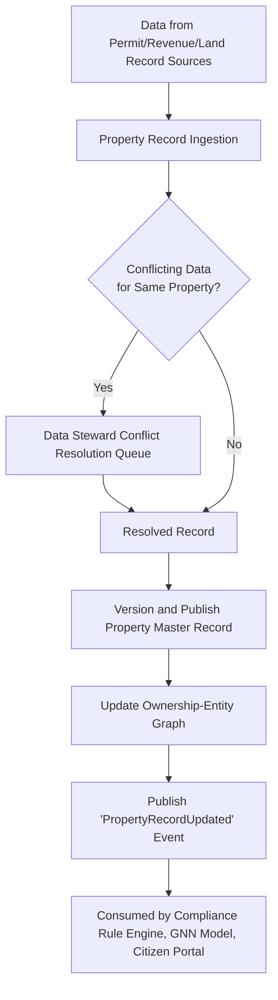

## 10.11 Architecture

The Property Intelligence Engine is a relational + graph hybrid: core property/permit/ownership data lives in PostgreSQL (joined to Module 4's spatial data via parcel ID), while the ownership-entity graph used by the GNN model (Module 3) is either maintained as a graph projection over the same relational data (using a graph query layer like Apache AGE on PostgreSQL) or exported periodically to a dedicated graph store if scale demands it.

## 10.12 Microservices

| Service | Responsibility |
|---|---|
| `property-registry-svc` | Property master record CRUD and versioning |
| `ownership-svc` | Ownership history, entity resolution, graph projection |
| `permit-svc` | Permit and sanctioned plan record management |
| `conflict-resolution-svc` | Data steward queue for cross-source conflicts |

## 10.13 Database Tables (Core Entities)

| Table | Key Fields |
|---|---|
| `property` | id, tenant_id, parcel_id (FK Module 4), current_version_id |
| `property_version` | id, property_id, valid_from, valid_to, source, data (JSON snapshot) |
| `owner` | id, tenant_id, name, id_document_ref (encrypted), entity_type (individual/company) |
| `property_ownership` | property_id, owner_id, ownership_share, effective_from, effective_to |
| `permit` | id, property_id, permit_number, issued_date, sanctioned_floor_count, sanctioned_far, setback_params (JSON), source_document_ref |
| `data_conflict` | id, property_id, field_name, conflicting_values (JSON), status, resolved_by |

## 10.14 APIs (Representative)

| Method | Endpoint | Purpose |
|---|---|---|
| `GET` | `/v1/properties/{parcel_id}` | Full property record (officer-authenticated) |
| `GET` | `/v1/properties/{parcel_id}/public-status` | Redacted citizen-safe compliance status |
| `GET` | `/v1/owners/{id}/properties` | All properties linked to an owner entity (for officer/GNN use) |
| `POST` | `/v1/conflicts/{id}/resolve` | Data steward conflict resolution |

## 10.15 Permissions

| Role | Permissions |
|---|---|
| Data Steward | Full read/write, conflict resolution authority |
| Town Planning Officer / Field Inspector | Read full property record |
| Revenue Department (Integration Hub) | Read property record; receive update events |
| Citizen | Read-only, redacted public-status endpoint only |

## 10.16 Security

- Owner PII (ID document references, contact details) encrypted at rest with per-tenant envelope encryption keys.
- Citizen-facing endpoint (`/public-status`) never exposes owner name/contact/ID details — returns only property-level compliance status.
- All property record changes logged with source and steward identity (Module 20).

## 10.17 Data Flow

Permit/Revenue/Land-record sources (Chapter 4 integration tiers) → ingestion → conflict detection/resolution → versioned property master record → consumed by Compliance Rule Engine (Module 6), GNN model (Module 3), Citizen Portal (Module 9), Revenue Department (Integration Hub, Module 26).

## 10.18 External Integrations

| Integration | Purpose |
|---|---|
| State land-records system | Ownership source |
| Municipal permit system | Permit/sanctioned plan source |
| Revenue/tax department system | Tax assessment cross-reference and update feed |

## 10.19 KPIs

| KPI | Target (indicative) |
|---|---|
| Property records with fully reconciled (conflict-free) data | Tracked; improves over Phase 1–2 as source systems improve |
| Conflict resolution median time | < 5 business days |
| Citizen property lookup availability | 99.9% |

## 10.20 Future Improvements

- Automated conflict resolution suggestions (AI-assisted, human-approved) once sufficient historical resolution patterns are captured.
- Direct citizen self-service correction requests (e.g., "this ownership record is outdated") with a verifiable document-upload workflow.

## 10.21 Risks

| Risk | Mitigation |
|---|---|
| Source system data is itself inaccurate or fraudulent (e.g., backdated permits) | This module surfaces provenance and conflicts; final legal determination remains a human/tribunal function, consistent with AP10 |
| Citizen-facing property lookup misused for harassment/surveillance of specific owners | Redaction (10.16) and rate-limiting (NFR-5.3); no owner-identifying detail ever returned publicly |

## 10.22 Limitations

- This module cannot independently verify the authenticity of source documents (e.g., a forged permit) — document authenticity verification is a process/legal matter, flagged for investigation when Document AI extraction conflicts with other records, not automatically adjudicated.

## 10.23 Technology Choices

| Component | Choice | Rationale |
|---|---|---|
| Core data store | PostgreSQL | Consistent with platform-wide relational standard, strong versioning support via temporal tables pattern |
| Graph projection | Apache AGE (PostgreSQL graph extension) initially; dedicated graph DB (e.g., Neo4j) if scale requires | Avoids introducing a new database technology until proven necessary — consistent with AP2/AP8 discipline |
| PII encryption | Envelope encryption via platform KMS (Module 17) | Consistent with platform-wide security standard |

---

## 10.24 Chapter 10 Closing Note

With Modules 4 and 5 complete, SATRAK now has both the spatial fabric and the property/ownership record layer that every compliance decision depends on. Chapter 11 continues Volume 3 with **Module 6: Compliance Rule Engine** — the module that actually encodes "what counts as a violation," configurably per jurisdiction, converting raw detections and property data into a legal determination candidate.

**Next chapter:** Chapter 11 — Module 6: Compliance Rule Engine (full specification).

---

---

# CHAPTER 11: MODULE 6 — COMPLIANCE RULE ENGINE

---

## 11.1 Purpose

The Compliance Rule Engine is the module that converts a raw AI detection plus property/GIS data into an actual **violation classification** — the single most legally consequential piece of business logic in the entire platform. It exists precisely because "what counts as a violation" is not a universal constant: FAR limits, setback requirements, and permitted land use vary by state, city, zone, and even change over time within the same zone (Chapter 2, §2.2.2, Planner Arjun's core pain point). This module makes those rules **data, not code** — configurable per jurisdiction, versioned, and auditable.

## 11.2 Vision

Every jurisdiction's building bylaws, zoning ordinances, and environmental protection boundaries are encoded as structured, versioned, testable rules — so that a violation determination is reproducible, explainable, and defensible, rather than embedded as scattered if-else logic that no one can audit years later.

## 11.3 Business Value

| Value Driver | Explanation |
|---|---|
| Consistency at scale | The same rule set applies identically across every parcel in a zone — directly addresses GG1 (Chapter 2): uniform enforcement, reducing perceived/actual selective enforcement |
| Auditability | Every violation classification can be traced to the exact rule version applied and the exact detection/property data it was evaluated against — critical for court evidence (Module 28) |
| Multi-jurisdiction scalability | New cities/states onboard by configuring rules, not by engineering teams writing new code — essential for the 1,000+ city target (Chapter 1, §1.5) |
| Temporal correctness | Rule versioning prevents the common real-world problem of applying today's rules retroactively to older construction |

## 11.4 Users

| User | Interaction |
|---|---|
| Town Planning Officer (Arjun) | Configures/reviews rule sets per zone; the primary business owner of this module's content |
| Field Inspector (Priya) | Receives rule-engine-classified candidate violations attached to cases |
| Legal/Compliance Advisor | Reviews rule definitions for legal accuracy before publication |
| AI Detection Engine (Module 3, system) | Supplies detection data as rule-engine input |
| Municipal Tribunal (indirect) | Consumes rule-application explanation as part of case evidence |

## 11.5 User Stories

| ID | As a... | I want to... | So that... |
|---|---|---|---|
| US-6.1 | Town Planning Officer | define/update FAR, setback, and land-use rules per zone through a configuration interface, not code | I don't need engineering involvement for routine rule changes |
| US-6.2 | Town Planning Officer | simulate a proposed rule change against historical data before publishing it | I can see its impact before it takes legal effect |
| US-6.3 | Legal/Compliance Advisor | review a rule's exact wording and effective date before it goes live | I can confirm it accurately reflects the underlying bylaw |
| US-6.4 | Field Inspector | see exactly which rule (with citation) a flagged candidate violates | I can reference it correctly in the field and in the notice |

## 11.6 Use Cases

### UC-6.1: Rule Configuration and Versioning
Trigger: Town Planning Officer defines a new or amended rule (e.g., updated FAR limit for a zone following a master plan revision). Rule is drafted, reviewed by Legal/Compliance Advisor, and published with an effective date — never overwriting the prior version, which remains queryable for historical evaluation.

### UC-6.2: Automated Violation Classification
Trigger: `DetectionCandidateCreated` event (Chapter 3, §3.4.2) from the AI Detection Engine. Rule Engine resolves the applicable rule set (via Module 4's temporal zoning lookup), evaluates the detection against sanctioned plan data (Module 5) and the rule set, and classifies the candidate (e.g., "unauthorized floor addition, exceeds sanctioned floor count by 2, FAR violation of 0.3").

### UC-6.3: Rule Change Impact Simulation
Trigger: Before publishing a proposed rule change, Planning Officer runs a simulation against a historical detection dataset to see how many additional/fewer violations the new rule would classify.

### UC-6.4: Cross-Jurisdiction Rule Application (Encroachment)
Trigger: A detection near a protected lake boundary spanning two ULBs' jurisdiction requires evaluating both the local ULB's building rules and the state environment authority's protected-boundary rules together (ties to Chapter 3, §3.3.4 cross-tenant case pattern).

## 11.7 Functional Requirements

| ID | Requirement |
|---|---|
| FR-6.1 | System shall represent rules as structured, versioned configuration (not hardcoded logic), including FAR/FSI limits, setback distances, permitted land use, and protected-boundary buffer distances, per zone |
| FR-6.2 | System shall apply rules based on the effective date relevant to the case (e.g., date of construction, not date of evaluation) |
| FR-6.3 | System shall evaluate incoming detection candidates against the applicable rule set and produce a violation classification with a machine-readable explanation (which rule, which measured value, which threshold) |
| FR-6.4 | System shall support a simulation/dry-run mode for proposed rule changes against historical data before publication |
| FR-6.5 | System shall require Legal/Compliance Advisor sign-off before any rule change moves from draft to published/effective status |
| FR-6.6 | System shall support cross-jurisdiction rule composition for parcels/detections spanning multiple authorities |
| FR-6.7 | System shall never auto-generate a final enforcement action from a rule classification alone — output is always a "violation candidate" routed to human case review (Module 10/11), per AP10 |

## 11.8 Non-Functional Requirements

| ID | Requirement |
|---|---|
| NFR-6.1 | Rule evaluation latency per detection: < 2 seconds |
| NFR-6.2 | 100% of published rule changes require logged Legal/Compliance Advisor approval before taking effect |
| NFR-6.3 | Rule version history retained indefinitely and queryable for any historical date |
| NFR-6.4 | Rule simulation (UC-6.3) shall run against a full historical dataset within 1 hour for a typical city-scale rule set |

## 11.9 UI Components

| Component | Description |
|---|---|
| Rule Configuration Editor | Structured form/DSL editor for defining zone-specific rules (not free-text code) |
| Rule Review & Approval Queue | Legal/Compliance Advisor interface for reviewing pending rule changes |
| Rule Simulation Dashboard | Before/after impact visualization for proposed rule changes |
| Violation Explanation Panel | Officer-facing display of exactly which rule was violated, with citation and measured values (embedded in Dashboard/Mobile) |

## 11.10 Workflows

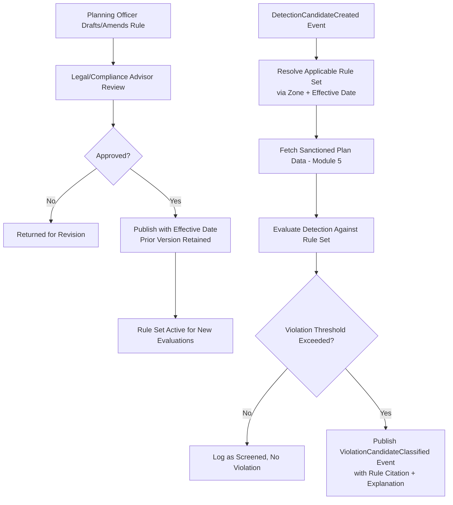

## 11.11 Architecture

The Compliance Rule Engine is deliberately architected as a **rules-as-data** system: rule definitions are stored as structured, versioned records (not application code), evaluated by a generic rule-evaluation service. This is what makes onboarding a new state/city a configuration exercise rather than a software development exercise — directly serving the 1,000+ city scalability goal (Chapter 1, §1.5) and Architect Meera's persona concern about re-architecture risk (Chapter 2, §2.2.5).

## 11.12 Microservices

| Service | Responsibility |
|---|---|
| `rule-engine-svc` | Core rule evaluation against detection + property data |
| `rule-configuration-svc` | Rule authoring, versioning, approval workflow |
| `rule-simulation-svc` | Dry-run impact simulation against historical data |
| `violation-classifier-svc` | Aggregates rule evaluation output into a structured violation classification record |

## 11.13 Database Tables (Core Entities)

| Table | Key Fields |
|---|---|
| `compliance_rule` | id, tenant_id, zone_id (FK Module 4), rule_type (FAR/setback/land_use/protected_buffer), parameters (JSON), effective_from, effective_to, status (draft/approved/published), approved_by |
| `rule_evaluation_log` | id, detection_result_id (FK Module 3), rule_id, evaluated_value, threshold_value, result (pass/fail), explanation_text |
| `violation_candidate` | id, tenant_id, property_id (FK Module 5), rule_evaluation_log_ids[], classification_type, created_at |
| `rule_simulation_run` | id, proposed_rule_id, dataset_snapshot_ref, impact_summary (JSON), run_by, run_at |

## 11.14 APIs (Representative)

| Method | Endpoint | Purpose |
|---|---|---|
| `POST` | `/v1/rules` | Draft a new/amended rule |
| `POST` | `/v1/rules/{id}/approve` | Legal/Compliance Advisor approval |
| `GET` | `/v1/rules?zone_id=&as_of=` | Query applicable rule set for a zone/date |
| `POST` | `/v1/rules/{id}/simulate` | Run impact simulation |
| `GET` | `/v1/violation-candidates/{id}/explanation` | Get full rule-citation explanation for a classified violation |

## 11.15 Permissions

| Role | Permissions |
|---|---|
| Town Planning Officer | Draft/amend rules; view simulations |
| Legal/Compliance Advisor | Approve/reject rule changes |
| Field Inspector | Read violation classification and explanation for assigned cases |
| System (AI Detection Engine, Property Intelligence Engine) | Read-only API access for evaluation input |

## 11.16 Security

- Rule change approval requires a distinct approver identity from the drafter (segregation of duties), logged in the Audit & Compliance System (Module 20).
- Rule evaluation logs are immutable once created (tied to AP6/AP10) — they form part of the evidentiary chain for any resulting enforcement case.

## 11.17 Data Flow

`DetectionCandidateCreated` event (Module 3) → Rule Engine resolves applicable rules (Module 4 zone/temporal lookup) and sanctioned plan data (Module 5) → evaluation → `ViolationCandidateClassified` event → consumed by Case Management (Module 10/11).

## 11.18 External Integrations

This module has no direct external (non-SATRAK) integrations — it is purely an internal logic layer consuming Modules 3, 4, and 5. Its **content** (the rules themselves) originates from municipal bylaws and master plan documents, digitized via Document AI (Module 3) where sourced from paper records.

## 11.19 KPIs

| KPI | Target (indicative) |
|---|---|
| Rule evaluation latency | < 2 seconds per detection |
| Rule changes with full approval audit trail | 100% |
| Violation classifications later overturned due to incorrect rule application (vs. overturned on other grounds) | Tracked as a rule-engine-specific quality metric, distinct from overall legal survival rate (Chapter 2, §2.7) |

## 11.20 Future Improvements

- Natural-language rule drafting assistance (LLM-assisted, Module 3 §8.1.3) that converts a plain-language bylaw amendment into a structured rule draft for Planning Officer review — always human-approved, never auto-published.
- Cross-jurisdiction rule template library, so states onboarding new cities can start from a proven rule structure rather than from scratch.

## 11.21 Risks

| Risk | Mitigation |
|---|---|
| Incorrectly configured rules causing systematic false violation classifications | Simulation/dry-run requirement (FR-6.4) before publication; mandatory Legal/Compliance Advisor approval (FR-6.5) |
| Rule complexity growing unmanageable as more jurisdictions and exceptions accumulate | Structured rule schema with a bounded, well-defined rule-type vocabulary (FR-6.1) rather than an open-ended scripting language, deliberately trading some flexibility for auditability |

## 11.22 Limitations

- The rule engine can only be as accurate as the underlying bylaw digitization — where a municipal bylaw is itself ambiguous or contested, this module surfaces the rule as configured, but resolving genuine legal ambiguity remains a human/legal function.
- This module does not have authority to finalize any enforcement action — it produces a "violation candidate," always subject to human case review (FR-6.7).

## 11.23 Technology Choices

| Component | Choice | Rationale |
|---|---|---|
| Rule representation | Structured JSON schema with a defined rule-type taxonomy, stored in PostgreSQL | Balances configurability with auditability; avoids the opacity risk of a general-purpose scripting/rules-engine DSL that's harder to review for legal correctness |
| Evaluation engine | Custom lightweight evaluation service (not a heavyweight BRMS like Drools) | Rule types here are well-bounded (FAR, setback, land-use, buffer distance) — a custom evaluator is simpler to audit than importing a general business-rules-management system |

---

## 11.24 Chapter 11 Closing Note

With Module 6 complete, SATRAK now has the full detection-to-classification pipeline specified end to end: observe (Modules 1–2) → detect (Module 3) → locate spatially (Module 4) → attach to property (Module 5) → classify against jurisdiction rules (Module 6). Chapter 12 continues Volume 3 with **Module 7: Digital Twin Platform**, which assembles this data into a persistent, time-aware 3D representation of the city.

**Next chapter:** Chapter 12 — Module 7: Digital Twin Platform (full specification).

---

---

# CHAPTER 12: MODULE 7 — DIGITAL TWIN PLATFORM

---

## 12.1 Purpose

The Digital Twin Platform assembles satellite, drone, GIS, and property data into a persistent, time-aware 3D representation of the city — allowing planners and leadership to view not just current state but how a parcel, ward, or the entire city has changed over time. This is distinct from the GIS Intelligence Engine (Module 4), which is the authoritative 2D spatial *record*; the Digital Twin is a *visualization and simulation layer* built on top of it, primarily for planning and executive use rather than transactional queries.

## 12.2 Vision

Any authorized user can "scrub through time" across any part of the city, viewing 3D building state, detected changes, and compliance status as they evolved — turning static compliance data into an explorable, intuitive spatial narrative.

## 12.3 Business Value

| Value Driver | Explanation |
|---|---|
| Executive/planning communication tool | Gives Commissioner Fatima (Chapter 2, §2.2.3) a visual, intuitive way to present city-wide compliance trends to legislative/audit bodies without requiring GIS literacy |
| Urban planning simulation | Planners can visualize the impact of proposed zoning changes (feeding back into Module 6's rule simulation) in 3D spatial context |
| Foundation for future smart-city mandates | The same twin infrastructure is directly reusable for Module 29 (Disaster Management) and Module 30 (Future Smart City Integration), amortizing investment (Chapter 1, §1.11.2) |

## 12.4 Users

| User | Interaction |
|---|---|
| Municipal Commissioner (Fatima) | Views city-wide 3D compliance visualization for reporting/presentations |
| Town Planning Officer (Arjun) | Simulates zoning/development scenarios in 3D spatial context |
| Smart City ICCC Operator | Embeds twin views into broader city operations dashboards |
| GIS Architects | Maintain twin data pipeline and rendering configuration |

## 12.5 User Stories

| ID | As a... | I want to... | So that... |
|---|---|---|---|
| US-7.1 | Commissioner Fatima | view a 3D time-lapse of a ward's construction activity over the past year | I can present tangible progress evidence to oversight bodies |
| US-7.2 | Planner Arjun | overlay a proposed zoning change onto the 3D twin | I can visually assess its impact before publishing the rule |
| US-7.3 | ICCC Operator | embed a twin view into the broader smart-city command center dashboard | compliance data is visible alongside other city operations data without a separate system |

## 12.6 Use Cases

### UC-7.1: Time-Scrubbing Visualization
Trigger: User selects a ward/parcel and a date range. System renders the reconstructed 3D state (from drone 3D reconstruction, Module 3 §8.3.3, where available, or extruded 2D footprints with height estimates elsewhere) at each available time slice.

### UC-7.2: Zoning Scenario Overlay
Trigger: Planner selects a proposed rule change (from Module 6's simulation) and views its spatial impact overlaid on current 3D twin state (e.g., visualizing which existing buildings would newly exceed a proposed lower FAR limit).

## 12.7 Functional Requirements

| ID | Requirement |
|---|---|
| FR-7.1 | System shall render 3D building state from available data — full mesh (drone reconstruction) where available, else extruded footprint using height estimation (Module 3) |
| FR-7.2 | System shall support time-based navigation ("scrubbing") across historical twin states for any given area |
| FR-7.3 | System shall overlay compliance status (color-coded by violation type/severity) onto 3D twin geometry |
| FR-7.4 | System shall support scenario overlay of proposed zoning rule changes |
| FR-7.5 | System shall be embeddable (via API/widget) into external dashboards (e.g., Smart City ICCC) |

## 12.8 Non-Functional Requirements

| ID | Requirement |
|---|---|
| NFR-7.1 | 3D scene load time for a ward-scale area: < 5 seconds on standard broadband |
| NFR-7.2 | Twin state snapshot generation: incremental (only re-render changed areas), not full-city recomputation on every update |
| NFR-7.3 | Support rendering scale up to city-wide extent with level-of-detail (LOD) degradation for distant/zoomed-out views |

## 12.9 UI Components

| Component | Description |
|---|---|
| 3D Twin Viewer | Cesium-based 3D map viewer with time-scrub control |
| Compliance Overlay Toggle | Layer control for violation-status color coding |
| Scenario Comparison View | Side-by-side or overlay comparison of current vs. proposed zoning scenario |

## 12.10 Workflows

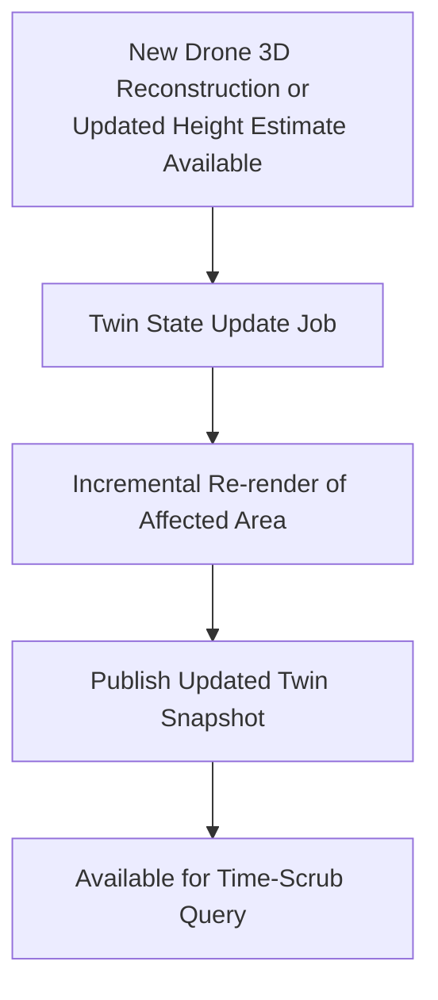

## 12.11 Architecture

The Digital Twin Platform is a read-optimized aggregation and rendering layer sitting atop Modules 1–6 — it does not own primary data, it composes and renders it. Twin "snapshots" are generated incrementally as underlying data changes (new drone reconstruction, new detection, new rule classification) rather than recomputed from scratch, to keep rendering current without prohibitive compute cost at city scale.

## 12.12 Microservices

| Service | Responsibility |
|---|---|
| `twin-state-svc` | Assembles and versions twin state snapshots from underlying module data |
| `twin-render-svc` | Serves 3D tiles/scenes to client viewers |
| `scenario-overlay-svc` | Computes and renders zoning scenario overlays |

## 12.13 Database Tables (Core Entities)

| Table | Key Fields |
|---|---|
| `twin_snapshot` | id, tenant_id, area_ref, snapshot_datetime, source_data_refs (JSON — links to detection/reconstruction records), render_asset_uri |
| `scenario_overlay` | id, tenant_id, proposed_rule_id (FK Module 6), computed_impact_geom, created_at |

## 12.14 APIs (Representative)

| Method | Endpoint | Purpose |
|---|---|---|
| `GET` | `/v1/twin/{area_id}/snapshots?from=&to=` | List available twin snapshots for time-scrub navigation |
| `GET` | `/v1/twin/{area_id}/tiles/{datetime}` | Retrieve 3D tile data for a specific time slice |
| `POST` | `/v1/twin/scenario-overlay` | Generate a zoning scenario overlay |

## 12.15 Permissions

| Role | Permissions |
|---|---|
| Commissioner / Executive | View-only, city/ward-wide access |
| Town Planning Officer | View + scenario overlay creation |
| ICCC Operator | View-only, via embedded widget API |

## 12.16 Security

Twin views inherit the same tenant isolation as underlying data (Chapter 3, §3.3) — an ICCC operator embedding a twin widget only sees data for their own jurisdiction's tenant.

## 12.17 Data Flow

Modules 1–6 (imagery, detections, GIS, property, rule classifications) → `twin-state-svc` aggregation → incremental snapshot generation → `twin-render-svc` tile serving → 3D Viewer (Dashboard/ICCC embed).

## 12.18 External Integrations

| Integration | Purpose |
|---|---|
| Smart City ICCC dashboards | Embeddable widget integration |
| Cesium ion (optional, for terrain/imagery basemap hosting) | 3D globe/terrain rendering support |

## 12.19 KPIs

| KPI | Target (indicative) |
|---|---|
| Twin snapshot freshness (lag behind underlying data update) | < 24 hours |
| 3D scene load time | < 5 seconds, ward-scale |

## 12.20 Future Improvements

- Integration with future IoT sensor data (Module 30) for live environmental/structural overlays on the twin.
- VR/AR viewing mode for immersive planning review sessions.

## 12.21 Risks

| Risk | Mitigation |
|---|---|
| 3D rendering compute cost at national scale | Incremental snapshotting (NFR-7.2) and LOD degradation (NFR-7.3) rather than full-fidelity rendering everywhere at all times |
| Twin data becoming a perceived "second source of truth" diverging from Module 4/5/6 authoritative records | Twin explicitly documented and UI-labeled as a visualization layer, not an authoritative record — any compliance determination must trace back to Module 6's classification, not the twin's rendering |

## 12.22 Limitations

- Full photorealistic 3D mesh is only available where drone photogrammetry/LiDAR has been captured; most of the city, most of the time, will render as extruded footprints with estimated heights — a materially lower-fidelity representation, and the UI must not obscure this distinction from users.

## 12.23 Technology Choices

| Component | Choice | Rationale |
|---|---|---|
| 3D rendering engine | CesiumJS | Purpose-built for geospatial 3D/terrain visualization, open-source, avoids proprietary game-engine licensing complexity for a government deployment |
| 3D tile format | 3D Tiles (OGC standard) | Standardized streaming format for large-scale 3D geospatial content |

---

## 12.24 Chapter 12 Closing Note

Chapter 13 continues Volume 3 with **Module 8: Government Dashboard** — the primary executive and operational interface that surfaces everything specified so far (detections, cases, twin views, analytics) into role-appropriate views for commissioners, planners, and administrators.

**Next chapter:** Chapter 13 — Module 8: Government Dashboard (full specification).

---

---

# CHAPTER 13: MODULE 8 — GOVERNMENT DASHBOARD

---

## 13.1 Purpose

The Government Dashboard is the primary role-based operational and executive interface into SATRAK — the surface through which Commissioners, Planning Officers, and administrative staff consume detections, cases, analytics, and twin views without needing to understand the underlying modules. It is the "front door" for every government user persona except the field inspector (who primarily uses the Mobile Application, Module 15).

## 13.2 Vision

Every government user, from a ward-level planning officer to the Municipal Commissioner, opens a single dashboard tailored to their role that answers their most important question within one click — "what needs my attention today," "how is my city trending," or "what happened with this specific case."

## 13.3 Business Value

| Value Driver | Explanation |
|---|---|
| Adoption driver | A confusing or overly technical UI is the single biggest risk to program success regardless of backend sophistication — this module is where that risk is managed |
| Executive visibility | Directly serves Commissioner Fatima's persona need (Chapter 2, §2.2.3) for decision-ready, non-technical views |
| Operational efficiency | Planning Officer Arjun and case-managing staff need a workflow-centric (not just data-centric) view to actually act on the platform's output |

## 13.4 Users

| User | Role-Based View |
|---|---|
| Municipal Commissioner (Fatima) | Executive Summary View — city/ward heatmaps, trend lines, exportable reports |
| Town Planning Officer (Arjun) | Planning View — zoning rule management, case review queue, rule simulation access |
| Case Manager / Senior Inspector | Operations View — case queue, SLA tracking, assignment |
| GIS/Data Admin | Admin View — data pipeline health, layer management links |

## 13.5 User Stories

| ID | As a... | I want to... | So that... |
|---|---|---|---|
| US-8.1 | Commissioner | see a ward-level heatmap of violation density and enforcement progress on login | I immediately understand where attention is needed without navigating multiple screens |
| US-8.2 | Planning Officer | access the rule configuration and simulation tools directly from the dashboard | I don't need a separate system for rule management |
| US-8.3 | Case Manager | see all cases approaching their SLA deadline, sorted by urgency | nothing falls through the cracks |
| US-8.4 | Commissioner | export a ready-made monthly report for a legislative/audit question | I don't need to manually assemble data from multiple sources |

## 13.6 Use Cases

### UC-8.1: Role-Based Landing View
Trigger: User logs in. Dashboard renders the view configuration matching their assigned role (IAM-driven, Module 18), not a one-size-fits-all screen.

### UC-8.2: Drill-Down from Heatmap to Case
Trigger: Commissioner clicks a high-violation-density ward on the heatmap. Dashboard drills down to ward-level case list, then to individual case detail, without leaving the dashboard shell.

### UC-8.3: Ad Hoc Report Export
Trigger: User selects a report template (Module 12) and parameters (ward, date range); dashboard triggers report generation and provides a download link once ready.

## 13.7 Functional Requirements

| ID | Requirement |
|---|---|
| FR-8.1 | System shall render a role-specific landing view based on the authenticated user's assigned role (Module 18) |
| FR-8.2 | System shall provide ward/zone-level heatmap visualization of violation density, detection recency, and case status |
| FR-8.3 | System shall support drill-down navigation from aggregate views to individual case/property detail |
| FR-8.4 | System shall embed the Digital Twin viewer (Module 7) and GIS map (Module 4) as first-class dashboard components |
| FR-8.5 | System shall provide a case queue view with SLA countdown and prioritization sorting |
| FR-8.6 | System shall support one-click export of standard report templates (Module 12) |
| FR-8.7 | System shall provide the rule configuration/simulation interface (Module 6) accessible to authorized planning roles |

## 13.8 Non-Functional Requirements

| ID | Requirement |
|---|---|
| NFR-8.1 | Dashboard initial load time: < 3 seconds on standard broadband |
| NFR-8.2 | Heatmap rendering for city-wide extent: < 2 seconds |
| NFR-8.3 | Dashboard shall be responsive across desktop and tablet form factors (officer use in field offices, not only desks) |
| NFR-8.4 | Session timeout and re-authentication per government security policy (tied to Module 17/18) |

## 13.9 UI Components

| Component | Description |
|---|---|
| Executive Summary Panel | Ward heatmap, trend lines, key metrics (Chapter 2, §2.7 success metrics surfaced here) |
| Case Queue Table | Sortable/filterable list with SLA countdown indicators |
| Embedded GIS Map | Module 4 map viewer with detection/case overlays |
| Embedded Twin Viewer | Module 7 3D view, accessible from relevant screens |
| Report Export Panel | Template selection, parameter input, download link delivery |
| Admin/Config Panels | Rule configuration (Module 6), data pipeline health (for GIS/Data Admin role) |

## 13.10 Workflows

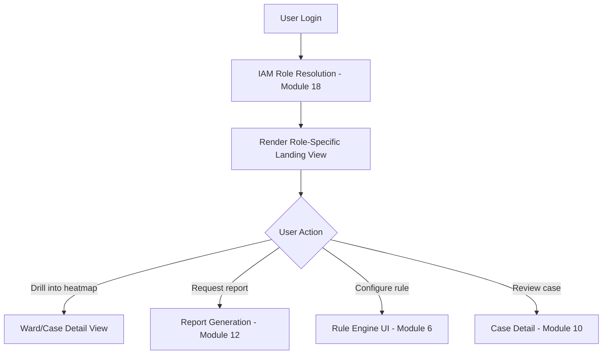

## 13.11 Architecture

The Government Dashboard is a client application (single-page web app) consuming the API Gateway (Module 16) exclusively — it holds no business logic or direct database access of its own, consistent with AP4 (API-first, Chapter 3). This keeps the Dashboard, Mobile App, and Citizen Portal genuinely interchangeable clients of the same backend capability, rather than each reimplementing logic.

## 13.12 Microservices

The Dashboard itself is primarily a frontend application; it depends on a **backend-for-frontend (BFF)** service to aggregate calls efficiently:

| Service | Responsibility |
|---|---|
| `dashboard-bff-svc` | Aggregates/composes calls across multiple module APIs into dashboard-optimized responses, avoiding excessive round-trips from the client |

## 13.13 Database Tables (Core Entities)

| Table | Key Fields |
|---|---|
| `dashboard_view_config` | id, role, layout_config (JSON), tenant_id (for tenant-specific customization if needed) |
| `saved_report_request` | id, user_id, template_id, parameters (JSON), status, generated_at |

*(The Dashboard largely reads from other modules' tables rather than owning substantial data itself.)*

## 13.14 APIs (Representative)

| Method | Endpoint | Purpose |
|---|---|---|
| `GET` | `/v1/dashboard/summary?tenant_id=` | Aggregated executive summary data |
| `GET` | `/v1/dashboard/case-queue?filters=` | Filtered/sorted case queue |
| `POST` | `/v1/dashboard/reports` | Request report generation |

## 13.15 Permissions

Dashboard access is entirely governed by the role/permission model defined centrally in Module 18 (Identity & Access Management) — this module does not define its own permission system, only renders views according to permissions resolved there.

## 13.16 Security

- All dashboard API calls authenticated via the central IAM (Module 18), no separate authentication mechanism.
- Client-side rendering never caches sensitive data (owner PII, case notes) beyond session scope; no local storage of sensitive data in the browser.

## 13.17 Data Flow

User action → Dashboard client → `dashboard-bff-svc` → API Gateway → relevant module services (4, 5, 6, 7, 10, 12, 13) → aggregated response → rendered view.

## 13.18 External Integrations

| Integration | Purpose |
|---|---|
| Smart City ICCC (outbound) | Dashboard widgets embeddable into broader ICCC screens (ties to Module 7, §12.18) |

## 13.19 KPIs

| KPI | Target (indicative) |
|---|---|
| Dashboard load time | < 3 seconds |
| Daily active users among assigned officers/planners | Tracked as an adoption health metric |
| Report export usage | Tracked to validate this feature reduces manual reporting burden (Chapter 2, §2.4, B5) |

## 13.20 Future Improvements

- Personalized/customizable widget layout per user (beyond fixed role-based templates).
- Natural-language query bar (leveraging the VLM/LLM capability from Module 3) — "show me wards with rising violation trends this quarter."

## 13.21 Risks

| Risk | Mitigation |
|---|---|
| Low adoption due to poor UX (a recognized risk for any government software) | Dedicated UI/UX design phase with persona-based usability testing (Volume 10) before full rollout |
| Dashboard becoming a bottleneck if it embeds too much business logic itself | Strict adherence to AP4 (API-first) and the BFF pattern (13.12) keeps it a thin composition layer |

## 13.22 Limitations

- The Dashboard is not designed for offline use — that requirement belongs to the Mobile Application (Module 15), which serves field inspectors specifically.

## 13.23 Technology Choices

| Component | Choice | Rationale |
|---|---|---|
| Frontend framework | React | Broad ecosystem, consistent with the platform's overall web technology choices, strong component reuse potential with the Citizen Portal |
| Mapping | MapLibre GL JS (2D), CesiumJS (3D twin embed) | Consistent with Modules 4 and 7 |
| State management | Standard React state/query libraries (e.g., React Query) for server-state caching | Reduces redundant API calls, improves perceived performance (NFR-8.1) |

---

## 13.24 Chapter 13 Closing Note

Chapter 14 continues Volume 3 with **Module 9: Citizen Portal** — the public-facing counterpart to this internal dashboard, covering property verification, complaint filing, and transparent status tracking.

**Next chapter:** Chapter 14 — Module 9: Citizen Portal (full specification).

---

---

# CHAPTER 14: MODULE 9 — CITIZEN PORTAL

---

## 14.1 Purpose

The Citizen Portal is SATRAK's public-facing surface — enabling property compliance verification, complaint filing, and transparent tracking of complaint/case status. It directly serves the citizen goals defined in Chapter 2 (§2.6: CG1–CG4) and is the module most exposed to public scrutiny, privacy sensitivity, and misuse risk, so its design deliberately trades some capability for restraint (redaction, rate-limiting) throughout.

## 14.2 Vision

Any citizen can verify a property's sanctioned status before a major financial decision, file a complaint with confidence it will be tracked transparently, and never encounter a system that exposes another citizen's private information or enables harassment.

## 14.3 Business Value

| Value Driver | Explanation |
|---|---|
| Trust building | Directly serves GG1/CG3 (Chapter 2) — visible, transparent process reduces the "selective enforcement" perception that undermines government legitimacy |
| Crowdsourced signal | Citizen complaints remain a valid detection input even in an AI-native system, catching things automated observation might miss (e.g., a neighbor noticing unauthorized activity before it's visible from above) |
| Reduced in-person office burden | Property verification and complaint status queries move from mandatory in-person office visits to self-service (Chapter 1, §1.10.2, pain point 8) |

## 14.4 Users

| User | Interaction |
|---|---|
| Property Owner (Rahul, as owner) | Views own property status, responds to notices, files appeals |
| Prospective Buyer (Rahul, as buyer) | Verifies a property's sanctioned status before purchase |
| General Citizen / Complainant | Files complaints, tracks status |
| Civil Society / RTI Requesters | Views aggregated, anonymized public analytics (not individual records) |

## 14.5 User Stories

| ID | As a... | I want to... | So that... |
|---|---|---|---|
| US-9.1 | Prospective Buyer | search a property by address and see its sanctioned status and any open violations | I can make an informed purchase decision without visiting a government office |
| US-9.2 | General Citizen | file a complaint about a suspected violation with a photo and location pin | it gets logged and tracked, not lost |
| US-9.3 | Citizen (Complainant) | see the current status and expected timeline of my filed complaint | I know it hasn't been ignored |
| US-9.4 | Property Owner | view and respond to a notice issued against my property, including submitting supporting documents | I have a fair, documented opportunity to respond |
| US-9.5 | Civil Society Researcher | view ward-level aggregated enforcement statistics | I can analyze enforcement patterns for transparency reporting, without accessing individual property/owner data |

## 14.6 Use Cases

### UC-9.1: Property Verification Lookup
Trigger: User searches by address/parcel ID. System returns redacted compliance status (per Module 5, §10.9 Citizen Property Lookup) — sanctioned status, any open case existence (not internal detail), last-verified date.

### UC-9.2: Complaint Filing
Trigger: Citizen submits a complaint with location, description, and optional photo. System creates a complaint record, geocodes/resolves to a parcel (Module 4), and routes it into the case-creation workflow (Module 10/11) alongside AI-detected candidates — flagged distinctly as citizen-originated for prioritization/audit purposes.

### UC-9.3: Notice Response and Appeal
Trigger: Property owner receives a notice (Module 11 workflow) and logs in to view details and submit a response/appeal with supporting documents before the statutory deadline.

### UC-9.4: Aggregated Public Analytics View
Trigger: Any visitor (no login required) views ward-level, anonymized enforcement statistics (e.g., "number of violations resolved this quarter per ward") without any individual property or owner identification.

## 14.7 Functional Requirements

| ID | Requirement |
|---|---|
| FR-9.1 | System shall provide property search returning redacted compliance status only (no owner PII, no internal case notes) |
| FR-9.2 | System shall support complaint filing with location, description, photo attachment, and optional citizen contact info (optional to support anonymous complaints where policy allows) |
| FR-9.3 | System shall provide complaint/case status tracking visible to the filing citizen and/or affected property owner |
| FR-9.4 | System shall support notice response/appeal submission with document upload, respecting statutory response windows |
| FR-9.5 | System shall provide a public, no-login-required aggregated analytics view with no individually identifiable data |
| FR-9.6 | System shall rate-limit property search to prevent bulk scraping (tied to Module 5, NFR-5.3) |

## 14.8 Non-Functional Requirements

| ID | Requirement |
|---|---|
| NFR-9.1 | Property search response time: < 2 seconds |
| NFR-9.2 | Complaint submission available on low-bandwidth mobile connections (progressive/lightweight design, since citizen access patterns skew more toward mobile/variable connectivity than officer users) |
| NFR-9.3 | Portal shall support at least the primary regional language(s) of each deploying jurisdiction, not English-only |
| NFR-9.4 | Anonymous complaint option shall not require any account creation, consistent with policy allowing anonymous reporting where applicable |

## 14.9 UI Components

| Component | Description |
|---|---|
| Property Search | Address/parcel search returning redacted status card |
| Complaint Filing Form | Location picker (map or GPS), description, photo upload |
| My Complaints / My Property Dashboard | Logged-in citizen's own tracked items |
| Notice Response Panel | View notice detail, submit response/documents within deadline |
| Public Analytics View | Ward-level aggregated charts, no login required |

## 14.10 Workflows

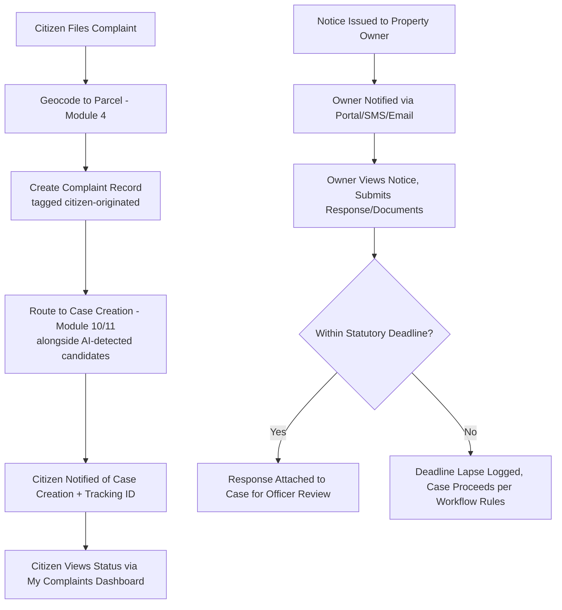

## 14.11 Architecture

Like the Government Dashboard, the Citizen Portal is a thin client of the shared API Gateway (AP4), but with a materially different security posture: it is internet-facing to the general public (not restricted to authenticated government network access), so it sits behind additional WAF/rate-limiting/bot-protection layers (Module 16/17) not required for internal-only clients.

## 14.12 Microservices

| Service | Responsibility |
|---|---|
| `citizen-portal-bff-svc` | Aggregates citizen-facing API calls, applies redaction rules |
| `complaint-svc` | Complaint intake, geocoding, routing to case creation |
| `property-lookup-svc` | Redacted property search (fronts Module 5's public-status endpoint) |

## 14.13 Database Tables (Core Entities)

| Table | Key Fields |
|---|---|
| `complaint` | id, tenant_id, filer_contact (nullable, for anonymous), description, photo_uri, location_geom, parcel_id (FK Module 4), status, created_at |
| `notice_response` | id, case_id (FK Module 10), owner_id (FK Module 5), response_text, document_refs[], submitted_at |
| `public_analytics_cache` | tenant_id, ward_id, period, aggregated_metrics (JSON) — precomputed, contains no individually identifiable data |

## 14.14 APIs (Representative)

| Method | Endpoint | Purpose |
|---|---|---|
| `GET` | `/v1/public/properties/search?address=` | Redacted property search |
| `POST` | `/v1/public/complaints` | File a complaint (auth optional) |
| `GET` | `/v1/public/complaints/{tracking_id}` | Check complaint status by tracking ID |
| `POST` | `/v1/citizen/notices/{id}/response` | Submit notice response (authenticated, property owner only) |
| `GET` | `/v1/public/analytics/{ward_id}` | Public aggregated statistics |

## 14.15 Permissions

| Role | Permissions |
|---|---|
| Anonymous Visitor | Property search, complaint filing, public analytics — no account required |
| Registered Citizen | Above, plus complaint/case status tracking tied to their filings |
| Property Owner (verified) | Above, plus notice viewing/response for properties they are verified to own |

**Owner verification note:** linking a portal account to "verified owner of property X" requires an identity/ownership verification step (e.g., matching against Module 5's ownership record via a secure verification flow) — this is treated as a security-sensitive onboarding step, not a simple self-declaration, to prevent impersonation.

## 14.16 Security

- Public-facing surface behind WAF, rate limiting, and bot/CAPTCHA-equivalent protections appropriate for internet exposure (Module 16/17) — noting per the platform-wide action rules that CAPTCHA bypass is never something SATRAK itself performs; this refers to protecting the portal against abuse, not circumventing others' protections.
- Complaint photo uploads scanned for malware before storage (standard file-upload security hygiene).
- No owner PII ever returned via any anonymous/public endpoint (FR-9.1, consistent with Module 5 §10.16).

## 14.17 Data Flow

Citizen input (search/complaint/response) → `citizen-portal-bff-svc` → routes to `property-lookup-svc` (read Module 5 redacted view), `complaint-svc` (creates records, routes to Module 10/11), or notice-response handling (Module 11) → citizen-visible status updates via portal notifications.

## 14.18 External Integrations

| Integration | Purpose |
|---|---|
| SMS/Email gateway | Notice and status update notifications (shared with Module 19, Notification Platform) |
| National digital identity verification (e.g., Aadhaar-based or equivalent, where applicable and consented) | Optional stronger identity verification for owner-account linking |

## 14.19 KPIs

| KPI | Target (indicative) |
|---|---|
| Complaint filing to acknowledgment time | < 24 hours |
| Citizen Portal NPS/trust score (Chapter 2, §2.7) | Tracked via periodic survey |
| Property search usage | Tracked as an adoption/trust indicator |
| Complaint-to-case conversion rate | Tracked to validate citizen input quality vs. AI-detected candidates |

## 14.20 Future Improvements

- Mobile app (native, not just responsive web) for citizen use, if usage data justifies the investment beyond the web portal.
- Multi-channel complaint filing (WhatsApp/SMS-based filing for citizens with limited smartphone/data access).

## 14.21 Risks

| Risk | Mitigation |
|---|---|
| Portal misused to file bad-faith/harassing complaints against a specific owner | Complaint volume/pattern monitoring (ties to Module 20 audit); repeated unfounded complaints from the same source flagged for review, without discouraging legitimate anonymous reporting |
| Anonymous complaint feature abused for spam/false reports | Rate-limiting and basic bot protection (14.16); complaints still require human case-creation review (Module 10/11), so false reports don't automatically become enforcement actions |
| Public perception that "AI is watching citizens" (privacy anxiety) | Clear, plain-language public documentation of what data is collected and how (ties to Volume 9, Privacy) — addressed at the program communications level, not solely a portal UI concern |

## 14.22 Limitations

- The Citizen Portal cannot itself verify complaint truthfulness — every complaint, like every AI detection, is a candidate routed to human case review, never an automatic finding.
- Anonymous complaints, while supported for accessibility, inherently limit the platform's ability to follow up for clarification — this is a deliberate policy tradeoff (accessibility vs. investigability), not an oversight.

## 14.23 Technology Choices

| Component | Choice | Rationale |
|---|---|---|
| Frontend framework | React (shared component library with Government Dashboard where feasible) | Consistency, reduced maintenance overhead |
| Localization | i18next or equivalent framework supporting regional language packs | Required for NFR-9.3 |
| Bot/abuse protection | WAF + rate limiting + CAPTCHA-equivalent challenge on public endpoints | Standard practice for internet-facing government portals |

---

## 14.24 Chapter 14 Closing Note

Chapter 15 continues Volume 3 with **Module 10: Inspection Management** — the module that turns AI detections and citizen complaints alike into assigned, trackable, SLA-governed cases for field inspectors.

**Next chapter:** Chapter 15 — Module 10: Inspection Management (full specification).

---

---

# CHAPTER 15: MODULE 10 — INSPECTION MANAGEMENT

---

## 15.1 Purpose

Inspection Management converts violation candidates (from Module 6's rule engine) and citizen complaints (Module 9) into assigned, trackable, SLA-governed field inspection tasks. It is the operational core that gives Field Inspector Priya (Chapter 2, §2.2.1) a prioritized, manageable workload instead of an undifferentiated flood of alerts — directly addressing her primary pain point.

## 15.2 Vision

No violation candidate or citizen complaint sits unassigned or unaccounted for; every inspector has a clear, prioritized, capacity-aware task list, and every case's progress is visible to supervisors without manual status-chasing.

## 15.3 Business Value

| Value Driver | Explanation |
|---|---|
| Directly enables B3 (Chapter 2) | Reduced time-to-detection only matters if it translates into reduced time-to-inspection; this module is the bridge |
| Inspector capacity protection | Risk-based prioritization (via Module 14's risk scores) prevents inspector burnout from an unfiltered detection firehose |
| Supervisory visibility | Case Manager persona (Chapter 13, §13.4) gets SLA-tracked queue visibility without manual chasing |

## 15.4 Users

| User | Interaction |
|---|---|
| Field Inspector (Priya) | Receives assigned cases, updates status, records findings |
| Case Manager / Senior Inspector | Assigns/reassigns cases, monitors SLA compliance |
| Town Planning Officer (Arjun) | Reviews case findings requiring rule-application judgment |

## 15.5 User Stories

| ID | As a... | I want to... | So that... |
|---|---|---|---|
| US-10.1 | Field Inspector | see my assigned cases sorted by priority and SLA deadline | I know what to work on first |
| US-10.2 | Case Manager | assign a new violation candidate to an available inspector based on workload and location | work is distributed fairly and efficiently |
| US-10.3 | Field Inspector | record site-visit findings (photos, notes, measurements) directly against a case from the field | documentation is complete and attached without separate paperwork |
| US-10.4 | Case Manager | see all cases approaching SLA breach across the team | I can intervene before deadlines are missed |

## 15.6 Use Cases

### UC-10.1: Case Creation and Auto-Assignment
Trigger: `ViolationCandidateClassified` event (Module 6) or citizen complaint (Module 9). System creates a case record, computes priority (incorporating Module 14's risk score), and either auto-assigns to an inspector (by ward/workload rules) or queues for Case Manager manual assignment.

### UC-10.2: Field Findings Recording
Trigger: Inspector conducts a site visit (possibly with a drone survey requested per Module 2, UC-2.1) and records findings via the Mobile Application (Module 15... note: cross-reference, "Module 15" here refers to the Mobile Application module number, distinct from this chapter's own numbering).

### UC-10.3: SLA Monitoring and Escalation
Trigger: Scheduled job checks all open cases against their SLA deadlines; cases approaching breach are flagged to the Case Manager; cases past breach are escalated per configured policy.

## 15.7 Functional Requirements

| ID | Requirement |
|---|---|
| FR-10.1 | System shall create a case record from any violation candidate or citizen complaint, retaining a link to its originating source (AI detection vs. citizen complaint, tagged distinctly per Module 9, FR-9.2/UC-9.2) |
| FR-10.2 | System shall compute case priority incorporating risk score (Module 14), violation severity, and source type |
| FR-10.3 | System shall support both automatic assignment (rule-based, by ward/workload) and manual reassignment by a Case Manager |
| FR-10.4 | System shall track SLA deadlines per case stage (assignment, initial site visit, resolution) and provide breach warnings |
| FR-10.5 | System shall allow inspectors to attach findings (photos, notes, measurements, drone survey requests) to a case |
| FR-10.6 | System shall support case status transitions per a defined state machine (e.g., Created → Assigned → Under Investigation → Notice Issued → Resolved/Dismissed) |

## 15.8 Non-Functional Requirements

| ID | Requirement |
|---|---|
| NFR-10.1 | Case auto-assignment computation: < 5 seconds from triggering event |
| NFR-10.2 | SLA breach check: run at least every 1 hour |
| NFR-10.3 | Case state transitions logged immutably (audit requirement, Module 20) |

## 15.9 UI Components

| Component | Description |
|---|---|
| Inspector Task List (Mobile + Dashboard) | Prioritized, SLA-annotated list of assigned cases |
| Case Manager Assignment Board | Kanban-style view for manual assignment/reassignment |
| Case Detail View | Full case history, findings, attached evidence, state transitions |
| SLA Breach Alert Panel | Escalation view for Case Managers |

## 15.10 Workflows

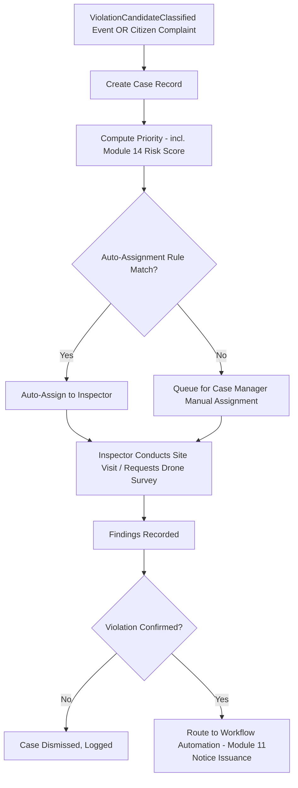

## 15.11 Architecture

Inspection Management is the primary consumer of `ViolationCandidateClassified` events and owns the case state machine — but notice issuance, hearing scheduling, and SLA-driven escalation logic beyond simple deadline tracking are delegated to Module 11 (Workflow Automation), keeping this module focused on the inspector-facing task management surface specifically.

## 15.12 Microservices

| Service | Responsibility |
|---|---|
| `case-management-svc` | Case creation, state machine, priority computation |
| `assignment-svc` | Auto-assignment logic, workload balancing |
| `sla-tracker-svc` | SLA deadline monitoring and breach alerting |
| `findings-svc` | Field findings capture and attachment |

## 15.13 Database Tables (Core Entities)

| Table | Key Fields |
|---|---|
| `case` | id, tenant_id, property_id (FK Module 5), source_type (ai_detection/citizen_complaint), violation_candidate_id (nullable FK Module 6), complaint_id (nullable FK Module 9), priority_score, status, assigned_inspector_id, created_at |
| `case_finding` | id, case_id, inspector_id, notes, photo_refs[], measurement_data (JSON), recorded_at |
| `case_sla` | case_id, stage, deadline_at, breached (boolean) |
| `case_state_transition` | id, case_id, from_state, to_state, actor_id, transitioned_at |

## 15.14 APIs (Representative)

| Method | Endpoint | Purpose |
|---|---|---|
| `GET` | `/v1/cases?assigned_to=&status=` | Query cases (inspector task list, manager board) |
| `POST` | `/v1/cases/{id}/assign` | Assign/reassign a case |
| `POST` | `/v1/cases/{id}/findings` | Attach field findings |
| `POST` | `/v1/cases/{id}/transition` | Change case state |

## 15.15 Permissions

| Role | Permissions |
|---|---|
| Field Inspector | Read/update own assigned cases; add findings |
| Case Manager | Full read/write on team's cases; reassignment authority |
| Town Planning Officer | Read on cases; input on rule-application judgment calls |

## 15.16 Security

Case findings (photos, notes) inherit evidentiary handling rules once a case proceeds toward enforcement (Module 27) — field-captured photos are geotagged and timestamped at capture (Module 15, Mobile Application) to support later evidentiary chain requirements.

## 15.17 Data Flow

Module 6 (`ViolationCandidateClassified`) / Module 9 (complaint) → Case creation → Assignment → Field findings (Module 2 drone integration where requested) → State transition → Module 11 (Workflow Automation) for notice/hearing processes.

## 15.18 External Integrations

None direct; this module is purely internal, integrating tightly with Modules 2, 5, 6, 9, 11, 14, 15.

## 15.19 KPIs

| KPI | Target (indicative) |
|---|---|
| Case assignment time (event to assigned inspector) | < 24 hours |
| SLA breach rate | Tracked; target trending toward zero with capacity-aware assignment |
| Case closure time (Chapter 2, §2.7) | Tracked as a primary program metric |

## 15.20 Future Improvements

- Predictive workload balancing incorporating inspector historical case-complexity patterns, not just raw case count.
- Automated drone-survey suggestion at case-creation time when AI confidence is below a threshold requiring higher-resolution confirmation.

## 15.21 Risks

| Risk | Mitigation |
|---|---|
| Auto-assignment creating unfair or imbalanced workload distribution | Workload-balancing rules (US-10.2) reviewed periodically by Case Managers; manual override always available |
| Case backlog growth outpacing inspector capacity as AI detection volume scales | Risk-based prioritization (Module 14) ensures limited capacity targets highest-value cases first, and program-level roadmap (Chapter 2, §2.8) phases rollout to match capacity growth |

## 15.22 Limitations

- This module manages workflow and assignment; it does not itself determine whether a violation is confirmed — that judgment remains the inspector's (and, where contested, the tribunal's), consistent with AP10.

## 15.23 Technology Choices

| Component | Choice | Rationale |
|---|---|---|
| State machine implementation | Explicit state machine library (not ad hoc status field logic) | Ensures valid state transitions are enforced consistently and auditable |
| Assignment algorithm | Rule-based initially (ward + workload), with future ML-assisted balancing (15.20) | Starts simple/explainable, consistent with AP10's explainability principle, before adding complexity |

---

## 15.24 Chapter 15 Closing Note

Chapter 16 continues Volume 3 with **Module 11: Workflow Automation** — covering notice issuance, hearing scheduling, and the broader SLA-governed administrative process beyond individual case task management.

**Next chapter:** Chapter 16 — Module 11: Workflow Automation (full specification).

---

---

# CHAPTER 16: MODULE 11 — WORKFLOW AUTOMATION

---

## 16.1 Purpose

Workflow Automation manages the statutory administrative process that follows a confirmed violation finding: notice issuance, the owner's response window, hearing scheduling (where contested), and final order execution — the process mapped as the "As-Is Workflow" in Chapter 1 (§1.9), now digitized, SLA-tracked, and auditable. This module is where SATRAK's technical detection capability meets binding legal/administrative process, so every workflow step must be configurable per jurisdiction's specific statutory timelines, not hardcoded to one state's process.

## 16.2 Vision

Every notice, response window, hearing, and order follows the applicable statutory process automatically and transparently — with the owner always aware of their rights and deadlines (serving Citizen Portal integration, Module 9), and with the process itself immune to indefinite silent delay.

## 16.3 Business Value

| Value Driver | Explanation |
|---|---|
| Directly enables GG3 (Chapter 2) | An auditable trail for every enforcement decision, protecting both citizens and officers, is this module's core output |
| Reduces case closure time (B3/success metric) | Digitized, deadline-tracked process removes the manual paper-shuffling delay documented in Chapter 1's as-is workflow |
| Configurable per jurisdiction | Notice periods, hearing procedures, and appeal windows vary by state/municipal act — this module encodes them as configuration, mirroring the Compliance Rule Engine's design philosophy (Module 6) |

## 16.4 Users

| User | Interaction |
|---|---|
| Field Inspector / Case Manager | Initiates notice issuance following confirmed findings |
| Property Owner (Rahul) | Receives notices, submits responses/appeals via Citizen Portal (Module 9) |
| Municipal Tribunal / Hearing Officer | Manages hearing scheduling and outcome recording |
| Town Planning Officer | Reviews and signs off on final orders where required |

## 16.5 User Stories

| ID | As a... | I want to... | So that... |
|---|---|---|---|
| US-11.1 | Case Manager | trigger a formal notice from a confirmed case with one action | I don't need to manually draft and mail a paper notice |
| US-11.2 | Property Owner | receive clear notification of a notice with the exact response deadline | I have a fair opportunity to respond within my statutory rights |
| US-11.3 | Hearing Officer | see all cases requiring a hearing, with relevant case evidence assembled | I can conduct hearings efficiently without manually gathering documents |
| US-11.4 | Town Planning Officer | review and formally sign off on a final enforcement order | there's a clear accountable decision-maker of record |

## 16.6 Use Cases

### UC-11.1: Notice Issuance
Trigger: Case confirmed by inspector (Module 10 state transition). System generates a notice (via Module 12, Report Generation, using an LLM-assisted draft per Module 3 §8.1.3, officer-reviewed) citing the specific rule violated (Module 6 explanation), and delivers it via the Citizen Portal/SMS/email/registered post integration.

### UC-11.2: Response Window Management
Trigger: Notice delivered. System starts the statutory response-window countdown; owner may submit a response via the Citizen Portal (Module 9, UC-9.3) at any point before deadline.

### UC-11.3: Contested Case — Hearing Scheduling
Trigger: Owner contests within the response window. System schedules a hearing per Municipal Tribunal availability, assembles the case evidence package (Module 27/28) for the hearing officer.

### UC-11.4: Final Order and Execution Handoff
Trigger: Hearing concludes (or response window lapses uncontested). System records the final order (regularization/demolition/dismissal) and hands off execution tracking (e.g., to actual demolition scheduling, which may be a separate municipal engineering process outside SATRAK's own execution but tracked for status).

## 16.7 Functional Requirements

| ID | Requirement |
|---|---|
| FR-11.1 | System shall generate notices from a jurisdiction-configurable template, populated with case-specific rule citation and evidence reference |
| FR-11.2 | System shall track statutory response-window deadlines per jurisdiction configuration (varies by state/municipal act) |
| FR-11.3 | System shall support hearing scheduling with evidence-package assembly for hearing officers |
| FR-11.4 | System shall record final orders with the deciding officer/tribunal identity and rationale |
| FR-11.5 | System shall notify the property owner at every material workflow transition (notice issued, hearing scheduled, order recorded) via the Notification Platform (Module 19) |
| FR-11.6 | System shall support configurable multi-stage appeal processes where a jurisdiction's law provides for more than one appeal level |

## 16.8 Non-Functional Requirements

| ID | Requirement |
|---|---|
| NFR-11.1 | Notice generation time: < 5 minutes from case confirmation to notice ready for officer review |
| NFR-11.2 | 100% of workflow stage transitions logged immutably with actor and timestamp |
| NFR-11.3 | Response-window deadline tracking accuracy: zero tolerance for miscalculated statutory deadlines (directly affects legal validity) |

## 16.9 UI Components

| Component | Description |
|---|---|
| Notice Draft & Review Panel | LLM-assisted draft (Module 3) with officer review/edit before send |
| Response Window Tracker | Visual countdown, embedded in case detail (Module 10) |
| Hearing Scheduler | Calendar-integrated (Module 19/external calendar) scheduling interface |
| Evidence Package Assembler | Auto-compiles relevant Module 27 evidence for a scheduled hearing |
| Final Order Recorder | Structured form for recording tribunal/officer decision and rationale |

## 16.10 Workflows

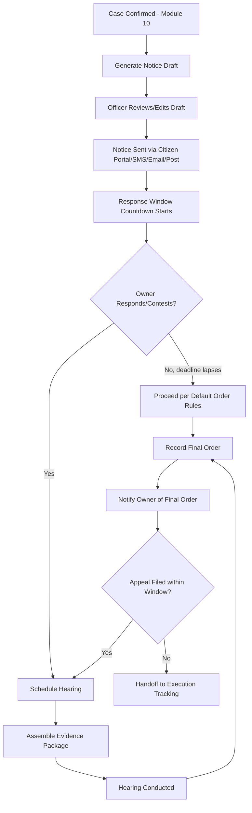

## 16.11 Architecture

Workflow Automation is implemented as a configurable state-machine engine per jurisdiction, distinct from (but structurally similar to) the case state machine in Module 10 — this module's state machine specifically encodes the *statutory* process stages (notice → response → hearing → order → appeal), while Module 10's encodes the *operational* investigation stages (assigned → investigating → confirmed). Keeping these separate avoids conflating operational workflow with legally consequential process stages.

## 16.12 Microservices

| Service | Responsibility |
|---|---|
| `notice-svc` | Notice generation, delivery tracking |
| `hearing-svc` | Hearing scheduling, evidence package assembly |
| `order-svc` | Final order recording |
| `workflow-config-svc` | Per-jurisdiction statutory timeline and process-stage configuration |

## 16.13 Database Tables (Core Entities)

| Table | Key Fields |
|---|---|
| `notice` | id, case_id (FK Module 10), template_id, content, delivered_at, delivery_channel, response_deadline |
| `hearing` | id, case_id, scheduled_at, hearing_officer_id, evidence_package_ref, outcome |
| `final_order` | id, case_id, order_type (regularize/demolish/dismiss), decided_by, rationale_text, decided_at |
| `workflow_config` | tenant_id, stage_name, statutory_duration_days, appeal_levels (JSON) |

## 16.14 APIs (Representative)

| Method | Endpoint | Purpose |
|---|---|---|
| `POST` | `/v1/cases/{id}/notices` | Generate and send a notice |
| `GET` | `/v1/cases/{id}/response-deadline` | Query current deadline status |
| `POST` | `/v1/cases/{id}/hearings` | Schedule a hearing |
| `POST` | `/v1/cases/{id}/orders` | Record a final order |

## 16.15 Permissions

| Role | Permissions |
|---|---|
| Case Manager | Trigger notice generation |
| Town Planning Officer | Review/approve notices; record orders where authorized |
| Hearing Officer / Tribunal | Manage hearing outcomes |
| Property Owner (via Citizen Portal) | View own notices, submit responses (no direct write access to this module's internal tables) |

## 16.16 Security

All notice/order records are immutable once issued/recorded (append corrections as new versioned entries, never edit history) — this is essential for evidentiary integrity in the event of a legal challenge to the process itself (e.g., "was the notice properly served within the statutory window").

## 16.17 Data Flow

Module 10 (confirmed case) → Notice generation (Module 3 LLM-assisted draft, officer-reviewed) → Delivery (Module 19) → Response window tracking → Hearing (if contested) → Final order → Notification (Module 19) → Execution handoff / Digital Evidence Repository archival (Module 27).

## 16.18 External Integrations

| Integration | Purpose |
|---|---|
| Postal/registered-post service API (where legally required for formal service) | Physical notice delivery tracking |
| Municipal Tribunal case management system (if separately maintained) | Hearing outcome synchronization |

## 16.19 KPIs

| KPI | Target (indicative) |
|---|---|
| Notice generation time | < 5 minutes post-confirmation |
| Statutory deadline calculation accuracy | 100% |
| Case closure time (Chapter 2, §2.7) | Tracked as primary program metric |

## 16.20 Future Improvements

- Digital signature integration for legally binding electronic notice delivery where jurisdiction law permits.
- Automated appeal-window and multi-level appeal tracking for jurisdictions with complex multi-tier tribunal structures.

## 16.21 Risks

| Risk | Mitigation |
|---|---|
| Incorrect statutory deadline configuration invalidating enforcement action | Workflow configuration changes require the same Legal/Compliance Advisor approval pattern as Module 6's rule changes (FR-6.5 pattern reused here) |
| Notice non-delivery disputes (owner claims they never received it) | Full delivery-channel tracking and confirmation logging (16.13) as part of the evidentiary record |

## 16.22 Limitations

- This module manages process and deadlines; it does not adjudicate the merits of a contested case — that remains the Municipal Tribunal's function, with SATRAK providing evidence and process support only (consistent with AP10 and the explicit non-goal in Chapter 1, §1.12.2).

## 16.23 Technology Choices

| Component | Choice | Rationale |
|---|---|---|
| Workflow/state engine | Camunda or a lightweight custom state-machine framework | Camunda gives configurable BPMN-based process modeling suited to varied jurisdiction-specific statutory flows; evaluated against custom build based on program complexity findings in Phase 1 |

---

## 16.24 Chapter 16 Closing Note

Chapter 17 continues Volume 3 with **Module 12: Report Generation** — the module underpinning notice drafting (this chapter), inspection reports, and the full suite of report types specified in the program brief.

**Next chapter:** Chapter 17 — Module 12: Report Generation (full specification).

---

---

# CHAPTER 17: MODULE 12 — REPORT GENERATION

---

## 17.1 Purpose

Report Generation is the shared reporting service producing every document type specified in the program brief — inspection reports, violation reports, drone reports, satellite reports, court evidence packages (structured here; final legal formatting is Module 28's responsibility), executive summaries, ward/city analytics reports, and monthly reports. Rather than each module implementing its own report formatting, this module centralizes report templates, generation, and delivery.

## 17.2 Vision

Any report an officer, planner, or commissioner needs is generated from a consistent, well-formatted template in minutes, pulling live data from the relevant modules, rather than manually assembled from multiple systems.

## 17.3 Business Value

| Value Driver | Explanation |
|---|---|
| Eliminates manual report assembly | Directly serves B5 (Chapter 2) — reduced inspector/officer administrative burden |
| Consistency | Standard templates mean every ward's monthly report looks the same, easing comparison and audit review |
| Legal defensibility groundwork | Structured, consistent inspection/violation reports feed directly into the Court Evidence Generator (Module 28) |

## 17.4 Users

| User | Interaction |
|---|---|
| Field Inspector | Generates inspection/violation reports from case data |
| Commissioner (Fatima) | Requests executive summary and city/ward analytics reports |
| Case Manager | Generates monthly team performance reports |
| Hearing Officer | Consumes evidence-package reports (Module 11/28 integration) |

## 17.5 User Stories

| ID | As a... | I want to... | So that... |
|---|---|---|---|
| US-12.1 | Field Inspector | generate a formatted inspection report from case data with one action | I don't manually format documents |
| US-12.2 | Commissioner | request a ward-level or city-level analytics report for a chosen date range | I have ready material for legislative/audit questions |
| US-12.3 | Case Manager | generate a monthly summary of team case closures and SLA performance | I can review team performance without manual data pulls |

## 17.6 Use Cases

### UC-12.1: Inspection/Violation Report Generation
Trigger: Officer requests a report from a case (Module 10) or workflow record (Module 11). System populates a jurisdiction-formatted template with case data, findings, and evidence references.

### UC-12.2: Scheduled Periodic Reports
Trigger: Scheduled job (monthly) generates ward/city analytics reports automatically and delivers them to configured recipients (Commissioner, Planning Officer) via Module 19.

### UC-12.3: On-Demand Executive Summary
Trigger: Commissioner requests a custom-date-range executive summary via the Dashboard (Module 8, FR-8.6).

## 17.7 Functional Requirements

| ID | Requirement |
|---|---|
| FR-12.1 | System shall support configurable report templates per report type (inspection, violation, drone, satellite, court evidence input, executive summary, ward analytics, city analytics, monthly) |
| FR-12.2 | System shall populate templates by querying live data from relevant modules (Module 3, 5, 6, 10, 11, 13) rather than requiring manual data entry |
| FR-12.3 | System shall generate reports in PDF format as standard, with export to Word/Excel where relevant (e.g., analytics tables) |
| FR-12.4 | System shall support both on-demand and scheduled report generation |
| FR-12.5 | System shall embed evidence references (imagery, detection IDs) as citable links/appendices, not just narrative text |

## 17.8 Non-Functional Requirements

| ID | Requirement |
|---|---|
| NFR-12.1 | Standard report generation time: < 2 minutes for case-level reports; < 10 minutes for city-wide analytics reports |
| NFR-12.2 | Generated reports stored immutably once finalized (evidentiary reports especially, tied to Module 27) |

## 17.9 UI Components

| Component | Description |
|---|---|
| Report Request Panel | Template selection, parameter input (embedded across Dashboard/Mobile) |
| Report Template Manager (Admin) | Configure/edit report templates per jurisdiction |
| Report History/Archive | Browse previously generated reports |

## 17.10 Workflows

```mermaid
flowchart TD
    A[Report Request - On-Demand or Scheduled] --> B[Select Template]
    B --> C[Query Live Data from Relevant Modules]
    C --> D[Populate Template]
    D --> E[Render PDF/Export Format]
    E --> F{Evidentiary Report?}
    F -- Yes --> G[Store Immutably, Register in Evidence Repository - Module 27]
    F -- No --> H[Deliver via Notification/Download]
    G --> H
```

## 17.11 Architecture

Report Generation is a stateless rendering service consuming data from other modules via their APIs (not direct database access, consistent with AP4) — templates are stored as configuration (similar philosophy to Module 6's rules-as-data approach), so new report types or jurisdiction-specific formatting can be added without code changes.

## 17.12 Microservices

| Service | Responsibility |
|---|---|
| `report-generator-svc` | Core template population and rendering |
| `report-template-svc` | Template configuration management |
| `report-schedule-svc` | Scheduled report job management |

## 17.13 Database Tables (Core Entities)

| Table | Key Fields |
|---|---|
| `report_template` | id, tenant_id, report_type, template_definition (JSON/HTML), version |
| `generated_report` | id, tenant_id, template_id, parameters (JSON), storage_uri, generated_at, evidentiary_flag |
| `report_schedule` | id, tenant_id, template_id, cron_schedule, recipients[] |

## 17.14 APIs (Representative)

| Method | Endpoint | Purpose |
|---|---|---|
| `POST` | `/v1/reports` | Generate a report on demand |
| `GET` | `/v1/reports/{id}` | Retrieve a generated report |
| `POST` | `/v1/report-schedules` | Configure a recurring report schedule |

## 17.15 Permissions

| Role | Permissions |
|---|---|
| Field Inspector | Generate case-level reports for own cases |
| Case Manager / Commissioner | Generate team/ward/city-level reports |
| Admin | Manage report templates |

## 17.16 Security

Evidentiary reports (inspection/violation reports feeding legal process) are stored with the same immutability/hash-chain protections as other evidentiary assets (AP6), registered with the Digital Evidence Repository (Module 27).

## 17.17 Data Flow

Report request → data queried from Modules 3/5/6/10/11/13 → template populated → rendered → stored (immutably if evidentiary) → delivered via Module 19.

## 17.18 External Integrations

None direct; purely an internal aggregation/rendering layer.

## 17.19 KPIs

| KPI | Target (indicative) |
|---|---|
| Report generation time | Per NFR-12.1 targets |
| Report usage vs. manual reporting displacement | Tracked to validate B5 |

## 17.20 Future Improvements

- LLM-assisted narrative summary generation for analytics reports (Module 3, §8.1.3), always human-reviewed before external distribution.

## 17.21 Risks

| Risk | Mitigation |
|---|---|
| Template misconfiguration producing incorrect/incomplete reports | Template changes reviewed/tested before production use, versioned (17.13) |

## 17.22 Limitations

- This module generates and formats reports; it does not itself determine report content's legal sufficiency — that determination, for evidentiary reports, is the domain of Module 28 (Court Evidence Generator) and Legal/Compliance Advisor review.

## 17.23 Technology Choices

| Component | Choice | Rationale |
|---|---|---|
| PDF rendering | Headless Chromium-based rendering (e.g., Puppeteer) from HTML templates, or a dedicated reporting library | Flexible templating using familiar HTML/CSS, consistent rendering |

---

## 17.24 Chapter 17 Closing Note

Chapter 18 continues Volume 3 with **Module 13: Analytics Platform** — the module powering the aggregated dashboards, trend analysis, and KPI tracking referenced throughout the preceding modules.

**Next chapter:** Chapter 18 — Module 13: Analytics Platform (full specification).

---

---

# CHAPTER 18: MODULE 13 — ANALYTICS PLATFORM

---

## 18.1 Purpose

The Analytics Platform aggregates data across every module into trend analysis, KPI tracking, and comparative reporting — powering the Government Dashboard's executive views (Module 8), the success-metrics tracking defined in Chapter 2 (§2.7), and the ward/city analytics reports (Module 12). It is distinct from Report Generation (Module 12, which renders a formatted document) — this module is the analytical computation and aggregation layer that Report Generation and the Dashboard both draw from.

## 18.2 Vision

Every KPI defined in this program (Chapter 2, §2.7) is computed continuously and queryable at any level of granularity — ward, city, state, national — with trend history, not just a current snapshot.

## 18.3 Business Value

| Value Driver | Explanation |
|---|---|
| Program accountability | Makes Chapter 2's success metrics concrete and queryable rather than aspirational |
| Cross-city comparison | At national scale, enables identifying which cities/states are seeing the most improvement, informing resource allocation and best-practice sharing |
| Feeds Predictive AI (Module 14) | Historical trend data computed here is a direct input to forecasting models |

## 18.4 Users

| User | Interaction |
|---|---|
| Commissioner (Fatima) | Views city/ward trend dashboards |
| Program Office / State Government | Views cross-city comparative analytics for resource allocation decisions |
| Town Planning Officer | Views ward-level violation-type breakdowns to inform rule review |

## 18.5 User Stories

| ID | As a... | I want to... | So that... |
|---|---|---|---|
| US-13.1 | Commissioner | see trend lines for key metrics (detection coverage, case closure time) over the past 12 months | I can identify whether the program is improving |
| US-13.2 | Program Office | compare performance across multiple cities in a state | I can identify best practices and underperforming areas needing support |
| US-13.3 | Planning Officer | see which violation types are most common in my ward | I can inform proactive rule review or targeted enforcement campaigns |

## 18.6 Use Cases

### UC-13.1: KPI Computation Pipeline
Trigger: Scheduled (e.g., daily/hourly) aggregation jobs compute all defined KPIs (Chapter 2, §2.7) at ward/city/state granularity from underlying module data.

### UC-13.2: Cross-City Comparison
Trigger: Program Office selects multiple cities/states and a metric; system renders comparative trend charts.

### UC-13.3: Ad Hoc Analytical Query
Trigger: User (with appropriate access) runs a custom query against the analytics data mart (e.g., "violation count by type, by ward, last quarter").

## 18.7 Functional Requirements

| ID | Requirement |
|---|---|
| FR-13.1 | System shall compute all Chapter 2, §2.7 success metrics on a defined refresh schedule, at ward/city/state/national granularity |
| FR-13.2 | System shall retain historical trend data (not just current snapshot) for at least 5 years for longitudinal analysis |
| FR-13.3 | System shall support cross-jurisdiction comparative views for authorized state/national-level users |
| FR-13.4 | System shall support ad hoc analytical queries within defined data-access permissions |

## 18.8 Non-Functional Requirements

| ID | Requirement |
|---|---|
| NFR-13.1 | KPI refresh latency: < 1 hour for daily-refresh metrics |
| NFR-13.2 | Analytical query response time: P95 < 3 seconds for standard dashboard queries |
| NFR-13.3 | Historical data retention: minimum 5 years, subject to applicable data retention policy |

## 18.9 UI Components

Analytics Platform primarily surfaces through embedded components in the Government Dashboard (Module 8) rather than a standalone UI; internal components:

| Component | Description |
|---|---|
| KPI Trend Charts | Time-series visualizations per metric |
| Cross-City Comparison View | Side-by-side/ranked comparative charts |
| Ad Hoc Query Builder | Structured query interface for authorized analytical users |

## 18.10 Workflows

```mermaid
flowchart TD
    A[Scheduled Aggregation Job] --> B[Query Underlying Module Data<br/>Modules 3,5,6,10,11]
    B --> C[Compute KPIs at Ward/City/State Granularity]
    C --> D[Write to Analytics Data Mart]
    D --> E[Available for Dashboard Queries/Reports]
```

## 18.11 Architecture

The Analytics Platform is built as a dedicated analytical data mart (denormalized, query-optimized) fed by periodic ETL/aggregation jobs from the transactional module databases — this separation (transactional stores vs. analytics data mart) prevents heavy analytical queries from impacting the performance of operational services (Modules 10, 11) that officers depend on in real time.

## 18.12 Microservices

| Service | Responsibility |
|---|---|
| `analytics-aggregation-svc` | ETL/aggregation jobs computing KPIs from module data |
| `analytics-query-svc` | Serves dashboard and ad hoc analytical queries |

## 18.13 Database Tables (Core Entities)

| Table | Key Fields |
|---|---|
| `kpi_snapshot` | id, tenant_id, ward_id (nullable), metric_name, value, period, computed_at |
| `analytics_fact_case` | Denormalized fact table: case_id, ward_id, violation_type, source_type, opened_at, closed_at, sla_breached (boolean) — optimized for analytical queries, not transactional use |

## 18.14 APIs (Representative)

| Method | Endpoint | Purpose |
|---|---|---|
| `GET` | `/v1/analytics/kpis?metric=&granularity=&period=` | Query KPI trend data |
| `GET` | `/v1/analytics/compare?entities=&metric=` | Cross-jurisdiction comparison |
| `POST` | `/v1/analytics/query` | Ad hoc structured query (within permission scope) |

## 18.15 Permissions

| Role | Permissions |
|---|---|
| Commissioner | City/ward-level KPI access for own tenant |
| Program Office / State Government | Cross-city comparative access across tenants they're authorized for |
| Town Planning Officer | Ward-level access within own tenant |

## 18.16 Security

Cross-tenant comparative access (18.15) is the one deliberate, controlled exception to the tenant-isolation principle (Chapter 3, AP1) — implemented as read-only, aggregated-metric-only access (no underlying case/property/PII detail crosses tenant boundaries), explicitly logged per access (Module 20).

## 18.17 Data Flow

Modules 3/5/6/10/11 transactional data → ETL aggregation → analytics data mart → Dashboard (Module 8) and Report Generation (Module 12) queries.

## 18.18 External Integrations

None direct; internal aggregation layer only.

## 18.19 KPIs

*(Meta-note: this module computes the program's KPIs; its own operational health is measured by:)*

| KPI | Target (indicative) |
|---|---|
| KPI computation freshness | < 1 hour lag |
| Query response time | P95 < 3 seconds |

## 18.20 Future Improvements

- Self-service BI tool integration (e.g., embedding a Superset/Metabase-style exploration tool) for advanced users beyond the standard dashboard views.

## 18.21 Risks

| Risk | Mitigation |
|---|---|
| Aggregation lag causing stale-looking dashboards during high-activity periods | Refresh frequency tuned per metric criticality (some hourly, some daily) rather than one-size-fits-all |
| Cross-tenant comparison inadvertently enabling re-identification through aggregate data combination | Aggregation granularity floor (e.g., minimum ward size/case count) enforced before exposing comparative metrics, avoiding small-sample re-identification risk |

## 18.22 Limitations

- This module reports on historical/current state; forward-looking forecasting is explicitly Module 14's (Predictive AI) responsibility, not duplicated here.

## 18.23 Technology Choices

| Component | Choice | Rationale |
|---|---|---|
| Analytics data store | ClickHouse | Column-oriented store well-suited to fast aggregation queries over large historical datasets, consistent with Chapter 3's technology stack |
| ETL orchestration | Airflow (shared with Module 24, Data Pipeline) | Reuses existing orchestration investment rather than introducing a separate tool |

---

## 18.24 Chapter 18 Closing Note

Chapter 19 continues Volume 3 with **Module 14: Predictive AI** — the forward-looking counterpart to this chapter's historical analytics, covering risk prediction and resource-allocation forecasting in full workflow/architecture detail (building on the model specs already defined in Module 3, §8.2).

**Next chapter:** Chapter 19 — Module 14: Predictive AI (full specification).

---

---

# CHAPTER 19: MODULE 14 — PREDICTIVE AI

---

## 19.1 Purpose

Predictive AI is the module-level home for the risk-scoring and forecasting capability whose underlying models (Time-Series Forecasting, Risk Prediction) were specified in Module 3 (Chapter 8, §8.2.2–8.2.3). Where Module 3 specifies the models themselves, this module specifies how their output is operationalized: proactive drone survey targeting, inspector capacity planning, and resource allocation recommendations for planning and leadership.

## 19.2 Vision

Inspection and drone-survey resources are allocated based on where violations are statistically likely to emerge next, not only where they've already been detected — shifting the program's posture from reactive to genuinely proactive (Chapter 1, §1.4 vision statement).

## 19.3 Business Value

| Value Driver | Explanation |
|---|---|
| Proactive resource allocation | Directly serves the program vision's "detected in weeks, not years" goal by front-loading attention to high-risk areas before violations mature |
| Capacity planning | Gives Program Office and Commissioner leadership a data-driven basis for inspector hiring/allocation decisions |
| Tasking cost optimization | Feeds back into Module 1's satellite tasking strategy (Chapter 5, §5.21 Future Improvements) — pre-tasking high-resolution imagery for predicted-high-risk areas |

## 19.4 Users

| User | Interaction |
|---|---|
| Case Manager | Consumes risk scores to inform proactive case creation/prioritization |
| Program Office | Uses forecasts for resource/budget planning |
| Fleet Ops Manager (Module 2) | Uses risk predictions to schedule proactive drone ward sweeps |

## 19.5 User Stories

| ID | As a... | I want to... | So that... |
|---|---|---|---|
| US-14.1 | Case Manager | see a ranked list of parcels by predicted violation risk, even absent a specific AI detection | I can proactively schedule inspections in high-risk areas |
| US-14.2 | Program Office | see forecasted resource needs by ward for the next quarter | I can plan inspector allocation and budget in advance |
| US-14.3 | Fleet Ops Manager | receive suggested proactive drone-sweep targets based on risk scores | drone capacity is used efficiently, not just reactively |

## 19.6 Use Cases

### UC-14.1: Proactive Risk-Ranked Parcel List
Trigger: Periodic (e.g., monthly) refresh of the Risk Prediction model (Module 3, §8.2.3) output. System surfaces a ranked list per ward for Case Manager review, distinct from AI-detection-triggered cases.

### UC-14.2: Resource Forecast Report
Trigger: Program Office requests a forecast report for a planning cycle; system combines Time-Series Forecasting output (Module 3, §8.2.2) with current staffing levels to project capacity gaps.

### UC-14.3: Proactive Drone Sweep Recommendation
Trigger: Risk scores for an area exceed a threshold without recent high-resolution observation; system recommends a proactive drone mission (feeding Module 2's scheduling, §6.6 UC-2.2).

## 19.7 Functional Requirements

| ID | Requirement |
|---|---|
| FR-14.1 | System shall surface risk-ranked parcel lists per ward, refreshed on a defined schedule |
| FR-14.2 | System shall generate resource/capacity forecast reports combining forecasting model output with current staffing data |
| FR-14.3 | System shall recommend proactive drone survey targets based on risk score and monitoring recency |
| FR-14.4 | System shall clearly distinguish proactively-suggested cases from AI-detection-triggered or citizen-complaint-triggered cases (source-type tagging, consistent with Module 10, FR-10.1) |

## 19.8 Non-Functional Requirements

| ID | Requirement |
|---|---|
| NFR-14.1 | Risk-ranked list refresh: monthly minimum, configurable per jurisdiction |
| NFR-14.2 | Forecast report generation: < 10 minutes |

## 19.9 UI Components

| Component | Description |
|---|---|
| Risk-Ranked Parcel List | Embedded in Case Manager assignment board (Module 10) as a distinct proactive queue |
| Resource Forecast Dashboard | Program Office planning view |
| Proactive Drone Sweep Suggestions | Embedded in Drone Fleet Ops console (Module 2) |

## 19.10 Workflows

```mermaid
flowchart TD
    A[Risk Prediction Model Refresh - Module 3] --> B[Rank Parcels by Risk Score per Ward]
    B --> C[Surface to Case Manager as Proactive Queue]
    C --> D{Case Manager Elects to Act?}
    D -- Yes --> E[Create Proactive Case or Request Drone Survey]
    D -- No --> F[Retained in Queue for Next Cycle]
```

## 19.11 Architecture

Predictive AI is primarily an operationalization layer over Module 3's forecasting/risk models — it does not train or serve models itself (that remains Module 3/22/23's responsibility) but consumes their output and routes it into actionable recommendations within Modules 2, 8, and 10.

## 19.12 Microservices

| Service | Responsibility |
|---|---|
| `risk-ranking-svc` | Aggregates and ranks risk scores per ward, manages proactive queue |
| `forecast-report-svc` | Generates resource/capacity forecast reports |

## 19.13 Database Tables (Core Entities)

| Table | Key Fields |
|---|---|
| `proactive_queue_entry` | id, tenant_id, parcel_id, risk_score, ranked_at, status (pending/acted_upon/dismissed) |
| `resource_forecast` | id, tenant_id, ward_id, period, forecasted_case_volume, current_capacity, gap_estimate |

## 19.14 APIs (Representative)

| Method | Endpoint | Purpose |
|---|---|---|
| `GET` | `/v1/predictive/risk-queue?ward_id=` | Get ranked proactive parcel list |
| `GET` | `/v1/predictive/forecast-report?ward_id=&period=` | Get resource forecast |

## 19.15 Permissions

| Role | Permissions |
|---|---|
| Case Manager | Read/act on risk queue |
| Program Office | Read forecast reports |
| Fleet Ops Manager | Read drone sweep suggestions |

## 19.16 Security

Standard tenant-scoped access; no additional sensitivity beyond underlying case/property data already governed elsewhere.

## 19.17 Data Flow

Module 3 (Risk Prediction, Time-Series Forecasting output) → Predictive AI aggregation/ranking → Case Manager queue (Module 10) / Drone Fleet Ops (Module 2) / Program Office forecast reports.

## 19.18 External Integrations

None direct.

## 19.19 KPIs

| KPI | Target (indicative) |
|---|---|
| Proactive-queue-sourced cases as % of total cases | Tracked as a leading indicator of proactive posture (Chapter 1 vision) |
| Forecast accuracy vs. actual subsequent case volume | Tracked (ties to Module 3, §8.2.2 model evaluation) |

## 19.20 Future Improvements

- Automated proactive case creation (with human approval gate) once risk-model calibration confidence is sufficiently validated over multiple cycles.

## 19.21 Risks

| Risk | Mitigation |
|---|---|
| Over-reliance on risk scores diverting attention from confirmed detections | Proactive queue explicitly presented as supplementary, not a replacement for AI-detection/citizen-complaint case sources (FR-14.4) |
| Risk model perpetuating historical enforcement bias (e.g., if past enforcement was itself uneven, a risk model trained on that history could reproduce the imbalance) | Explicit fairness review as part of Module 3's evaluation process (Chapter 8, §8.2.3), and periodic audit of proactive-queue outcomes by ward for disparate impact patterns |

## 19.22 Limitations

- Predictions are inherently probabilistic; a proactively-flagged parcel is a resource-allocation suggestion, never itself a violation finding — the same AP10 principle applies here as everywhere else in the platform.

## 19.23 Technology Choices

Predictive AI reuses the model-serving and data infrastructure already specified for Module 3/22/23; it introduces no new core technology beyond aggregation/ranking logic in `risk-ranking-svc` and `forecast-report-svc`.

---

## 19.24 Chapter 19 Closing Note

Chapter 20 continues Volume 3 with **Module 15: Mobile Application** — the offline-capable field tool that is Field Inspector Priya's primary interface, and the module that operationalizes much of what Modules 2, 10, and 11 have specified from a backend perspective.

**Next chapter:** Chapter 20 — Module 15: Mobile Application (full specification).

---

---

# CHAPTER 20: MODULE 15 — MOBILE APPLICATION

---

## 20.1 Purpose

The Mobile Application is Field Inspector Priya's primary tool — an offline-capable Android application (per Chapter 2, §2.2.1: shared/low-spec Android devices are the realistic field context) for viewing assigned cases, capturing geotagged evidence, recording findings, and requesting drone surveys, all without requiring continuous connectivity.

## 20.2 Vision

An inspector in the field, with unreliable connectivity, can view their task list, capture complete evidence, and update case status exactly as if fully connected — with everything syncing automatically once connectivity resumes, and nothing lost.

## 20.3 Business Value

| Value Driver | Explanation |
|---|---|
| Directly resolves Priya's top pain point | Chapter 2, §2.2.1 explicitly identifies "no offline mode in existing tools" as a core pain point this module exists to solve |
| Evidentiary quality at the point of capture | Geotagging and timestamping photos at capture time (not after-the-fact upload) strengthens the evidentiary chain (Module 27) from the earliest possible point |
| Adoption-critical | If inspectors don't trust/use this tool, the entire platform's human workflow (Modules 10, 11) stalls regardless of backend sophistication |

## 20.4 Users

| User | Interaction |
|---|---|
| Field Inspector (Priya) | Primary and near-exclusive user of this module |
| Drone Pilot (secondary) | May use mobile app for on-site mission triggering in some deployment configurations |

## 20.5 User Stories

| ID | As a... | I want to... | So that... |
|---|---|---|---|
| US-15.1 | Field Inspector | view my assigned case list and details fully offline | connectivity gaps in the field don't block my work |
| US-15.2 | Field Inspector | capture geotagged, timestamped photos with one tap that attach automatically to the correct case | I don't need separate photo management or manual attachment |
| US-15.3 | Field Inspector | record measurements and notes offline and have them sync automatically when connectivity returns | I don't lose work or need to remember to manually sync |
| US-15.4 | Field Inspector | request a drone survey for a case directly from the field | I don't need to return to office to make that request |

## 20.6 Use Cases

### UC-15.1: Offline Case Review and Findings Capture
Trigger: Inspector opens the app with no connectivity. Locally cached assigned cases are viewable; photo/note/measurement capture is stored locally with a pending-sync queue.

### UC-15.2: Automatic Sync on Connectivity Restoration
Trigger: Device regains connectivity. App automatically syncs pending findings, resolving any conflicts (e.g., case reassigned while inspector was offline) per a defined conflict-resolution policy, surfaced to the inspector rather than silently overwritten.

### UC-15.3: Field Drone Survey Request
Trigger: Inspector requests a drone survey from within a case detail view; request routes to Module 2's mission-request flow (UC-2.1).

## 20.7 Functional Requirements

| ID | Requirement |
|---|---|
| FR-15.1 | System shall cache assigned case data locally for full offline access |
| FR-15.2 | System shall capture photo evidence with embedded GPS coordinates and timestamp at the moment of capture |
| FR-15.3 | System shall queue findings/status updates locally when offline and sync automatically upon connectivity restoration |
| FR-15.4 | System shall surface sync conflicts (e.g., case state changed server-side during offline period) to the inspector for resolution rather than silently discarding either version |
| FR-15.5 | System shall support drone survey requests directly from case detail view |
| FR-15.6 | System shall support the primary regional language(s) of the deploying jurisdiction |

## 20.8 Non-Functional Requirements

| ID | Requirement |
|---|---|
| NFR-15.1 | App shall function fully (view + capture) with zero connectivity for at least 8 hours of continuous field use |
| NFR-15.2 | App shall run acceptably on low-spec Android devices (defined minimum spec published in device requirements) |
| NFR-15.3 | Sync operation shall resume from interruption (partial sync) without data loss or duplication |
| NFR-15.4 | Photo capture-to-local-storage time: < 1 second (no perceptible lag blocking field work) |

## 20.9 UI Components

| Component | Description |
|---|---|
| Offline Task List | Cached, prioritized case list |
| Case Detail (Offline-Capable) | Findings entry, photo capture, drone request button |
| Sync Status Indicator | Clear visual state (synced/pending/syncing/conflict) |
| Conflict Resolution Screen | Simple side-by-side view when a sync conflict is detected |

## 20.10 Workflows

```mermaid
flowchart TD
    A[Inspector Opens App] --> B{Connectivity Available?}
    B -- No --> C[Load from Local Cache]
    B -- Yes --> D[Sync Latest Case Data]
    C --> E[Inspector Captures Findings/Photos]
    D --> E
    E --> F{Connectivity at Save Time?}
    F -- No --> G[Queue Locally]
    F -- Yes --> H[Submit Immediately]
    G --> I[Connectivity Restored]
    I --> J[Auto-Sync Queued Items]
    J --> K{Conflict Detected?}
    K -- Yes --> L[Surface to Inspector for Resolution]
    K -- No --> M[Sync Complete]
```

## 20.11 Architecture

The Mobile Application uses a local-first architecture: a local embedded database (e.g., SQLite via a sync-capable framework) mirrors relevant server-side case data, with a sync engine reconciling changes bidirectionally. This is architecturally distinct from the Government Dashboard's purely thin-client model (Module 8, §13.11) precisely because of the offline requirement — the mobile app necessarily carries more client-side logic and local state.

## 20.12 Microservices

The mobile app is a client application; it depends on a dedicated sync-oriented backend service distinct from the Dashboard's BFF:

| Service | Responsibility |
|---|---|
| `mobile-sync-svc` | Manages bidirectional sync, conflict detection/resolution logic, delta-sync optimization for bandwidth-constrained conditions |

## 20.13 Database Tables (Core Entities)

| Table | Key Fields |
|---|---|
| `sync_queue_item` | id, device_id, entity_type, entity_id, payload (JSON), created_at, sync_status |
| `sync_conflict_log` | id, entity_type, entity_id, local_version, server_version, resolution, resolved_by |

*(Local on-device schema is a subset mirror of relevant Module 10/15 server-side tables, out of scope for the central Volume 7 schema but documented in the mobile app's own technical design spec.)*

## 20.14 APIs (Representative)

| Method | Endpoint | Purpose |
|---|---|---|
| `GET` | `/v1/mobile/sync/pull?since=` | Delta pull of case updates since last sync |
| `POST` | `/v1/mobile/sync/push` | Push queued local changes |
| `GET` | `/v1/mobile/sync/conflicts` | Retrieve unresolved conflicts requiring inspector input |

## 20.15 Permissions

Standard Field Inspector role permissions (Module 10, §15.15) apply; the mobile app enforces the same server-side authorization on every sync operation — offline access to cached data does not bypass permission checks once synced.

## 20.16 Security

- Local device storage of case data (including any cached photos) is encrypted at rest (device-level encryption plus app-level encryption for sensitive fields).
- Device loss/theft handled via remote session revocation (Module 18) — a lost device's cached credentials are invalidated centrally, though already-downloaded local data recovery/wipe depends on device-level MDM (Mobile Device Management) policy, which is a deployment/IT policy consideration flagged for Volume 9.
- Photo GPS/timestamp metadata is captured using the device's secure location APIs, not user-editable, to preserve evidentiary integrity (ties to FR-15.2 and Module 27).

## 20.17 Data Flow

Server case/finding data (Module 10) ↔ `mobile-sync-svc` (delta sync) ↔ local on-device store ↔ Mobile UI. Findings ultimately flow back into Module 10's `case_finding` table upon successful sync.

## 20.18 External Integrations

| Integration | Purpose |
|---|---|
| Device GPS/camera APIs | Geotagged photo capture |
| Mobile Device Management (MDM) platform (government-issued devices) | Device security policy enforcement |

## 20.19 KPIs

| KPI | Target (indicative) |
|---|---|
| Inspector adoption rate (Chapter 2, §2.7) | Tracked as a primary program health metric |
| Sync failure/conflict rate | Tracked; target trending toward near-zero unresolved conflicts |
| App crash-free session rate | > 99% |

## 20.20 Future Improvements

- Voice-to-text note capture for faster field data entry.
- Augmented-reality overlay showing sanctioned plan boundaries on the live camera view during a site visit (ambitious, flagged for later-phase evaluation, not core scope).

## 20.21 Risks

| Risk | Mitigation |
|---|---|
| Low-spec device performance issues | Explicit minimum device spec (NFR-15.2) and lightweight local-first architecture optimized for constrained hardware |
| Data loss from prolonged offline periods exceeding local storage capacity | Configurable local retention window with clear inspector-facing warnings before old unsynced data would need to be purged (should never happen silently) |
| Low adoption if the app is perceived as surveillance of inspectors rather than a tool for them | Change-management and inspector co-design input during UI/UX design phase (Volume 10), consistent with treating adoption as a first-class risk (Chapter 13, §13.21) |

## 20.22 Limitations

- Offline capability has a practical ceiling (NFR-15.1: 8 hours) — this is a deliberate, disclosed operational boundary, not an unlimited offline guarantee.

## 20.23 Technology Choices

| Component | Choice | Rationale |
|---|---|---|
| Mobile framework | React Native or native Android (Kotlin) | Native Android preferred for tightest control over offline storage, camera/GPS integration, and performance on low-spec devices, given the government-issued-device context; React Native considered if cross-platform (iOS) need emerges |
| Local database | SQLite with a sync framework (e.g., WatermelonDB or a custom sync layer) | Mature, lightweight, well-suited to offline-first mobile architectures |

---

## 20.24 Chapter 20 Closing Note

Chapter 21 continues Volume 3 with **Module 16: API Gateway** — the shared entry point that every client (Dashboard, Mobile App, Citizen Portal, and external integrations) passes through, completing the platform-foundation modules referenced throughout the preceding chapters.

**Next chapter:** Chapter 21 — Module 16: API Gateway (full specification).

---

---

# CHAPTER 21: MODULE 16 — API GATEWAY

---

## 21.1 Purpose

The API Gateway is the single ingress point through which every client — Government Dashboard, Mobile Application, Citizen Portal, external integrations (Integration Hub, Module 26) — reaches SATRAK's backend services. It centralizes authentication enforcement, rate limiting, request routing, and API versioning, so individual module services don't each reimplement these cross-cutting concerns (consistent with AP7, Chapter 3).

## 21.2 Vision

Every request into SATRAK, regardless of client, passes through one consistently enforced, well-monitored gateway layer — making it the single place to reason about API security, versioning, and traffic behavior platform-wide.

## 21.3 Business Value

| Value Driver | Explanation |
|---|---|
| Consistent security enforcement | Removes the risk of an individual module accidentally implementing weaker authentication than the platform standard |
| Simplifies client development | Dashboard/Mobile/Portal teams integrate against one gateway contract rather than tracking N different module service endpoints directly |
| Enables safe API evolution | Versioning at the gateway layer lets backend services evolve without breaking existing clients (important given the multi-year, multi-city rollout timeline) |

## 21.4 Users

This module's "users" are other systems, not humans directly:

| Consumer | Interaction |
|---|---|
| Government Dashboard (Module 8) | All API calls routed through gateway |
| Mobile Application (Module 15) | All sync/API calls routed through gateway |
| Citizen Portal (Module 9) | All public API calls routed through gateway (with additional public-facing protections) |
| External Integrations (Module 26) | Third-party/government-system integrations authenticate via gateway |
| Platform Ops/Security | Monitors gateway traffic, configures rate limits and routing rules |

## 21.5 User Stories

| ID | As a... | I want to... | So that... |
|---|---|---|---|
| US-16.1 | Platform Security Engineer | enforce authentication and rate limiting centrally at the gateway | individual module teams don't need to reimplement security logic inconsistently |
| US-16.2 | Frontend Developer (Dashboard/Mobile/Portal team) | integrate against a single, versioned API contract | I don't need to track changes across dozens of individual backend services |
| US-16.3 | Platform Ops | see real-time traffic patterns and error rates across all API consumers | I can detect issues (abuse, outages) quickly |

## 21.6 Use Cases

### UC-16.1: Authenticated Request Routing
Trigger: Any client request arrives at the gateway. Gateway validates the authentication token (Module 18), applies rate limiting, and routes to the appropriate backend service based on path/version.

### UC-16.2: Public Endpoint Protection
Trigger: A Citizen Portal request arrives (potentially unauthenticated, per Module 9's design). Gateway applies stricter rate limiting, WAF rules, and bot-protection checks appropriate to internet-facing traffic, distinct from internally-authenticated dashboard/mobile traffic.

### UC-16.3: API Version Migration
Trigger: A backend service releases a new API version. Gateway routes existing clients to the prior version until they migrate, based on version negotiation in the request.

## 21.7 Functional Requirements

| ID | Requirement |
|---|---|
| FR-16.1 | System shall authenticate every request via the central IAM (Module 18) before routing to backend services |
| FR-16.2 | System shall apply configurable rate limiting per client type/tenant/endpoint |
| FR-16.3 | System shall support API versioning, routing requests to the appropriate backend service version |
| FR-16.4 | System shall apply distinct security policies for public-facing (Citizen Portal) vs. internally-authenticated (Dashboard/Mobile) traffic |
| FR-16.5 | System shall log all requests (method, path, status, latency, actor/tenant) for observability and audit purposes |
| FR-16.6 | System shall support GraphQL alongside REST for clients requiring flexible query composition (e.g., complex dashboard aggregation queries) |

## 21.8 Non-Functional Requirements

| ID | Requirement |
|---|---|
| NFR-16.1 | Gateway-added request latency overhead: < 20ms P95 |
| NFR-16.2 | Gateway shall support the platform-wide throughput targets (Chapter 3, NFR platform-wide requirements) without becoming a bottleneck |
| NFR-16.3 | Gateway shall be deployed in a highly available (multi-instance, load-balanced) configuration with zero single point of failure |

## 21.9 UI Components

The API Gateway has no direct end-user UI; its operational surface is an internal admin console:

| Component | Description |
|---|---|
| Gateway Admin Console | Rate limit configuration, routing rule management, traffic monitoring dashboard |

## 21.10 Workflows

```mermaid
flowchart TD
    A[Client Request] --> B[API Gateway]
    B --> C{Authenticated?}
    C -- No --> D{Public Endpoint?}
    D -- No --> E[401 Unauthorized]
    D -- Yes --> F[Apply Public Rate Limit/WAF]
    C -- Yes --> G[Apply Standard Rate Limit]
    F --> H[Route to Backend Service by Path/Version]
    G --> H
    H --> I[Log Request/Response for Observability]
```

## 21.11 Architecture

The API Gateway sits at the ingress of the Kubernetes cluster topology described in Chapter 3 (§3.2.2), typically implemented via the service mesh's ingress gateway (Istio Ingress Gateway) combined with a dedicated API management layer for versioning/rate-limiting policy, rather than as a bespoke custom-built component.

## 21.12 Microservices

| Service | Responsibility |
|---|---|
| `api-gateway` (Istio Ingress + policy layer) | Request routing, authentication enforcement, rate limiting |
| `gateway-admin-svc` | Configuration management for routing/rate-limit rules |

## 21.13 Database Tables (Core Entities)

| Table | Key Fields |
|---|---|
| `rate_limit_policy` | id, tenant_id (nullable for global), endpoint_pattern, limit_per_minute, client_type |
| `api_route_config` | id, path_pattern, backend_service, version |

## 21.14 APIs (Representative)

The Gateway is itself the entry point for all other modules' APIs (documented in Volume 8); its own management API:

| Method | Endpoint | Purpose |
|---|---|---|
| `POST` | `/admin/v1/rate-limit-policies` | Configure a rate limit policy |
| `GET` | `/admin/v1/traffic-metrics` | Query traffic/error-rate metrics |

## 21.15 Permissions

| Role | Permissions |
|---|---|
| Platform Security Engineer / Ops | Full gateway configuration access |
| All other roles | No direct gateway configuration access; interact only as API consumers |

## 21.16 Security

- Gateway is the enforcement point for Zero Trust network principles (Chapter 3, §3.5) — no backend service trusts a request without gateway-validated authentication, and services additionally validate authorization independently (defense in depth, not gateway-only trust).
- All public-facing traffic (Citizen Portal) passes through WAF rules before reaching the gateway's routing logic.

## 21.17 Data Flow

Client request → Gateway (authn/rate-limit/routing) → backend module service → response → Gateway (logging) → client.

## 21.18 External Integrations

| Integration | Purpose |
|---|---|
| WAF provider (cloud-native or empanelled government security service) | Public endpoint protection |

## 21.19 KPIs

| KPI | Target (indicative) |
|---|---|
| Gateway latency overhead | < 20ms P95 |
| Gateway availability | 99.99% |
| Blocked malicious/abusive request rate | Tracked as a security health indicator |

## 21.20 Future Improvements

- Adaptive rate limiting based on anomaly detection (tying into Module 3's anomaly detection capability for traffic pattern analysis, not just imagery).

## 21.21 Risks

| Risk | Mitigation |
|---|---|
| Gateway as a single point of failure for the entire platform | Multi-instance, load-balanced, multi-zone deployment (NFR-16.3) |
| Overly aggressive rate limiting blocking legitimate high-volume use (e.g., bulk analytics queries from Program Office) | Differentiated rate-limit tiers per client type/role, not a single global limit |

## 21.22 Limitations

- The gateway enforces authentication and coarse-grained routing/rate policy; fine-grained authorization (what specific data a given authenticated user can see) remains each backend service's responsibility, in coordination with Module 18 — the gateway is not a substitute for per-service authorization logic.

## 21.23 Technology Choices

| Component | Choice | Rationale |
|---|---|---|
| Gateway/ingress | Istio Ingress Gateway (service mesh-native) | Consistent with Chapter 3's chosen service mesh (Istio), avoids introducing a second, separate ingress technology |
| API management/rate limiting | Kong or an equivalent API management layer atop Istio, if richer policy management is needed beyond Istio's native capability | Provides more expressive rate-limiting/versioning policy configuration if program needs exceed Istio's built-in features |

---

## 21.24 Chapter 21 Closing Note

Chapter 22 continues Volume 3 with **Module 17: Security Platform** — the centralized encryption, secrets management, and Zero Trust enforcement layer that this gateway and every other module rely on.

**Next chapter:** Chapter 22 — Module 17: Security Platform (full specification).

---

---

# CHAPTER 22: MODULE 17 — SECURITY PLATFORM

---

## 22.1 Purpose

The Security Platform centralizes encryption, secrets/key management, network security enforcement (Zero Trust, mTLS), and vulnerability management — the foundational security capability every other module consumes rather than implements independently (AP7, Chapter 3). This chapter specifies the platform layer; Volume 9 provides the complete cross-cutting Security, Privacy & Compliance treatment including legal/regulatory mapping.

## 22.2 Vision

Security is never a per-module afterthought — every module inherits encryption, key management, and network security from this shared platform, so security posture is consistent, centrally auditable, and independently upgradable without touching every module's code.

## 22.3 Business Value

| Value Driver | Explanation |
|---|---|
| Government deployment prerequisite | No government body will approve a platform holding property/ownership/citizen data without demonstrable, centralized, auditable security architecture |
| Reduces per-module security risk | Individual module teams (30 of them) cannot each be trusted to correctly implement encryption/key management from scratch — centralizing this removes that risk |
| Supports independent security audit | A single, well-documented security platform is far easier for the mandated Security Auditor/CERT (Chapter 2, §2.1.1, stakeholder #13) to review than 30 independently-secured modules |

## 22.4 Users

| Consumer | Interaction |
|---|---|
| All 30 modules | Consume encryption, secrets management, mTLS transparently |
| Security Auditor / CERT | Reviews security architecture, conducts penetration testing |
| Platform Security Engineers | Operate and maintain the security platform |

## 22.5 User Stories

| ID | As a... | I want to... | So that... |
|---|---|---|---|
| US-17.1 | Platform Security Engineer | manage all encryption keys centrally with rotation policies | no module handles raw key material independently |
| US-17.2 | Security Auditor | review a single, well-documented security architecture | I can efficiently audit the entire platform rather than 30 separate implementations |
| US-17.3 | Module Developer | request a secret (API credential, database password) via a standard interface | I never hardcode secrets in application code or config |

## 22.6 Use Cases

### UC-17.1: Envelope Encryption Key Management
Trigger: Any module needs to encrypt sensitive data at rest (e.g., Module 5's owner PII). Module requests a data encryption key from the platform KMS, which itself is protected by a master key, following standard envelope-encryption practice.

### UC-17.2: mTLS Certificate Issuance and Rotation
Trigger: A new service instance starts. Service mesh (Istio) automatically issues/rotates mTLS certificates for service-to-service communication without manual intervention.

### UC-17.3: Vulnerability Scanning and Patch Management
Trigger: Scheduled (continuous) vulnerability scanning of container images and dependencies across all module services; critical vulnerabilities trigger an alert and patch workflow.

## 22.7 Functional Requirements

| ID | Requirement |
|---|---|
| FR-17.1 | System shall provide centralized key management (KMS) supporting envelope encryption for all modules requiring data-at-rest encryption |
| FR-17.2 | System shall enforce mutual TLS (mTLS) for all service-to-service communication within the platform |
| FR-17.3 | System shall provide a centralized secrets management interface (e.g., HashiCorp Vault) for all API credentials, database passwords, and certificates |
| FR-17.4 | System shall continuously scan container images and dependencies for known vulnerabilities |
| FR-17.5 | System shall support key rotation on a defined schedule without service disruption |
| FR-17.6 | System shall enforce Zero Trust network policy — no implicit trust based on network location, every request authenticated and authorized |

## 22.8 Non-Functional Requirements

| ID | Requirement |
|---|---|
| NFR-17.1 | Encryption: AES-256 at rest, TLS 1.3 in transit (platform-wide standard, Chapter 3, §3.5) |
| NFR-17.2 | Key rotation: at least annually, or immediately upon suspected compromise |
| NFR-17.3 | Critical vulnerability remediation SLA: 72 hours from detection |
| NFR-17.4 | Secrets management system availability: 99.99% (a Vault outage would block service authentication platform-wide) |

## 22.9 UI Components

| Component | Description |
|---|---|
| Security Admin Console | Key/secret management, certificate status, vulnerability scan results |
| Vulnerability Dashboard | Real-time view of scan findings across all module container images |

## 22.10 Workflows

```mermaid
flowchart TD
    A[Module Requests Data Encryption Key] --> B[KMS Issues Data Key<br/>Encrypted by Master Key]
    B --> C[Module Encrypts Data, Discards Plaintext Key]
    C --> D[Encrypted Data Stored]

    E[New Service Instance Starts] --> F[Service Mesh Issues mTLS Cert]
    F --> G[Service Communicates via mTLS]

    H[Continuous Vulnerability Scan] --> I{Critical Vulnerability Found?}
    I -- Yes --> J[Alert + Patch Workflow Triggered<br/>72hr SLA]
    I -- No --> K[Logged, No Action]
```

## 22.11 Architecture

The Security Platform is not a single monolithic service but a set of shared infrastructure capabilities integrated at the platform level: the service mesh (Istio) provides mTLS transparently to all services; a secrets manager (Vault) is queried by services at startup/runtime; a KMS provides envelope encryption keys; vulnerability scanning runs as a CI/CD pipeline gate (Module 21 territory) plus continuous runtime scanning.

## 22.12 Microservices

| Service | Responsibility |
|---|---|
| `kms-svc` (or managed cloud KMS) | Encryption key issuance and rotation |
| `secrets-mgmt` (Vault) | Centralized secrets storage and access |
| `vuln-scan-svc` | Continuous vulnerability scanning orchestration |

## 22.13 Database Tables (Core Entities)

| Table | Key Fields |
|---|---|
| `key_rotation_log` | id, key_id, rotated_at, reason |
| `vulnerability_finding` | id, service_name, image_tag, cve_id, severity, detected_at, remediated_at, status |

## 22.14 APIs (Representative)

Security Platform capabilities are largely consumed via SDK/sidecar integration rather than direct application-level API calls; administrative APIs:

| Method | Endpoint | Purpose |
|---|---|---|
| `GET` | `/admin/v1/vulnerabilities?severity=critical` | Query open critical vulnerabilities |
| `POST` | `/admin/v1/keys/{id}/rotate` | Trigger manual key rotation |

## 22.15 Permissions

| Role | Permissions |
|---|---|
| Platform Security Engineer | Full access to KMS/secrets/vulnerability management |
| Security Auditor | Read-only access to security posture, audit logs, vulnerability history |
| All other roles | No direct access — consume security services transparently through platform integration |

## 22.16 Security

*(This module's own "security" section is, definitionally, most of this chapter; additional cross-cutting requirements are consolidated in Volume 9.)*

## 22.17 Data Flow

All modules ↔ Security Platform (KMS for encryption keys, Vault for secrets, Istio for mTLS) — a cross-cutting dependency rather than a linear pipeline stage.

## 22.18 External Integrations

| Integration | Purpose |
|---|---|
| Cloud provider KMS (if using managed KMS rather than self-hosted) | Master key management, particularly relevant for empanelled government cloud compliance |
| National CERT (Computer Emergency Response Team) | Vulnerability disclosure/coordination, incident reporting |

## 22.19 KPIs

| KPI | Target (indicative) |
|---|---|
| Critical vulnerability remediation time | < 72 hours |
| Key rotation compliance | 100% on schedule |
| mTLS coverage across service-to-service traffic | 100% |

## 22.20 Future Improvements

- Automated, policy-driven incident response playbooks integrated with the SIEM (Volume 9).

## 22.21 Risks

| Risk | Mitigation |
|---|---|
| Secrets management system outage blocking platform-wide authentication | High-availability Vault deployment (NFR-17.4), with documented degraded-mode behavior for already-authenticated long-lived sessions |
| Key compromise | Rapid rotation capability (FR-17.5) and compromise-response runbook (Volume 9) |

## 22.22 Limitations

- The Security Platform provides infrastructure-level security controls; it does not itself guarantee application-level logic is free of business-logic vulnerabilities (e.g., an improperly scoped authorization check in a module service) — that remains each module team's responsibility, subject to security code review as part of the standard CI/CD gate.

## 22.23 Technology Choices

| Component | Choice | Rationale |
|---|---|---|
| Secrets management | HashiCorp Vault | Industry-standard, supports dynamic secrets, integrates well with Kubernetes |
| Service mesh mTLS | Istio | Consistent with Chapter 3's chosen mesh, provides automatic mTLS without per-service implementation |
| Vulnerability scanning | Trivy (container images) + Dependabot/equivalent (dependencies) | Open-source, CI/CD-integrable, low licensing friction for government procurement |

---

## 22.24 Chapter 22 Closing Note

Chapter 23 continues Volume 3 with **Module 18: Identity & Access Management** — the authentication and role-based authorization layer that this Security Platform and the API Gateway (Module 16) both depend on.

**Next chapter:** Chapter 23 — Module 18: Identity & Access Management (full specification).

---

---

# CHAPTER 23: MODULE 18 — IDENTITY & ACCESS MANAGEMENT

---

## 23.1 Purpose

Identity & Access Management (IAM) is the platform's authentication and authorization backbone — every human user (government officer, citizen, auditor) and every system-to-system caller resolves their identity and permissions here. It is the module the API Gateway (Module 16) and every application service defer to for "who is this, and what are they allowed to do."

## 23.2 Vision

Every identity in the system — human or system — is authenticated once, consistently, with permissions modeled precisely enough to express the real-world complexity of government roles (a Planning Officer in one ward is not automatically one in another) without becoming unmanageable.

## 23.3 Business Value

| Value Driver | Explanation |
|---|---|
| Enforces least-privilege access | Directly supports GG1/GG3 (Chapter 2) — consistent, auditable access control underpins uniform, accountable enforcement |
| Enables safe multi-tenancy | Chapter 3's tenant isolation model (§3.3) depends on IAM correctly scoping every user's access to their authorized tenant(s) |
| Supports complex government role structures | Officers often hold jurisdiction-specific roles (ward-level, city-level, state-level) that a simple flat RBAC model cannot express — this module supports RBAC combined with ABAC (attribute-based) constraints |

## 23.4 Users

Every human and system actor in the platform is, indirectly, a "user" of this module. Direct administrative users:

| User | Interaction |
|---|---|
| IAM Administrator | Manages roles, permission policies, user provisioning/deprovisioning |
| All authenticated personas (Priya, Arjun, Fatima, Rahul, Meera) | Authenticate and are authorized transparently through this module |

## 23.5 User Stories

| ID | As a... | I want to... | So that... |
|---|---|---|---|
| US-18.1 | IAM Administrator | assign a Field Inspector role scoped to specific wards | that inspector cannot access cases outside their assigned jurisdiction |
| US-18.2 | IAM Administrator | immediately revoke a departing employee's access across all modules | there's no lingering access risk after offboarding |
| US-18.3 | Officer (any role) | authenticate once and access all authorized modules without re-logging in per module | I have a seamless single sign-on experience |
| US-18.4 | Security Auditor | review a complete access log showing who had what permission at what time | I can investigate any access-related incident |

## 23.6 Use Cases

### UC-18.1: Role-Scoped Authentication
Trigger: User logs in. IAM authenticates identity and resolves their role(s) with jurisdiction scope (e.g., "Field Inspector, Ward 12, Hyderabad"), returning a token used by all subsequent requests (validated at the Gateway, Module 16).

### UC-18.2: Offboarding/Access Revocation
Trigger: HR/administrative action marks an employee as departed. IAM immediately revokes all active sessions and future authentication for that identity across every module and client (Dashboard, Mobile, internal admin consoles).

### UC-18.3: Cross-Jurisdiction Access Grant (Special Case)
Trigger: A cross-jurisdiction case (Chapter 3, §3.3.4) requires temporary, logged, scoped access grant to an officer outside their normal jurisdiction — handled as an explicit, audited exception, not a permanent role change.

## 23.7 Functional Requirements

| ID | Requirement |
|---|---|
| FR-18.1 | System shall support Role-Based Access Control (RBAC) combined with Attribute-Based Access Control (ABAC) for jurisdiction-scoped permissions (ward/city/state) |
| FR-18.2 | System shall support Single Sign-On (SSO) across all SATRAK client applications |
| FR-18.3 | System shall support immediate, platform-wide access revocation upon offboarding |
| FR-18.4 | System shall log every authentication and authorization decision for audit purposes (feeding Module 20) |
| FR-18.5 | System shall support time-bound, scoped, explicitly-logged exception access grants for cross-jurisdiction cases |
| FR-18.6 | System shall support multi-factor authentication (MFA) for all government officer accounts, mandatory for roles with elevated privileges (Legal/Compliance Advisor, IAM Administrator, Security Engineer) |

## 23.8 Non-Functional Requirements

| ID | Requirement |
|---|---|
| NFR-18.1 | Authentication latency: < 500ms P95 |
| NFR-18.2 | Access revocation propagation: < 1 minute across all services (no service should honor a revoked session beyond this window) |
| NFR-18.3 | 100% of authentication/authorization decisions logged immutably |

## 23.9 UI Components

| Component | Description |
|---|---|
| Login/SSO Screen | Standard authentication entry point across all clients |
| IAM Admin Console | Role/permission management, user provisioning, access log review |
| MFA Enrollment Flow | Setup for multi-factor authentication |

## 23.10 Workflows

```mermaid
flowchart TD
    A[User Login Attempt] --> B[Authenticate Credentials + MFA if Required]
    B --> C{Valid?}
    C -- No --> D[Reject, Log Failed Attempt]
    C -- Yes --> E[Resolve Role + Jurisdiction Scope]
    E --> F[Issue Token]
    F --> G[Token Used for All Subsequent API Gateway Requests]

    H[Offboarding Trigger] --> I[Revoke All Active Sessions]
    I --> J[Propagate Revocation to All Services within NFR-18.2]
```

## 23.11 Architecture

IAM is implemented via a dedicated identity provider (e.g., Keycloak or an equivalent open-source/government-approved IdP) supporting OAuth 2.0/OIDC for token issuance, combined with a custom policy layer expressing the RBAC+ABAC jurisdiction-scoping logic specific to SATRAK's government-role complexity, since generic IdP role models typically don't natively express ward/city/state jurisdiction scoping out of the box.

## 23.12 Microservices

| Service | Responsibility |
|---|---|
| `iam-svc` (Identity Provider) | Authentication, token issuance, SSO |
| `authz-policy-svc` | RBAC+ABAC policy evaluation, jurisdiction scoping |
| `access-log-svc` | Immutable logging of authentication/authorization events |

## 23.13 Database Tables (Core Entities)

| Table | Key Fields |
|---|---|
| `user_identity` | id, username, mfa_enabled, status (active/revoked) |
| `role` | id, role_name, permission_set (JSON) |
| `user_role_assignment` | user_id, role_id, jurisdiction_scope (ward_id/city_id/state_id), effective_from, effective_to |
| `access_log` | id, user_id, action, resource, decision (allow/deny), timestamp |
| `exception_access_grant` | id, user_id, resource_scope, reason, granted_by, expires_at |

## 23.14 APIs (Representative)

| Method | Endpoint | Purpose |
|---|---|---|
| `POST` | `/v1/auth/login` | Authenticate and receive token |
| `POST` | `/v1/auth/revoke` | Revoke a user's active sessions |
| `GET` | `/v1/authz/check` | Authorization decision check (used internally by services) |
| `POST` | `/v1/exception-grants` | Create a time-bound cross-jurisdiction access grant |

## 23.15 Permissions

| Role | Permissions |
|---|---|
| IAM Administrator | Full role/permission/user management |
| Security Auditor | Read-only access log review |
| All other roles | Self-service profile/MFA management only |

## 23.16 Security

- MFA mandatory for elevated-privilege roles (FR-18.6); recommended (and increasingly mandated over rollout phases) for all officer accounts.
- Access revocation is the single most time-sensitive security control in this module — NFR-18.2's 1-minute propagation target is treated as a hard SLA, not aspirational.
- All IAM administrative actions (role changes, exception grants) require a second-approver pattern for high-privilege role assignments, mirroring the segregation-of-duties principle used in Module 6 (rule approval) and Module 11 (workflow config approval).

## 23.17 Data Flow

Login request → `iam-svc` authentication → `authz-policy-svc` role/scope resolution → token issued → API Gateway (Module 16) validates token on every subsequent request → `access-log-svc` records the decision.

## 23.18 External Integrations

| Integration | Purpose |
|---|---|
| Government employee directory system (if one exists, e.g., an HRMS) | Source of truth for employee identity/role assignment, reducing manual provisioning |
| National digital identity system (optional, for citizen-side stronger verification, per Module 9 §14.15 owner-verification note) | Citizen identity verification |

## 23.19 KPIs

| KPI | Target (indicative) |
|---|---|
| Authentication success/failure rate | Tracked for anomaly detection (unusual failure spikes indicate potential attack) |
| Access revocation propagation time | < 1 minute, 100% compliance |
| MFA adoption rate among officer accounts | Tracked toward 100% |

## 23.20 Future Improvements

- Risk-based adaptive authentication (step-up MFA challenge triggered by anomalous login patterns, e.g., unusual location/device).

## 23.21 Risks

| Risk | Mitigation |
|---|---|
| Overly complex jurisdiction-scoping rules becoming unmanageable | Role/scope model kept as explicit, structured data (23.13) rather than ad hoc code, consistent with the platform's rules-as-data philosophy (Module 6) |
| Delayed offboarding creating lingering access risk | Direct integration with HR/employee directory system where available (23.18) to automate offboarding triggers rather than relying solely on manual IAM Administrator action |

## 23.22 Limitations

- IAM manages authentication and coarse-to-medium-grained authorization; the most fine-grained, business-logic-specific authorization decisions (e.g., "can this specific inspector view this specific case's citizen complaint history") are still enforced within each module service, using IAM-provided identity/role/scope as input — IAM does not attempt to encode every module's full business authorization logic centrally.

## 23.23 Technology Choices

| Component | Choice | Rationale |
|---|---|---|
| Identity provider | Keycloak (open-source) | Mature, OIDC/OAuth2-compliant, avoids proprietary IdP licensing costs at national scale, widely used in government deployments |
| Policy evaluation | Custom ABAC policy layer (e.g., using Open Policy Agent, OPA) atop Keycloak's RBAC | OPA provides a well-established, auditable policy-as-code approach for the jurisdiction-scoping complexity this program requires |

---

## 23.24 Chapter 23 Closing Note

Chapter 24 continues Volume 3 with **Module 19: Notification Platform** — the shared notification/messaging layer referenced throughout preceding chapters (case assignment alerts, citizen notice delivery, SLA breach warnings).

**Next chapter:** Chapter 24 — Module 19: Notification Platform (full specification).

---

---

# CHAPTER 24: MODULE 19 — NOTIFICATION PLATFORM

---

## 24.1 Purpose

The Notification Platform is the shared, multi-channel messaging layer used across the program — case assignment alerts (Module 10), notice/hearing delivery (Module 11), SLA breach warnings, and citizen status updates (Module 9). Centralizing notifications avoids each module implementing its own SMS/email/push logic inconsistently.

## 24.2 Vision

Every notification the platform needs to send — to an inspector, a commissioner, or a citizen — goes out on the right channel, in the right language, with delivery tracked and retried, from one consistent service.

## 24.3 Business Value

| Value Driver | Explanation |
|---|---|
| Consistent citizen communication | Directly supports CG2 (Chapter 2) — transparent, trackable process depends on reliable notification delivery |
| Reduces duplicated engineering effort | One notification service instead of 30 modules each building their own messaging integration |
| Delivery accountability | Tracked delivery status is part of the evidentiary record for notice-service disputes (Module 11, §16.21 risk) |

## 24.4 Users

| Consumer | Interaction |
|---|---|
| All modules (system) | Trigger notifications via a standard API |
| Field Inspector, Case Manager, Officers | Receive in-app/push/email notifications |
| Citizens | Receive SMS/email/portal notifications |

## 24.5 User Stories

| ID | As a... | I want to... | So that... |
|---|---|---|---|
| US-19.1 | Any module (system) | send a notification through a single standard interface | I don't need to integrate separately with SMS/email/push providers |
| US-19.2 | Citizen | receive an SMS when a notice is issued against my property | I'm promptly informed even if I don't regularly check the portal |
| US-19.3 | Case Manager | receive an in-app alert when a case approaches SLA breach | I can intervene in time |
| US-19.4 | Platform Ops | see delivery success/failure rates per channel | I can detect provider issues quickly |

## 24.6 Use Cases

### UC-19.1: Multi-Channel Notification Dispatch
Trigger: Any module publishes a notification request (e.g., `CaseAssigned` event, Chapter 3 §3.4.2). Notification Platform determines appropriate channel(s) per recipient preference/notification type and dispatches.

### UC-19.2: Delivery Failure Retry
Trigger: A notification fails to deliver (e.g., SMS provider timeout). System retries per a configured backoff policy and falls back to an alternate channel if configured (e.g., email if SMS repeatedly fails).

## 24.7 Functional Requirements

| ID | Requirement |
|---|---|
| FR-19.1 | System shall support SMS, email, push notification, and in-app notification channels |
| FR-19.2 | System shall support templated messages with jurisdiction-appropriate localization |
| FR-19.3 | System shall track delivery status per notification (sent/delivered/failed) |
| FR-19.4 | System shall support configurable retry/fallback-channel policy on delivery failure |
| FR-19.5 | System shall respect citizen-specified notification channel preferences where captured |

## 24.8 Non-Functional Requirements

| ID | Requirement |
|---|---|
| NFR-19.1 | Notification dispatch latency: < 1 minute from trigger event for standard-priority notifications; < 10 seconds for critical (e.g., SLA breach) alerts |
| NFR-19.2 | Delivery tracking retained for at least the same retention period as the related case/notice record (evidentiary alignment with Module 11) |

## 24.9 UI Components

| Component | Description |
|---|---|
| In-App Notification Center | Embedded in Dashboard/Mobile for officer-facing alerts |
| Notification Admin Console | Template management, delivery metrics dashboard |

## 24.10 Workflows

```mermaid
flowchart TD
    A[Module Publishes Notification Request] --> B[Resolve Recipient + Channel Preference]
    B --> C[Dispatch via Selected Channel]
    C --> D{Delivered?}
    D -- Yes --> E[Log Success]
    D -- No --> F{Retries Remaining?}
    F -- Yes --> G[Retry per Backoff Policy]
    G --> C
    F -- No --> H[Fallback Channel or Log Failure for Manual Follow-up]
```

## 24.11 Architecture

The Notification Platform is a straightforward event-consumer service subscribing to relevant Kafka topics (e.g., `CaseAssigned`, notice-issuance events from Module 11) and dispatching via provider-specific adapters (SMS gateway, email service, push notification service), following the same plugin-adapter pattern used in Module 1 for imagery providers (Chapter 5, NFR-1.4) — new providers can be added without core logic changes.

## 24.12 Microservices

| Service | Responsibility |
|---|---|
| `notification-svc` | Core dispatch logic, template rendering, retry/fallback |
| `notification-provider-adapter` (per channel: SMS/email/push) | Provider-specific integration |

## 24.13 Database Tables (Core Entities)

| Table | Key Fields |
|---|---|
| `notification` | id, tenant_id, recipient_id, channel, template_id, status, sent_at, delivered_at |
| `notification_template` | id, tenant_id, notification_type, channel, content_template, language |
| `recipient_preference` | recipient_id, preferred_channel, language |

## 24.14 APIs (Representative)

| Method | Endpoint | Purpose |
|---|---|---|
| `POST` | `/v1/notifications` | Dispatch a notification (internal, system-to-system) |
| `GET` | `/v1/notifications/{id}/status` | Check delivery status |

## 24.15 Permissions

| Role | Permissions |
|---|---|
| All modules (system) | Trigger notifications via internal API |
| Platform Ops | Manage templates, view delivery metrics |
| Recipients (officers/citizens) | Manage own channel/language preferences only |

## 24.16 Security

Notification content involving case/property details is subject to the same PII handling standards as the source module (e.g., an SMS about a notice must not leak sensitive detail beyond what's appropriate for an unencrypted channel — SMS content is kept to minimal reference/tracking-ID detail, with full content only accessible via authenticated portal/dashboard login).

## 24.17 Data Flow

Kafka event (from any module) → `notification-svc` → provider adapter → external channel (SMS gateway/email/push) → delivery status tracked and logged.

## 24.18 External Integrations

| Integration | Purpose |
|---|---|
| SMS gateway (national/telecom-provider API) | SMS delivery |
| Email service (SMTP/transactional email provider) | Email delivery |
| Push notification service (FCM or equivalent) | Mobile app push notifications |

## 24.19 KPIs

| KPI | Target (indicative) |
|---|---|
| Notification delivery success rate | > 98% |
| Dispatch latency | Per NFR-19.1 targets |

## 24.20 Future Improvements

- WhatsApp Business API integration for citizen notifications, given high regional adoption in many target deployment geographies.

## 24.21 Risks

| Risk | Mitigation |
|---|---|
| SMS/telecom provider outage or throttling at scale | Multi-provider fallback configuration; email fallback for critical notices |
| Sensitive information leakage via unencrypted SMS channel | Content minimization policy (24.16) — SMS carries reference/tracking info only, full detail behind authenticated login |

## 24.22 Limitations

- SMS delivery confirmation (carrier-level) does not guarantee the recipient actually read the message — "delivered" status reflects carrier acknowledgment, not read receipt, and this distinction must be reflected accurately in any evidentiary use of delivery records (Module 11, §16.21).

## 24.23 Technology Choices

| Component | Choice | Rationale |
|---|---|---|
| Notification dispatch | Custom service on Kafka consumer pattern | Consistent with platform-wide event-driven architecture (AP3, Chapter 3) |
| Push notifications | Firebase Cloud Messaging (FCM) | Industry standard for Android push delivery, relevant given Android-first field device strategy (Module 15) |

---

## 24.24 Chapter 24 Closing Note

Chapter 25 continues Volume 3 with **Module 20: Audit & Compliance System** — the immutable logging and audit-trail backbone referenced by nearly every module chapter so far.

**Next chapter:** Chapter 25 — Module 20: Audit & Compliance System (full specification).

---

---

# CHAPTER 25: MODULE 20 — AUDIT & COMPLIANCE SYSTEM

---

## 25.1 Purpose

The Audit & Compliance System is the immutable, platform-wide logging backbone that nearly every prior module chapter has referenced — every rule change (Module 6), every notice/order (Module 11), every access decision (Module 18), every cross-tenant analytics query (Module 13, §18.16) is recorded here. It exists to make SATRAK's core promise — "an auditable trail for every enforcement decision" (GG3, Chapter 2) — a concrete, queryable capability rather than an aspiration scattered across module-specific logs.

## 25.2 Vision

Any action, by any actor (human or system), affecting any legally or operationally significant record, is logged immutably, centrally, and queryably — so that "who did what, when, and why" is always answerable, whether for a routine internal review or a court's evidentiary challenge.

## 25.3 Business Value

| Value Driver | Explanation |
|---|---|
| Directly enables GG3 and legal defensibility | The single most important trust-building capability for both citizens (CG3) and the judiciary (Chapter 1, §1.8.3 evidentiary standards) |
| Protects officers as much as citizens | A complete, accurate log protects an inspector or officer from unfounded allegations of bias or misconduct just as much as it protects citizens from actual misconduct |
| Required for external oversight | Comptroller/Auditor General and Legislative Oversight Committee (Chapter 2, §2.1.1) depend on this module's exports for their periodic reviews |

## 25.4 Users

| User | Interaction |
|---|---|
| Security Auditor / CERT | Reviews security-relevant audit logs |
| Comptroller / Auditor General | Reviews fund-utilization and program-effectiveness audit trails |
| Legal/Compliance Advisor | Reviews rule-change and workflow-configuration approval trails |
| Data Protection Officer | Reviews PII access logs |
| Any officer under review/dispute | Subject of (not necessarily direct user of) audit records relevant to a specific case |

## 25.5 User Stories

| ID | As a... | I want to... | So that... |
|---|---|---|---|
| US-20.1 | Security Auditor | query all authentication/authorization events for a specific user over a date range | I can investigate a suspected access-abuse incident |
| US-20.2 | Auditor General | export a complete audit trail for a specific enforcement action, from detection to final order | I can verify due process was followed |
| US-20.3 | Data Protection Officer | see every access event involving a specific citizen's PII | I can respond to a data-subject access request or investigate a privacy complaint |

## 25.6 Use Cases

### UC-20.1: Immutable Event Logging
Trigger: Any module performs a state-changing action (rule publish, case transition, notice issuance, access grant/revocation, cross-tenant analytics query). Event is logged immutably with actor, timestamp, action, and before/after state where applicable.

### UC-20.2: Case-Level Audit Trail Export
Trigger: A specific case is challenged in tribunal/court. Auditor/legal team requests the complete audit trail for that case — every detection, rule evaluation, human review, notice, and order — compiled chronologically.

### UC-20.3: Periodic Compliance Reporting
Trigger: Scheduled export of aggregated compliance metrics (e.g., % of rule changes with proper approval, % of access revocations meeting SLA) for oversight bodies.

## 25.7 Functional Requirements

| ID | Requirement |
|---|---|
| FR-20.1 | System shall log every state-changing action across all 30 modules with actor identity, timestamp, action type, and affected resource |
| FR-20.2 | System shall store audit logs immutably (WORM-equivalent guarantee) — no update or delete capability, even for administrators |
| FR-20.3 | System shall support case-level chronological audit trail compilation spanning multiple modules |
| FR-20.4 | System shall support filtered queries by actor, resource, action type, date range, and tenant |
| FR-20.5 | System shall support scheduled/on-demand export for external oversight bodies |
| FR-20.6 | System shall log its own administrative access (who queried what audit data) — audit of the audit system itself |

## 25.8 Non-Functional Requirements

| ID | Requirement |
|---|---|
| NFR-20.1 | Log write latency: asynchronous, non-blocking to the originating action (must not slow down operational services) |
| NFR-20.2 | Log retention: minimum 7 years (or longer per applicable government records-retention law), immutable throughout |
| NFR-20.3 | Query performance for case-level audit trail compilation: < 30 seconds for a typical multi-year case history |
| NFR-20.4 | 100% of state-changing actions across all modules captured — zero tolerance for silent gaps in coverage |

## 25.9 UI Components

| Component | Description |
|---|---|
| Audit Query Console | Filtered search across all logged events |
| Case Audit Trail Viewer | Chronological, cross-module compiled view for a specific case |
| Compliance Export Panel | Scheduled/on-demand export generation for oversight bodies |

## 25.10 Workflows

```mermaid
flowchart TD
    A[Any Module Performs State-Changing Action] --> B[Emit Audit Event - Async]
    B --> C[Audit & Compliance System Ingests Event]
    C --> D[Write to Immutable Log Store]
    D --> E[Indexed for Query]

    F[Audit Query/Export Request] --> G[Query Immutable Log Store]
    G --> H[Compile Chronological/Filtered Result]
    H --> I[Log the Query Itself - Meta-Audit, FR-20.6]
```

## 25.11 Architecture

The Audit & Compliance System is implemented as a dedicated, append-only event store separate from operational databases — every module publishes audit events (via Kafka, consistent with AP3) to this system rather than writing directly to a shared audit table, keeping the audit log's integrity independent of any single module's database security posture.

## 25.12 Microservices

| Service | Responsibility |
|---|---|
| `audit-ingestion-svc` | Consumes audit events from all modules via Kafka, writes to immutable store |
| `audit-query-svc` | Serves filtered/case-level audit trail queries |
| `audit-export-svc` | Generates scheduled/on-demand compliance exports |

## 25.13 Database Tables (Core Entities)

| Table | Key Fields |
|---|---|
| `audit_event` | id, tenant_id, actor_id, actor_type (human/system), action, resource_type, resource_id, before_state (JSON), after_state (JSON), timestamp, source_module |
| `audit_query_log` | id, queried_by, query_params (JSON), queried_at (meta-audit, FR-20.6) |

## 25.14 APIs (Representative)

| Method | Endpoint | Purpose |
|---|---|---|
| `GET` | `/v1/audit/events?actor=&resource=&from=&to=` | Filtered audit event query |
| `GET` | `/v1/audit/case-trail/{case_id}` | Compiled chronological case audit trail |
| `POST` | `/v1/audit/exports` | Generate a compliance export |

## 25.15 Permissions

| Role | Permissions |
|---|---|
| Security Auditor | Read all audit events within authorized scope |
| Data Protection Officer | Read PII-access-relevant audit events |
| Comptroller/Auditor General | Read/export compliance-relevant audit trails |
| IAM Administrator | No special audit-data access beyond their own administrative actions being logged — administrators are subject to audit, not exempt from it |

## 25.16 Security

- The audit store itself uses WORM-equivalent storage (Object Lock or append-only database configuration) — this is the platform's implementation of AP6 (evidence immutability) at its most foundational level.
- Access to audit query capability is itself tightly restricted and logged (FR-20.6) — this module is a common target for "who watches the watchers" scrutiny, and its own access control must be exemplary.

## 25.17 Data Flow

All modules → Kafka audit events → `audit-ingestion-svc` → immutable store → `audit-query-svc`/`audit-export-svc` → Security Auditor / Oversight bodies / Legal team (case trail compilation feeding Module 28, Court Evidence Generator).

## 25.18 External Integrations

| Integration | Purpose |
|---|---|
| SIEM (Security Information and Event Management) platform | Security-relevant audit events feed into broader security monitoring (Volume 9) |
| Government audit/oversight body reporting systems | Scheduled compliance export delivery |

## 25.19 KPIs

| KPI | Target (indicative) |
|---|---|
| Audit event capture coverage | 100% of defined state-changing actions across all modules |
| Case audit trail compilation time | < 30 seconds |
| Audit log immutability integrity checks | 100% pass rate (periodic hash-chain verification) |

## 25.20 Future Improvements

- Automated anomaly detection over audit log patterns (e.g., unusual volume of rule changes by a single user in a short window) feeding a security alert, using the same anomaly-detection model family as Module 3 (§8.2.1) applied to a different data domain.

## 25.21 Risks

| Risk | Mitigation |
|---|---|
| Incomplete audit coverage (a module fails to emit an event for some action) | Coverage requirement (NFR-20.4) enforced via automated testing/code review checklist for every module's state-changing actions during development, not left to ad hoc discipline |
| Audit log itself becoming a target for tampering | WORM storage (25.16), cryptographic hash-chaining, and periodic integrity verification |

## 25.22 Limitations

- This module records that actions occurred and their before/after state; it does not itself judge whether an action was *appropriate* — that determination belongs to the human reviewers (auditors, tribunals) who consume its output, consistent with AP10.

## 25.23 Technology Choices

| Component | Choice | Rationale |
|---|---|---|
| Immutable event store | Append-only table design in PostgreSQL with database-level revoke of UPDATE/DELETE privileges, backed by object storage snapshots for long-term archival | Avoids introducing a specialized, less-proven immutable-ledger technology when a well-understood, hardened relational approach with strict privilege controls achieves the same guarantee |
| Query/search | OpenSearch index over the audit event store for fast filtered search | Consistent with platform-wide search technology choice (Chapter 3, §3.2.1) |

---

## 25.24 Chapter 25 Closing Note

Chapter 26 continues Volume 3 with **Module 21: Administration Portal** — the platform-wide administrative surface for tenant onboarding, user provisioning, and system configuration across all modules.

**Next chapter:** Chapter 26 — Module 21: Administration Portal (full specification).

---

---

# CHAPTER 26: MODULE 21 — ADMINISTRATION PORTAL

---

## 26.1 Purpose

The Administration Portal is the platform-wide operational surface for tenant onboarding (bringing a new city/state onto SATRAK), user provisioning, module-level configuration, and system health monitoring — the "back office" that IAM Administrators, Platform Ops, and Program Office staff use to actually run the platform day to day, as distinct from the citizen/officer-facing product surfaces.

## 26.2 Vision

Onboarding a new city to SATRAK is a configuration exercise completed in days through this portal — provisioning a tenant, mapping data sources, configuring initial rule sets — not a bespoke engineering project, directly supporting the 1,000+ city scalability goal (Chapter 1, §1.5).

## 26.3 Business Value

| Value Driver | Explanation |
|---|---|
| Enables rapid multi-city scaling | Central to the roadmap's Phase 4-5 scale-out (Chapter 2, §2.8) — without a real onboarding tool, each new city becomes a manual engineering effort |
| Centralized operational visibility | Platform Ops needs one place to see system health across all 30 modules, not 30 separate consoles |
| Reduces engineering dependency for routine operations | Program Office/Ops staff can perform routine configuration without engineering team involvement for every change |

## 26.4 Users

| User | Interaction |
|---|---|
| IAM Administrator | User/role provisioning |
| Platform Ops | System health monitoring, tenant configuration |
| Program Office | New tenant onboarding oversight |
| GIS Architects, Legal/Compliance Advisors | Access to their respective module admin consoles (Modules 4, 6) via this shared portal shell |

## 26.5 User Stories

| ID | As a... | I want to... | So that... |
|---|---|---|---|
| US-21.1 | Program Office Staff | initiate onboarding of a new city tenant through a guided workflow | I don't need engineering support for routine city onboarding |
| US-21.2 | Platform Ops | see aggregated system health (all 30 modules) in one view | I can quickly identify which module needs attention during an incident |
| US-21.3 | IAM Administrator | provision a new officer's account with the correct jurisdiction-scoped role | they have appropriate access from day one |

## 26.6 Use Cases

### UC-21.1: New Tenant Onboarding
Trigger: Program Office initiates onboarding for a new city. Guided workflow provisions the tenant (Chapter 3, §3.3), sets up initial GIS layer imports (Module 4), configures initial rule sets (Module 6, likely cloned from a similar city's template per Chapter 11, §11.20 future improvement), and provisions initial administrator accounts.

### UC-21.2: Aggregated System Health Monitoring
Trigger: Platform Ops views the Admin Portal's health dashboard, aggregating status/metrics from all module-level admin consoles (Satellite Ops Console, Drone Fleet Status, GIS Admin Console, etc.) into one operational view.

## 26.7 Functional Requirements

| ID | Requirement |
|---|---|
| FR-21.1 | System shall provide a guided, multi-step tenant onboarding workflow covering tenant provisioning, initial data import, and administrator account setup |
| FR-21.2 | System shall aggregate system health/status indicators from all 30 modules into a unified operational dashboard |
| FR-21.3 | System shall provide a single entry point (portal shell) linking to each module's own admin console, rather than requiring separate logins |
| FR-21.4 | System shall support user/role provisioning and bulk import (e.g., importing an initial inspector roster for a new city) |

## 26.8 Non-Functional Requirements

| ID | Requirement |
|---|---|
| NFR-21.1 | New tenant provisioning time (technical steps only, excluding data-source integration which varies by jurisdiction): < 1 day |
| NFR-21.2 | Health dashboard refresh: < 1 minute lag |

## 26.9 UI Components

| Component | Description |
|---|---|
| Tenant Onboarding Wizard | Step-by-step guided workflow |
| Unified System Health Dashboard | Aggregated status across all modules |
| Module Admin Console Directory | Single navigation point to each module's admin surface |
| Bulk User Import Tool | CSV/template-based user provisioning |

## 26.10 Workflows

```mermaid
flowchart TD
    A[Program Office Initiates New Tenant Onboarding] --> B[Provision Tenant - Schema/Isolation Setup]
    B --> C[Configure Initial GIS Layers - Module 4]
    C --> D[Configure Initial Rule Set - Module 6<br/>often cloned from template]
    D --> E[Provision Initial Admin/Officer Accounts - Module 18]
    E --> F[Tenant Ready for Phase 1 Pilot Activities]
```

## 26.11 Architecture

The Administration Portal is a thin orchestration/aggregation layer over the individual admin consoles already specified within each module chapter (Satellite Ops Console, GIS Admin Console, Rule Configuration Editor, IAM Admin Console, Security Admin Console, etc.) — it does not duplicate their functionality, it provides a unified shell and a guided onboarding workflow that calls into each module's provisioning API in sequence.

## 26.12 Microservices

| Service | Responsibility |
|---|---|
| `tenant-onboarding-svc` | Orchestrates the multi-step tenant provisioning workflow across modules |
| `system-health-aggregator-svc` | Collects and aggregates health/status data from all module services |

## 26.13 Database Tables (Core Entities)

| Table | Key Fields |
|---|---|
| `tenant_onboarding_status` | tenant_id, current_step, status, started_at, completed_at |
| `system_health_snapshot` | module_name, status, last_checked_at, metrics (JSON) |

## 26.14 APIs (Representative)

| Method | Endpoint | Purpose |
|---|---|---|
| `POST` | `/v1/admin/tenants/onboard` | Initiate new tenant onboarding workflow |
| `GET` | `/v1/admin/system-health` | Aggregated health status across modules |
| `POST` | `/v1/admin/users/bulk-import` | Bulk user provisioning |

## 26.15 Permissions

| Role | Permissions |
|---|---|
| Program Office | Initiate/oversee tenant onboarding |
| IAM Administrator | User provisioning |
| Platform Ops | System health monitoring, full admin portal access |

## 26.16 Security

Administration Portal access is among the most sensitive in the platform (it can provision new tenants and users) — access requires MFA (Module 18, FR-18.6) and is itself heavily audited (Module 20).

## 26.17 Data Flow

Program Office/Ops action → Admin Portal → orchestrated calls to Modules 3/4/6/18's provisioning APIs → tenant/user state established → health data pulled periodically from all module services for the dashboard.

## 26.18 External Integrations

None direct; purely an internal orchestration layer.

## 26.19 KPIs

| KPI | Target (indicative) |
|---|---|
| Tenant onboarding time (technical steps) | < 1 day |
| System health dashboard accuracy/freshness | < 1 minute lag |

## 26.20 Future Improvements

- Self-service tenant configuration templates (e.g., "clone Hyderabad's rule set and GIS layer structure for a similar-profile new city") to further reduce onboarding time.

## 26.21 Risks

| Risk | Mitigation |
|---|---|
| Onboarding wizard oversimplifying genuinely complex jurisdiction-specific setup (e.g., unique rule structures) | Wizard handles the technical provisioning steps; jurisdiction-specific rule/data configuration still requires informed Planning Officer and Legal/Compliance Advisor input (Module 6) — the wizard accelerates technical setup, not legal/policy configuration judgment |

## 26.22 Limitations

- This module orchestrates and aggregates; it holds no independent business logic of its own beyond onboarding workflow sequencing and health-data aggregation.

## 26.23 Technology Choices

| Component | Choice | Rationale |
|---|---|---|
| Portal shell | React, consistent with Dashboard/Portal frontend stack | Reuse of component library and frontend patterns |
| Health aggregation | Prometheus federation / Grafana | Consistent with platform-wide observability stack (Chapter 3, §3.2.1) |

---

## 26.24 Chapter 26 Closing Note

Chapter 27 continues Volume 3 with **Module 22: AI Model Management** — the model registry and lifecycle governance layer referenced throughout Module 3's AI specifications (Chapters 7-8).

**Next chapter:** Chapter 27 — Module 22: AI Model Management (full specification).

---

---

# CHAPTER 27: MODULE 22 — AI MODEL MANAGEMENT

---

## 27.1 Purpose

AI Model Management owns the model registry, versioning, and lifecycle governance referenced throughout Module 3's AI specifications (Chapters 7-8) — it is the system of record for "which model version is deployed where, with what evaluation metrics, approved by whom." Where Module 23 (MLOps Platform, next chapter) handles the operational pipeline of training/deploying/monitoring, this module is the governance and registry layer: the source of truth for model provenance and promotion decisions.

## 27.2 Vision

Every AI model ever deployed in SATRAK, across all 20+ model types and all jurisdictions, has a complete, permanent provenance record — what data trained it, how it was evaluated, who approved its promotion to production, and when it was retired — answering "why did the AI say this" for any detection, at any point in the future, including years later during a legal challenge.

## 27.3 Business Value

| Value Driver | Explanation |
|---|---|
| Legal defensibility | Directly supports the evidentiary traceability requirement (Module 3, FR-3.4/NFR-3.3) — a court challenging a detection's basis needs the exact model version's provenance |
| Prevents uncontrolled model proliferation | At national scale with per-jurisdiction fine-tuning (Chapter 8), without central governance, model sprawl becomes unmanageable |
| Enables safe rollback | If a newly promoted model version underperforms, the registry enables immediate, confident rollback to the known-good prior version |

## 27.4 Users

| User | Interaction |
|---|---|
| AI/ML Research Engineers | Register new model versions, submit for evaluation |
| MLOps Engineers | Promote/rollback model versions in production |
| Legal/Compliance Advisor | Reviews model provenance for evidentiary/legal review (particularly for models processing PII, per Chapter 8 §8.6) |
| Data Protection Officer | Audits which models process personal data |

## 27.5 User Stories

| ID | As a... | I want to... | So that... |
|---|---|---|---|
| US-22.1 | AI/ML Engineer | register a new model version with its training data lineage and evaluation results | it's available for promotion review through a standard process |
| US-22.2 | MLOps Engineer | see the complete deployment history of a model family (all versions, dates, promotion/rollback events) | I can quickly diagnose issues by comparing current vs. prior behavior |
| US-22.3 | Legal Advisor | retrieve the exact model version and its evaluation metrics that produced a specific historical detection | I can respond to a legal challenge regarding that detection's basis |

## 27.6 Use Cases

### UC-22.1: Model Registration
Trigger: A training run (Module 23) completes. Resulting model artifact is registered with metadata: training data version, hyperparameters, evaluation metrics, and a unique version identifier.

### UC-22.2: Promotion Review and Approval
Trigger: A registered model version is proposed for production promotion. Reviewer (MLOps lead or designated approver) checks evaluation metrics against the acceptance threshold defined for that model type (Module 3's NFR-3.2) before approving promotion.

### UC-22.3: Historical Model Lookup for Legal Review
Trigger: A legal challenge references a specific historical detection. Legal Advisor queries the registry using the detection's logged model version ID (Module 3, FR-3.4) to retrieve full provenance.

## 27.7 Functional Requirements

| ID | Requirement |
|---|---|
| FR-22.1 | System shall maintain a permanent registry of every model version across all model families, including training lineage and evaluation metrics |
| FR-22.2 | System shall enforce that promotion to production requires meeting the model type's defined acceptance threshold and an approver's sign-off |
| FR-22.3 | System shall support immediate rollback to any prior production model version |
| FR-22.4 | System shall never delete a model version's registry record, even after retirement — retired models remain queryable for historical/legal purposes |
| FR-22.5 | System shall flag which models process personally identifiable data (e.g., OCR, Document AI) for Data Protection Officer visibility |

## 27.8 Non-Functional Requirements

| ID | Requirement |
|---|---|
| NFR-22.1 | Model registry query latency: < 1 second for a specific version lookup |
| NFR-22.2 | Registry retention: permanent (no expiration), consistent with evidentiary traceability needs |
| NFR-22.3 | Rollback execution time: < 10 minutes from decision to fully rolled back in production |

## 27.9 UI Components

| Component | Description |
|---|---|
| Model Registry Console | Browse/search all model versions, view provenance detail |
| Promotion Review Queue | Pending promotion requests with evaluation metrics for approver review |
| Deployment History Timeline | Visual history of promotions/rollbacks per model family |

## 27.10 Workflows

```mermaid
flowchart TD
    A[Training Run Completes - Module 23] --> B[Register Model Version<br/>with Lineage + Metrics]
    B --> C[Submit for Promotion Review]
    C --> D{Meets Acceptance Threshold?}
    D -- No --> E[Remain in Registry, Not Promoted]
    D -- Yes --> F[Approver Reviews and Signs Off]
    F --> G[Promote to Production - Canary then Full]
    G --> H{Performance Issue Detected Post-Promotion?}
    H -- Yes --> I[Rollback to Prior Version]
    H -- No --> J[Continue as Production Model]
```

## 27.11 Architecture

The Model Registry is a metadata-and-artifact-reference store (using MLflow or an equivalent registry tool, Chapter 8 §8.14) integrated tightly with the MLOps Platform's deployment pipeline (Module 23) — this module owns the "what is approved and what is its provenance" question, while Module 23 owns the "how does it get deployed and monitored" question.

## 27.12 Microservices

| Service | Responsibility |
|---|---|
| `model-registry-svc` | Core registration, versioning, provenance storage |
| `promotion-approval-svc` | Promotion review workflow and approval gating |

## 27.13 Database Tables (Core Entities)

*(Extends `model_registry_entry` first introduced in Module 3, Chapter 8, §8.4, with fuller lifecycle detail:)*

| Table | Key Fields |
|---|---|
| `model_version` | id, model_family, version_number, training_run_ref, evaluation_metrics (JSON), pii_processing_flag, status (registered/promoted/retired), created_at |
| `promotion_review` | id, model_version_id, reviewer_id, decision, decision_rationale, reviewed_at |
| `deployment_event` | id, model_version_id, event_type (promoted/rolled_back/retired), actor_id, occurred_at |

## 27.14 APIs (Representative)

| Method | Endpoint | Purpose |
|---|---|---|
| `POST` | `/v1/models/{family}/versions` | Register a new model version |
| `POST` | `/v1/models/versions/{id}/promote` | Submit/approve promotion |
| `POST` | `/v1/models/versions/{id}/rollback` | Trigger rollback |
| `GET` | `/v1/models/versions/{id}` | Full provenance lookup |

## 27.15 Permissions

| Role | Permissions |
|---|---|
| AI/ML Research Engineer | Register model versions |
| MLOps Lead / Designated Approver | Approve promotions, trigger rollback |
| Legal/Compliance Advisor | Read-only provenance lookup |
| Data Protection Officer | Read-only PII-processing-flagged model list |

## 27.16 Security

Promotion approval requires a distinct approver identity from the model's author (segregation of duties, consistent with Module 6/11's rule-approval pattern) — logged in the Audit & Compliance System (Module 20).

## 27.17 Data Flow

Module 23 training pipeline → model artifact + metrics → Model Registry registration → Promotion review → production deployment (Module 23 serving infrastructure) → detection records (Module 3) reference the exact `model_version_id` for traceability.

## 27.18 External Integrations

None direct; internal governance layer over Module 23.

## 27.19 KPIs

| KPI | Target (indicative) |
|---|---|
| Model promotion cycle time | < 2 weeks (shared metric with Module 3, §8.10) |
| Rollback execution time | < 10 minutes |
| Registry completeness (models with full provenance record) | 100% |

## 27.20 Future Improvements

- Automated regression-testing gate before promotion (running the candidate model against a fixed adversarial/edge-case test suite, not just the standard evaluation set).

## 27.21 Risks

| Risk | Mitigation |
|---|---|
| Promotion approval becoming a rubber-stamp bottleneck slowing legitimate model improvements | Clear, published acceptance thresholds (NFR from Module 3) so approval is a verification step against objective criteria, not a subjective gate |
| Registry data loss undermining future legal defensibility | Registry backed by the same DR/backup posture as other critical platform data (Chapter 3, §3.2.3) |

## 27.22 Limitations

- This module is a governance/provenance layer — it does not itself evaluate model quality (that's Module 23's evaluation pipeline) or make model architecture decisions (that's the AI/ML Research Engineers', per Module 3).

## 27.23 Technology Choices

| Component | Choice | Rationale |
|---|---|---|
| Registry backend | MLflow Model Registry | Open-source, integrates with the training/evaluation stack chosen in Module 3 (Chapter 8, §8.14), avoids proprietary lock-in |

---

## 27.24 Chapter 27 Closing Note

Chapter 28 continues Volume 3 with **Module 23: MLOps Platform** — the operational pipeline (training orchestration, deployment, drift monitoring, retraining) that this registry governs.

**Next chapter:** Chapter 28 — Module 23: MLOps Platform (full specification).

---

---

# CHAPTER 28: MODULE 23 — MLOPS PLATFORM

---

## 28.1 Purpose

The MLOps Platform is the operational engine behind every AI model specified in Module 3: training orchestration, deployment/serving infrastructure, drift monitoring, and retraining pipelines. Where Module 22 governs "what is approved," this module executes "how it runs" — the difference between a model that works once in a research notebook and one that reliably serves millions of inference requests across 1,000+ cities without silent degradation.

## 28.2 Vision

Every model in production is continuously monitored for performance drift, automatically flagged when degrading, and retrainable through a repeatable, version-controlled pipeline — so AI quality is a managed, observable process, not a one-time achievement that quietly decays.

## 28.3 Business Value

| Value Driver | Explanation |
|---|---|
| Directly addresses Architect Meera's core concern | Chapter 2, §2.2.5 — "AI models that work in a demo but drift in production without monitoring" is precisely the failure mode this module exists to prevent |
| Sustains detection quality over years of operation | As cities grow and change, without active drift monitoring and retraining, model accuracy silently degrades — this module keeps quality visible and actionable |
| Enables cost-efficient scaling | Autoscaling inference infrastructure prevents both wasted GPU spend (idle capacity) and pipeline backlog (insufficient capacity) as the platform scales nationally |

## 28.4 Users

| User | Interaction |
|---|---|
| AI/ML Research Engineers | Configure and launch training pipelines |
| MLOps Engineers | Monitor drift, manage serving infrastructure, trigger retraining |
| Platform Ops | Monitor GPU/compute resource utilization and cost |

## 28.5 User Stories

| ID | As a... | I want to... | So that... |
|---|---|---|---|
| US-23.1 | MLOps Engineer | be alerted automatically when a production model's prediction distribution drifts from its training baseline | I can act before case quality silently degrades (directly resolving Meera's concern) |
| US-23.2 | AI/ML Engineer | launch a retraining pipeline incorporating newly accumulated officer feedback data | model accuracy improves over time as a managed process |
| US-23.3 | Platform Ops | see GPU utilization and cost across all model-serving workloads | I can right-size infrastructure and control cost at scale |

## 28.6 Use Cases

### UC-23.1: Automated Drift Detection and Alerting
Trigger: Continuous monitoring job compares live prediction distributions (confidence scores, class balance, input feature statistics) against the training baseline for each deployed model. Significant divergence triggers an alert to MLOps Engineers.

### UC-23.2: Scheduled/Triggered Retraining Pipeline
Trigger: Either a defined schedule (e.g., quarterly for Change Detection, Chapter 8 §7.13.3) or a drift/feedback-volume threshold triggers a retraining pipeline run, incorporating newly labeled data (from officer feedback, Module 3 FR-3.5).

### UC-23.3: Autoscaling Inference Serving
Trigger: Inference request queue depth increases (e.g., during a large batch of new satellite imagery). Serving infrastructure autoscales GPU inference pool capacity to match demand, then scales down during low-demand periods.

## 28.7 Functional Requirements

| ID | Requirement |
|---|---|
| FR-23.1 | System shall continuously monitor deployed model prediction distributions against training baselines and alert on significant drift |
| FR-23.2 | System shall support repeatable, version-controlled training pipeline execution, incorporating new/updated datasets |
| FR-23.3 | System shall support canary deployment (partial-traffic rollout) before full production promotion of a new model version |
| FR-23.4 | System shall autoscale inference serving capacity based on queue depth/demand |
| FR-23.5 | System shall support scheduled retraining triggers per model type, per the schedule defined in each model's specification (Module 3, Chapters 7-8) |
| FR-23.6 | System shall track training/inference compute cost per model family for budget accountability |

## 28.8 Non-Functional Requirements

| ID | Requirement |
|---|---|
| NFR-23.1 | Drift detection check frequency: at least daily per deployed model |
| NFR-23.2 | Autoscaling response time: < 5 minutes to add capacity under load increase |
| NFR-23.3 | Training pipeline reproducibility: 100% — same input dataset + configuration must be able to reproduce equivalent model performance for audit/debugging purposes |

## 28.9 UI Components

| Component | Description |
|---|---|
| Drift Monitoring Dashboard | Per-model live drift metrics (referenced in Module 3, §7.9) |
| Training Pipeline Console | Launch/monitor training runs, view logs |
| Serving Infrastructure Dashboard | GPU utilization, autoscaling status, cost tracking |
| Canary Rollout Control Panel | Traffic-split configuration and monitoring during promotion |

## 28.10 Workflows

```mermaid
flowchart TD
    A[Continuous Drift Monitoring] --> B{Drift Threshold Exceeded?}
    B -- Yes --> C[Alert MLOps Engineer]
    C --> D{Retrain?}
    D -- Yes --> E[Launch Retraining Pipeline]
    B -- No --> F[Continue Monitoring]
    E --> G[New Model Version Registered - Module 22]
    G --> H[Promotion Review - Module 22]
    H --> I[Canary Deployment - Partial Traffic]
    I --> J{Canary Performance Acceptable?}
    J -- Yes --> K[Full Production Promotion]
    J -- No --> L[Rollback Canary, Investigate]
```

## 28.11 Architecture

The MLOps Platform provides the serving infrastructure (GPU inference pool, autoscaling, canary routing) and training orchestration (pipeline execution) that Module 3's model-inference services and Module 22's registry both depend on — it is infrastructure, not a business-logic module, sitting alongside the Data Pipeline (Module 24) as a foundational platform capability.

## 28.12 Microservices

| Service | Responsibility |
|---|---|
| `training-orchestrator-svc` | Executes and tracks training pipeline runs |
| `drift-monitor-svc` | Continuous prediction-distribution monitoring and alerting |
| `serving-infra-svc` | GPU inference pool management, autoscaling, canary routing |
| `compute-cost-tracker-svc` | Per-model-family compute cost attribution |

## 28.13 Database Tables (Core Entities)

*(Extends `training_run` and `model_drift_metric`, first introduced in Module 3, Chapter 8 §8.4:)*

| Table | Key Fields |
|---|---|
| `training_pipeline_run` | id, model_family, pipeline_config_ref, dataset_version, status, started_at, completed_at, resulting_model_version_id |
| `canary_deployment` | id, model_version_id, traffic_pct, started_at, performance_metrics (JSON), decision |
| `compute_cost_record` | id, model_family, period, gpu_hours, estimated_cost |

## 28.14 APIs (Representative)

| Method | Endpoint | Purpose |
|---|---|---|
| `POST` | `/v1/mlops/training-runs` | Launch a training pipeline run |
| `GET` | `/v1/mlops/drift/{model_family}` | Get current drift status |
| `POST` | `/v1/mlops/canary` | Configure a canary deployment |
| `GET` | `/v1/mlops/compute-cost?model_family=&period=` | Get compute cost report |

## 28.15 Permissions

| Role | Permissions |
|---|---|
| AI/ML Research Engineer | Launch training runs |
| MLOps Engineer | Manage serving infrastructure, drift response, canary/rollback decisions |
| Platform Ops | Read compute cost/utilization data |

## 28.16 Security

Training pipeline execution environments are isolated per run (containerized) to prevent cross-contamination between training jobs, particularly important when jurisdiction-specific fine-tuning data (potentially containing sensitive imagery/property context) is involved.

## 28.17 Data Flow

Curated Zone data (Chapter 4) + officer feedback (Module 3, FR-3.5) → `training-orchestrator-svc` → trained model artifact → Module 22 registration → `serving-infra-svc` deployment → live inference → `drift-monitor-svc` continuous check → feedback loop to retraining trigger.

## 28.18 External Integrations

| Integration | Purpose |
|---|---|
| GPU cloud provider or on-premise GPU cluster | Training and inference compute |
| MLflow (shared with Module 22) | Experiment tracking integrated with the registry |

## 28.19 KPIs

| KPI | Target (indicative) |
|---|---|
| Drift detection lag (time from actual drift onset to alert) | < 24 hours |
| GPU utilization efficiency | Tracked to balance cost vs. capacity headroom |
| Training pipeline reproducibility rate | 100% |
| Model promotion cycle time (shared with Modules 3/22) | < 2 weeks |

## 28.20 Future Improvements

- Automated retraining triggering (not just alerting) once sufficient confidence in the retraining pipeline's reliability is established over multiple manual cycles — always still gated by Module 22's promotion review before production deployment.

## 28.21 Risks

| Risk | Mitigation |
|---|---|
| GPU compute cost growing unsustainably at national scale | Autoscaling (FR-23.4) and cost tracking (FR-23.6) provide the visibility needed for tiered acquisition/optimization decisions, mirroring the cost-discipline approach used for satellite tasking (Module 1) |
| Drift monitoring generating alert fatigue (too many false alarms) | Drift thresholds tuned per model type based on accumulated operational experience, not a single blanket sensitivity setting |
| Training data isolation failure leaking one jurisdiction's sensitive imagery into another's model | Containerized, per-run isolation (28.16) and tenant-scoped dataset access controls consistent with Chapter 3's multi-tenancy principles |

## 28.22 Limitations

- This module manages the operational ML lifecycle; it does not determine model architecture or evaluate whether a given model type is the right approach for a problem — that remains an AI/ML Research Engineer judgment call, informed by the specifications in Module 3.

## 28.23 Technology Choices

| Component | Choice | Rationale |
|---|---|---|
| Training orchestration | Kubeflow Pipelines or Argo Workflows | Kubernetes-native, integrates with the platform's existing container orchestration choice (Chapter 3, §3.2.1) |
| Serving infrastructure | KServe or Triton Inference Server on Kubernetes with GPU autoscaling | Mature, Kubernetes-native model-serving with autoscaling support |
| Drift monitoring | Evidently AI or a custom statistical monitoring service | Open-source drift-detection tooling well-suited to the platform's model diversity |

---

## 28.24 Chapter 28 Closing Note

Chapter 29 continues Volume 3 with **Module 24: Data Pipeline** — formally specifying, at the module template level, the pipeline architecture already introduced in Chapter 4, now covering its own dedicated FR/NFR/UI/architecture/database/API/security/KPI treatment.

**Next chapter:** Chapter 29 — Module 24: Data Pipeline (full module-level specification).

---

---

# CHAPTER 29: MODULE 24 — DATA PIPELINE

---

## 29.1 Purpose

This chapter provides the formal module-level specification (per the standard 24-part template) for the Data Pipeline whose architecture was introduced in Chapter 4 — ingestion, ETL, lakehouse zoning, and STAC cataloging. Chapter 4 established the *architecture*; this chapter completes the module's user stories, requirements, permissions, and KPIs to bring it in line with every other module's treatment.

## 29.2 Vision

*(As Chapter 4, §4.1–4.2.)* Every data source — satellite, drone, government legacy system, citizen upload — flows through one well-governed, traceable pipeline into an analysis-ready state, with zero silent data loss or unflagged quality issues.

## 29.3 Business Value

| Value Driver | Explanation |
|---|---|
| Foundation for all downstream modules | Every module from Module 1 through Module 14 ultimately depends on this pipeline's reliability |
| Data lineage for legal defensibility | Full traceability from raw source to any AI detection or report (ties to Module 22's provenance requirements) |
| Cost control | Tiered processing and zone-based retention avoid unnecessary storage/compute cost at petabyte scale |

## 29.4 Users

| User | Interaction |
|---|---|
| Data Engineers | Configure/monitor pipeline jobs, resolve quarantine-zone failures |
| Data Stewards | Resolve data quality conflicts (Chapter 4, §4.5.2) |
| All AI/GIS/Property modules (system) | Consume Curated Zone data |

## 29.5 User Stories

| ID | As a... | I want to... | So that... |
|---|---|---|---|
| US-24.1 | Data Engineer | see pipeline job status and failure alerts in real time | I can resolve ingestion issues before they cause monitoring gaps |
| US-24.2 | Data Steward | review data quality conflicts flagged from legacy government sources | legally significant fields are never silently auto-resolved |
| US-24.3 | AI/ML Engineer | query the full lineage of any curated data asset back to its raw source | I can explain a model's input provenance during evaluation or legal review |

## 29.6 Use Cases

*(As detailed in Chapter 4: UC covering scheduled ingestion, tiered legacy system integration, and the Data Quality Gate — not repeated here to avoid duplication; this chapter adds the governance use case below.)*

### UC-24.1: Pipeline Health Monitoring and Incident Response
Trigger: A pipeline job fails or falls behind its latency SLA (Chapter 4, §4.6). Data Engineering is alerted and follows a defined incident-response runbook.

## 29.7 Functional Requirements

*(Extends Chapter 4, §4.2–4.5 with explicit FR numbering for this module:)*

| ID | Requirement |
|---|---|
| FR-24.1 | System shall implement the zone architecture (Raw/Curated/Analytics) as specified in Chapter 4, §4.3.1 |
| FR-24.2 | System shall implement the STAC catalog as specified in Chapter 4, §4.4 |
| FR-24.3 | System shall implement the four-tier legacy government integration pattern as specified in Chapter 4, §4.5.1 |
| FR-24.4 | System shall implement the Data Quality Gate as specified in Chapter 4, §4.5.2 |
| FR-24.5 | System shall provide pipeline health monitoring and alerting per NFR-24.4 below |

## 29.8 Non-Functional Requirements

*(Restates and consolidates Chapter 4, §4.6 as this module's formal NFRs:)*

| ID | Requirement |
|---|---|
| NFR-24.1 | Satellite imagery ingestion latency: < 2 hours |
| NFR-24.2 | Processing latency: < 6 hours optical, < 12 hours SAR |
| NFR-24.3 | Drone imagery ingestion latency: < 1 hour |
| NFR-24.4 | Pipeline failure alerting: < 5 minutes to on-call |
| NFR-24.5 | End-to-end data lineage traceability: 100% |

## 29.9 UI Components

| Component | Description |
|---|---|
| Pipeline Health Console | Job status, failure alerts, quarantine zone review (Data Engineer-facing) |
| Data Quality Conflict Queue | Data Steward review interface (shared with Module 5's conflict-resolution queue where property data is involved) |
| Lineage Explorer | Trace any curated asset back to its raw source and processing history |

## 29.10 Workflows

*(As Chapter 4, §4.3 diagram; not repeated.)*

## 29.11 Architecture

*(As specified in full in Chapter 4, §4.3.)*

## 29.12 Microservices

*(Consolidates services already introduced across Chapters 4-8 that constitute this module:)*

| Service | Responsibility |
|---|---|
| `ingestion-connector-svc` (family, per source type) | Source-specific ingestion adapters |
| `pipeline-orchestrator-svc` | DAG-based processing orchestration (Argo/Airflow) |
| `data-quality-gate-svc` | Validation, conflict detection, steward routing |
| `lineage-tracking-svc` | Maintains raw-to-curated lineage graph |

## 29.13 Database Tables (Core Entities)

*(Extends tables introduced in Chapter 4; adds explicit lineage tracking:)*

| Table | Key Fields |
|---|---|
| `pipeline_job_run` | id, job_type, source, status, started_at, completed_at, error_detail |
| `data_lineage_record` | id, curated_asset_id, raw_source_id, processing_steps_applied (JSON), created_at |

## 29.14 APIs (Representative)

| Method | Endpoint | Purpose |
|---|---|---|
| `GET` | `/v1/pipeline/jobs?status=failed` | Query failed pipeline jobs |
| `GET` | `/v1/pipeline/lineage/{asset_id}` | Retrieve full lineage for a curated asset |

## 29.15 Permissions

| Role | Permissions |
|---|---|
| Data Engineer | Full pipeline job monitoring/management |
| Data Steward | Data quality conflict resolution |
| All modules (system) | Read access to Curated Zone via appropriate module APIs |

## 29.16 Security

Raw Zone data retains WORM protection per AP6; pipeline processing services operate with least-privilege access — a processing job that transforms imagery has no access to, e.g., property ownership PII tables, and vice versa.

## 29.17 Data Flow

*(As specified in full in Chapter 4, §4.3, 4.6.)*

## 29.18 External Integrations

*(As specified in Chapter 4, §4.2, 4.5.)*

## 29.19 KPIs

| KPI | Target (indicative) |
|---|---|
| Pipeline ingestion success rate | > 99% |
| Data quality conflicts resolved within SLA | Tracked (5 business days, per Module 5 §10.19) |
| Lineage completeness | 100% |

## 29.20 Future Improvements

*(As Chapter 4, §4.7 risk-mitigation-adjacent future directions — not repeated.)*

## 29.21 Risks

*(As specified in Chapter 4, §4.7; this module-level chapter adds:)*

| Risk | Mitigation |
|---|---|
| Pipeline complexity growing unmanageable as new data source types are added over the program's lifetime | Plugin-adapter architecture (consistent with Module 1's NFR-1.4 pattern) applied uniformly to all ingestion connectors, not just satellite |

## 29.22 Limitations

*(As Chapter 4, §4.7 — legacy government data quality is a fundamental, not fully solvable, constraint this pipeline surfaces rather than hides.)*

## 29.23 Technology Choices

*(As specified in Chapter 4; consolidated: Python/rasterio/GDAL for geospatial processing, Argo/Airflow for orchestration, pgSTAC for cataloging.)*

---

## 29.24 Chapter 29 Closing Note

Chapter 30 continues Volume 3 with **Module 25: Asset Management** — tracking the platform's physical and digital assets (drone fleet hardware, dock stations, licensed imagery contracts, compute infrastructure) as a distinct inventory/lifecycle concern from the operational modules that use them.

**Next chapter:** Chapter 30 — Module 25: Asset Management (full specification).

---

---

# CHAPTER 30: MODULE 25 — ASSET MANAGEMENT

---

## 30.1 Purpose

Asset Management tracks the platform's physical and contractual assets — drone hardware and dock stations (operationally used by Module 2), licensed imagery contracts (used by Module 1), and compute/infrastructure assets — as a distinct inventory and lifecycle concern from the operational modules that consume them. Module 2 tracks a drone's *mission* history; this module tracks its *ownership, warranty, maintenance contract, and depreciation lifecycle* — a procurement/finance concern as much as an operations one.

## 30.2 Vision

Every physical asset (drone, dock, sensor) and every licensing contract (imagery, software) the program depends on is tracked from procurement through retirement, giving the Program Office accurate capital planning data and preventing operational surprises from expired contracts or unmaintained hardware.

## 30.3 Business Value

| Value Driver | Explanation |
|---|---|
| Capital planning accuracy | Program Office needs accurate asset depreciation/replacement data for multi-year budget planning (Chapter 1, §1.1, indicative $35-60M program investment) |
| Prevents operational disruption | Expired imagery licenses or unmaintained drone hardware discovered only at point-of-failure disrupts Module 1/2 operations; proactive tracking here prevents this |
| Procurement accountability | Government procurement audits (Comptroller/Auditor General, Chapter 2 §2.1.1) require asset-level accountability for public funds spent |

## 30.4 Users

| User | Interaction |
|---|---|
| Fleet Ops Manager (Module 2) | Views drone hardware maintenance/warranty status |
| Program Office / Procurement | Manages contract renewals, capital planning |
| Platform Ops | Tracks compute infrastructure asset lifecycle |

## 30.5 User Stories

| ID | As a... | I want to... | So that... |
|---|---|---|---|
| US-25.1 | Fleet Ops Manager | see upcoming maintenance/warranty expiration for fleet hardware | I can schedule maintenance proactively, not reactively |
| US-25.2 | Procurement Officer | see all imagery licensing contracts with renewal dates | I never let a critical contract lapse unnoticed |
| US-25.3 | Program Office | see depreciation schedules for capital assets | I can plan replacement budgets accurately |

## 30.6 Use Cases

### UC-25.1: Asset Lifecycle Tracking
Trigger: An asset (drone, dock, compute node) is procured and registered. System tracks its status through operational use, maintenance events, and eventual retirement/disposal.

### UC-25.2: Contract Renewal Alerting
Trigger: A licensing contract (imagery provider, software license) approaches its renewal/expiration date. System alerts Procurement Officer with sufficient lead time to negotiate renewal or transition.

## 30.7 Functional Requirements

| ID | Requirement |
|---|---|
| FR-25.1 | System shall maintain an asset registry covering physical hardware (drones, docks, sensors, compute nodes) and contractual assets (imagery/software licenses) |
| FR-25.2 | System shall track maintenance history and schedule for physical assets |
| FR-25.3 | System shall alert on upcoming contract renewal/expiration dates with configurable lead time |
| FR-25.4 | System shall support depreciation schedule tracking for capital planning |
| FR-25.5 | System shall link asset records to their operational counterparts (e.g., an Asset Management drone record linked to Module 2's `drone_asset` operational record) without duplicating operational telemetry data |

## 30.8 Non-Functional Requirements

| ID | Requirement |
|---|---|
| NFR-25.1 | Contract expiration alerts: minimum 90 days advance notice for critical contracts (imagery licensing) |
| NFR-25.2 | Asset registry query latency: < 1 second |

## 30.9 UI Components

| Component | Description |
|---|---|
| Asset Registry Console | Browse/search all tracked assets |
| Maintenance Schedule View | Upcoming maintenance per hardware asset |
| Contract Renewal Dashboard | Upcoming contract expirations with alert status |
| Depreciation/Capital Planning Report | Asset value/depreciation over time |

## 30.10 Workflows

```mermaid
flowchart TD
    A[Asset Procured] --> B[Register in Asset Registry]
    B --> C[Track Operational Use<br/>linked to Module 2 drone_asset or Module 1 provider config]
    C --> D{Maintenance Due or Contract Expiring?}
    D -- Yes --> E[Alert Responsible Party]
    D -- No --> F[Continue Tracking]
    E --> G[Renewal/Maintenance Action Taken]
    G --> C
```

## 30.11 Architecture

Asset Management is a relatively lightweight registry/tracking service that links to, but does not duplicate, operational data owned by Modules 1 and 2 — e.g., it references Module 2's `drone_asset.id` rather than maintaining a separate copy of drone status, keeping a single source of truth for operational state while adding the procurement/lifecycle dimension Module 2 doesn't need to concern itself with.

## 30.12 Microservices

| Service | Responsibility |
|---|---|
| `asset-registry-svc` | Core asset/contract registration and tracking |
| `contract-alert-svc` | Renewal/expiration alerting |

## 30.13 Database Tables (Core Entities)

| Table | Key Fields |
|---|---|
| `physical_asset` | id, asset_type, linked_operational_id (e.g., FK to Module 2 drone_asset), procured_at, warranty_expiry, maintenance_schedule (JSON) |
| `contract_asset` | id, contract_type (imagery/software/service), vendor, start_date, end_date, renewal_lead_time_days |
| `maintenance_event` | id, physical_asset_id, event_type, performed_at, notes |

## 30.14 APIs (Representative)

| Method | Endpoint | Purpose |
|---|---|---|
| `GET` | `/v1/assets?type=` | Query assets by type |
| `GET` | `/v1/contracts/expiring?within_days=` | Query upcoming contract expirations |
| `POST` | `/v1/assets/{id}/maintenance` | Log a maintenance event |

## 30.15 Permissions

| Role | Permissions |
|---|---|
| Fleet Ops Manager | Read/update physical asset maintenance records |
| Procurement Officer | Manage contract records, renewal tracking |
| Program Office | Read depreciation/capital planning reports |

## 30.16 Security

Contract records may contain commercially sensitive vendor pricing information — access restricted to Procurement/Program Office roles, not broadly visible to operational staff.

## 30.17 Data Flow

Procurement action → Asset registration → linked to operational modules (1, 2) via reference ID → maintenance/contract events tracked over time → alerts and capital planning reports generated.

## 30.18 External Integrations

| Integration | Purpose |
|---|---|
| Government e-procurement system (if applicable) | Asset procurement record synchronization |
| Vendor maintenance/warranty portals | Warranty status verification where API-accessible |

## 30.19 KPIs

| KPI | Target (indicative) |
|---|---|
| Contract lapses (unplanned) | Zero tolerance target |
| Maintenance schedule adherence | Tracked as a fleet reliability indicator (ties to Module 2, §6.21 predictive maintenance) |

## 30.20 Future Improvements

- Predictive maintenance integration (Module 14, Predictive AI) using drone flight-hour/battery-cycle data to forecast maintenance needs before scheduled intervals, rather than purely calendar-based scheduling.

## 30.21 Risks

| Risk | Mitigation |
|---|---|
| Asset data becoming stale/inaccurate if not actively maintained by procurement staff | Contract/maintenance alerting (FR-25.3) creates a forcing function for regular review, rather than relying purely on manual diligence |

## 30.22 Limitations

- This module tracks lifecycle/procurement state; it does not manage day-to-day operational scheduling (that remains Module 2 for drones, Module 1 for imagery tasking) — deliberately avoiding duplicated ownership of operational data.

## 30.23 Technology Choices

| Component | Choice | Rationale |
|---|---|---|
| Registry backend | PostgreSQL, consistent with platform-wide relational standard | No specialized asset-management technology needed given the module's relatively modest scale/complexity compared to operational modules |

---

## 30.24 Chapter 30 Closing Note

Chapter 31 continues Volume 3 with **Module 26: Integration Hub** — the module governing all external system integrations (government legacy systems, Smart City ICCC, Revenue Department) referenced throughout preceding chapters, now given its own complete specification.

**Next chapter:** Chapter 31 — Module 26: Integration Hub (full specification).

---

---

# CHAPTER 31: MODULE 26 — INTEGRATION HUB

---

## 31.1 Purpose

The Integration Hub is the governed gateway for every external system integration referenced throughout this document: government legacy systems (Chapter 4, §4.5), the Revenue Department (Chapter 2, §2.1.1; Module 5, §10.18), Smart City ICCC dashboards (Module 7, §12.18; Module 8, §13.18), and any future third-party integration. It centralizes integration connector management, credential handling, and data-sharing agreement enforcement, so external integrations are consistently governed rather than each module building bespoke, inconsistently-secured connections.

## 31.2 Vision

Every external system SATRAK connects to — whether receiving data (permits, land records) or sending it (tax base updates, ICCC dashboard feeds) — does so through one governed, auditable connector framework, with data-sharing terms explicit and enforced technically, not just documented on paper.

## 31.3 Business Value

| Value Driver | Explanation |
|---|---|
| Consistent integration governance | Prevents each module team from building ad hoc, inconsistently-secured external connections |
| Enables the "shared infrastructure" positioning | Chapter 1, §1.11.3 — SATRAK's value as reusable infrastructure depends on being integratable, not a closed silo |
| Data-sharing agreement enforcement | Cross-department data flows (e.g., to Revenue Department) require technical enforcement of what's shared, not just an MoU that a system can silently violate |

## 31.4 Users

| User | Interaction |
|---|---|
| Integration Engineers | Build/maintain connector adapters |
| Revenue Department (external) | Receives property/tax-relevant data feed |
| Smart City ICCC Operator | Consumes dashboard widget feeds |
| Program Office | Approves new data-sharing integrations |

## 31.5 User Stories

| ID | As a... | I want to... | So that... |
|---|---|---|---|
| US-26.1 | Integration Engineer | build a new connector using a standard adapter framework | I don't need to design integration security/governance from scratch each time |
| US-26.2 | Program Office | approve exactly what data fields a new external integration can access before it goes live | data-sharing agreements are enforced technically, not just contractually |
| US-26.3 | Revenue Department | receive property tax-base-relevant updates automatically | tax assessment can be corrected without a manual data request process |

## 31.6 Use Cases

### UC-26.1: New External Integration Onboarding
Trigger: A new integration need is identified (e.g., a new state Revenue Department wants a data feed). Program Office defines the exact data scope permitted, Integration Engineer builds/configures the connector within that scope, enforced technically by the Hub.

### UC-26.2: Outbound Data Feed (Revenue Department)
Trigger: Property record updates (Module 5) relevant to tax assessment are automatically pushed to the Revenue Department's system per the approved data-sharing scope.

### UC-26.3: Inbound Legacy System Sync
Trigger: Scheduled sync from a government legacy system per the tiered integration pattern (Chapter 4, §4.5.1), routed through the Hub's connector framework rather than a bespoke per-module integration.

## 31.7 Functional Requirements

| ID | Requirement |
|---|---|
| FR-26.1 | System shall provide a standard connector adapter framework for both inbound and outbound external integrations |
| FR-26.2 | System shall enforce data-sharing scope (exact fields/data types permitted) per integration, technically, not just via documentation |
| FR-26.3 | System shall require Program Office approval before any new external integration goes live |
| FR-26.4 | System shall log all data sent/received via any integration for audit purposes (Module 20) |
| FR-26.5 | System shall support both real-time (API/webhook) and batch (scheduled) integration patterns |

## 31.8 Non-Functional Requirements

| ID | Requirement |
|---|---|
| NFR-26.1 | New connector build time (given an existing similar adapter pattern): target < 2 weeks |
| NFR-26.2 | Integration data scope enforcement: zero tolerance for a connector exceeding its approved field-level scope |

## 31.9 UI Components

| Component | Description |
|---|---|
| Integration Registry Console | List of all active integrations, their scope, and status |
| Integration Approval Workflow | Program Office review/approval interface for new integrations |
| Data Scope Configuration Panel | Field-level permission configuration per integration |

## 31.10 Workflows

```mermaid
flowchart TD
    A[New Integration Need Identified] --> B[Define Data-Sharing Scope]
    B --> C[Program Office Review/Approval]
    C --> D{Approved?}
    D -- No --> E[Rejected/Returned for Revision]
    D -- Yes --> F[Integration Engineer Builds Connector<br/>within Approved Scope]
    F --> G[Technical Scope Enforcement Configured]
    G --> H[Connector Goes Live]
    H --> I[All Data Flow Logged - Module 20]
```

## 31.11 Architecture

The Integration Hub follows the same plugin-adapter pattern used elsewhere in the platform (Module 1's provider adapters, Module 19's notification channel adapters) — each external system integration is a bounded adapter conforming to a standard interface, with data-scope enforcement implemented as a policy layer the adapter cannot bypass, rather than trusting each adapter's internal logic to self-enforce scope.

## 31.12 Microservices

| Service | Responsibility |
|---|---|
| `integration-hub-svc` | Core connector registry, scope enforcement policy engine |
| `integration-adapter` (per external system) | System-specific integration logic, bounded by Hub-enforced scope |

## 31.13 Database Tables (Core Entities)

| Table | Key Fields |
|---|---|
| `integration_connector` | id, tenant_id, external_system_name, direction (inbound/outbound), status, approved_by |
| `integration_data_scope` | connector_id, allowed_field_paths (JSON array), approved_at |
| `integration_data_flow_log` | id, connector_id, direction, record_count, timestamp |

## 31.14 APIs (Representative)

| Method | Endpoint | Purpose |
|---|---|---|
| `POST` | `/v1/integrations` | Register a new integration (pending approval) |
| `POST` | `/v1/integrations/{id}/approve` | Program Office approval |
| `GET` | `/v1/integrations/{id}/data-flow-log` | Audit log of data sent/received |

## 31.15 Permissions

| Role | Permissions |
|---|---|
| Integration Engineer | Build/configure connectors within approved scope |
| Program Office | Approve/reject new integrations, define data scope |
| External system (via connector) | Access strictly limited to its approved data scope |

## 31.16 Security

Data scope enforcement (FR-26.2) is implemented as a non-bypassable policy check at the Hub layer — an adapter's code cannot request fields outside its approved scope even if the underlying module API would technically allow it, providing defense-in-depth beyond the Property Intelligence Engine's own field-level access controls (Module 5, §10.16).

## 31.17 Data Flow

External system ↔ Integration adapter ↔ Hub scope enforcement policy ↔ relevant internal module API (e.g., Module 5 for property data) ↔ audit logging (Module 20).

## 31.18 External Integrations

*(This module's entire purpose is external integration; specific integrations are documented per connector as they're onboarded — Revenue Department, Smart City ICCC, and legacy government systems are the primary examples referenced throughout this document.)*

## 31.19 KPIs

| KPI | Target (indicative) |
|---|---|
| New connector build time | < 2 weeks (NFR-26.1) |
| Data scope violations | Zero tolerance, tracked as a security metric |
| Active integrations with current approval documentation | 100% |

## 31.20 Future Improvements

- Self-service integration marketplace for common, pre-approved integration patterns (e.g., a standard "Revenue Department feed" template) to further reduce onboarding time for new city deployments.

## 31.21 Risks

| Risk | Mitigation |
|---|---|
| Scope creep — an approved integration gradually expanding beyond its original data-sharing agreement | Scope changes require the same approval workflow as new integrations (FR-26.3), not an informal amendment process |
| External system security posture weaker than SATRAK's, creating a backdoor risk | Integration security requirements (encryption, authentication) specified as a condition of connector approval, with periodic review |

## 31.22 Limitations

- The Hub enforces technical scope; it cannot control what the external system does with data once legitimately received within its approved scope — that remains governed by the underlying data-sharing agreement/MoU (a legal instrument, not purely a technical one).

## 31.23 Technology Choices

| Component | Choice | Rationale |
|---|---|---|
| Adapter framework | Custom, built on the platform's existing API Gateway/service mesh infrastructure | Reuses existing platform capability rather than introducing a separate integration platform (e.g., a heavyweight iPaaS product), keeping the stack consistent with Chapter 3's architecture |

---

## 31.24 Chapter 31 Closing Note

Chapter 32 continues Volume 3 with **Module 27: Digital Evidence Repository** — the immutable, hash-chained evidence store that every prior module's "evidentiary" references (imagery, findings, notices, reports) ultimately register with.

**Next chapter:** Chapter 32 — Module 27: Digital Evidence Repository (full specification).

---

---

# CHAPTER 32: MODULE 27 — DIGITAL EVIDENCE REPOSITORY

---

## 32.1 Purpose

The Digital Evidence Repository is the immutable, hash-chained store where every artifact that may be used as legal evidence — satellite/drone imagery, AI detection records, field findings, notices, reports — is registered once it becomes relevant to an active or potential case. It is the concrete technical implementation of AP6 (evidence immutability, Chapter 3) and the shared foundation the Court Evidence Generator (Module 28) draws from when assembling a formal legal submission.

## 32.2 Purpose Distinction from Related Modules

This module is frequently referenced but not yet centrally specified — Modules 1, 2, 3, 10, 12, and 20 all mention "registering with the evidence repository." This chapter is where that shared capability is formally defined.

## 32.3 Vision

Every piece of evidence, from the moment it becomes case-relevant, is cryptographically sealed and permanently traceable — such that its authenticity and unaltered state can be proven years later, regardless of which system originally produced it.

## 32.4 Business Value

| Value Driver | Explanation |
|---|---|
| Directly enables B4 (Chapter 2) | "Increase the proportion of enforcement actions that survive legal challenge" depends entirely on evidence quality this module guarantees |
| Protects against tampering allegations | A cryptographic hash chain lets SATRAK prove evidence hasn't been altered since the moment it was captured/generated |
| Single evidentiary standard across all modules | Rather than each module implementing its own "is this evidence-grade" logic, this module is the single authority |

## 32.5 Users

| User | Interaction |
|---|---|
| Field Inspector, AI Detection Engine (system), Report Generation (system) | Register evidence at the point of creation |
| Legal/Compliance Advisor, Hearing Officer | Retrieve evidence for case review/hearings |
| Court Evidence Generator (Module 28, system) | Assembles formal legal packages from repository contents |
| Security Auditor | Verifies evidence integrity via hash-chain audit |

## 32.6 User Stories

| ID | As a... | I want to... | So that... |
|---|---|---|---|
| US-27.1 | Field Inspector | have my captured photos automatically registered as evidence with a tamper-proof seal | I don't need to manually manage evidentiary chain-of-custody paperwork |
| US-27.2 | Legal/Compliance Advisor | verify that a piece of evidence hasn't been altered since capture | I can confidently present it in a legal proceeding |
| US-27.3 | Security Auditor | run an integrity verification across the entire evidence repository | I can confirm no evidence has been tampered with, platform-wide |

## 32.7 Use Cases

### UC-27.1: Evidence Registration at Point of Creation
Trigger: Any evidentiary artifact is created (drone/satellite imagery flagged in an active case, AI detection record, inspector-captured photo, generated report, issued notice). System computes a cryptographic hash, stores the artifact in WORM storage, and records the hash in an append-only hash chain.

### UC-27.2: Evidence Retrieval for Hearing/Legal Review
Trigger: Hearing Officer or Legal Advisor requests all evidence for a specific case (via Module 11's evidence package assembly, §16.9). Repository returns the complete, verified evidence set with integrity confirmation.

### UC-27.3: Periodic Integrity Verification
Trigger: Scheduled job re-computes hashes for a sample (or full set) of stored evidence and verifies against the recorded hash chain, flagging any discrepancy immediately as a critical security incident.

## 32.8 Functional Requirements

| ID | Requirement |
|---|---|
| FR-27.1 | System shall compute and record a cryptographic hash for every artifact registered as evidence, at the moment of registration |
| FR-27.2 | System shall store evidentiary artifacts in WORM (write-once-read-many) storage, preventing any modification or deletion |
| FR-27.3 | System shall maintain an append-only hash chain linking each evidence record to establish tamper-evidence for the sequence of registrations |
| FR-27.4 | System shall support periodic and on-demand integrity verification, flagging any hash mismatch as a critical incident |
| FR-27.5 | System shall link every evidence record to its originating case, source module, and creation context (e.g., which officer, which model version, which mission) |
| FR-27.6 | System shall never allow deletion of evidence, even by administrators, except through a legally mandated, fully audited retention-expiry process (Volume 9) |

## 32.9 Non-Functional Requirements

| ID | Requirement |
|---|---|
| NFR-27.1 | Evidence registration latency: < 5 minutes from artifact creation to sealed registration |
| NFR-27.2 | Storage durability: 99.999999999% (11 nines), consistent with Chapter 3's object storage standard |
| NFR-27.3 | Integrity verification: full-repository verification completed at least quarterly; sample-based verification daily |

## 32.10 UI Components

| Component | Description |
|---|---|
| Evidence Registration Status Indicator | Confirms an artifact has been sealed (embedded in Mobile App, Dashboard case views) |
| Evidence Retrieval Console | For Legal Advisors/Hearing Officers to pull a case's complete evidence set |
| Integrity Verification Dashboard | Security Auditor-facing verification run history and results |

## 32.11 Workflows

```mermaid
flowchart TD
    A[Evidentiary Artifact Created<br/>imagery, finding, report, notice] --> B[Compute Cryptographic Hash]
    B --> C[Store in WORM Storage]
    C --> D[Append to Hash Chain]
    D --> E[Link to Case, Source, Context]
    E --> F[Registration Confirmed]

    G[Scheduled/On-Demand Integrity Check] --> H[Recompute Hash for Sample/Full Set]
    H --> I{Matches Recorded Hash?}
    I -- Yes --> J[Verified, Logged]
    I -- No --> K[CRITICAL INCIDENT - Immediate Escalation]
```

## 32.12 Architecture

The Digital Evidence Repository sits atop the platform's object storage (Chapter 3, §3.2.1) using Object Lock/WORM mode, with a dedicated hash-chain ledger maintained separately (in the same immutable-append-only pattern as Module 20's audit log, and in fact tightly integrated with it — every evidence registration is itself an audited event). This module is best understood as a specialized extension of the platform's general evidence-immutability principle (AP6), applied specifically to legally-consequential artifacts rather than all audit events broadly.

## 32.13 Microservices

| Service | Responsibility |
|---|---|
| `evidence-registration-svc` | Hash computation, WORM storage write, hash-chain append |
| `evidence-retrieval-svc` | Case-scoped evidence set retrieval for legal/hearing use |
| `integrity-verification-svc` | Scheduled/on-demand hash-chain verification |

## 32.14 Database Tables (Core Entities)

| Table | Key Fields |
|---|---|
| `evidence_record` | id, tenant_id, case_id, artifact_type (imagery/detection/finding/report/notice), storage_uri, sha256_hash, source_module, source_context (JSON — e.g., model_version_id, mission_id, inspector_id), registered_at |
| `hash_chain_entry` | id, evidence_record_id, previous_hash, current_hash, sequence_number |
| `integrity_verification_run` | id, run_type (scheduled/on_demand), records_checked, mismatches_found, run_at |

## 32.15 APIs (Representative)

| Method | Endpoint | Purpose |
|---|---|---|
| `POST` | `/v1/evidence` | Register a new evidentiary artifact (system-to-system, called by Modules 1/2/3/10/12) |
| `GET` | `/v1/evidence/case/{case_id}` | Retrieve complete evidence set for a case |
| `POST` | `/v1/evidence/verify` | Trigger integrity verification |
| `GET` | `/v1/evidence/{id}/chain` | Retrieve the hash-chain proof for a specific evidence record |

## 32.16 Permissions

| Role | Permissions |
|---|---|
| System (Modules 1/2/3/10/12) | Register evidence (write-once) |
| Legal/Compliance Advisor, Hearing Officer | Read case-scoped evidence sets |
| Security Auditor | Trigger and review integrity verification |
| No role, including administrators | Delete/modify capability (FR-27.6) |

## 32.17 Security

This module is, by design, the platform's strictest access-control surface for write operations (write-once only, no updates/deletes ever, per FR-27.6) — this is a deliberate architectural choice, not an oversight, since any exception would undermine the entire evidentiary value proposition.

## 32.18 Data Flow

Modules 1/2/3/10/12 (evidence-producing modules) → `evidence-registration-svc` → WORM storage + hash chain → `evidence-retrieval-svc` (consumed by Module 11 hearings, Module 28 court packages) → `integrity-verification-svc` (continuous assurance).

## 32.19 External Integrations

None direct; this is a foundational internal capability. Its output feeds Module 28's external-facing court submission format.

## 32.20 KPIs

| KPI | Target (indicative) |
|---|---|
| Evidence registration latency | < 5 minutes |
| Integrity verification pass rate | 100% (any failure is a critical incident, not a tolerable metric) |
| Evidence retrieval time for hearing preparation | < 5 minutes for a typical case |

## 32.21 Future Improvements

- Blockchain-anchored hash-chain checkpointing (periodically publishing a repository-wide hash root to an external, independently-verifiable ledger) for even stronger third-party-verifiable tamper evidence, if legal/evidentiary standards evolve to expect this.

## 32.22 Risks

| Risk | Mitigation |
|---|---|
| Storage cost growth given permanent, undeletable retention at national scale | Tiered storage (hot for recent/active cases, cold/archival for older evidence) while preserving the same integrity guarantees regardless of storage tier |
| A hash-chain integrity failure discovered years after the fact, undermining historical cases | Frequent verification (NFR-27.3) minimizes the detection lag; any failure is escalated as a critical, not routine, incident |

## 32.23 Limitations

- This module guarantees an artifact hasn't been altered *since registration* — it cannot retroactively verify the authenticity of the artifact's original capture (e.g., whether a submitted photo was genuinely taken where/when claimed before entering the system) beyond what the originating module's own capture-time controls provide (e.g., Module 15's secure GPS/timestamp capture, §20.16).

## 32.24 Technology Choices

| Component | Choice | Rationale |
|---|---|---|
| WORM storage | Object storage with Object Lock (compliance mode) | Cloud-native, widely supported WORM implementation avoiding custom tamper-proof storage development |
| Hash algorithm | SHA-256 | Industry-standard cryptographic hash, sufficient collision resistance for evidentiary purposes |
| Hash chain | Simple append-only chained-hash ledger (each entry includes the previous entry's hash) | Provides tamper-evidence without the operational complexity of a full distributed blockchain, appropriate given the repository is centrally operated and trusted infrastructure rather than a multi-party trustless system |

---

## 32.25 Chapter 32 Closing Note

Chapter 33 continues Volume 3 with **Module 28: Court Evidence Generator** — the module that assembles this repository's contents into formally structured legal submission packages, satisfying jurisdiction-specific electronic evidence requirements (e.g., IT Act Section 65B certification, per Chapter 1, §1.8.3).

**Next chapter:** Chapter 33 — Module 28: Court Evidence Generator (full specification).

---

---

# CHAPTER 33: MODULE 28 — COURT EVIDENCE GENERATOR

---

## 33.1 Purpose

The Court Evidence Generator assembles the Digital Evidence Repository's (Module 27) contents into formally structured legal submission packages, satisfying jurisdiction-specific electronic evidence requirements (e.g., certification requirements analogous to India's IT Act Section 65B for electronic records, referenced in Chapter 1, §1.8.3). This is the final, most legally sensitive module in the evidentiary chain — where SATRAK's technical output must translate into a form a court or tribunal will actually accept.

## 33.2 Vision

Every legal evidence package SATRAK produces is correctly certified, complete, and formatted per the applicable jurisdiction's evidentiary rules — such that "the evidence was digital/AI-assisted" is never itself a successful ground for challenge; only the substance of the finding can be contested.

## 33.3 Business Value

| Value Driver | Explanation |
|---|---|
| Directly enables B4 (Chapter 2) | The legal survival rate metric depends critically on this module getting certification/format requirements right |
| Protects the program's credibility | A single successfully challenged evidence package on procedural grounds (not merits) damages trust in the entire platform disproportionately to one case |
| Jurisdiction-adaptable | Certification requirements vary by country/state; this module's design must not assume a single legal framework |

## 33.4 Users

| User | Interaction |
|---|---|
| Legal/Compliance Advisor | Reviews and finalizes evidence packages before submission |
| Hearing Officer / Municipal Tribunal | Receives certified evidence packages for adjudication |
| Court (external, higher-level legal proceedings) | Receives packages for cases escalated beyond municipal tribunal |

## 33.5 User Stories

| ID | As a... | I want to... | So that... |
|---|---|---|---|
| US-28.1 | Legal/Compliance Advisor | generate a court-ready evidence package for a case with one action | I don't need to manually assemble and certify each document |
| US-28.2 | Legal/Compliance Advisor | see exactly which certification requirements apply for the jurisdiction and confirm they're met | I can be confident the package will withstand procedural challenge |
| US-28.3 | Hearing Officer | receive a clearly organized package with native (non-enhanced) imagery and a plain-language summary | I can adjudicate efficiently without needing deep technical expertise |

## 33.6 Use Cases

### UC-28.1: Court Evidence Package Assembly
Trigger: A case proceeds to hearing/court (Module 11). Legal/Compliance Advisor requests package generation. System compiles: native (unenhanced) imagery, AI detection records with model provenance (Module 22), rule evaluation explanation (Module 6), inspector findings, notices, and a certification statement meeting jurisdiction requirements.

### UC-28.2: Jurisdiction-Specific Certification
Trigger: Package assembly reaches the certification step. System applies the jurisdiction-configured certification template (e.g., a Section 65B-style certificate for Indian courts, or the applicable equivalent elsewhere), populated with the specific technical facts required (device/system identification, process description, integrity confirmation).

### UC-28.3: Chain-of-Custody Narrative Generation
Trigger: As part of package assembly, system generates a plain-language chain-of-custody narrative (LLM-assisted per Module 3, §8.1.3, always human-reviewed) explaining, in terms a non-technical hearing officer can follow, how the evidence was captured, processed, and preserved.

## 33.7 Functional Requirements

| ID | Requirement |
|---|---|
| FR-28.1 | System shall assemble a complete evidence package from the Digital Evidence Repository (Module 27) for a given case, including native (non-AI-enhanced) imagery only |
| FR-28.2 | System shall apply jurisdiction-configurable certification templates meeting the applicable electronic evidence law |
| FR-28.3 | System shall include full AI model provenance (Module 22) for any AI-derived evidence included in the package |
| FR-28.4 | System shall include the Compliance Rule Engine's explanation (Module 6, FR-6.3) for any rule-based violation classification referenced |
| FR-28.5 | System shall require Legal/Compliance Advisor review and sign-off before a package is considered final/submittable |
| FR-28.6 | System shall generate a plain-language chain-of-custody narrative accompanying the technical evidence, always as a human-reviewed draft |
| FR-28.7 | System shall never include super-resolution-enhanced or cloud-removal-reconstructed imagery in place of native imagery (hard rule, consistent with Module 3, §8.3.1) |

## 33.8 Non-Functional Requirements

| ID | Requirement |
|---|---|
| NFR-28.1 | Package assembly time: < 30 minutes for a typical single-property case |
| NFR-28.2 | Certification template accuracy: 100% — certification content errors are treated as critical defects, not minor bugs |
| NFR-28.3 | Assembled packages stored immutably (Module 27 registration) once finalized |

## 33.9 UI Components

| Component | Description |
|---|---|
| Package Assembly Wizard | Guided generation with checklist of required components |
| Certification Review Panel | Legal Advisor review/sign-off interface |
| Package Preview | Full preview of the assembled package before finalization |

## 33.10 Workflows

```mermaid
flowchart TD
    A[Case Proceeds to Hearing/Court - Module 11] --> B[Request Evidence Package Assembly]
    B --> C[Compile Native Imagery, Detection Records, Rule Explanation, Findings, Notices]
    C --> D[Generate Chain-of-Custody Narrative - LLM-Assisted Draft]
    D --> E[Apply Jurisdiction Certification Template]
    E --> F[Legal/Compliance Advisor Review]
    F --> G{Approved?}
    G -- No --> H[Returned for Correction]
    G -- Yes --> I[Finalize and Register Package - Module 27]
    I --> J[Package Available for Hearing/Court Submission]
```

## 33.11 Architecture

The Court Evidence Generator is a specialized extension of Report Generation (Module 12)'s template-driven rendering approach, but with materially stricter controls: mandatory human sign-off (FR-28.5), a hard prohibition on enhanced imagery (FR-28.7), and jurisdiction-specific certification logic that must be legally reviewed and approved (similar governance pattern to Module 6's rule approval) before being encoded as a template.

## 33.12 Microservices

| Service | Responsibility |
|---|---|
| `court-package-svc` | Core package assembly logic |
| `certification-template-svc` | Jurisdiction-specific certification template management |
| `narrative-generation-svc` | LLM-assisted chain-of-custody narrative drafting |

## 33.13 Database Tables (Core Entities)

| Table | Key Fields |
|---|---|
| `evidence_package` | id, case_id, status (draft/reviewed/finalized), assembled_at, finalized_by |
| `certification_template` | id, tenant_id/jurisdiction, template_content, legal_basis_reference, approved_by |
| `package_component` | id, evidence_package_id, evidence_record_id (FK Module 27), component_type |

## 33.14 APIs (Representative)

| Method | Endpoint | Purpose |
|---|---|---|
| `POST` | `/v1/court-packages` | Initiate package assembly for a case |
| `POST` | `/v1/court-packages/{id}/finalize` | Legal Advisor sign-off and finalization |
| `GET` | `/v1/court-packages/{id}` | Retrieve assembled package |

## 33.15 Permissions

| Role | Permissions |
|---|---|
| Legal/Compliance Advisor | Request assembly, review, finalize packages |
| Hearing Officer / Tribunal (recipient) | Receive finalized packages, no editing capability |
| System (Module 27) | Supply evidence records for assembly |

## 33.16 Security

Finalized packages are themselves registered with the Digital Evidence Repository (Module 27) — the package's own integrity is protected by the same hash-chain/WORM guarantees as its component evidence.

## 33.17 Data Flow

Module 27 (evidence records) + Module 22 (model provenance) + Module 6 (rule explanation) + Module 10/11 (findings/notices) → Package assembly → Legal review → Finalization → Registration (Module 27) → Delivery to hearing/court.

## 33.18 External Integrations

| Integration | Purpose |
|---|---|
| Municipal Tribunal / Court case management system (where one exists) | Package delivery/submission channel |

## 33.19 KPIs

| KPI | Target (indicative) |
|---|---|
| Package assembly time | < 30 minutes typical case |
| Legal survival rate for cases with SATRAK-generated packages (Chapter 2, §2.7) | Tracked as the ultimate program-level validation of this module's effectiveness |
| Certification errors identified post-submission | Zero tolerance target |

## 33.20 Future Improvements

- Jurisdiction certification template library shareable across states adopting SATRAK, reducing legal review burden for each new deployment (mirroring Module 6's future rule-template-library idea, §11.20).

## 33.21 Risks

| Risk | Mitigation |
|---|---|
| Incorrect certification format leading to evidence being ruled inadmissible on procedural grounds | Mandatory Legal/Compliance Advisor review (FR-28.5), and certification templates themselves require legal sign-off before use (33.11) |
| Evolving legal standards for AI-derived evidence (a genuinely unsettled area of law in most jurisdictions) | Certification templates and the narrative-generation approach are designed to be conservative and explainable by default (full model provenance, native imagery only), positioning the program to adapt as case law develops, rather than assuming current standards are permanent |

## 33.22 Limitations

- This module cannot guarantee legal admissibility — it can only ensure the technical/procedural requirements within SATRAK's control are met; ultimate admissibility is a judicial determination, and law in this area continues to evolve, particularly regarding AI-derived evidence specifically.

## 33.23 Technology Choices

Reuses Module 12's PDF rendering approach with additional certification-template and legal-review workflow layers; no new core rendering technology introduced.

---

## 33.24 Chapter 33 Closing Note

Chapter 34 continues Volume 3 with **Module 29: Disaster Management Module** — the first of the two forward-looking modules that demonstrate SATRAK's reusable-infrastructure value proposition (Chapter 1, §1.11.2) beyond compliance enforcement alone.

**Next chapter:** Chapter 34 — Module 29: Disaster Management Module (full specification).

---

---

# CHAPTER 34: MODULE 29 — DISASTER MANAGEMENT MODULE

---

## 34.1 Purpose

The Disaster Management Module demonstrates SATRAK's reusable-infrastructure value proposition (Chapter 1, §1.11.2) by extending the existing satellite/drone/GIS/AI backbone to disaster risk assessment and post-disaster damage evaluation — without duplicating any of Modules 1-6's core observation and detection capability. This module is deliberately scoped as an **extension**, not a parallel platform: it subscribes to existing event streams (Chapter 3, §3.4.2) and adds disaster-specific rule/model logic on top.

## 34.2 Vision

The same satellite/drone observation and AI detection infrastructure that monitors urban compliance also identifies flood-plain/landslide-risk construction proactively and supports rapid post-disaster damage assessment — amortizing the platform's core investment across an additional, high-value government mandate.

## 34.3 Business Value

| Value Driver | Explanation |
|---|---|
| Amortizes core platform investment | Directly realizes the "reusable infrastructure" value pool identified in Chapter 1, §1.11.2 |
| Compliance-disaster synergy | Unauthorized construction in flood plains or unstable slopes is simultaneously a compliance violation and a disaster risk — this module surfaces that dual relevance rather than treating them as unrelated concerns |
| Rapid post-disaster assessment | Existing drone fleet (Module 2) and change-detection AI (Module 3) can be redirected to rapid damage assessment surveys immediately after a disaster event, without new infrastructure procurement |

## 34.4 Users

| User | Interaction |
|---|---|
| Disaster Management Authority (new stakeholder, extending Chapter 2's stakeholder map) | Consumes risk assessments and post-disaster damage reports |
| Commissioner (Fatima) | Views disaster-risk overlays alongside compliance data on the same Dashboard |
| Fleet Ops Manager (Module 2) | Redirects drone fleet to disaster-response missions during an active event |

## 34.5 User Stories

| ID | As a... | I want to... | So that... |
|---|---|---|---|
| US-29.1 | Disaster Management Authority | see which flagged unauthorized structures are also in flood-plain/landslide-risk zones | I can prioritize both compliance action and risk mitigation together |
| US-29.2 | Fleet Ops Manager | redirect drone missions to disaster-affected areas immediately after an event | rapid damage assessment doesn't wait for separate infrastructure procurement |
| US-29.3 | Commissioner | see disaster-risk data as an overlay on the same Digital Twin/Dashboard used for compliance | I don't need a separate system for a related concern |

## 34.6 Use Cases

### UC-29.1: Proactive Risk-Zone Cross-Referencing
Trigger: A detection (Module 3) or property record (Module 5) falls within a hazard zone layer (extending Module 4's protected-land pattern to flood-plain/landslide-risk boundaries). System tags the case with dual relevance (compliance + disaster risk), visible to both the Case Manager (Module 10) and Disaster Management Authority.

### UC-29.2: Post-Disaster Rapid Damage Assessment
Trigger: A disaster event occurs. Disaster Management Authority requests priority drone survey missions (Module 2) over affected areas; the existing Change Detection model (Module 3, §7.13.3) is re-purposed with a disaster-specific configuration to classify damage severity rather than compliance violation type.

## 34.7 Functional Requirements

| ID | Requirement |
|---|---|
| FR-29.1 | System shall maintain hazard-zone layers (flood plain, landslide risk, seismic risk where applicable) as an extension of Module 4's GIS layer pattern |
| FR-29.2 | System shall cross-reference compliance cases/properties against hazard zones and flag dual relevance |
| FR-29.3 | System shall support priority mission scheduling override for disaster-response drone surveys (extending Module 2's mission scheduling with an emergency-priority mode) |
| FR-29.4 | System shall support a disaster-damage-classification configuration of the existing Change Detection model, distinct from (but reusing the same underlying architecture as) the compliance-violation classification |

## 34.8 Non-Functional Requirements

| ID | Requirement |
|---|---|
| NFR-29.1 | Emergency-priority drone mission scheduling: bypass standard queue, launch within 1 hour of request during an active declared disaster event |
| NFR-29.2 | Hazard-zone cross-reference query latency: consistent with Module 4's standard spatial query targets (< 300ms) |

## 34.9 UI Components

| Component | Description |
|---|---|
| Hazard-Zone Overlay Toggle | Additional layer on the existing GIS Map (Module 4) and Digital Twin (Module 7) viewers |
| Dual-Relevance Case Flag | Visual indicator on case records (Module 10) falling within a hazard zone |
| Disaster Response Mission Priority Panel | Extension of Module 2's Fleet Ops console for emergency mission scheduling |

## 34.10 Workflows

```mermaid
flowchart TD
    A[Detection/Property in Hazard Zone] --> B[Cross-Reference Check - Module 4 Extension]
    B --> C{Within Hazard Zone?}
    C -- Yes --> D[Flag Dual Relevance:<br/>Compliance + Disaster Risk]
    D --> E[Visible to Case Manager AND Disaster Authority]
    C -- No --> F[Standard Compliance Case Only]

    G[Disaster Event Declared] --> H[Disaster Authority Requests Priority Drone Surveys]
    H --> I[Emergency-Priority Mission Scheduling - Module 2 Extension]
    I --> J[Post-Disaster Change Detection - Damage Classification Mode]
    J --> K[Damage Assessment Report - Module 12 Extension]
```

## 34.11 Architecture

This module is architecturally minimal by design — it is primarily a **configuration and cross-reference layer** over Modules 2, 3, 4, 10, and 12, rather than introducing substantial new infrastructure. This is a deliberate proof point of Chapter 3's event-driven microservices architecture (AP3): a new capability subscribing to existing `DetectionCandidateCreated` and `DroneDataAvailable` events without requiring changes to the producing services.

## 34.12 Microservices

| Service | Responsibility |
|---|---|
| `hazard-zone-svc` | Extends Module 4's zoning-layer pattern with hazard-specific layers |
| `disaster-response-svc` | Emergency mission priority override, damage-assessment report coordination |

## 34.13 Database Tables (Core Entities)

| Table | Key Fields |
|---|---|
| `hazard_zone` | id, tenant_id, geometry, hazard_type (flood/landslide/seismic), risk_level |
| `dual_relevance_flag` | case_id (FK Module 10), hazard_zone_id, flagged_at |
| `disaster_event` | id, tenant_id, event_type, declared_at, affected_area_geom |

## 34.14 APIs (Representative)

| Method | Endpoint | Purpose |
|---|---|---|
| `GET` | `/v1/hazard-zones?bbox=` | Query hazard zone layers |
| `POST` | `/v1/disaster-events/{id}/priority-missions` | Request emergency-priority drone missions |

## 34.15 Permissions

| Role | Permissions |
|---|---|
| Disaster Management Authority | Read dual-relevance flags, request priority missions |
| Fleet Ops Manager | Execute emergency-priority mission scheduling |

## 34.16 Security

Emergency-priority mission requests still pass through the same airspace-clearance check (Module 2, FR-2.2) — disaster urgency does not bypass safety/regulatory requirements, only queue priority.

## 34.17 Data Flow

Module 3/4 events → hazard-zone cross-reference → dual-relevance flagging → Module 10 case visibility + Disaster Authority visibility. Disaster event → Module 2 priority override → Module 3 damage-classification inference → Module 12 report.

## 34.18 External Integrations

| Integration | Purpose |
|---|---|
| National/state Disaster Management Authority systems | Coordination, data sharing during active events |
| National hazard-zone mapping datasets (where available) | Source for flood-plain/landslide-risk boundary layers |

## 34.19 KPIs

| KPI | Target (indicative) |
|---|---|
| Emergency mission launch time during declared disaster | < 1 hour |
| Hazard-zone cross-reference coverage | % of properties/cases checked against hazard layers |

## 34.20 Future Improvements

- Deeper integration with national early-warning systems for proactive (pre-event) risk alerting, not just post-event damage assessment.

## 34.21 Risks

| Risk | Mitigation |
|---|---|
| Scope creep turning this "extension module" into a full parallel disaster-management platform, diluting focus from the core compliance mission | Explicit architectural discipline (34.11) keeping this module a thin cross-reference/configuration layer; a full-scale disaster management platform would be a distinct program, not a SATRAK module, if requirements grow substantially beyond this scope |

## 34.22 Limitations

- This module provides risk cross-referencing and rapid-response infrastructure reuse; it is explicitly not a comprehensive disaster management system (early warning, evacuation coordination, relief logistics) — those remain the domain of dedicated disaster management authorities and their existing systems, which this module supports rather than replaces.

## 34.23 Technology Choices

No new core technology introduced; this module reuses Modules 2, 3, 4, 10, and 12's existing technology stack entirely, consistent with its intentionally minimal architectural footprint.

---

## 34.24 Chapter 34 Closing Note

Chapter 35 concludes Volume 3 with **Module 30: Future Smart City Integration** — the final module, specifying how SATRAK positions itself as a foundation for broader smart-city initiatives beyond its initial compliance and disaster-management scope.

**Next chapter:** Chapter 35 — Module 30: Future Smart City Integration (full specification).

---

---

# CHAPTER 35: MODULE 30 — FUTURE SMART CITY INTEGRATION

---

## 35.1 Purpose

Future Smart City Integration is the final module in Volume 3, specifying how SATRAK positions itself as a foundation for broader smart-city initiatives — traffic management, utility monitoring, environmental sensing, public safety — beyond its initial compliance and disaster-management scope (Module 29). This module is deliberately the thinnest and most forward-looking in the entire specification: it defines integration *contracts and architectural commitments*, not new operational capability, ensuring the platform doesn't foreclose future extension while staying disciplined about current scope (Chapter 1, §1.12.2, "What SATRAK Is Not").

## 35.2 Vision

Any future smart-city capability a government chooses to build — whether by SATRAK's own team or a third party — can plug into the existing satellite/drone/GIS/AI/Digital Twin backbone through well-defined, stable interfaces, rather than requiring that capability to be built as a separate, disconnected system.

## 35.3 Business Value

| Value Driver | Explanation |
|---|---|
| Protects the initial investment's long-term value | Chapter 1's $35-60M program investment (§1.1) is justified partly on the basis that the infrastructure is reusable beyond compliance alone (§1.11.2) — this module is where that promise is architecturally committed, not just asserted |
| Avoids future platform fragmentation | Without an explicit integration contract, future smart-city projects risk building redundant satellite/GIS/AI infrastructure rather than extending SATRAK's |
| Positions SATRAK within existing Smart City Mission infrastructure | Directly serves the ICCC integration pattern referenced throughout (Module 7 §12.18, Module 8 §13.18) |

## 35.4 Users

This module's primary "users" are future systems and their teams, not current end-users:

| User | Interaction |
|---|---|
| Future Module Development Teams (traffic, utilities, environment, public safety) | Build new capability against this module's defined extension contracts |
| Smart City ICCC Architects | Plan broader city command-center integration using SATRAK as one component |
| Program Office / State Government | Make long-term platform investment decisions informed by this module's extensibility commitments |

## 35.5 User Stories

| ID | As a... | I want to... | So that... |
|---|---|---|---|
| US-30.1 | Future Traffic Management Team | subscribe to SATRAK's existing satellite/drone imagery events for traffic-pattern analysis | I don't need to build separate Earth-observation infrastructure |
| US-30.2 | Smart City ICCC Architect | embed SATRAK's Digital Twin and Dashboard widgets alongside other city systems | citizens and officials get one integrated view of city operations |
| US-30.3 | Program Office | evaluate whether a proposed new city initiative should be built as a SATRAK extension or a separate system | I can make informed platform investment decisions based on documented extension patterns |

## 35.6 Use Cases

### UC-30.1: New Capability as an Event Subscriber
Trigger: A future module (e.g., environmental air-quality monitoring combining satellite hyperspectral data, per Module 1 §5.21) is proposed. Following the pattern demonstrated in Module 29 (Chapter 34, §34.11), the new capability subscribes to existing Kafka event streams and GIS layers rather than requiring new core infrastructure.

### UC-30.2: Third-Party Smart City Application Integration
Trigger: A government-selected third-party vendor builds a complementary smart-city application (e.g., utility network monitoring). Integration occurs through the Integration Hub (Module 26) and API Gateway (Module 16), using the same governed connector pattern as any other external system.

### UC-30.3: Digital Twin as Shared City Visualization Layer
Trigger: Multiple future city systems (traffic, utilities, environment) all want to contribute data layers to a unified city visualization. The Digital Twin Platform (Module 7) is extended as a shared rendering substrate, following its existing incremental-snapshot architecture (Chapter 12, §12.11).

## 35.7 Functional Requirements

| ID | Requirement |
|---|---|
| FR-30.1 | System shall document and maintain stable, versioned extension contracts (event schemas, API contracts, GIS layer conventions) for future capability builders |
| FR-30.2 | System shall support new capability integration via the existing event-driven architecture (Kafka topics, Chapter 3 §3.4) without requiring changes to core module services |
| FR-30.3 | System shall support third-party smart-city application integration via the Integration Hub (Module 26) governed connector pattern |
| FR-30.4 | System shall support the Digital Twin Platform (Module 7) as an extensible shared visualization substrate for additional city data layers |

## 35.8 Non-Functional Requirements

| ID | Requirement |
|---|---|
| NFR-30.1 | Extension contract stability: core event schemas and API contracts shall maintain backward compatibility for at least 2 years per version, given the multi-year rollout timeline (Chapter 2, §2.8) |
| NFR-30.2 | New capability onboarding (given a well-defined use case) shall not require modification to any of Modules 1-29's core logic, only configuration/subscription — validated by the precedent set in Module 29 |

## 35.9 UI Components

This module defines no new end-user UI; it specifies extension points within existing UI components (Dashboard widget embedding, Digital Twin layer contribution) documented for future integrators.

## 35.10 Workflows

```mermaid
flowchart TD
    A[Future Smart City Capability Proposed] --> B{Can It Subscribe to<br/>Existing Events/Layers?}
    B -- Yes --> C[Build as Event Subscriber/GIS Layer Extension<br/>per Module 29 Precedent]
    B -- No, Needs New Core Data Source --> D[Evaluate as New SATRAK Module<br/>via Standard Module Development Process]
    C --> E[Integrate via API Gateway/Integration Hub]
    D --> E
    E --> F[Contribute to Digital Twin as Shared Visualization Layer]
```

## 35.11 Architecture

This module's "architecture" is a set of documented contracts rather than new running infrastructure: the Kafka event schema registry (extending Chapter 3's event-driven pattern), the GIS layer convention (extending Module 4's zoning-layer pattern to arbitrary future layer types), and the Integration Hub's connector framework (Module 26) collectively constitute the extension surface future capabilities build against.

## 35.12 Microservices

No new microservices are introduced by this module; it governs how future services integrate with the existing set (Modules 1-29).

## 35.13 Database Tables (Core Entities)

| Table | Key Fields |
|---|---|
| `extension_contract_registry` | id, contract_type (event_schema/api_contract/gis_layer_convention), version, documentation_uri, stability_commitment_expiry |

## 35.14 APIs (Representative)

This module does not introduce new operational APIs; it documents and versions the contracts of APIs already specified in Modules 1-29 (consolidated formally in Volume 8).

## 35.15 Permissions

| Role | Permissions |
|---|---|
| Program Office / Chief Architect | Approve new extension contracts, evaluate build-vs-separate-system decisions |
| Future Module Development Teams | Consume documented extension contracts (read-only relative to this module) |

## 35.16 Security

Any future capability integrating via the Integration Hub (Module 26) or API Gateway (Module 16) inherits those modules' existing security governance — this module introduces no new security surface, by design.

## 35.17 Data Flow

Existing Kafka event streams (Modules 1-6) + GIS layers (Module 4) + Digital Twin (Module 7) + Integration Hub (Module 26) → future capability builders (external to this PRD's current scope).

## 35.18 External Integrations

By definition, this entire module concerns future/unspecified external integrations; no specific integration is committed to beyond the pattern and contract stability guarantees above.

## 35.19 KPIs

| KPI | Target (indicative) |
|---|---|
| Extension contract backward-compatibility maintained | 100% within the committed 2-year window (NFR-30.1) |
| Future capabilities built without core module modification | Tracked as validation of the extensibility promise, following the Module 29 precedent |

## 35.20 Future Improvements

*(By definition, this entire module IS the "future improvements" register for the platform as a whole — specific future capabilities are intentionally left unspecified here, to be evaluated on their own merits as they're proposed.)*

## 35.21 Risks

| Risk | Mitigation |
|---|---|
| Premature over-generalization — designing extension contracts for hypothetical future needs not yet validated by a real use case | Extension contracts are derived from and validated against the one concrete precedent already built (Module 29, Disaster Management), not speculative design; new contract commitments should similarly wait for a concrete second/third use case before over-engineering flexibility |
| Program scope creep — "future smart city integration" becoming a justification to expand current-phase scope beyond compliance | This module explicitly does not authorize any current-phase work beyond documentation of extension contracts; new capabilities remain separate programs/modules subject to their own business case and approval, consistent with Chapter 1's explicit non-goals (§1.12.2) |

## 35.22 Limitations

- This module is intentionally underspecified relative to every other module in this document — it documents commitments and patterns, not a built capability. Any specific future smart-city module would require its own full treatment following this document's template, at the time it is actually commissioned.

## 35.23 Technology Choices

No new technology choices; this module governs the use of technology already selected in Modules 1-29 (Kafka, PostGIS, CesiumJS, the Integration Hub's adapter framework).

---

## 35.24 Chapter 35 Closing Note — End of Volume 3

Volume 3 is now complete: all 30 modules specified per the program brief's full template (Purpose through Technology Choices), spanning roughly Chapters 5 through 35. Chapter 36 begins **Volume 4 — Data Model & Database Design**, consolidating every module's database tables introduced across Volume 3 into a single, cross-referenced entity-relationship specification with full DDL, indexing strategy, and ER diagrams — the artifact a database architect would use to actually provision the schema.

**Next chapter:** Chapter 36 — Volume 4: Consolidated Data Model & Database Design (full ER diagrams and DDL).

---

---

# VOLUME 4 — CONSOLIDATED DATA MODEL & DATABASE DESIGN

# CHAPTER 36: CROSS-MODULE ENTITY-RELATIONSHIP SPECIFICATION

---

## 36.1 Purpose

Volume 3 introduced database tables module-by-module. This volume consolidates them into a single cross-referenced schema a database architect can provision directly, resolves foreign-key relationships across module boundaries, and defines the indexing/partitioning strategy for national scale.

## 36.2 Master Entity-Relationship Diagram (Core Domain)

```mermaid
erDiagram
    TENANT ||--o{ PARCEL : contains
    PARCEL ||--o{ PROPERTY : has
    PARCEL ||--o{ ZONING_LAYER : covered_by
    PROPERTY ||--o{ PROPERTY_VERSION : has_history
    PROPERTY ||--o{ PERMIT : sanctioned_by
    PROPERTY ||--o{ PROPERTY_OWNERSHIP : owned_via
    OWNER ||--o{ PROPERTY_OWNERSHIP : owns
    IMAGERY_ASSET ||--o{ DETECTION_RESULT : analyzed_into
    PARCEL ||--o{ DETECTION_RESULT : located_at
    MODEL_REGISTRY_ENTRY ||--o{ DETECTION_RESULT : produced_by
    DETECTION_RESULT ||--o{ RULE_EVALUATION_LOG : evaluated_by
    COMPLIANCE_RULE ||--o{ RULE_EVALUATION_LOG : applies
    RULE_EVALUATION_LOG ||--o{ VIOLATION_CANDIDATE : classified_into
    VIOLATION_CANDIDATE ||--o{ CASE : becomes
    COMPLAINT ||--o{ CASE : becomes
    PROPERTY ||--o{ CASE : concerns
    CASE ||--o{ CASE_FINDING : has
    CASE ||--o{ NOTICE : triggers
    CASE ||--o{ HEARING : may_require
    CASE ||--o{ FINAL_ORDER : resolved_by
    CASE ||--o{ EVIDENCE_RECORD : links_to
    CASE ||--o{ EVIDENCE_PACKAGE : compiled_into
    DRONE_MISSION ||--o{ MISSION_ASSET_OUTPUT : produces
    DRONE_MISSION }o--|| CASE : requested_by
    USER_IDENTITY ||--o{ USER_ROLE_ASSIGNMENT : has
    USER_IDENTITY ||--o{ CASE : assigned_to
```

## 36.3 Cross-Module Foreign Key Resolution Table

Volume 3 chapters occasionally referenced FKs informally (e.g., "FK Module 5"). This table is the authoritative resolution:

| Referencing Table | Column | Resolves To | Source Module |
|---|---|---|---|
| `property.parcel_id` | parcel_id | `parcel.id` | Module 4 → Module 5 |
| `detection_result.parcel_id` | parcel_id | `parcel.id` | Module 4 → Module 3 |
| `detection_result.imagery_asset_id` | imagery_asset_id | `imagery_asset.id` | Module 1 → Module 3 |
| `violation_candidate.property_id` | property_id | `property.id` | Module 5 → Module 6 |
| `case.property_id` | property_id | `property.id` | Module 5 → Module 10 |
| `case.violation_candidate_id` | violation_candidate_id | `violation_candidate.id` | Module 6 → Module 10 |
| `case.complaint_id` | complaint_id | `complaint.id` | Module 9 → Module 10 |
| `notice.case_id` | case_id | `case.id` | Module 10 → Module 11 |
| `evidence_record.case_id` | case_id | `case.id` | Module 10 → Module 27 |
| `drone_mission.case_id` | case_id | `case.id` | Module 10 → Module 2 |
| `evidence_package.case_id` | case_id | `case.id` | Module 10 → Module 28 |

## 36.4 Multi-Tenancy Implementation Detail

Per Chapter 3, §3.3, every tenant-scoped table carries a `tenant_id` column and lives within a schema-per-tenant (default) or dedicated cluster (large tenants) arrangement:

```sql
-- Example: schema-per-tenant pattern
CREATE SCHEMA IF NOT EXISTS tenant_hyd;
SET search_path TO tenant_hyd;

CREATE TABLE parcel (
    id UUID PRIMARY KEY DEFAULT gen_random_uuid(),
    tenant_id UUID NOT NULL,
    geometry GEOMETRY(POLYGON, 4326) NOT NULL,
    parcel_number VARCHAR(64) NOT NULL,
    version INT NOT NULL DEFAULT 1,
    valid_from DATE NOT NULL,
    valid_to DATE,
    source VARCHAR(128),
    CONSTRAINT chk_tenant CHECK (tenant_id = '<tenant-uuid-for-this-schema>')
);

CREATE INDEX idx_parcel_geom ON parcel USING GIST (geometry);
CREATE INDEX idx_parcel_number ON parcel (parcel_number);
```

## 36.5 Indexing Strategy

| Table Category | Index Type | Rationale |
|---|---|---|
| Spatial geometry columns (parcel, zoning_layer, protected_land) | GiST | PostGIS-standard spatial index for point-in-polygon/proximity queries (Chapter 9, NFR-4.1) |
| High-cardinality lookup columns (parcel_number, case status) | B-tree | Standard equality/range query optimization |
| Time-series/audit tables (audit_event, detection_result) | B-tree on timestamp, partitioned by month/quarter | Query performance at scale; simplifies retention/archival |
| Full-text search fields (case notes, document content) | GIN (with pg_trgm or tsvector) | Supports case search functionality (Module 8 dashboard search) |

## 36.6 Partitioning Strategy for High-Volume Tables

| Table | Partition Strategy | Rationale |
|---|---|---|
| `detection_result` | Range-partitioned by month | Highest-volume table in the system; monthly partitions keep individual partition size manageable and simplify old-data archival |
| `audit_event` | Range-partitioned by quarter | 7-year retention (Module 20, NFR-20.2) requires long-term partition management |
| `mission_telemetry` | Range-partitioned by week | Very high write volume (≥1Hz per active drone, Module 2 NFR-2.3), short-term operational relevance |
| `kpi_snapshot` | Range-partitioned by year | Long retention (5 years, Module 13 NFR-13.3), lower write volume |

## 36.7 Data Retention Summary (Cross-Module)

| Data Category | Retention | Governing Module |
|---|---|---|
| Raw/Curated imagery | Indefinite (evidentiary), policy-defined otherwise | Module 24/1 |
| Evidence records | Permanent, no deletion | Module 27 |
| Audit events | Minimum 7 years | Module 20 |
| Analytics KPI history | Minimum 5 years | Module 13 |
| Mission telemetry (raw, non-evidentiary) | 1 year hot, archived thereafter | Module 2 |
| Citizen complaint records | Per applicable data retention policy, subject to Volume 8 privacy review | Module 9 |

## 36.8 Chapter 36 Closing Note

Volume 4 complete. Chapter 37 begins **Volume 5 — Satellite & Drone Intelligence Deep-Dive**, expanding the sensor-tasking algorithms and mission-planning logic beyond Volume 3's module-level treatment.

---

---

# VOLUME 5 — SATELLITE & DRONE INTELLIGENCE DEEP-DIVE

# CHAPTER 37: SENSOR TASKING, FUSION & MISSION-PLANNING ALGORITHMS

---

## 37.1 Purpose

This chapter deepens Modules 1-2 (Chapters 5-6) with the specific tasking-optimization and mission-planning algorithms referenced but not fully elaborated there — the actual decision logic behind "which sensor, when, at what cost."

## 37.2 Satellite Tasking Decision Logic

```mermaid
flowchart TD
    A[Tasking Decision Point] --> B{Routine Schedule<br/>or AI-Triggered?}
    B -- Routine --> C[Use Lowest-Cost Sensor<br/>Meeting Revisit Requirement]
    B -- AI-Triggered --> D{Confidence Below<br/>Actioning Threshold?}
    D -- Yes --> E[Task High-Resolution Provider<br/>for Specific Bounding Box]
    D -- No --> F[No Additional Tasking Needed]
    C --> G{Cloud Cover Forecast High?}
    G -- Yes --> H[Pre-emptively Queue SAR as Fallback]
    G -- No --> I[Standard Optical Tasking]
```

### 37.2.1 Cost-Tiered Sensor Selection Matrix

| Scenario | Sensor Tier | Approx. Relative Cost | Trigger |
|---|---|---|---|
| Routine city-wide baseline | Moderate-resolution (Sentinel-2, Cartosat) | Low (often free/open for Sentinel) | Scheduled, per revisit cycle |
| Candidate area needing confirmation | High-resolution (Planet SkySat, Maxar, Airbus) | Medium-High | AI Detection Engine confidence below threshold (Module 3, UC-3.1) |
| Persistent cloud cover | SAR (Sentinel-1, or commercial SAR) | Medium | Optical acquisition failure for N cycles (Module 1, FR-1.5) |
| Contested/legally sensitive site | Drone (highest resolution, human-piloted option) | Highest (labor + hardware) | Officer request or tribunal evidentiary need |

## 37.3 Drone Mission-Planning Optimization

### 37.3.1 Waypoint Generation Algorithm (Conceptual)

For autonomous ward-sweep missions (Module 2, UC-2.2), waypoints are generated via a coverage-path-planning algorithm balancing:

1. **Overlap percentage** (typically 70-80% front/side overlap for photogrammetry quality)
2. **Battery/flight-time constraint** — total path length must fit within a safety-margined single-battery flight envelope, or explicitly plan a multi-battery/dock-return sequence
3. **Altitude** — set to satisfy both ground-sample-distance requirements and airspace ceiling constraints simultaneously
4. **No-fly-zone avoidance** — waypoints validated against the airspace clearance layer (Module 2, FR-2.2) before finalization, not just at mission start

### 37.3.2 Fleet Assignment Optimization

When multiple drones/docks are available, mission assignment considers:

| Factor | Weight Consideration |
|---|---|
| Distance from dock to mission area | Minimize transit time/battery consumption |
| Drone sensor payload match | LiDAR-equipped drone prioritized for missions flagged for 3D reconstruction |
| Battery/maintenance status | Avoid assigning a drone near its maintenance threshold to a long mission |
| Pilot availability (for manual/contested missions) | Match mission complexity to appropriate pilot certification level |

## 37.4 SAR-Optical Fusion Decision Logic

Extending Module 3, §8.3.6: fusion mode selection depends on data availability:

| Available Data | Fusion Mode |
|---|---|
| Both optical (clear) and SAR | Full fusion — highest confidence |
| Optical only (clear) | Optical-only pipeline — standard confidence |
| SAR only (persistent cloud cover) | SAR-only pipeline — reduced confidence, explicitly flagged |
| Neither (data gap) | Coverage gap flagged in Module 1's coverage heatmap (Chapter 5, §5.10) |

## 37.5 Chapter 37 Closing Note

Volume 5 complete. Chapter 38 begins **Volume 6 — GIS Architecture Deep-Dive**, expanding Module 4's spatial query optimization and coordinate reference system handling.

---

---

# VOLUME 6 — GIS ARCHITECTURE DEEP-DIVE

# CHAPTER 38: COORDINATE SYSTEMS, TOPOLOGY & SPATIAL QUERY OPTIMIZATION

---

## 38.1 Purpose

This chapter deepens Module 4 (Chapter 9) with the specific coordinate reference system (CRS) handling, topology validation rules, and spatial query optimization techniques required at national scale.

## 38.2 Coordinate Reference System Strategy

| Use Case | CRS | Rationale |
|---|---|---|
| Storage (canonical) | WGS84 (EPSG:4326) | Universal standard, compatible with GPS/satellite/drone source data |
| Area/distance calculation (FAR, setback measurement) | Local projected CRS per zone (e.g., relevant UTM zone, or a national projected grid where mandated) | Geographic (lat/lon) coordinates distort area/distance; projected CRS required for accurate FAR/setback math (Module 6 dependency) |
| Web map rendering | Web Mercator (EPSG:3857) | Standard for tile-based web map rendering (MapLibre, GeoServer) |

**Design rule:** all area/distance calculations feeding the Compliance Rule Engine (Module 6) must explicitly transform to an appropriate projected CRS before calculation — a systemic source of real-world GIS errors is calculating area directly on unprojected lat/lon geometry, which this platform's `spatial-query-svc` must never do silently.

## 38.3 Topology Validation Rules (Detail)

Extending Module 4, FR-4.4:

| Rule | Check |
|---|---|
| No self-intersection | Parcel polygon must be simple (non-self-intersecting) |
| No overlapping parcels | Two parcels in the same layer/version must not overlap (excluding legitimate multi-level cadastral cases, handled as an explicit exception type) |
| No gaps in mandatory-coverage layers | Administrative boundary layers (ward/zone) must fully tile without gaps |
| Minimum polygon area threshold | Flags likely digitization errors (slivers) below a configurable minimum area |
| Valid ring orientation | Exterior rings counter-clockwise, holes clockwise, per OGC standard |

## 38.4 Spatial Query Optimization Techniques

| Technique | Application |
|---|---|
| GiST spatial indexing | Applied to all frequently queried geometry columns (Chapter 36, §36.5) |
| Bounding-box pre-filter | Query planner uses `&&` bounding-box overlap operator before exact geometry intersection test, standard PostGIS optimization pattern |
| Materialized views for common aggregations | E.g., ward-level violation-density heatmap data (Module 8) precomputed rather than calculated live on every dashboard load |
| Tile caching | Vector/raster tiles cached at the CDN/tile-server layer (Module 4, §9.19 KPI: >95% cache hit rate) |
| Read replicas | Spatial query load (heavy read, infrequent write) routed to read replicas, isolating write-path performance for layer updates |

## 38.5 Handling Cadastral Data Quality Variance

Real-world cadastral data quality varies enormously by source. This platform's approach:

1. Accept data at whatever quality it arrives (never reject wholesale).
2. Run topology validation (38.3) and flag, don't silently fix, significant issues.
3. Maintain a per-source data-quality score (tracked in `parcel.source` metadata) so downstream consumers (e.g., Module 6's rule engine) can factor source reliability into confidence, if needed.

## 38.6 Chapter 38 Closing Note

Volume 6 complete. Chapter 39 begins **Volume 7 — Full API Specification**, consolidating every module's representative API endpoints (introduced throughout Volume 3) into complete request/response schemas, error contracts, and versioning policy.

---

---

# VOLUME 7 — FULL API SPECIFICATION

# CHAPTER 39: API STANDARDS, VERSIONING & REPRESENTATIVE SCHEMAS

---

## 39.1 Purpose

This chapter establishes the platform-wide API conventions every module's endpoints (introduced throughout Volume 3) must conform to, and provides representative full request/response schemas for the most heavily used endpoints.

## 39.2 API Design Standards

| Standard | Rule |
|---|---|
| Base path | `/v{n}/{module-resource}` (e.g., `/v1/cases`, `/v1/detections`) |
| Versioning | URL path versioning (`/v1/`, `/v2/`); breaking changes require a new version, old versions supported per NFR-30.1 (2-year minimum) |
| Pagination | Cursor-based (`?cursor=&limit=`), not offset-based, for stable pagination over frequently-updated datasets |
| Filtering | Query parameters follow `field_operator=value` convention (e.g., `?confidence_gte=0.8`) |
| Error format | RFC 7807 Problem Details JSON: `{ "type", "title", "status", "detail", "instance" }` |
| Authentication | Bearer token (OAuth2/OIDC, Module 18) in `Authorization` header; all endpoints except explicitly public ones (Module 9 public endpoints) require it |
| Rate limiting headers | `X-RateLimit-Limit`, `X-RateLimit-Remaining`, `X-RateLimit-Reset` on every response |

## 39.3 Representative Full Schema: Case Query API

```
GET /v1/cases?status=open&assigned_to={user_id}&limit=20&cursor={cursor}
```

Response:
```json
{
  "data": [
    {
      "id": "case_8f3a...",
      "tenant_id": "tenant_hyd",
      "property_id": "prop_2b1c...",
      "source_type": "ai_detection",
      "priority_score": 0.87,
      "status": "assigned",
      "assigned_inspector_id": "user_9f2e...",
      "created_at": "2026-06-01T10:15:00Z",
      "sla": {
        "stage": "initial_site_visit",
        "deadline_at": "2026-06-08T10:15:00Z",
        "breached": false
      }
    }
  ],
  "pagination": {
    "next_cursor": "eyJpZCI6...",
    "has_more": true
  }
}
```

## 39.4 Representative Full Schema: Detection Query API

```
POST /v1/detections/query
```

Request:
```json
{
  "parcel_id": "parcel_44a1...",
  "date_range": { "from": "2026-01-01", "to": "2026-07-01" },
  "model_type": "change_detection",
  "min_confidence": 0.75
}
```

Response:
```json
{
  "data": [
    {
      "id": "det_71c9...",
      "model_registry_entry_id": "model_change_detection_v4.2",
      "confidence": 0.91,
      "detection_type": "unauthorized_floor_addition",
      "geometry": { "type": "Polygon", "coordinates": [ ["...lat/lon pairs..."] ] },
      "imagery_asset_id": "img_c091...",
      "created_at": "2026-06-15T04:02:11Z"
    }
  ]
}
```

## 39.5 Error Response Example

```json
{
  "type": "https://satrak.gov/errors/insufficient-permission",
  "title": "Insufficient Permission",
  "status": 403,
  "detail": "User does not have jurisdiction access to the requested tenant.",
  "instance": "/v1/cases/case_8f3a..."
}
```

## 39.6 API Catalog Summary (Cross-Reference)

Every module's representative endpoints (introduced in their respective Volume 3 chapters) collectively form the API surface; this volume's role is establishing that they all conform to §39.2's standards. A complete, generated OpenAPI 3.1 specification document is maintained as a living artifact alongside this PRD (versioned separately in the engineering repository, not reproduced in full here given its size — typically several thousand lines across 30 modules).

## 39.7 Webhook Support

For external integrations (Module 26) requiring push notification of events rather than polling:

| Webhook Event | Payload Summary |
|---|---|
| `case.created` | Case ID, property ID, source type, priority |
| `case.status_changed` | Case ID, old status, new status |
| `notice.issued` | Case ID, notice ID, response deadline |

Webhook delivery follows standard retry-with-backoff, with signature verification (HMAC) to authenticate payload origin.

## 39.8 SDK Strategy

Client SDKs (TypeScript for Dashboard/Portal, Kotlin for Mobile) are generated from the OpenAPI specification where feasible, ensuring client-server contract consistency and reducing manual integration drift.

## 39.9 Chapter 39 Closing Note

Volume 7 complete. Chapter 40 begins **Volume 8 — Security, Privacy & Compliance**, the full cross-cutting treatment of data protection law mapping, SIEM/SOC operations, and privacy-by-design commitments referenced throughout every prior module.

---

---

# VOLUME 8 — SECURITY, PRIVACY & COMPLIANCE

# CHAPTER 40: DATA PROTECTION, LEGAL MAPPING, SIEM/SOC & PRIVACY-BY-DESIGN

---

## 40.1 Purpose

This volume consolidates the cross-cutting security, privacy, and legal compliance requirements referenced throughout every module chapter (Modules 5, 9, 17, 18, 20, 27, 28 in particular) into one authoritative treatment, mapping technical controls to applicable legal frameworks.

## 40.2 Applicable Legal Frameworks (Illustrative — Jurisdiction-Specific Legal Review Required)

| Framework Category | Example (India context, generalize per deploying jurisdiction) | Relevance |
|---|---|---|
| Data protection law | Digital Personal Data Protection (DPDP) Act | Governs owner/citizen PII handling (Modules 5, 9) |
| Electronic evidence law | IT Act, Section 65B (or jurisdiction equivalent) | Governs Court Evidence Generator certification requirements (Module 28) |
| Right to Information / transparency law | RTI Act (or equivalent) | Governs what aggregated data must be publicly available (Module 9, public analytics) |
| Municipal/building bylaws | State/city-specific Municipal Corporation Acts, Town Planning Acts | Governs Compliance Rule Engine content (Module 6) |
| UAS/drone regulation | Digital Sky / UTM rules | Governs Drone Intelligence Platform operations (Module 2) |
| Data localization/residency requirements | Government cloud empanelment policy (e.g., MeghRaj) | Governs cloud architecture decisions (Chapter 3) |

**Critical note:** this table is illustrative and must be replaced with jurisdiction-specific legal counsel review before any production deployment — SATRAK's engineering team is not a substitute for qualified legal review of applicable law in each deploying state/country.

## 40.3 Privacy-by-Design Commitments (Cross-Module Summary)

| Commitment | Implementing Modules |
|---|---|
| PII never exposed via public/anonymous endpoints | Module 5 (§10.16), Module 9 (§14.16) |
| PII encrypted at rest with per-tenant keys | Module 5 (§10.16), Module 17 (KMS) |
| Data minimization in low-security channels (SMS) | Module 19 (§24.16) |
| No external third-party LLM/API processing of case/citizen data | Module 3 (§8.1.3, §8.7) |
| Explicit data-sharing scope enforcement for external integrations | Module 26 (§31.16) |
| Citizen right to see own data (property/complaint status) | Module 9 |
| Data retention limits (non-evidentiary data) per policy | Chapter 36, §36.7 |

## 40.4 Data Subject Rights Handling

For jurisdictions with data-subject-rights provisions (access, correction, erasure-where-applicable):

| Right | Implementation Approach |
|---|---|
| Right to access | Citizen Portal (Module 9) property/complaint self-service views; formal data-subject-access-request process routed through Data Protection Officer for anything beyond self-service scope |
| Right to correction | Module 5's conflict-resolution process (§10.6, UC-5.1) extended to accept citizen-initiated correction requests (flagged in Module 10, §10.20 Future Improvements) |
| Right to erasure | **Explicitly limited** — evidentiary data (Module 27) cannot be erased even upon request, consistent with legal record-keeping obligations; this limitation must be clearly and lawfully communicated to citizens, not silently applied |

## 40.5 SIEM/SOC Architecture

```mermaid
flowchart TD
    A[All Module Services] --> B[Centralized Logging - Loki]
    A --> C[Audit Events - Module 20]
    A --> D[Security Events - Module 17]
    B --> E[SIEM Platform]
    C --> E
    D --> E
    E --> F[SOC Analyst Monitoring]
    F --> G{Incident Detected?}
    G -- Yes --> H[Incident Response Runbook Triggered]
    G -- No --> I[Continuous Monitoring]
```

| SOC Function | Responsibility |
|---|---|
| Log aggregation | Centralizes logs from all 30 modules for correlation analysis |
| Threat detection rules | Signature and anomaly-based detection tuned for government-target threat patterns |
| Incident response | Documented runbooks per incident category (data breach, DDoS, insider threat, model/data tampering) |
| Coordination with national CERT | Per Module 17, §22.18 |

## 40.6 Penetration Testing & Independent Audit Cadence

| Activity | Frequency |
|---|---|
| Independent third-party penetration test | Annually, and before each major version release |
| Internal vulnerability scanning | Continuous (Module 17, FR-17.4) |
| Security architecture review | Before each new state/major-city onboarding |
| Compliance audit (Comptroller/Auditor General) | Per government audit cycle, using Module 20 exports |

## 40.7 Incident Response Classification

| Severity | Example | Response SLA |
|---|---|---|
| Critical | Evidence integrity failure (Module 27), mass data breach, IAM compromise | Immediate escalation, < 1 hour response |
| High | Individual service compromise, critical vulnerability (Module 17, NFR-17.3) | < 4 hours |
| Medium | Non-critical vulnerability, isolated access anomaly | < 24 hours |
| Low | Policy violation without data exposure | < 1 week |

## 40.8 Chapter 40 Closing Note

Volume 8 complete. Chapter 41 begins **Volume 9 — UI/UX Design System & Screen Inventory**, cataloging every screen referenced across Modules 8, 9, 15, and others into a coherent design system.

---

---

# VOLUME 9 — UI/UX DESIGN SYSTEM & SCREEN INVENTORY

# CHAPTER 41: DESIGN SYSTEM PRINCIPLES & COMPLETE SCREEN CATALOG

---

## 41.1 Purpose

This volume catalogs every screen referenced across Modules 2, 6, 7, 8, 9, 10, 11, 15, and 21 into one coherent design system and complete screen inventory — the artifact a UI/UX design team would use to begin wireframing and visual design.

## 41.2 Design System Principles

| Principle | Application |
|---|---|
| Clarity over density | Government users are often time-pressured and non-technical (Commissioner Fatima, Citizen Rahul persona) — screens prioritize the 1-2 decisions that matter, not exhaustive data display |
| Consistent visual language for confidence/severity | AI confidence scores and violation severity use a single, consistent color/icon system across Dashboard, Mobile, and Portal (e.g., a shared severity palette: green/amber/red) |
| Accessibility | WCAG 2.1 AA minimum compliance, given mandatory public-sector accessibility obligations in most jurisdictions |
| Localization-first | All UI text externalized to translation files from day one (not retrofitted), supporting Module 9/15's multi-language requirements |
| Offline-aware state (Mobile specifically) | Clear, unambiguous visual distinction between synced/pending/conflict states (Module 15, §20.9) |

## 41.3 Complete Screen Inventory

### 41.3.1 Government Dashboard (Module 8) Screens

| Screen | Purpose |
|---|---|
| Executive Summary Landing | Ward heatmap, KPI trend lines (Commissioner role) |
| Planning Landing | Rule configuration access, case review queue (Planning Officer role) |
| Operations Landing | Case queue, SLA tracker (Case Manager role) |
| Admin Landing | Data pipeline health, layer management links (GIS/Data Admin role) |
| Case Detail | Full case history, findings, evidence, state |
| GIS Map View | Embedded parcel/zoning/detection map |
| Digital Twin View | Embedded 3D time-scrub viewer |
| Rule Configuration Editor | Draft/edit zone rules |
| Rule Review Queue | Legal Advisor approval interface |
| Report Export Panel | Template selection, parameter input, download |

### 41.3.2 Mobile Application (Module 15) Screens

| Screen | Purpose |
|---|---|
| Offline Task List | Prioritized assigned cases |
| Case Detail (Mobile) | Findings entry, photo capture, drone request |
| Photo Capture | Geotagged/timestamped evidence capture |
| Sync Status | Sync/conflict indicator |
| Conflict Resolution | Side-by-side resolution when sync conflict detected |

### 41.3.3 Citizen Portal (Module 9) Screens

| Screen | Purpose |
|---|---|
| Property Search Landing | Address/parcel search |
| Property Status Card | Redacted compliance status result |
| Complaint Filing Form | Location, description, photo upload |
| My Complaints Dashboard | Logged-in citizen's tracked items |
| Notice Response Panel | View/respond to notice |
| Public Analytics View | No-login aggregated ward statistics |

### 41.3.4 Drone Command Center (Module 2) Screens

| Screen | Purpose |
|---|---|
| Mission Planner | Waypoint/area selection, sensor config |
| Live Mission Console | Real-time video + telemetry |
| Fleet Status Board | Drone/dock status grid |
| Mission History/Playback | Review completed missions |

### 41.3.5 Administration Portal (Module 21) Screens

| Screen | Purpose |
|---|---|
| Tenant Onboarding Wizard | New city onboarding steps |
| System Health Dashboard | Aggregated module status |
| Bulk User Import | CSV-based provisioning |

## 41.4 Key Screen Wireframe Concept: Case Detail View

```mermaid
flowchart TD
    A[Case Header:<br/>Property Address, Status Badge, SLA Countdown] --> B[Tabbed Content]
    B --> C[Overview Tab:<br/>Detection Summary, Rule Violation Explanation]
    B --> D[Evidence Tab:<br/>Imagery, Drone Data, Findings]
    B --> E[Timeline Tab:<br/>State Transitions, Notices, Hearings]
    B --> F[Map Tab:<br/>Embedded GIS + Twin View]
```

## 41.5 Severity/Confidence Visual Language (Shared Design Token)

| Level | Color | Usage |
|---|---|---|
| High confidence / Severe violation | Red | Immediate attention required |
| Medium confidence / Moderate violation | Amber | Review recommended |
| Low confidence / Minor or unclassified | Grey/Blue | Informational, lower priority |
| Confirmed/Resolved | Green | Positive/closed status |

This token set is defined once (design system) and consumed identically across Dashboard, Mobile, and Portal — never redefined per-client, avoiding the inconsistency risk flagged in Module 8, §13.21.

## 41.6 Chapter 41 Closing Note

Volume 9 complete. Chapter 42 begins **Volume 10 — Reporting & Legal Evidence Specification**, providing the detailed content/format specification for each report type named in the original program brief.

---

---

# VOLUME 10 — REPORTING & LEGAL EVIDENCE SPECIFICATION

# CHAPTER 42: DETAILED REPORT TYPE SPECIFICATIONS

---

## 42.1 Purpose

This volume provides the detailed content specification for each report type named in the original program brief, building on Module 12 (Report Generation, Chapter 17) and Module 28 (Court Evidence Generator, Chapter 33).

## 42.2 Report Type Specifications

### 42.2.1 Inspection Report

| Section | Content |
|---|---|
| Header | Case ID, property address, inspector name/ID, inspection date |
| Findings Summary | Plain-language description of what was observed |
| Photographic Evidence | Geotagged/timestamped photos with captions |
| Measurements | Any recorded dimensions (height, setback, floor count) |
| Rule Reference | Cited rule(s) evaluated, if applicable |
| Recommendation | Inspector's recommendation (proceed to notice / dismiss / escalate) |

### 42.2.2 Violation Report

| Section | Content |
|---|---|
| Header | Case ID, property address, violation type |
| Rule Citation | Exact rule violated, with measured value vs. threshold (Module 6 explanation) |
| Evidence Summary | Detection confidence, imagery reference, drone survey reference (if any) |
| Severity Classification | Per the shared severity taxonomy (Chapter 41, §41.5) |
| Statutory Basis | Reference to the specific bylaw/act section |

### 42.2.3 Drone Report

| Section | Content |
|---|---|
| Mission Metadata | Mission ID, date, pilot, drone asset, sensor payload |
| Flight Path Summary | Visual flight path map |
| Captured Assets | RGB/thermal/LiDAR outputs with thumbnails |
| 3D Reconstruction Summary | Height/floor/volumetric measurements if applicable |
| Airspace Clearance Confirmation | Reference to the clearance check (Module 2, §6.13) |

### 42.2.4 Satellite Report

| Section | Content |
|---|---|
| Imagery Metadata | Sensor, acquisition date, cloud cover %, resolution |
| Change Detection Summary | What changed since prior observation |
| Model Provenance | Model version, confidence score |
| Time-Series Context | Thumbnail sequence showing change over time |

### 42.2.5 Court Evidence Package

*(Fully specified in Module 28, Chapter 33 — this report type is the most legally sensitive and follows the strict native-imagery, certified, human-reviewed process detailed there, not repeated here.)*

### 42.2.6 Executive Summary

| Section | Content |
|---|---|
| Key Metrics | Coverage %, cases opened/closed, SLA compliance (Chapter 2, §2.7 metrics) |
| Ward Heatmap Snapshot | Visual violation density |
| Trend Commentary | Period-over-period change narrative (LLM-assisted draft, human-reviewed) |

### 42.2.7 Ward Analytics Report

| Section | Content |
|---|---|
| Violation Type Breakdown | Count by violation type for the ward |
| Case Aging Analysis | Distribution of case age/SLA status |
| Comparative Trend | This period vs. prior period |

### 42.2.8 City Analytics Report

Aggregates Ward Analytics Reports (42.2.7) to city level, adding cross-ward comparison.

### 42.2.9 Monthly Report

Scheduled combination of Executive Summary (42.2.6) and City Analytics Report (42.2.8), auto-generated and delivered per Module 12, UC-12.2.

## 42.3 Legal Evidence Chain-of-Custody Documentation Standard

Every report type that may feed a legal proceeding (Inspection, Violation, Drone, Satellite reports) must, at minimum, document:

1. **Capture provenance** — device/sensor, timestamp, geolocation, capturing officer/system
2. **Processing provenance** — any transformation applied (e.g., orthorectification), with explicit flagging of any AI-enhancement (never used as primary evidence per Module 3, §8.3.1)
3. **Storage provenance** — registration in the Digital Evidence Repository (Module 27) with hash reference
4. **Chain of custody** — every access/handling event logged (Module 20)

## 42.4 Report Template Governance

All report templates (Module 12, §17.13) undergo the following lifecycle:

```mermaid
flowchart TD
    A[Template Drafted] --> B[Legal/Compliance Review<br/>for Evidentiary Templates]
    B --> C[Approved]
    C --> D[Versioned and Published]
    D --> E{Jurisdiction-Specific<br/>Variant Needed?}
    E -- Yes --> F[Clone and Adapt per Jurisdiction]
    E -- No --> G[Used as National Default]
```

## 42.5 Chapter 42 Closing Note

Volume 10 complete. Chapter 43 begins **Volume 11 — Implementation Roadmap & Phasing**, the detailed program execution plan expanding Chapter 2's program-level Gantt chart into phase-by-phase deliverables, team composition, and budget structure.

---

---

# VOLUME 11 — IMPLEMENTATION ROADMAP & PHASING

# CHAPTER 43: DETAILED PROGRAM EXECUTION PLAN

---

## 43.1 Purpose

This final volume expands Chapter 2's program-level roadmap (§2.8) into phase-by-phase deliverables, indicative team composition, and budget structure — the artifact a program office would use for staffing and budget approval.

## 43.2 Phase 1 — Foundation (Months 1-9)

| Deliverable | Modules Involved |
|---|---|
| Discovery: data audit of one pilot city's existing permit/land-record/revenue systems | Chapter 4 integration-tier assessment |
| Core platform build: multi-tenancy, IAM, API Gateway, Security Platform, Data Pipeline skeleton | Modules 16, 17, 18, 20, 24 |
| Satellite ingestion for pilot city (optical only, no drone yet) | Module 1 |
| Basic GIS layer import (parcel, zoning) for pilot city | Module 4 |

**Indicative Phase 1 Team:** ~25-35 engineers — Cloud/Platform (6), Data Engineering (5), GIS (4), Security/IAM (4), Backend/API (6), QA (3), Program Management (3-4).

## 43.3 Phase 2 — Single-City Pilot (Months 7-15, overlapping Phase 1 tail)

| Deliverable | Modules Involved |
|---|---|
| AI Detection Engine v1 (Building Detection, Change Detection only — a deliberately narrow initial model set) | Module 3 (subset) |
| Compliance Rule Engine configured for pilot city's actual bylaws | Module 6 |
| Inspector Mobile App v1 (offline case list, findings capture) | Module 15 |
| Case Management + basic workflow | Modules 10, 11 |
| Government Dashboard v1 | Module 8 |

**Indicative Phase 2 Team additions:** AI/ML (8), Mobile (4), Frontend/Dashboard (5), Legal/Compliance Advisor (1-2, part-time), Change Management/Training (2).

**Phase 2 Exit Criteria:** Pilot city demonstrates end-to-end detection→case→notice workflow for a defined sample of parcels, with inspector adoption and detection precision meeting minimum thresholds (Chapter 2, §2.7 metrics, baselined during this phase).

## 43.4 Phase 3 — Drone & Evidence (Months 14-22)

| Deliverable | Modules Involved |
|---|---|
| Drone Intelligence Platform (mission planning, live video, fleet management) | Module 2 |
| Digital Evidence Repository + Court Evidence Generator | Modules 27, 28 |
| Citizen Portal v1 | Module 9 |
| Full AI model set expansion (height/floor estimation, OCR/Document AI) | Module 3 (remaining Group A models) |

**Indicative Phase 3 Team additions:** Drone/Robotics Engineering (5), Legal/Evidence Specialists (2), Citizen-facing Frontend (3).

## 43.5 Phase 4 — Multi-City Scale (Months 20-32)

| Deliverable | Modules Involved |
|---|---|
| Rollout to 5-10 additional cities using Administration Portal onboarding | Module 21 |
| Predictive AI, Analytics Platform, Digital Twin Platform | Modules 13, 14, 7 |
| MLOps Platform maturation (drift monitoring, automated retraining pipelines) | Modules 22, 23 |
| Integration Hub connections to Revenue Department, ICCC | Module 26 |

**Indicative Phase 4 Team additions:** MLOps (4), additional GIS/Data Engineering for multi-city scale (6), Program/Onboarding coordinators (3 per new state).

## 43.6 Phase 5 — National Rollout (Months 30-54)

| Deliverable | Modules Involved |
|---|---|
| Rollout to 100+ cities | All modules, at scale |
| Disaster Management and Future Smart City Integration extensions | Modules 29, 30 |
| Full national multi-tenancy validation (1,000+ city architecture headroom confirmed) | Chapter 3 architecture validation |

## 43.7 Indicative Budget Structure (Order-of-Magnitude, Requires Formal Costing)

| Category | Approximate Share of 5-Year Program Cost |
|---|---|
| Engineering (all disciplines, all phases) | ~40% |
| Satellite/drone imagery licensing and hardware | ~20% |
| Cloud infrastructure (compute, storage, GPU) | ~20% |
| Legal, compliance, and change management | ~8% |
| Program management and governance | ~7% |
| Contingency | ~5% |

**Caveat:** These percentages are illustrative planning ratios based on comparable large-scale GovTech/geospatial-AI programs; formal costing requires a dedicated financial planning exercise with the deploying government body, informed by actual imagery licensing quotes, cloud provider agreements, and local engineering labor market rates — not derivable from this PRD alone.

## 43.8 Critical Path Dependencies

```mermaid
flowchart LR
    A[IAM/Security Platform] --> B[API Gateway]
    B --> C[Data Pipeline]
    C --> D[Satellite Ingestion]
    D --> E[AI Detection Engine v1]
    E --> F[Compliance Rule Engine]
    F --> G[Case Management]
    G --> H[Mobile App]
    H --> I[Pilot Go-Live]
    I --> J[Drone Platform]
    I --> K[Evidence Repository]
    J --> L[Multi-City Scale]
    K --> L
    L --> M[National Rollout]
```

## 43.9 Program Risk Register (Consolidated Top-Level)

| Risk | Category | Mitigation Reference |
|---|---|---|
| Legacy government data quality worse than assumed | Data | Chapter 4, §4.5.2 Data Quality Gate |
| Inspector adoption failure | Change Management | Chapter 20, §20.21; Chapter 13, §13.21 |
| AI model accuracy insufficient at pilot scale | Technical | Chapter 8, §8.13 Limitations (ramp expectation) |
| Evidence inadmissibility on procedural grounds | Legal | Chapter 33, §33.21 |
| Multi-tenancy architecture strain at national scale | Architecture | Chapter 3, §3.7 |
| Budget/schedule overrun | Program | Phased exit criteria (43.3) prevent proceeding to next phase without validated success |

## 43.10 Chapter 43 Closing Note — Document Complete

This concludes the SATRAK Product Requirements Document: 11 volumes, 43 chapters, covering vision and market context (Vol 1), system architecture (Vol 2), all 30 product modules in full implementation-ready detail (Vol 3), the consolidated data model (Vol 4), satellite/drone and GIS deep-dives (Vols 5-6), the complete API specification (Vol 7), security/privacy/compliance (Vol 8), the UI/UX design system (Vol 9), detailed reporting/evidence specifications (Vol 10), and the phased implementation roadmap with budget structure and risk register (Vol 11).

This document is the definitive engineering blueprint requested at the outset — sufficient for a 100-person engineering team to begin Phase 1 implementation, with every module's purpose, requirements, architecture, data model, APIs, security posture, and risks specified in enough detail to start building without further requirements-gathering, while explicitly flagging the items (jurisdiction-specific legal review, formal costing, local data quality assessment) that necessarily require input from the deploying government body rather than being resolvable from a PRD alone.

---

# END OF DOCUMENT

---
