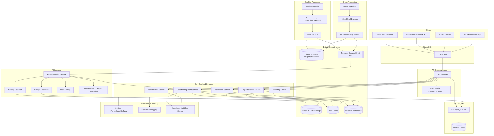
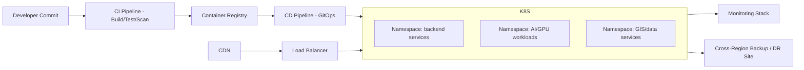

# SATRAK — Technical Design Document
### AI-Powered National Platform for Detection of Unauthorized & Illegal Construction

**Document Type:** Technical Design Document (TDD)
**Audience:** Engineering leadership, AI/ML teams, GIS engineers, DevOps/SRE, Security, Government stakeholders
**Status:** Draft for review prior to development kickoff

---

## Table of Contents
1. Executive Summary
2. Overall System Architecture
3. Microservice Architecture
4. Data Flow
5. AI Architecture
6. GIS Architecture
7. Satellite Processing Pipeline
8. Drone Architecture
9. Database Design
10. API Architecture
11. Security Architecture
12. Deployment Architecture
13. Performance Targets
14. Risks
15. Technology Stack Recommendation
16. Architecture Decision Records (ADR)
17. Future Expansion
18. Open Questions & Assumptions

---

# 1. Executive Summary

## 1.1 Technical Vision
SATRAK is a cloud-native, AI-driven geospatial intelligence platform that continuously monitors land parcels across a country using satellite imagery, periodically validates high-risk parcels using drone imagery, and correlates detected physical changes against government land, building-permit, and revenue records to identify unauthorized or illegal construction. The system converts raw earth-observation data into actionable, legally-defensible enforcement cases for Municipal Corporations, Urban Development Authorities, and Revenue Departments.

The platform is designed around three technical pillars:

- **Detect** — continuous, automated remote-sensing change detection at national scale.
- **Verify** — geospatial and administrative cross-referencing against authoritative government records, with human officer review before any legal action.
- **Act** — structured case management, drone-based ground-truthing, and citizen-facing transparency, all backed by tamper-evident audit trails suitable for use as legal evidence.

## 1.2 Architecture Philosophy
- **Cloud-native, API-first, microservices-based** — every capability is a service behind a well-defined API contract, enabling independent teams to build, test, and scale components in parallel.
- **Event-driven core** — satellite ingestion, AI inference, and case creation are decoupled via a message bus so that spikes in imagery volume never block downstream services.
- **Human-in-the-loop by design** — AI never issues an enforcement action directly; every AI output is a *recommendation* that a government officer reviews, edits, and approves. This is a legal and trust requirement, not just a technical one.
- **Geospatial-first data model** — nearly every entity (parcel, building, case, drone flight) is a geometry with attributes, so PostGIS and spatial indexing are treated as first-class citizens rather than an add-on.
- **National scale from day one** — the architecture assumes eventual coverage of an entire country's land area, not a single city pilot, and is designed to shard/partition accordingly even if the initial rollout is smaller.
- **Defense-in-depth security & chain-of-custody** — because outputs may be used in legal/administrative proceedings, evidentiary integrity (hashing, immutability, audit logs) is architected in from the start, not retrofitted.

## 1.3 Scalability Goals
- Support ingestion and processing of satellite imagery covering 3.28M km² (illustrative national scale) on a recurring revisit cycle (target: 5–15 day revisit depending on satellite source).
- Horizontally scale AI inference workers independently from API/backend services based on imagery queue depth.
- Support 10,000+ concurrent government officer users and 1M+ citizen-facing portal users nationally at full rollout.
- Support multi-tenant deployment per state/municipal corporation with logical data isolation.

## 1.4 Reliability Goals
- 99.9% uptime SLA for citizen-facing and officer-facing applications (excluding scheduled maintenance windows).
- No single point of failure in the ingestion pipeline — satellite/drone data landing zones are durable and replay-safe.
- RPO (Recovery Point Objective) ≤ 15 minutes for transactional data; RTO (Recovery Time Objective) ≤ 4 hours for full regional failover.

## 1.5 Security Goals
- Zero Trust network model between all internal services.
- Full audit trail of every AI recommendation, officer decision, and data access event, immutable and independently verifiable.
- Compliance-ready design for applicable national data protection and e-governance security frameworks (e.g., empanelled cloud requirements, data localization).

## 1.6 AI Goals
- Building/segmentation detection F1 ≥ 0.90 on held-out regional benchmarks before any region goes live.
- Change detection false-positive rate low enough that officer review remains the primary bottleneck reduction lever, not a rubber stamp — target ≤ 15% false-positive case creation rate at launch, improving over time.
- Every AI inference traceable to a specific model version, weight checksum, and input imagery ID for auditability.

---

# 2. Overall System Architecture

## 2.1 High-Level Architecture Diagram



## 2.2 Service Responsibilities

| Layer | Component | Responsibility |
|---|---|---|
| Frontend | Officer Dashboard | Case review, drone dispatch, approvals, map-based investigation UI |
| Frontend | Citizen Portal | Property status lookup, complaint filing, notice viewing |
| Frontend | Admin Console | User/role management, jurisdiction config, model rollout control |
| Frontend | Drone Pilot App | Mission planning, live telemetry, upload of flight data |
| Backend | API Gateway | Single entry point, rate limiting, request routing, TLS termination |
| Backend | Auth Service | Identity, SSO with government identity providers, JWT issuance, RBAC enforcement |
| Backend | Case Management | Lifecycle of a detected-violation case from creation to closure |
| Backend | Property/Parcel Service | Canonical parcel/property registry, links to revenue & permit records |
| Backend | Notification Service | SMS/email/push/postal-integration notices to citizens and officers |
| Backend | Reporting Service | Generates PDF/legal reports, aggregates statistics for dashboards |
| AI | AI Orchestration | Coordinates model pipeline execution, versioning, and result assembly |
| AI | Detection/Change/Risk Models | Core computer-vision and ML inference (detailed in Section 5) |
| GIS | GIS Engine | Spatial queries, parcel boundary management, coordinate transforms |
| Satellite | Ingestion & Preprocessing | Acquisition, ortho-rectification, cloud masking, tiling |
| Drone | Ingestion & Photogrammetry | Flight data ingestion, 3D reconstruction, point cloud generation |
| Data | Storage Layer | Object storage for imagery/evidence, spatial DB, vector DB, cache, warehouse |
| Ops | Monitoring/Logging/Audit | Observability and legally-defensible immutable audit trail |

---

# 3. Microservice Architecture

Each microservice below follows clean architecture (API layer → application/use-case layer → domain layer → infrastructure layer) and is independently deployable.

### 3.1 Auth Service
- **Purpose:** Centralized identity, authentication, and authorization.
- **Responsibilities:** SSO integration with government identity providers (e.g., DigiLocker-style or state SSO), JWT issuance/refresh, RBAC/ABAC policy evaluation, session/device management.
- **Inputs:** Login credentials, SSO assertions, MFA tokens.
- **Outputs:** Signed JWTs, refresh tokens, permission decisions.
- **Dependencies:** User directory (LDAP/DB), MFA provider.
- **Tech Stack:** Node.js/Go, Keycloak or custom OIDC provider, PostgreSQL.
- **Communication:** REST/gRPC + OIDC.
- **Scaling:** Stateless horizontal scaling behind the gateway; token validation cached at gateway edge.
- **Expected Load:** Peaks aligned with officer shift start (~9 AM local); target 5,000 auth requests/min nationally at scale.

### 3.2 Property/Parcel Service
- **Purpose:** Canonical registry of land parcels and buildings.
- **Responsibilities:** CRUD for parcel/building records, links to revenue survey numbers, ownership records, permit references.
- **Inputs:** Government land record imports, GIS updates, case linkages.
- **Outputs:** Parcel/building profiles with geometry + attributes.
- **Dependencies:** GIS Engine, external Revenue Department APIs.
- **Tech Stack:** Go/Java (Spring Boot), PostGIS.
- **Communication:** REST + async events on parcel change.
- **Scaling:** Read-heavy — horizontally scaled read replicas; writes centralized per jurisdiction shard.
- **Expected Load:** Hundreds of millions of parcels nationally; read QPS in the thousands.

### 3.3 Case Management Service
- **Purpose:** Orchestrates the lifecycle of a detected-violation case.
- **Responsibilities:** Case creation from AI triggers, officer assignment, status transitions (Detected → Under Review → Drone Dispatched → Inspected → Notice Issued → Resolved/Escalated), SLA tracking.
- **Inputs:** AI detection events, officer actions, drone inspection reports.
- **Outputs:** Case records, status change events, notification triggers.
- **Dependencies:** AI Orchestration, GIS Engine, Notification Service, Audit Service.
- **Tech Stack:** Go/Java, PostgreSQL + PostGIS extension for case geometry.
- **Communication:** REST for UI, event bus for cross-service triggers.
- **Scaling:** Sharded by jurisdiction/state; horizontally scalable stateless service layer.
- **Expected Load:** Tens of thousands of new cases/day nationally at full scale.

### 3.4 AI Orchestration Service
- **Purpose:** Coordinates the multi-model AI pipeline per imagery tile/parcel.
- **Responsibilities:** Model version routing, batching, retries, result aggregation, confidence thresholding before case creation.
- **Inputs:** Tiled imagery references, parcel metadata.
- **Outputs:** Structured detection/change/risk results, model provenance metadata.
- **Dependencies:** All AI model services, Vector DB, Object Storage.
- **Tech Stack:** Python (FastAPI), Kubernetes Jobs/KServe or Ray Serve for model serving.
- **Communication:** Async via message queue (Kafka/Pub-Sub); gRPC to model services.
- **Scaling:** Autoscaled based on queue depth; GPU node pools autoscale separately from CPU services.
- **Expected Load:** Millions of tile-inferences per revisit cycle.

### 3.5 GIS Query Service
- **Purpose:** Serves all spatial queries and geoprocessing operations.
- **Responsibilities:** Polygon intersection, buffer analysis, spatial joins between parcels/cases/imagery footprints, coordinate transforms.
- **Inputs:** Geometry queries (WKT/GeoJSON), CRS parameters.
- **Outputs:** Spatial query results, computed geometries.
- **Dependencies:** PostGIS cluster.
- **Tech Stack:** Python/Go with GDAL/GEOS bindings, PostGIS.
- **Communication:** REST/gRPC; OGC-compliant WFS/WMS endpoints for GIS clients.
- **Scaling:** Read replicas + spatial index tuning; heavy geoprocessing offloaded to worker pool.
- **Expected Load:** High-frequency read queries from dashboard map interactions.

### 3.6 Satellite Ingestion Service
- **Purpose:** Automated acquisition of satellite imagery from providers.
- **Responsibilities:** Scheduling acquisition tasking, downloading scenes, validating completeness, triggering preprocessing.
- **Inputs:** Provider APIs (e.g., national/commercial satellite feeds), AOI (Area of Interest) definitions.
- **Outputs:** Raw scene files in landing storage, ingestion events.
- **Dependencies:** Object Storage, satellite provider contracts/APIs.
- **Tech Stack:** Python, Apache Airflow for scheduling.
- **Communication:** Event-driven (publishes ingestion-complete events).
- **Scaling:** Scheduler-driven; scales with number of AOIs and revisit frequency.
- **Expected Load:** Terabytes of imagery per day at national scale.

### 3.7 Satellite Preprocessing Service
- **Purpose:** Converts raw scenes into analysis-ready imagery.
- **Responsibilities:** Cloud/shadow masking, orthorectification, radiometric correction, mosaicking, tiling into standard grids (e.g., XYZ/WMTS tiles).
- **Inputs:** Raw scene files.
- **Outputs:** Analysis-ready cloud-optimized GeoTIFFs (COGs), tile sets.
- **Dependencies:** Object Storage, GDAL-based processing cluster.
- **Tech Stack:** Python, GDAL, Rasterio, Dask/Spark for distributed processing.
- **Communication:** Event-driven pipeline stages.
- **Scaling:** Horizontally scaled batch workers (Kubernetes Jobs), autoscale by backlog.
- **Expected Load:** Bound by ingestion volume; designed for burst processing after each revisit pass.

### 3.8 Drone Ingestion & Photogrammetry Service
- **Purpose:** Processes drone-captured imagery/video into 3D data products.
- **Responsibilities:** Flight log ingestion, image stitching, photogrammetric reconstruction, point cloud/orthomosaic generation.
- **Inputs:** Drone imagery, telemetry, camera calibration data.
- **Outputs:** Orthomosaics, 3D point clouds, digital surface models.
- **Dependencies:** Object Storage, GPU compute for photogrammetry (e.g., OpenDroneMap/Pix4D-class pipeline).
- **Tech Stack:** Python/C++, OpenDroneMap or commercial SDK, GPU nodes.
- **Communication:** Event-driven; REST for pilot app uploads.
- **Scaling:** GPU-backed worker pool, autoscaled per mission volume.
- **Expected Load:** Correlated with number of dispatched inspections/day (thousands nationally).

### 3.9 Notification Service
- **Purpose:** Multi-channel communication to citizens and officers.
- **Responsibilities:** SMS/email/push dispatch, delivery tracking, template management, legal-notice formatting.
- **Inputs:** Notification requests from Case/Reporting services.
- **Outputs:** Delivery receipts, escalation triggers on non-delivery.
- **Dependencies:** SMS gateway, email provider, push notification service.
- **Tech Stack:** Node.js, message queue-backed workers.
- **Communication:** Async event consumption; REST for status queries.
- **Scaling:** Queue-based, horizontally scalable consumers.
- **Expected Load:** Hundreds of thousands of notifications/day at scale.

### 3.10 Reporting Service
- **Purpose:** Generates structured reports and dashboards.
- **Responsibilities:** PDF/legal report generation (with LLM assistance), aggregate analytics, export to Analytics Warehouse.
- **Inputs:** Case data, inspection data, AI outputs.
- **Outputs:** PDF reports, dashboard datasets.
- **Dependencies:** LLM Assistant service, Analytics Warehouse.
- **Tech Stack:** Python/Node.js, headless rendering (e.g., LibreOffice/pandoc-based pipeline), BI tooling.
- **Communication:** REST + scheduled batch jobs.
- **Scaling:** Batch worker pool.
- **Expected Load:** Thousands of report generations/day.

### 3.11 Audit & Evidence Service
- **Purpose:** Immutable, tamper-evident logging of every AI decision, officer action, and data access.
- **Responsibilities:** Hash-chained log entries, WORM (write-once-read-many) storage, chain-of-custody records for evidentiary imagery.
- **Inputs:** Events from all services.
- **Outputs:** Verifiable audit trail, evidence bundles for legal proceedings.
- **Dependencies:** WORM object storage, all services (as event producers).
- **Tech Stack:** Go, append-only log store (e.g., QLDB-style or custom Merkle-tree log), object storage with retention lock.
- **Communication:** Async event consumption.
- **Scaling:** High write throughput consumer group.
- **Expected Load:** Every state-changing action in the system — potentially tens of millions of events/day at scale.

---

# 4. Data Flow

## 4.1 End-to-End Sequence

```mermaid
sequenceDiagram
    participant Sat as Satellite Provider
    participant Ing as Ingestion Service
    participant Pre as Preprocessing Service
    participant AI as AI Orchestration
    participant Det as Detection/Change/Risk Models
    participant GIS as GIS Engine
    participant Case as Case Management
    participant Off as Officer Dashboard
    participant Drone as Drone Service
    participant Rep as Reporting Service
    participant Notif as Notification Service
    participant Cit as Citizen

    Sat->>Ing: New scene available
    Ing->>Pre: Raw scene
    Pre->>Pre: Cloud removal, orthorectification, tiling
    Pre->>AI: Analysis-ready tiles
    AI->>Det: Run detection + change detection
    Det->>AI: Building masks, change polygons
    AI->>GIS: Correlate with parcel boundaries & permits
    GIS->>AI: Parcel match / mismatch result
    AI->>AI: Risk scoring & priority classification
    AI->>Case: Create candidate case (if risk > threshold)
    Case->>Off: Case appears in review queue
    Off->>Case: Reviews evidence, approves/rejects
    Case->>Drone: Dispatch drone inspection (if approved)
    Drone->>Drone: Mission flight, photogrammetry
    Drone->>Case: Inspection report + 3D evidence
    Case->>Off: Final review with drone evidence
    Off->>Rep: Approve final report/notice
    Rep->>Notif: Generate & queue citizen notice
    Notif->>Cit: SMS/email/postal notice
    Case->>Case: Status -> Resolved/Escalated
```

## 4.2 Stage Descriptions

1. **Satellite Image Acquisition** — Scheduled tasking or archive pull from satellite providers for each Area of Interest (AOI), based on jurisdiction priority and revisit cadence.
2. **Image Processing** — Cloud masking, orthorectification, radiometric normalization, and tiling into a standard slippy-map grid for consistent AI input.
3. **Building Detection** — Semantic segmentation identifies building footprints in each tile.
4. **Change Detection** — Current tile compared against the most recent prior analysis-ready tile of the same AOI to flag new/modified structures.
5. **Risk Scoring** — Combines change magnitude, parcel zoning, permit records, and historical violation density into a numeric risk score.
6. **Government Verification** — Automated cross-check against permit/approval and revenue databases; determines whether the detected structure has a matching authorization.
7. **Case Creation** — If risk score exceeds threshold and no matching authorization exists, a case is created and queued for officer review.
8. **Officer Review** — A human officer reviews satellite evidence, GIS overlay, and record cross-check, then approves, rejects, or requests drone verification.
9. **Drone Dispatch** — For approved cases needing ground-truth, a drone mission is planned and dispatched.
10. **Inspection** — Drone captures high-resolution imagery/video; photogrammetry produces an orthomosaic and 3D model as physical evidence.
11. **Final Report** — Reporting service compiles satellite evidence, drone evidence, GIS analysis, and record cross-check into a legally structured report, with LLM-assisted drafting reviewed by the officer.
12. **Citizen Notification** — Formal notice dispatched via SMS/email/postal integration, with a citizen portal case reference number for response/appeal.

---

# 5. AI Architecture

All models are versioned, checksummed, and logged via the AI Orchestration Service so every inference is traceable (model ID + weight hash + input tile ID) for auditability. All modules expose a **fallback strategy** for degraded/low-confidence conditions, since outputs feed into government enforcement decisions.

### 5.1 Building Detection
- **Purpose:** Locate building footprints in satellite/aerial imagery.
- **Input:** Analysis-ready RGB/multispectral tile (e.g., 256×256 or 512×512 px, 0.3–3m resolution depending on source).
- **Output:** Binary/instance masks of building footprints with confidence scores.
- **Suggested Model:** U-Net / Mask R-CNN or a modern transformer-based segmentation model (e.g., SegFormer) pretrained on remote-sensing datasets and fine-tuned regionally.
- **Training Data:** Labeled footprints from open datasets (e.g., Microsoft/Google building footprint datasets) plus regionally labeled government cadastral data.
- **Inference Pipeline:** Tile → normalize → batch inference on GPU → mask post-processing (morphological cleanup, polygon vectorization).
- **Hardware:** GPU inference nodes (e.g., T4/A10-class), batched for throughput.
- **Evaluation Metrics:** IoU, F1, precision/recall on held-out regional test sets.
- **Fallback Strategy:** If confidence < threshold, tile is queued for secondary model ensemble or flagged for manual GIS analyst review rather than auto-creating a case.

### 5.2 Building Segmentation (Instance-Level)
- **Purpose:** Separate individual building instances within detected footprint masks (for counting and per-building tracking).
- **Input:** Binary building mask + original tile.
- **Output:** Per-instance polygons with unique IDs.
- **Suggested Model:** Mask R-CNN / Detectron2-based instance segmentation.
- **Training Data:** Instance-labeled building datasets.
- **Inference Pipeline:** Runs after 5.1; polygon simplification and topology validation via GIS Engine.
- **Hardware:** Shared GPU pool with 5.1.
- **Evaluation Metrics:** Instance-level mAP.
- **Fallback Strategy:** Falls back to footprint-level (non-instance) output if instance separation confidence is low.

### 5.3 Building Height Estimation
- **Purpose:** Estimate building height from shadow length, stereo imagery, or DSM (Digital Surface Model) where available.
- **Input:** Tile + sun-angle metadata, or stereo pair, or drone-derived DSM.
- **Output:** Estimated height (meters) per building instance.
- **Suggested Model:** Shadow-geometry regression model or monocular depth estimation network, refined with drone DSM ground truth when available.
- **Training Data:** Paired imagery + LiDAR/DSM ground truth.
- **Inference Pipeline:** Post-processes 5.2 outputs with shadow/geometry calculations.
- **Hardware:** CPU-sufficient for shadow-geometry method; GPU for deep-learning depth models.
- **Evaluation Metrics:** MAE (mean absolute error) in meters against ground truth.
- **Fallback Strategy:** Reports a height range/confidence interval instead of a point estimate when satellite-only; drone inspection provides authoritative height when dispatched.

### 5.4 Floor Count Detection
- **Purpose:** Estimate number of floors, primarily from drone/oblique imagery.
- **Input:** Drone orthomosaic/oblique images or estimated height from 5.3.
- **Output:** Estimated floor count with confidence.
- **Suggested Model:** CNN classifier on facade imagery (drone) or height/floor-height ratio heuristic (satellite-only).
- **Training Data:** Labeled facade image datasets with floor counts.
- **Inference Pipeline:** Runs post-drone-inspection when available; satellite-only estimate flagged as low-confidence.
- **Hardware:** GPU (small).
- **Evaluation Metrics:** Accuracy within ±1 floor.
- **Fallback Strategy:** Satellite-only cases report "estimated floors unavailable — pending drone verification."

### 5.5 Construction Stage Detection
- **Purpose:** Classify a detected structure's build stage (foundation, structure, roofing, finishing, complete).
- **Input:** Tile/time-series of tiles for the same footprint.
- **Output:** Stage label + confidence.
- **Suggested Model:** Temporal CNN/transformer over a short image time-series per parcel.
- **Training Data:** Time-series labeled construction-stage datasets (can be bootstrapped from historical case records).
- **Inference Pipeline:** Consumes multiple historical tiles for the same AOI.
- **Hardware:** GPU.
- **Evaluation Metrics:** Classification accuracy, confusion matrix across stages.
- **Fallback Strategy:** Defaults to "Under Construction — stage undetermined" and relies on officer/drone review.

### 5.6 Change Detection
- **Purpose:** Identify new or modified structures between two time periods.
- **Input:** Co-registered tile pairs (current vs. baseline).
- **Output:** Change polygons + change-type classification (new structure, extension, demolition).
- **Suggested Model:** Siamese CNN or transformer-based bi-temporal change detection network.
- **Training Data:** Bi-temporal labeled change datasets (public remote-sensing change datasets + regional bootstrapped labels).
- **Inference Pipeline:** Requires accurate co-registration (handled in preprocessing) before differencing.
- **Hardware:** GPU.
- **Evaluation Metrics:** F1 on change/no-change classification, IoU on change polygons.
- **Fallback Strategy:** Low-confidence changes are logged as "monitoring" rather than escalated to a case, and re-checked next revisit cycle.

### 5.7 Road Detection
- **Purpose:** Extract road network for context (e.g., setback violations, encroachment onto road reserve).
- **Input:** Tile.
- **Output:** Road centerlines/polygons.
- **Suggested Model:** Segmentation network (e.g., D-LinkNet) fine-tuned regionally.
- **Training Data:** Road-labeled remote sensing datasets, OpenStreetMap as weak supervision.
- **Inference Pipeline:** Runs in parallel with building detection; output stored in GIS layer.
- **Hardware:** GPU.
- **Evaluation Metrics:** IoU on road masks.
- **Fallback Strategy:** Falls back to existing OSM/government road layer if model confidence is low.

### 5.8 Encroachment Detection
- **Purpose:** Detect construction encroaching onto government land, road reserves, water bodies, or forest boundaries.
- **Input:** Building/change polygons + GIS boundary layers (government land, buffer zones).
- **Output:** Encroachment flag + overlapping area (m²) + boundary type violated.
- **Suggested Model:** Rule-based GIS spatial-intersection logic (polygon intersection/buffer analysis) rather than a learned model — this must be deterministic and explainable for legal purposes.
- **Training Data:** N/A (deterministic geometry logic); boundary layers sourced from authoritative government GIS data.
- **Inference Pipeline:** GIS Engine computes intersection/buffer analysis on every new building/change polygon.
- **Hardware:** CPU (GIS Engine).
- **Evaluation Metrics:** Boundary-layer accuracy audits; intersection-logic correctness tests.
- **Fallback Strategy:** If boundary layer data is stale/missing for a jurisdiction, encroachment flag is suppressed and a data-quality alert is raised instead of a false accusation.

### 5.9 Risk Prediction
- **Purpose:** Produce a composite risk/likelihood-of-violation score per detected case.
- **Input:** Change detection output, encroachment flags, permit-match result, historical violation density in the area, zoning classification.
- **Output:** Risk score (0–100) + contributing-factor breakdown.
- **Suggested Model:** Gradient-boosted tree ensemble (e.g., XGBoost/LightGBM) over engineered features — favored over deep learning here for interpretability (SHAP values explain each score to officers/legal reviewers).
- **Training Data:** Historical case outcomes (confirmed violation vs. false positive) labeled by officers over time.
- **Inference Pipeline:** Runs after all upstream detections complete for a parcel.
- **Hardware:** CPU.
- **Evaluation Metrics:** AUC-ROC, calibration curves, precision at top-K.
- **Fallback Strategy:** Cold-start jurisdictions with no historical labels use a rule-based scoring baseline until enough labeled data accumulates.

### 5.10 Priority Classification
- **Purpose:** Rank cases for officer queues (e.g., critical safety risk vs. routine).
- **Input:** Risk score, structure size, proximity to critical infrastructure, public-safety indicators.
- **Output:** Priority tier (Critical/High/Medium/Low).
- **Suggested Model:** Rule-based scoring layered on top of 5.9's output, tunable per jurisdiction policy.
- **Training Data:** N/A (policy-driven) with optional learned re-ranking from officer triage behavior.
- **Inference Pipeline:** Final step before case appears in officer queue.
- **Hardware:** CPU.
- **Evaluation Metrics:** Queue-clearance-time correlation, officer agreement rate.
- **Fallback Strategy:** Defaults to "Medium" priority if inputs are incomplete.

### 5.11 Report Generation
- **Purpose:** Draft structured, legally formatted case reports.
- **Input:** All case data — imagery, GIS analysis, drone evidence, officer notes.
- **Output:** Draft PDF/Word report for officer review and edit.
- **Suggested Model:** LLM (see 5.12) with a structured template + retrieval of case facts — never freeform generation of legal conclusions.
- **Training Data:** N/A (prompted generation, grounded in structured case data only).
- **Inference Pipeline:** Template-constrained generation; officer must review/approve before any report is finalized.
- **Hardware:** CPU (API call to LLM service) or GPU if self-hosted.
- **Evaluation Metrics:** Officer edit-rate (lower is better), factual-consistency checks against source case data.
- **Fallback Strategy:** If LLM output fails grounding checks, falls back to a deterministic template-filled report with no narrative prose.

### 5.12 LLM Assistant
- **Purpose:** Natural-language assistant for officers (query cases, summarize evidence, draft citizen-facing explanations) and citizen-facing chatbot for status queries.
- **Input:** Officer/citizen natural-language query + retrieved structured case context (RAG).
- **Output:** Natural-language response grounded in retrieved facts, with citations to source case fields.
- **Suggested Model:** Hosted foundation model (e.g., Claude) accessed via API, with a retrieval layer over the Case/Property/GIS services — no fine-tuning of the base model required initially.
- **Training Data:** N/A initially (RAG-based); future: officer feedback data for prompt/response quality tuning.
- **Inference Pipeline:** Query → retrieval from structured stores → grounded prompt → response → citation validation.
- **Hardware:** API-based (no local GPU needed) or self-hosted inference cluster if data-residency requires it.
- **Evaluation Metrics:** Groundedness/factual-accuracy rate, officer satisfaction scores.
- **Fallback Strategy:** If retrieval returns insufficient context, the assistant declines to speculate and directs the user to the relevant case screen instead of generating an unsupported answer.

---

# 6. GIS Architecture

- **Spatial Database:** PostGIS (PostgreSQL extension) as the system of record for all vector geometry — parcels, building footprints, road networks, jurisdiction boundaries, buffer zones. Chosen for open standards support (OGC), mature spatial indexing, and strong consistency guarantees needed for legal records.
- **Map Layers:** Layered model — Base (satellite basemap/OSM), Cadastral (parcel boundaries), Regulatory (zoning, road-reserve buffers, water-body/forest boundaries), Operational (cases, drone flight footprints), Analytical (AI detection overlays, heatmaps).
- **Parcel Boundaries:** Ingested from Revenue Department cadastral maps (survey number-based), maintained as authoritative polygons with versioning to track boundary updates/subdivisions over time.
- **Government Records:** Linked via foreign keys from parcel geometry to permit/approval records, ownership records, and prior violation history — stored relationally alongside spatial data in PostGIS.
- **Coordinate Systems:** All ingestion normalized to a national projected CRS for area/distance accuracy (e.g., a UTM zone or national grid), with WGS84 (EPSG:4326) used for web-map display and API interchange.
- **Geospatial Indexing:** GiST/SP-GiST indexes on all geometry columns; tile-based spatial partitioning aligned to a standard slippy-map grid for imagery correlation.
- **Spatial Queries:** Standard OGC spatial predicates (ST_Intersects, ST_Within, ST_DWithin) exposed through the GIS Query Service's REST/WFS API.
- **Buffer Analysis:** Used for setback-violation checks (e.g., distance from road centerline, water body edge) via `ST_Buffer` + intersection.
- **Polygon Intersection:** Core mechanism for encroachment detection (Section 5.8) and case-to-parcel matching.
- **Raster Processing:** Cloud-Optimized GeoTIFF (COG) storage for imagery, processed via GDAL/Rasterio; raster-vector overlay operations (zonal statistics) for per-parcel analysis.

---

# 7. Satellite Processing Pipeline

- **Supported Satellites:** Mix of high-revisit medium-resolution sources (e.g., Sentinel-2 class, national EO satellites) for continuous monitoring, and tasked high-resolution commercial imagery (sub-meter, e.g., Maxar/Planet-class) for verification of flagged parcels.
- **Image Sources:** Government EO satellite feeds, commercial imagery providers via tasking API, open data archives.
- **Preprocessing:** Radiometric calibration, atmospheric correction.
- **Cloud Removal:** Cloud/shadow masking (e.g., Fmask-style algorithm) with multi-date compositing to fill cloud gaps.
- **Geo-referencing:** Ground control point-based correction where sensor metadata is insufficient.
- **Orthorectification:** DEM-based correction for terrain displacement, producing map-accurate imagery.
- **Image Enhancement:** Pan-sharpening (where panchromatic band available), contrast normalization.
- **Tiling:** Output cut into a standard XYZ/WMTS tile grid at fixed zoom levels for consistent AI model input and web display.
- **AI Detection:** Tiles pushed to the AI Orchestration Service (Section 5).
- **Post Processing:** Vectorization of raster detection outputs, polygon simplification, topology validation via GIS Engine.
- **Output Generation:** Analysis-ready COGs archived in Object Storage; detection vectors written to PostGIS; provenance metadata (scene ID, acquisition date, sensor) attached to every output for auditability.

---

# 8. Drone Architecture

- **Mission Planning:** Officer/pilot app defines flight polygon over the flagged parcel, altitude, and overlap parameters; auto-generates a waypoint flight plan respecting airspace/no-fly-zone restrictions (integration with national drone airspace authorization systems).
- **Live Video:** Real-time video/telemetry streamed to the dashboard during inspection for officer situational awareness.
- **Edge AI:** Lightweight on-drone/on-tablet model performs real-time obstacle/no-fly-zone alerts and basic object detection (e.g., flagging visible construction activity) during flight, independent of cloud connectivity.
- **Object Detection:** Post-flight, higher-capacity cloud model re-analyzes captured imagery for construction materials, equipment, and worker presence as supporting evidence.
- **3D Mapping:** Structure-from-Motion (SfM) pipeline reconstructs a 3D model of the site from overlapping drone images.
- **Photogrammetry:** Orthomosaic and Digital Surface Model (DSM) generation via the Photogrammetry Service (Section 3.8).
- **Point Clouds:** Dense point cloud output enables precise height/volume measurement of unauthorized structures.
- **Mission Reports:** Auto-generated mission summary (flight path, imagery count, processing outputs) attached to the case file.
- **Integration with Dashboard:** Drone outputs (orthomosaic, 3D model, point cloud) rendered directly in the officer dashboard's map view alongside satellite evidence for side-by-side comparison.

---

# 9. Database Design

| Database | Purpose |
|---|---|
| **PostGIS (PostgreSQL)** | System of record for all spatial + relational data: parcels, buildings, cases, jurisdiction boundaries, permits, users. Chosen for ACID guarantees needed for legal records and mature spatial capability. |
| **Vector Database** (e.g., pgvector/Milvus) | Stores embeddings of imagery tiles/case narratives for similarity search (e.g., "find similar prior violation patterns") and RAG retrieval for the LLM Assistant. |
| **Object Storage** (e.g., S3-compatible) | Stores raw and processed imagery (COGs), drone photo/video, 3D models/point clouds, and evidence bundles. WORM-locked buckets for legal evidence. |
| **Cache** (Redis) | Session tokens, frequently accessed parcel/case lookups, map-tile response caching. |
| **Message Queue** (Kafka or cloud Pub/Sub) | Decouples ingestion → preprocessing → AI → case-creation stages; ensures replayability and backpressure handling. |
| **Logs** (Centralized logging, e.g., Loki/ELK) | Operational logs for debugging and performance monitoring (distinct from the legal Audit Log). |
| **Analytics Warehouse** (e.g., BigQuery/Redshift/ClickHouse-class) | Aggregated, denormalized data for dashboards, KPI reporting, and cross-jurisdiction analytics — decoupled from the transactional PostGIS store to avoid impacting case-processing performance. |

---

# 10. API Architecture

All APIs are REST (JSON) behind the API Gateway, versioned (`/v1/...`), authenticated via JWT (OIDC-issued), and authorized via RBAC scopes. GraphQL or gRPC may supplement internal service-to-service calls where flexible querying (dashboard map layers) benefits from it.

- **Authentication API:** `/v1/auth/login`, `/v1/auth/refresh`, `/v1/auth/mfa` — issued by Auth Service.
- **Satellite API:** `/v1/satellite/scenes`, `/v1/satellite/tiles/{z}/{x}/{y}` — scene metadata and tile serving.
- **GIS API:** `/v1/gis/parcels/{id}`, `/v1/gis/query/intersects`, `/v1/gis/buffer` — spatial query operations.
- **AI API:** `/v1/ai/detections/{tileId}`, `/v1/ai/risk-score/{caseId}` — internal-facing, primarily consumed by orchestration/case services.
- **Property API:** `/v1/properties/{id}`, `/v1/properties/search` — parcel/building CRUD and search.
- **Inspection API:** `/v1/inspections`, `/v1/inspections/{id}/drone-report` — drone mission and inspection data.
- **Reports API:** `/v1/reports/{caseId}`, `/v1/reports/{caseId}/export` — report generation and retrieval.
- **Admin API:** `/v1/admin/users`, `/v1/admin/jurisdictions`, `/v1/admin/model-versions` — administrative configuration.
- **Citizen API:** `/v1/citizen/property-status`, `/v1/citizen/complaints`, `/v1/citizen/notices/{id}` — public-facing, rate-limited, CAPTCHA-protected.
- **Notification API:** `/v1/notifications/send`, `/v1/notifications/{id}/status` — internal service for dispatch/tracking.

---

# 11. Security Architecture

- **RBAC:** Role-based access with jurisdiction-scoped permissions (e.g., an officer in District A cannot view/edit District B cases) enforced at both the API Gateway and service layer.
- **Zero Trust:** All internal service-to-service traffic authenticated via mTLS; no implicit trust based on network location (e.g., VPC membership alone).
- **Encryption:** TLS 1.3 in transit everywhere; AES-256 at rest for databases and object storage; envelope encryption with a managed KMS for evidence buckets.
- **JWT:** Short-lived access tokens (e.g., 15 min) + refresh tokens; signed with rotating asymmetric keys.
- **OAuth/OIDC:** Standard OIDC flows for SSO integration with government identity providers; citizen portal supports separate lightweight auth (mobile OTP) distinct from officer SSO.
- **Audit Logs:** Every read/write on case, property, and evidence data logged to the immutable Audit & Evidence Service (Section 3.11), independent of application logs.
- **Digital Evidence & Tamper-Proof Storage:** Evidence imagery/video hashed (SHA-256) at ingestion; hash + metadata written to an append-only ledger so any post-hoc tampering is cryptographically detectable; WORM object-storage retention locks prevent deletion/modification during a legally mandated retention period.
- **Secure Uploads:** Drone/officer uploads virus-scanned, size/type validated, and uploaded via pre-signed URLs (never direct credentialed access to storage from client devices).

---

# 12. Deployment Architecture



- **Cloud Design:** Government-empanelled cloud provider (or on-premise/hybrid for data-sovereignty-sensitive workloads), multi-region within-country for DR.
- **Containers/Docker:** All services containerized; base images scanned for vulnerabilities in CI.
- **Kubernetes:** Managed Kubernetes (e.g., EKS/GKE/AKS-equivalent government cloud offering) with separate node pools for general compute, GPU (AI/photogrammetry), and data-intensive workloads.
- **Load Balancers/CDN:** Layer-7 load balancing with WAF; CDN for static assets and map tiles.
- **CI/CD:** GitOps-based deployment (e.g., ArgoCD/Flux), automated testing, container scanning, staged rollout (dev → staging → pilot region → national).
- **Auto Scaling:** HPA (Horizontal Pod Autoscaler) on CPU/queue-depth metrics for backend services; cluster autoscaler for GPU node pools tied to AI job queue depth.
- **Monitoring:** Prometheus + Grafana for metrics, alerting via PagerDuty-class tooling.
- **Backup Strategy:** Automated daily snapshots of PostGIS, continuous WAL archiving for point-in-time recovery, cross-region replication of object storage.
- **Disaster Recovery:** Warm-standby in a secondary region; documented failover runbooks; quarterly DR drills.

---

# 13. Performance Targets

| Metric | Target |
|---|---|
| API Response Time (p95) | ≤ 300 ms for standard reads, ≤ 1 s for complex spatial queries |
| Detection Time (per tile) | ≤ 2 s per tile on GPU inference (batched) |
| Satellite Processing Time (per scene) | ≤ 30 min from acquisition to analysis-ready tiles |
| AI Latency (full pipeline per parcel) | ≤ 5 min from tile availability to risk-scored candidate case |
| API Latency (Gateway overhead) | ≤ 50 ms added latency |
| Database Latency (spatial query p95) | ≤ 200 ms |
| Concurrent Users | 10,000+ officer sessions, 100,000+ concurrent citizen portal sessions |
| Expected Scale | National land-area coverage; tens of millions of parcels; millions of tiles processed per revisit cycle |

---

# 14. Risks

### Technical Risks
- Imagery volume and processing backlog during monsoon/cloud-heavy seasons in optical satellite data.
- Co-registration errors between time-series imagery leading to false change detections.
- **Mitigation:** SAR (radar) imagery fallback for cloud-persistent periods; automated co-registration QA gates before change detection runs.

### Operational Risks
- Officer overload if false-positive rate is too high, eroding trust in the system.
- Drone fleet/pilot availability bottlenecks in rural jurisdictions.
- **Mitigation:** Continuous model recalibration using officer feedback labels; tiered drone-as-a-service contracts to supplement in-house fleets.

### AI Risks
- Model bias across regions with different building materials/styles (a model trained on urban imagery may underperform in rural/informal settlements).
- Overconfidence in automated risk scores leading to inappropriate reliance.
- **Mitigation:** Region-stratified evaluation before rollout; mandatory human review gate before any case reaches citizen-facing notice; SHAP-based explainability surfaced to officers.

### GIS Risks
- Outdated or inaccurate government cadastral/boundary data producing incorrect encroachment flags.
- **Mitigation:** Data-quality scoring per jurisdiction; suppress automated flags in jurisdictions with stale boundary data (Section 5.8 fallback).

### Government Risks
- Inter-departmental data-sharing friction (Revenue, Urban Development, Survey departments may use incompatible legacy systems).
- **Mitigation:** Dedicated integration adapters per legacy system; phased data-sharing MOUs.

### Legal Risks
- Enforcement action challenged in court due to evidentiary integrity questions.
- Privacy concerns from citizens regarding aerial/drone surveillance.
- **Mitigation:** Chain-of-custody architecture (Section 11) designed with legal counsel input; drone flights restricted to flagged parcels with documented justification, not blanket surveillance; published data-retention and privacy policy.

---

# 15. Technology Stack Recommendation

| Layer | Recommended Stack |
|---|---|
| Frontend | React + TypeScript, Mapbox GL JS / OpenLayers for map rendering |
| Backend | Go and/or Java (Spring Boot) for core services, Node.js for I/O-bound services (notifications) |
| AI | Python, PyTorch, KServe/Ray Serve for model serving, ONNX for cross-runtime portability |
| GIS | PostGIS, GDAL, GeoServer (OGC services), Turf.js (client-side geo ops) |
| Cloud | Government-empanelled cloud (or hybrid on-prem), Kubernetes |
| Authentication | Keycloak/OIDC-compliant IdP, integration with government SSO |
| Storage | S3-compatible object storage with WORM retention, Cloud-Optimized GeoTIFF format |
| Database | PostgreSQL/PostGIS (OLTP + spatial), Redis (cache), Kafka (event bus) |
| Messaging | Kafka or managed cloud Pub/Sub |
| Monitoring | Prometheus, Grafana, Loki/ELK, OpenTelemetry |
| Analytics | ClickHouse/BigQuery-class warehouse, a BI layer (e.g., Metabase/Superset) |

---

# 16. Architecture Decision Records (ADR)

**ADR-01: Microservices over Monolith**
Chosen because the platform spans fundamentally different scaling profiles (GPU-bound AI vs. I/O-bound notification vs. spatial-query-heavy GIS) that a monolith would scale poorly and force lockstep deployment. Alternative considered: modular monolith — rejected due to the national-scale, multi-team development model expected.

**ADR-02: PostGIS as Primary Spatial Store**
Chosen for open-standard OGC compliance, ACID guarantees suited to legal record-keeping, and mature ecosystem tooling. Alternative considered: proprietary GIS databases (e.g., Esri ArcGIS Enterprise geodatabase) — viable but rejected as a primary store due to licensing cost at national scale and lower flexibility for custom microservice integration; ArcGIS/Esri tooling can still be integrated as a client/analyst tool on top of PostGIS.

**ADR-03: Rule-Based (not ML) Encroachment Logic**
Chosen because encroachment determination has direct legal consequences and must be deterministic, explainable, and auditable — a black-box ML classifier here would undermine legal defensibility. Alternative considered: learned classifier over boundary+building features — rejected for this specific decision point, though ML remains appropriate for upstream detection/risk scoring.

**ADR-04: Human-in-the-Loop Mandatory Before Enforcement**
Chosen for legal, ethical, and trust reasons — no automated system should trigger legal/financial consequences for a citizen without human officer review. Alternative considered: fully automated notice issuance for high-confidence cases — rejected as unacceptable given the stakes of erroneous enforcement.

**ADR-05: Event-Driven Architecture via Message Queue**
Chosen to decouple the highly bursty satellite-ingestion workload from downstream AI/case-creation services, and to enable replay/reprocessing when models are updated. Alternative considered: synchronous REST chaining — rejected as it would create tight coupling and processing bottlenecks at national imagery volumes.

**ADR-06: Hosted LLM via API for Report Generation/Assistant**
Chosen to avoid the cost/complexity of hosting and fine-tuning a foundation model, while retrieval-grounding keeps outputs auditable. Alternative considered: self-hosted open-weight LLM — recommended as a future option if data-residency/regulatory requirements mandate it; architecture keeps the LLM behind an internal abstraction layer to allow swapping providers without touching consuming services.

---

# 17. Future Expansion

- **Digital Twin:** Extend 3D drone/photogrammetry data into a persistent city-scale digital twin for broader urban planning use cases beyond violation detection.
- **IoT Integration:** Incorporate ground sensors (e.g., structural/vibration sensors) for continuous monitoring of high-risk sites.
- **Smart City APIs:** Expose SATRAK's GIS and detection layers as APIs consumable by broader Smart Cities Mission platforms.
- **Traffic Monitoring:** Reuse the satellite/drone AI pipeline architecture for traffic-flow and road-condition analytics.
- **Flood Monitoring:** Apply the same change-detection architecture to water-body extent monitoring for flood early-warning.
- **Road Damage Detection:** Extend road-detection module (5.7) with a damage-classification head.
- **Utility Monitoring:** Detect unauthorized tapping/construction over utility right-of-way corridors using the same encroachment-detection framework.
- **Forest Encroachment:** Reapply change detection + encroachment logic against forest boundary layers for environmental enforcement.
- **Waterbody Encroachment:** Same pattern applied to lake/river buffer zones.

---

# 18. Open Questions & Assumptions

These items should be validated with government stakeholders and legal counsel before development begins:

1. **Satellite data source and licensing** — which specific national/commercial satellite programs will be contracted, and at what revisit cadence/resolution/budget? This drives the entire Satellite Processing Pipeline design (Section 7).
2. **Legal admissibility requirements** — what specific evidentiary standards (chain-of-custody, digital signature schemes) are required for SATRAK-generated reports to hold up in administrative/court proceedings in this jurisdiction? This affects the Audit & Evidence Service design (Section 3.11, 11).
3. **Data residency/sovereignty constraints** — must all data (including AI inference) remain within specific government-approved data centers? This determines whether the LLM Assistant (5.12) can use an external API or must be self-hosted.
4. **Inter-agency data-sharing agreements** — what is the current state of API/data availability from Revenue, Urban Development, and Survey departments? Legacy system integration effort is currently unscoped.
5. **Drone regulatory framework** — what airspace authorization process must be integrated for automated mission planning (Section 8)? This may vary significantly by region/airport proximity.
6. **Citizen privacy policy** — what public disclosure/consent framework governs drone imagery capture over private property? Needs legal sign-off before Section 8/11 implementation.
7. **Historical labeled data availability** — do historical enforcement case records exist in a usable form to bootstrap the Risk Prediction model (5.9), or will the initial rollout need to operate on rule-based scoring only?
8. **Jurisdictional rollout sequencing** — will SATRAK launch as a single-state pilot before national rollout? This affects sharding/multi-tenancy design priorities in Sections 3 and 9.
9. **Model update/retraining cadence and governance** — who approves a new model version before it goes live in Case Creation (Section 5), and what rollback process exists if a new model regresses accuracy?
10. **Cloud provider selection** — final selection among empanelled government cloud providers is assumed but not confirmed; this affects Section 12 specifics (exact managed-Kubernetes offering, KMS integration).

---

*End of Technical Design Document.*
